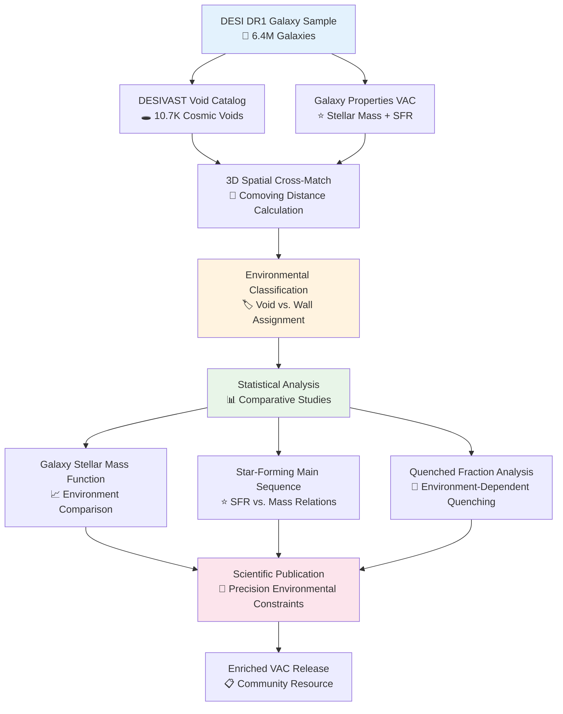

# 🌌 **DESI Cosmic Void Galaxies**

### Environmental Quenching: Probing Galaxy Evolution in Cosmic Voids

[](https://github.com/Pxomox-Astronomy-Lab/desi-cosmic-void-galaxies)
[](https://data.desi.lbl.gov/doc/releases/dr1/)
[](https://www.postgresql.org/)
[](https://www.python.org/)
[](LICENSE)

**DESI Cosmic Void Galaxies** investigates the "nature versus nurture" debate in galaxy evolution by leveraging the statistical power of DESI DR1 to measure how cosmic environment affects galaxy properties. Through systematic comparison of galaxies in cosmic voids versus dense "walls," this project provides definitive constraints on environmental quenching and star formation suppression mechanisms.

---

## 🎯 **Scientific Objectives**

This project addresses fundamental questions in galaxy evolution by studying how the most extreme large-scale environments influence galaxy properties and star formation activity.

- **🏠 Nature vs. Nurture:** Are galaxy properties primarily determined by intrinsic mass or environmental interactions?
- **🌌 Void Environment Effects:** How does the ultimate "field" environment of cosmic voids affect galaxy evolution?
- **⭐ Star Formation Quenching:** Do void galaxies have enhanced or suppressed star formation compared to wall galaxies?
- **📊 Mass Function Variations:** How does the galaxy stellar mass function differ between extreme environments?

### **Why This Project Matters**

- **🏆 Unprecedented Statistical Power:** Leverage DESI DR1's massive galaxy sample to achieve the most precise measurement of environmental effects on galaxy evolution to date
- **🧪 Clean Environmental Separation:** Compare galaxies in cosmic voids (ultimate low-density environment) with those in surrounding walls (higher-density regions) to isolate large-scale environmental effects
- **⚡ Early Results Strategy:** Low data engineering barrier enables rapid scientific results while more intensive spectral projects develop

### **Expected Impact**

- **🏆 Precision Measurement:** Most definitive quantification of void environment effects on galaxy properties
- **📋 Enriched Catalog:** Value-Added Catalog with environmental classifications for community use
- **🧮 Theory Benchmarks:** Critical observational constraints for cosmological simulations
- **⚡ Early Publication:** First major result demonstrating research capabilities

---

## 🌌 **Environmental Context**

The universe's large-scale structure consists of a cosmic web with distinct environmental regimes:

### **🕳️ Cosmic Voids:**

- Vast, underdense regions comprising bulk of universe's volume
- Minimal galaxy mergers, tidal stripping, or ram-pressure stripping
- Ultimate "field" environment for studying intrinsic galaxy evolution
- Low-density, low-interaction regime

### **🧱 Cosmic Walls:**

- Dense filamentary structures surrounding voids
- Higher galaxy density and interaction rates
- Enhanced merger activity and environmental processes
- Comparison population for environmental studies

### **Physical Processes Under Investigation:**

| Environment | Dominant Processes | Expected Effects |
|-------------|-------------------|------------------|
| **Cosmic Voids** | Minimal interactions, pristine gas supply | Enhanced/prolonged star formation |
| **Cosmic Walls** | Mergers, harassment, gas stripping | Earlier quenching, mass-dependent effects |

---

## 📊 **Data & Methodology**

This project's efficiency stems from leveraging existing, high-quality DESI DR1 Value-Added Catalogs, bypassing intensive raw spectral processing.

### **Primary Data Sources:**

- **DESIVAST VAC:** Cosmic void catalog with ~10,752 voids (4 algorithms: VIDE, ZOBOV, REVOLVER, VoidFinder)
- **FastSpecFit VAC:** Galaxy properties catalog with 6.4M galaxies providing stellar masses and SFR measurements
- **Total Data Volume:** ~30GB in PostgreSQL (3-5GB Parquet release)

### **Data Architecture Advantage:**

- **Low Barrier to Entry:** Direct analysis from pre-computed VACs
- **Rapid Development:** No custom ETL pipeline required for spectral processing
- **Early Results:** Can begin immediately while other projects develop infrastructure

---

## 🏗️ **Analysis Framework**



### **Environmental Assignment Process:**

1. **3D Distance Calculation:** Compute comoving distance from each galaxy to all void centers
2. **Radius Comparison:** Check if galaxy distance < void effective radius
3. **Binary Classification:**
   - **'Void':** Galaxy interior to any catalogued void
   - **'Wall':** Galaxy exterior to all voids (higher-density regions)

### **Statistical Analysis Methods:**

| **Analysis** | **Method** | **Scientific Insight** |
|-------------|------------|------------------------|
| **Galaxy Stellar Mass Function** | Number density vs. stellar mass for void and wall populations | Mass-dependent environmental effects, characteristic mass variations |
| **Star-Forming Main Sequence** | SFR vs. stellar mass correlation by environment | Environmental effects on star formation efficiency |
| **Quenched Fraction Measurements** | Fraction of galaxies below SFR threshold by mass bins and environment | Environment-dependent quenching mechanisms and mass dependence |

---

## 🛠️ **Technology Stack**

### **🖥️ Computational Infrastructure:**

- **Database Server:** proj-pg01 (8 vCPU, 48GB RAM, 250GB Samsung PM983 NVMe)
- **Analysis Platform:** proj-dp01 (4 vCPU, 16GB RAM, 100GB NVMe)
- **Backup Infrastructure:** pbs01 with 4TB storage and S3 Glacier archival

### **⚡ Software Stack:**

- **🐍 Language:** Python 3.11+ with scientific computing libraries
- **🗄️ Database:** PostgreSQL 16 for catalog operations and spatial queries
- **🌌 Astronomy:** AstroPy 5.3+ for coordinate systems and cosmological calculations
- **📊 Data Analysis:** Pandas, NumPy for tabular data manipulation
- **📈 Statistical Tools:** SciPy.stats for significance testing and statistical analysis
- **📊 Visualization:** Matplotlib, Seaborn for publication-quality scientific plots

### **🔍 Development Advantages:**

- **Minimal Infrastructure:** No distributed computing or GPU requirements
- **Standard Python Stack:** Leverages well-established scientific libraries
- **Single Database:** PostgreSQL sufficient for all analysis requirements
- **Rapid Development:** Clear path to early scientific publication

---

## 🚀 **Project Status**

**Current Phase:** Dataset packaging and publication preparation  
**Next Milestone:** Public data release with ML enrichment  
**Timeline:** Dataset v1.0 release October 2025

### **Development Phases:**

| **Phase** | **Duration** | **Key Deliverable** | **Status** |
|-----------|-------------|-------------------|------------|
| **Data Acquisition** | Complete | FITS download and inspection | ✅ Complete (2025-07-02) |
| **Database Architecture** | Complete | PostgreSQL schema and optimization | ✅ Complete (2025-07-14) |
| **Data Ingestion** | Complete | 6.4M galaxies + 10.7K voids loaded | ✅ Complete (2025-07-14) |
| **Stage 1 Validation** | Complete | Integrity checks (row counts, PKs, nulls) | ✅ Complete (2025-08-04) |
| **Stage 2 Validation** | Complete | Physical plausibility (z-range, mass-z) | ✅ Complete (2025-08-05) |
| **Systematics Analysis** | Complete | Cross-algorithm void comparison | ✅ Complete (2025-08-05) |
| **Dataset Packaging** | In Progress | Parquet export, documentation, notebooks | 🔄 In Progress |
| **Public Release** | Pending | Multi-platform dissemination (Zenodo, HuggingFace) | ⏳ Q4 2025 |

**Validation Summary:**

- ✅ **6,445,927 galaxies** ingested (98.4% retention post-QA cuts)
- ✅ **~10,752 voids** across 4 algorithms (VIDE, ZOBOV, REVOLVER, VoidFinder)
- ✅ Redshift range: z ∈ [0.001, 1.02], median ~0.31
- ✅ Cross-algorithm systematics: Δ quenched fraction ≈ 0.027 (Cohen's d ≈ 0.063)

---

## 📁 **Repository Structure**

``` markdown
desi-cosmic-void-galaxies/
├── 📚 docs/                    # Scientific methodology and project documentation
├── 🏗️ infrastructure/          # Database, deployment, and operations documentation
├── 💻 src/                     # Source code and analysis workflows
├── 🛠️ scripts/                 # Repository management and utility scripts
├── 📊 validation/              # Quality assurance reports and plots
├── 📋 ROADMAP.md              # Detailed implementation roadmap
├── 📝 README.md               # This file
└── 📄 LICENSE                 # MIT License
```

### **Key Documentation:**

- **[📋 Implementation Roadmap](ROADMAP.md)** - Complete 12-week technical roadmap
- **[📚 Project Documentation](docs/README.md)** - Architecture and methodology
- **[🏗️ Infrastructure Guide](infrastructure/README.md)** - Database and deployment
- **[💻 Source Code Overview](src/README.md)** - Analysis workflows and tools

---

## 🔗 **Related Projects**

This project is part of the **Proxmox Astronomy Lab** research program:

- **🏠 Main Infrastructure:** [proxmox-astronomy-lab](https://github.com/Pxomox-Astronomy-Lab/proxmox-astronomy-lab) - 7-node cluster infrastructure and documentation
- **🔮 Development Platform:** [the-crystal-forge](https://github.com/Pxomox-Astronomy-Lab/the-crystal-forge) - POC platform and methodology validation
- **🔍 Project 1:** [desi-qso-anomaly-detection](https://github.com/Pxomox-Astronomy-Lab/desi-qso-anomaly-detection) - ML-driven anomaly detection in QSO spectra
- **💨 Project 2:** [desi-quasar-outflows](https://github.com/Pxomox-Astronomy-Lab/desi-quasar-outflows) - AGN feedback and outflow energetics analysis
- **🌌 This Project:** Environmental quenching in cosmic voids

### **External Resources:**

- **🔭 DESI DR1:** [Official DESI Data Portal](https://data.desi.lbl.gov/doc/releases/dr1/) - Primary galaxy dataset
- **🕳️ DESIVAST VAC:** [DESI DR1 Void Catalog](https://data.desi.lbl.gov/doc/releases/dr1/vac/desivast/) - Cosmic void identification
- **⭐ FastSpecFit VAC:** [Galaxy Properties Catalog](https://data.desi.lbl.gov/doc/releases/dr1/vac/fastspecfit/) - Stellar masses and SFR

---

## 🤝 **Contributing**

This project implements systematic AI-human collaboration through transparent documentation and open science practices.

### **Development Principles:**

- **📖 Documentation First:** All analyses require comprehensive methodology description
- **📊 Statistical Rigor:** Systematic validation of statistical significance and error analysis
- **🔍 Reproducible Science:** Complete workflow documentation enabling independent verification
- **🌐 Open Data:** Commitment to public release of enriched environmental VAC

### **Getting Started:**

1. Review the [Implementation Roadmap](ROADMAP.md) for technical details
2. Check the [Infrastructure Documentation](infrastructure/README.md) for setup requirements
3. See our [Documentation Standards](docs/documentation-standards.md) for contribution guidelines

### **Research Standards:**

- Statistical rigor with appropriate significance testing
- Open science foundation built on public DESI data
- Transparent methodology with complete documentation
- Community value through enriched catalog release

---

## 📄 **License**

This project is licensed under the MIT License - see the [LICENSE](LICENSE) file for details.

---

## 🌟 **Acknowledgments**

**DESI Cosmic Void Galaxies** demonstrates responsible environmental studies through systematic statistical methods, open science principles, and transparent methodology. Built on public DESI data and open-source analysis tools, this project contributes to the astronomical community through precision environmental measurements and enriched catalog products.

### **Data Sources:**

- **DESI Collaboration** - Data Release 1 public catalogs
- **DESIVAST Team** - Cosmic void identification across 4 algorithms
- **FastSpecFit Team** - Galaxy stellar population synthesis

### **Infrastructure:**

- **Proxmox Astronomy Lab** - 7-node research cluster
- **proj-pg01** - PostgreSQL 16 primary database (Samsung PM983 NVMe, 3GB/s read)
- **proj-dp01** - Python processing workstation

---

**🌌 Built for precision environmental studies | Part of Proxmox Astronomy Lab**

*Last Updated: October 4, 2025*
