# 🌌 **DESI Cosmic Void Galaxies**

[](https://opensource.org/licenses/MIT)
[](https://www.python.org/downloads/)
[](https://data.desi.lbl.gov/doc/releases/dr1/)
[](https://www.postgresql.org/)
[](https://data.desi.lbl.gov/doc/vac/)

**Environmental Quenching: Probing Galaxy Evolution in Cosmic Voids**

DESI Cosmic Void Galaxies investigates the "nature versus nurture" debate in galaxy evolution by leveraging the statistical power of DESI DR1 to measure how cosmic environment affects galaxy properties. Through systematic comparison of galaxies in cosmic voids versus dense "walls," this project provides definitive constraints on environmental quenching and star formation suppression mechanisms.

## 📚 **Table of Contents**

- [🎯 Scientific Objectives](#-scientific-objectives)
- [🌌 Environmental Context](#-environmental-context)
- [📊 Data & Methodology](#-data--methodology)
- [🏗️ Analysis Framework](#️-analysis-framework)
- [🛠️ Technology Stack](#️-technology-stack)
- [🚀 Project Status](#-project-status)
- [📁 Repository Structure](#-repository-structure)
- [🔗 Related Projects](#-related-projects)
- [🤝 Contributing](#-contributing)
- [📄 License](#-license)

## 🎯 **Scientific Objectives**

This project addresses fundamental questions in galaxy evolution by studying how the most extreme large-scale environments influence galaxy properties and star formation activity.

### **🔬 Core Research Questions**

- **🏠 Nature vs. Nurture**: Are galaxy properties primarily determined by intrinsic mass or environmental interactions?
- **🌌 Void Environment Effects**: How does the ultimate "field" environment of cosmic voids affect galaxy evolution?
- **⭐ Star Formation Quenching**: Do void galaxies have enhanced or suppressed star formation compared to wall galaxies?
- **📊 Mass Function Variations**: How does the galaxy stellar mass function differ between extreme environments?

### **🌟 Scientific Innovation**

**Unprecedented Statistical Power**: Leverage DESI DR1's massive galaxy sample to achieve the most precise measurement of environmental effects on galaxy evolution to date.

**Clean Environmental Separation**: Compare galaxies in cosmic voids (ultimate low-density environment) with those in surrounding walls (higher-density regions) to isolate large-scale environmental effects.

**Early Results Strategy**: Low data engineering barrier enables rapid scientific results while more intensive spectral projects develop, providing early validation of the lab's analytical capabilities.

### **📊 Expected Impact**

- **🏆 Precision Measurement**: Most definitive quantification of void environment effects on galaxy properties
- **📋 Enriched Catalog**: Value-Added Catalog with environmental classifications for community use
- **🧮 Theory Benchmarks**: Critical observational constraints for cosmological simulations
- **⚡ Early Publication**: First major result from lab demonstrating research capabilities

## 🌌 **Environmental Context**

### **Cosmic Web Architecture**

The universe's large-scale structure consists of a cosmic web with distinct environmental regimes:

**🕳️ Cosmic Voids:**
- Vast, underdense regions comprising bulk of universe's volume
- Minimal galaxy mergers, tidal stripping, or ram-pressure stripping
- Ultimate "field" environment for studying intrinsic galaxy evolution
- Low-density, low-interaction regime

**🧱 Cosmic Walls:**
- Dense filamentary structures surrounding voids
- Higher galaxy density and interaction rates
- Enhanced merger activity and environmental processes
- Comparison population for environmental studies

### **Environmental Quenching Mechanisms**

**Physical Processes Under Investigation:**

| **Environment** | **Dominant Processes** | **Expected Effects** |
|-----------------|----------------------|---------------------|
| **Cosmic Voids** | Minimal interactions, pristine gas supply | Enhanced/prolonged star formation |
| **Cosmic Walls** | Mergers, harassment, gas stripping | Earlier quenching, mass-dependent effects |

**Key Observational Signatures:**
- **Galaxy Stellar Mass Function**: Number density variations by environment
- **Star-Forming Main Sequence**: SFR vs. stellar mass relationship shifts
- **Quenched Fraction**: Environment-dependent cessation of star formation

## 📊 **Data & Methodology**

### **Value-Added Catalog Integration**

This project's efficiency stems from leveraging existing, high-quality DESI DR1 Value-Added Catalogs, bypassing intensive raw spectral processing.

**Primary Data Sources:**
1. **DESIVAST VAC**: Cosmic void catalog with positions, redshifts, and effective radii
2. **Galaxy Properties VACs**: FastSpecFit or Mass EMLines catalogs providing stellar masses and SFR measurements

**Data Architecture Advantage:**
- **Low Barrier to Entry**: Direct analysis from pre-computed VACs
- **Rapid Development**: No custom ETL pipeline required
- **Early Results**: Can begin immediately while other projects develop infrastructure

### **Environmental Classification Workflow**

```mermaid
graph TD
    A[DESI DR1 Galaxy Sample<br/>🌌 ~13.1M Galaxies] --> B[DESIVAST Void Catalog<br/>🕳️ Cosmic Void Positions]
    A --> C[Galaxy Properties VAC<br/>⭐ Stellar Mass + SFR]
    
    B --> D[3D Spatial Cross-Match<br/>📍 Comoving Distance Calculation]
    C --> D
    D --> E[Environmental Classification<br/>🏷️ Void vs. Wall Assignment]
    
    E --> F[Statistical Analysis<br/>📊 Comparative Studies]
    F --> G[Galaxy Stellar Mass Function<br/>📈 Environment Comparison]
    F --> H[Star-Forming Main Sequence<br/>⭐ SFR vs. Mass Relations]
    F --> I[Quenched Fraction Analysis<br/>🔄 Environment-Dependent Quenching]
    
    G --> J[Scientific Publication<br/>📄 Precision Environmental Constraints]
    H --> J
    I --> J
    J --> K[Enriched VAC Release<br/>📋 Community Resource]
    
    style A fill:#e3f2fd
    style E fill:#fff3e0
    style F fill:#e8f5e8
    style J fill:#fce4ec
```



### **Spatial Cross-Matching Algorithm**

**Environmental Assignment Process:**
1. **3D Distance Calculation**: Compute comoving distance from each galaxy to all void centers
2. **Radius Comparison**: Check if galaxy distance < void effective radius
3. **Binary Classification**: 
   - **'Void'**: Galaxy interior to any catalogued void
   - **'Wall'**: Galaxy exterior to all voids (higher-density regions)

**Robust Methodology:**
- Accounts for redshift-dependent comoving distances
- Handles overlapping void regions appropriately
- Provides clean environmental dichotomy for statistical analysis

## 🏗️ **Analysis Framework**

### **Three-Phase Research Workflow**

| **Phase** | **Component** | **Method** | **Deliverable** |
|-----------|---------------|------------|-----------------|
| **Phase 1** | Database Integration | PostgreSQL VAC ingestion | Unified analysis database |
| **Phase 2** | Environmental Classification | 3D spatial cross-matching | Environment-labeled galaxy catalog |
| **Phase 3** | Statistical Analysis | Comparative population studies | Scientific results + enriched VAC |

### **Key Statistical Analyses**

**1. Galaxy Stellar Mass Function (GSMF) Comparison**
- **Methodology**: Number density vs. stellar mass for void and wall populations
- **Insights**: Mass-dependent environmental effects, characteristic mass variations
- **Significance**: Fundamental probe of how environment affects galaxy assembly

**2. Star-Forming Main Sequence Analysis**
- **Methodology**: SFR vs. stellar mass correlation by environment
- **Insights**: Environmental effects on star formation efficiency
- **Significance**: Direct probe of how void environment affects star formation

**3. Quenched Fraction Measurements**
- **Methodology**: Fraction of galaxies below SFR threshold by mass bins and environment
- **Insights**: Environment-dependent quenching mechanisms and mass dependence
- **Significance**: Quantitative measurement of environmental quenching efficiency

### **Infrastructure Requirements**

**🖥️ Computational Simplicity:**
- **Single PostgreSQL Database**: Sufficient for all analysis requirements
- **Standard Python Stack**: Pandas, NumPy, SciPy for statistical analysis
- **Visualization Tools**: Matplotlib, Seaborn for publication-quality plots
- **Minimal Infrastructure**: No distributed computing or GPU requirements

**⚡ Rapid Development Advantages:**
- Immediate start capability while other projects develop
- Clear path to early scientific publication
- Validation of lab's analytical framework
- Demonstration of research productivity

## 🛠️ **Technology Stack**

### **Core Analysis Framework**

- **🐍 Language**: Python 3.9+ with scientific computing libraries
- **🗄️ Database**: PostgreSQL for catalog operations and spatial queries
- **📊 Data Analysis**: Pandas, NumPy for tabular data manipulation
- **📈 Statistical Tools**: SciPy.stats for significance testing and statistical analysis

### **Scientific Libraries**

- **🌌 Astronomy**: AstroPy for coordinate systems and cosmological calculations
- **📊 Data Processing**: Pandas for efficient catalog operations and grouping
- **📈 Visualization**: Matplotlib, Seaborn for publication-quality scientific plots
- **🔍 Statistical Analysis**: scikit-learn for any clustering or classification needs

### **Database and Storage**

- **🗄️ PostgreSQL**: Primary database for VAC storage and spatial queries
- **📋 FITS Tables**: Standard astronomical format for catalog ingestion
- **💾 Local Storage**: Simple file-based storage for results and intermediate products
- **🔗 SQL Integration**: Direct SQL queries for efficient data selection and joining

### **Analysis and Visualization**

- **📊 Jupyter Notebooks**: Interactive analysis and exploration environment
- **📈 Statistical Plotting**: Professional scientific visualization capabilities
- **🔍 Quality Assurance**: Systematic validation of results and statistical significance
- **📄 Report Generation**: Automated figure generation for publication

## 🚀 **Project Status**

**Development Phase**: Ready for immediate deployment following hardware refresh

This repository represents the **early results track** in the DESI research portfolio, designed to generate first scientific publications while more data-intensive projects develop their infrastructure.

**Current Status**: Repository initialization and project setup  
**Immediate Capability**: Can begin analysis as soon as VACs are downloaded  
**Timeline**: Months 1-3 for analysis, months 4-9 for publication preparation

### **Strategic Positioning**

**Early Win Strategy**: This project provides systematic validation of the lab's analytical capabilities and produces publishable results while the shared ETL infrastructure for spectral projects develops.

**Resource Efficiency**: Minimal computational requirements allow parallel execution with infrastructure-intensive projects, maximizing overall lab productivity.

**Foundation for Expansion**: Success demonstrates analysis framework scalability for additional environmental studies and VAC enhancement projects.

## 📁 **Repository Structure**

```
desi-cosmic-void-galaxies/
├── 📚 docs/                    # Scientific methodology and analysis procedures
├── 🌌 src/                     # Source code (to be developed)
├── 🚀 scripts/                # Analysis pipeline and workflow automation
├── ⚙️ config/                 # Configuration files and database schema
├── 📊 notebooks/              # Jupyter analysis notebooks and exploration
├── 🗄️ data/                   # VAC storage and processed results
├── 📈 plots/                  # Generated figures and visualization outputs
├── 🧪 tests/                  # Unit and integration tests
└── 📋 requirements/           # Dependency specifications
```

## 🔗 **Related Projects**

### **🌌 Proxmox Astronomy Lab Organization**

- **🏠 Main Infrastructure**: [proxmox-astronomy-lab](https://github.com/Pxomox-Astronomy-Lab/proxmox-astronomy-lab) - 7-node cluster infrastructure and documentation
- **🔮 Development Platform**: [the-crystal-forge](https://github.com/Pxomox-Astronomy-Lab/the-crystal-forge) - POC platform and methodology validation

### **🎯 DESI Research Project Portfolio**

- **🔍 Project 1**: [desi-qso-anomaly-detection](https://github.com/Pxomox-Astronomy-Lab/desi-qso-anomaly-detection) - ML-driven anomaly detection in QSO spectra
- **💨 Project 2**: [desi-quasar-outflows](https://github.com/Pxomox-Astronomy-Lab/desi-quasar-outflows) - AGN feedback and outflow energetics analysis
- **🌌 This Project**: [desi-cosmic-void-galaxies](https://github.com/Pxomox-Astronomy-Lab/desi-cosmic-void-galaxies) - Environmental quenching in cosmic voids

### **📊 Data Resources**

- **🔭 DESI DR1**: [Official DESI Data Portal](https://data.desi.lbl.gov/doc/releases/dr1/) - Primary galaxy dataset
- **🕳️ DESIVAST VAC**: DESI DR1 cosmic void catalog for environmental classification
- **⭐ Galaxy Properties VACs**: FastSpecFit/Mass EMLines catalogs for stellar masses and SFR

### **🌌 Environmental Studies Context**

- **📖 Void Galaxy Studies**: Extensive literature on environmental effects in low-density regions
- **🧮 Cosmological Simulations**: IllustrisTNG, EAGLE, and other simulation suites for comparison
- **📊 Survey Comparisons**: SDSS, GAMA, and other spectroscopic survey environmental studies

## 🤝 **Contributing**

This project is part of the Proxmox Astronomy Lab research program implementing systematic AI-human collaboration through transparent documentation and open science practices.

### **Development Approach**

- **📖 Documentation First**: All analyses require comprehensive documentation and methodology description
- **📊 Statistical Rigor**: Systematic validation of statistical significance and error analysis
- **🔍 Reproducible Science**: Complete workflow documentation enabling independent verification
- **🌐 Open Data**: Commitment to public release of enriched environmental VAC

See our [Crystal Forge Documentation Standards](https://github.com/Pxomox-Astronomy-Lab/the-crystal-forge/blob/main/docs/documentation-standards.md) for contribution guidelines.

## 📄 **License**

This project is licensed under the MIT License - see the [LICENSE](LICENSE) file for details.

## 🙏 **Acknowledgments**

DESI Cosmic Void Galaxies demonstrates responsible environmental studies through:

- **🤝 Statistical Rigor**: Systematic application of statistical methods with appropriate significance testing
- **🌐 Open Science Foundation**: Built on public DESI data and open-source analysis tools
- **📖 Transparent Methodology**: Complete documentation of environmental classification and analysis procedures
- **📋 Community Value**: Enriched catalog release enabling follow-up studies across the field

---

**🌌 Built for precision environmental studies | Part of Proxmox Astronomy Lab | Documentation generated 2025-06-30**
