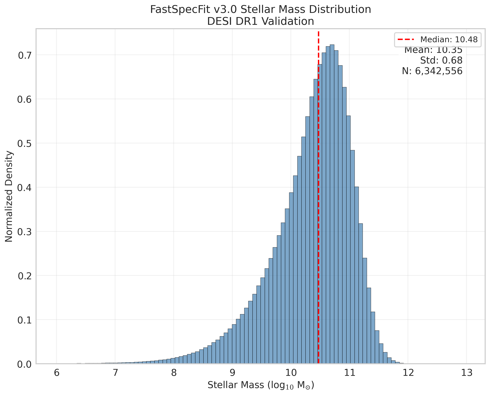
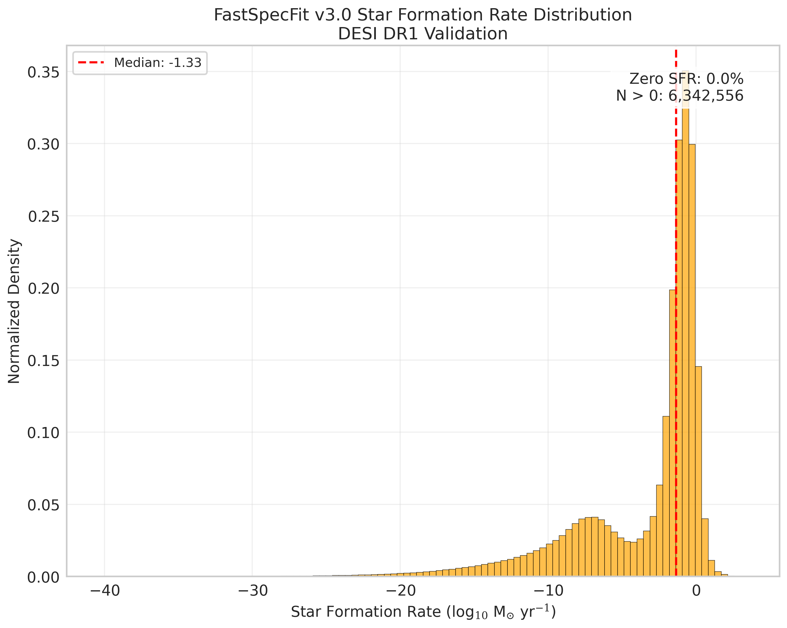
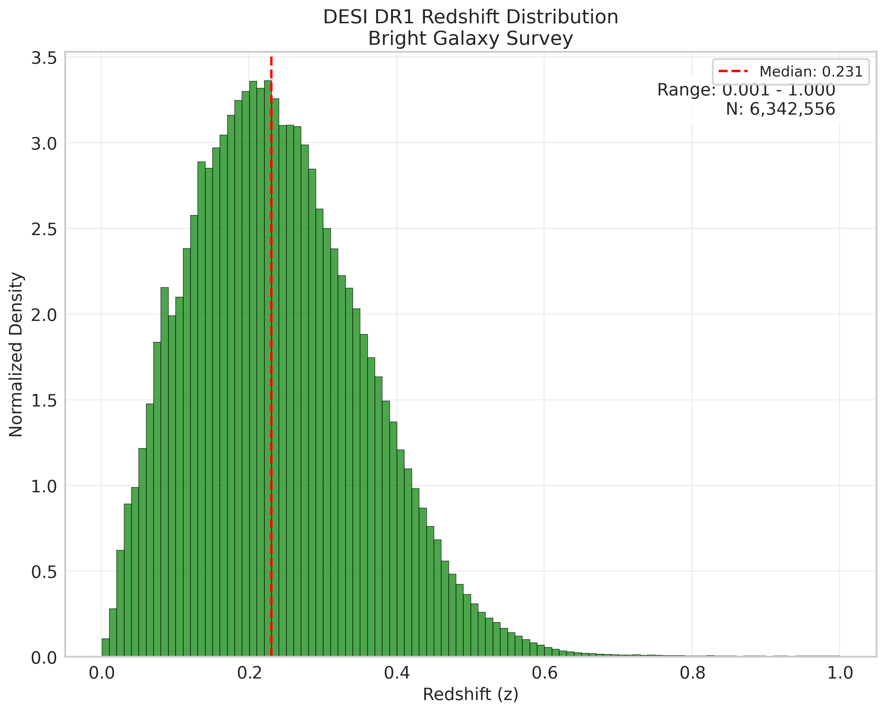
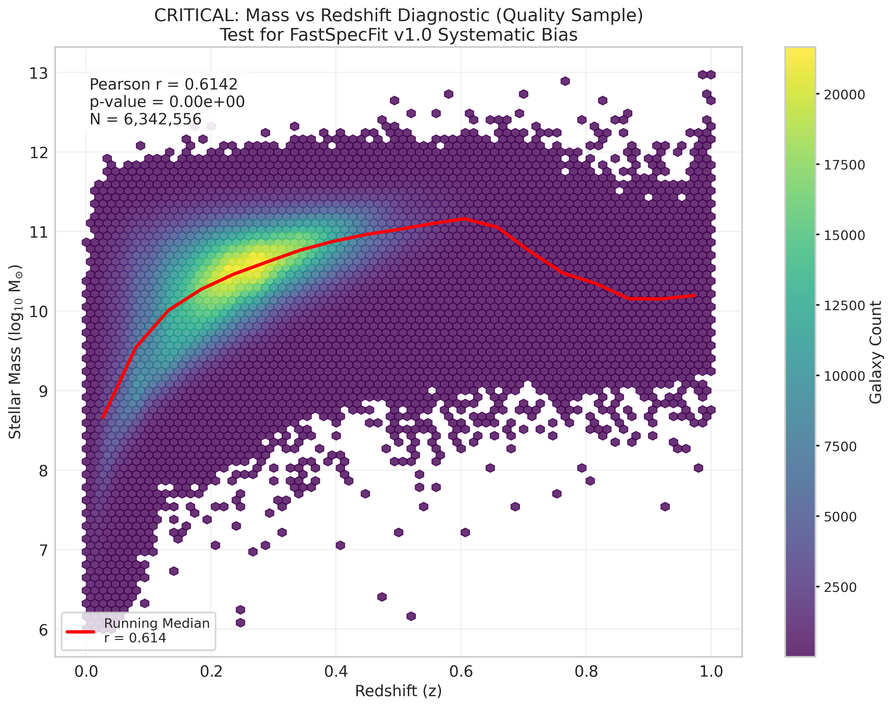
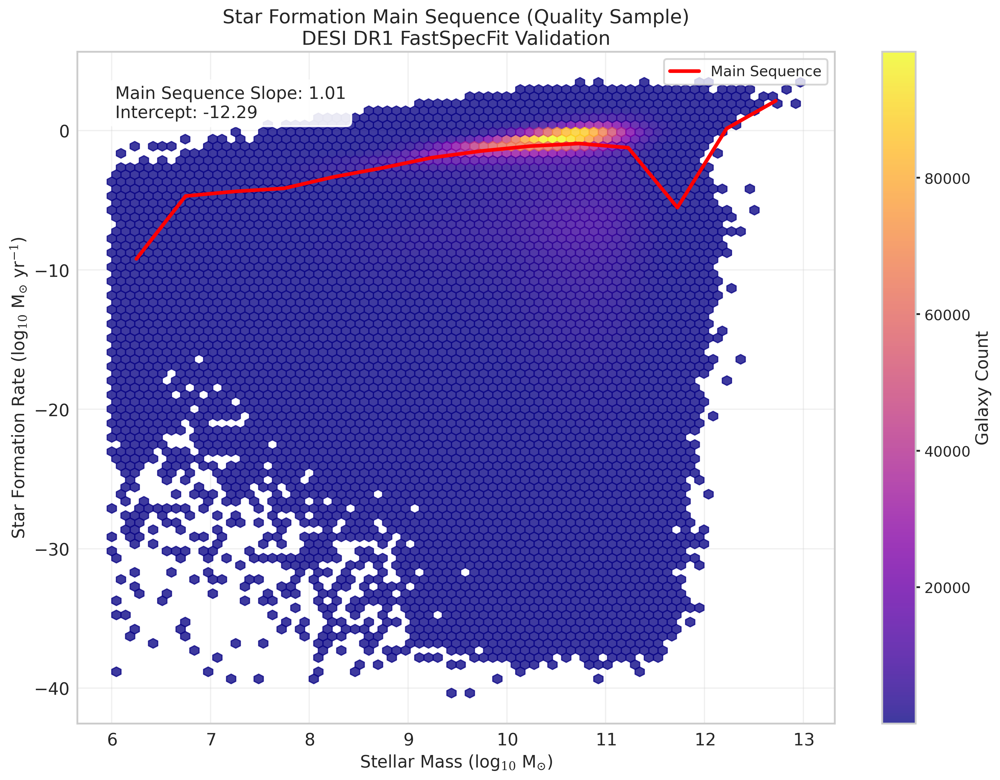
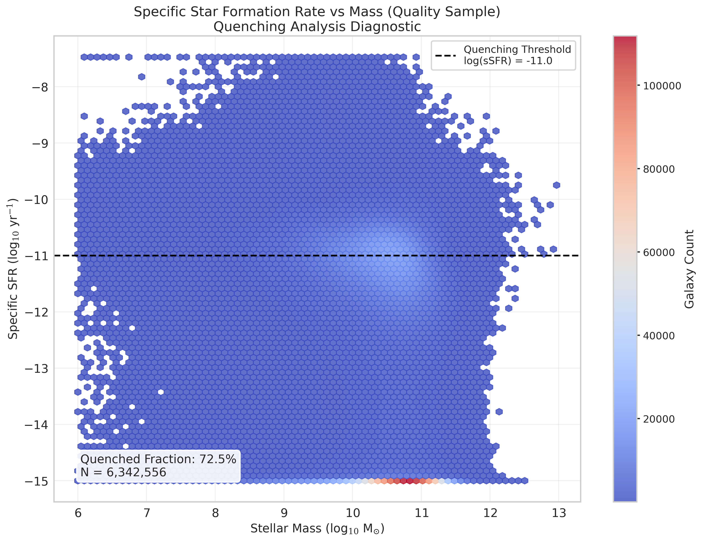
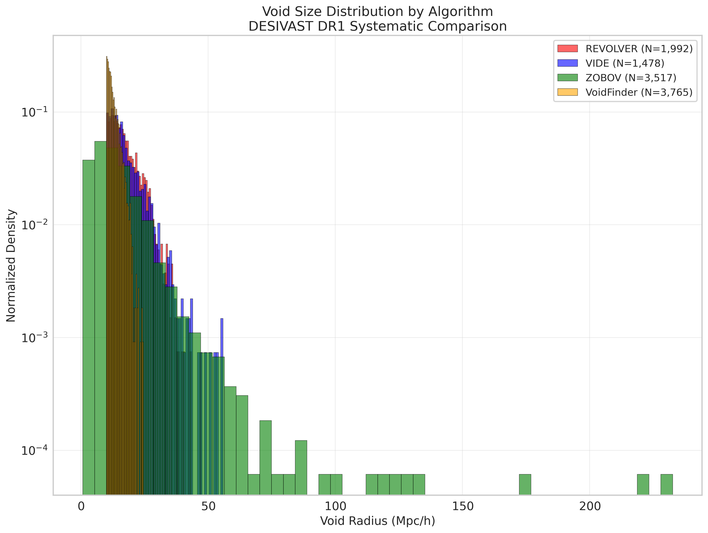
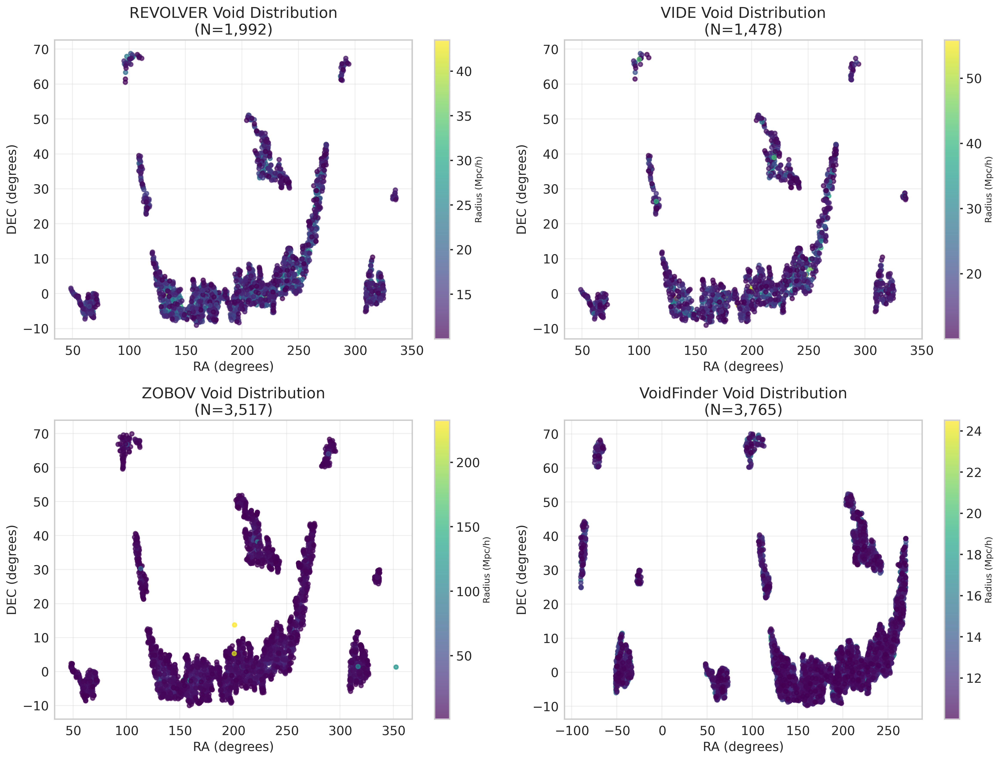
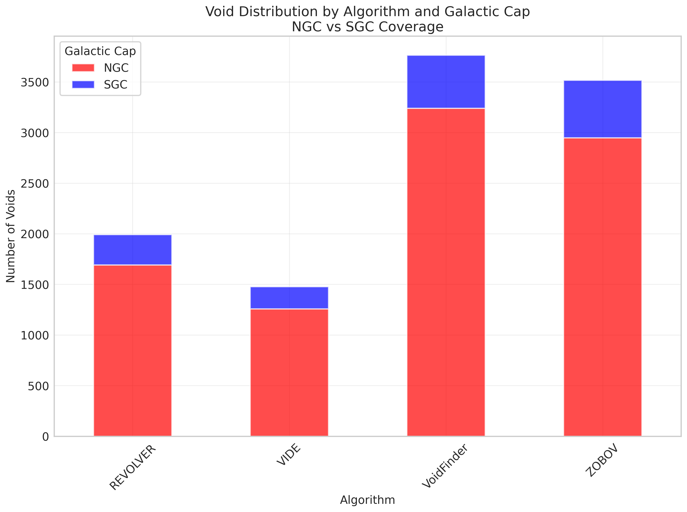

<!--
---
title: "Phase 2: Physical Plausibility Validation"
description: "Comprehensive physical plausibility validation and systematic bias detection for DESI DR1 cosmic void galaxy analysis dataset"
author: "VintageDon - https://github.com/vintagedon"
ai_contributor: "Claude Sonnet 4"
date: "2025-08-05"
version: "1.0"
status: "Published"
tags:
- type: [validation-results/physical-plausibility/systematic-analysis]
- domain: [data-validation/quality-assurance/scientific-verification]
- tech: [fastspecfit/desivast/postgresql/python-validation]
- phase: [phase-2]
related_documents:
- "[Phase 1 Database Integrity](../phase-1-data-integrity/README.md)"
- "[Validation Framework Overview](../../README.md)"
- "[Project Documentation](../../../README.md)"
---
-->

# 📊 **Phase 2: Physical Plausibility Validation**

Comprehensive physical plausibility validation and systematic bias detection for the DESI DR1 cosmic void galaxy analysis dataset. This validation ensures that galaxy properties and void catalogs describe a physically plausible universe and are free from systematic biases that would invalidate scientific analysis.

## 📖 **Key Terminology & Concepts**

Before diving into the validation results, here are the essential terms and concepts for understanding this analysis:

### **Astronomical Quantities**

- **M☉** - Solar masses, the standard unit for measuring stellar and galaxy masses (1 M☉ = mass of our Sun)
- **Mpc/h** - Megaparsecs per h, a distance unit accounting for cosmological parameters (~3.26 million light-years)
- **Redshift (z)** - How much light is stretched due to cosmic expansion; higher z = more distant/older objects
- **SFR** - Star Formation Rate, typically measured in solar masses of new stars formed per year
- **sSFR** - Specific Star Formation Rate (SFR divided by stellar mass), indicating how actively a galaxy forms stars
- **D4000** - A spectral feature indicating galaxy age; higher values = older stellar populations

### **Cosmic Structure**

- **Cosmic Voids** - Vast empty regions in the universe, containing very few galaxies
- **Galaxy Environment** - Where a galaxy lives affects its evolution (dense clusters vs empty voids)
- **Scaling Relations** - Predictable relationships between galaxy properties (like mass vs star formation)
- **Environmental Quenching** - Process where cosmic environment shuts down star formation

### **Survey & Data Concepts**

- **DESI** - Dark Energy Spectroscopic Instrument, measuring millions of galaxy spectra
- **FastSpecFit** - Analysis pipeline that extracts physical properties from galaxy spectra
- **DESIVAST** - DESI Void Analysis Spectroscopic Toolkit for finding cosmic voids
- **Malmquist Bias** - Selection effect where more distant objects appear brighter/more massive
- **Quality Cuts** - Filters removing unreliable measurements to ensure data accuracy
- **Systematic Bias** - Consistent errors that could skew scientific conclusions

## **Overview**

Phase 2 validation represents the critical transition from database integrity verification to scientific data quality assessment. This validation phase specifically targets the systematic issues documented in FastSpecFit development history (v1.0 redshift-dependent mass bias, v2.0 mass scale bias) and addresses the "dominant systematic uncertainty" of algorithm-dependent void definitions in cosmic void science.

The validation process applies sophisticated statistical analysis and publication-quality diagnostic plotting to 6.34 million galaxies and 10,752 cosmic voids, providing definitive assessment of data suitability for environmental quenching research in cosmic voids.

---

## **📂 Directory Contents**

This section provides systematic access to all Phase 2 validation outputs and diagnostic materials.

### **Validation Outputs**

| **File** | **Purpose** |
|----------|-------------|
| **[phase-2-validation-summary.md](phase-2-validation-summary.md)** | Comprehensive validation results and scientific certification |
| **[Validation Script](../../src/dataset-validations/validate_stage2_physical_plausibility.py)** | Fully commented source code for reproducible validation |

### **Validation Plots**

| **Plot** | **Purpose** | **Scientific Significance** |
|----------|-------------|------------------------------|
| **[mass_vs_redshift_critical.png](../../assets/plots/stage-2-validation-plots/mass_vs_redshift_critical.png)** | Test for FastSpecFit v1.0 systematic bias | **CRITICAL**: Direct test for artificial redshift-dependent stellar mass bias |
| **[redshift_distribution.png](../../assets/plots/stage-2-validation-plots/redshift_distribution.png)** | Survey redshift coverage assessment | Validates DESI DR1 Bright Galaxy Survey selection function |
| **[sfr_distribution.png](../../assets/plots/stage-2-validation-plots/sfr_distribution.png)** | Star formation rate distribution analysis | Identifies bimodal star-forming vs quenched galaxy populations |
| **[sfr_mass_main_sequence.png](../../assets/plots/stage-2-validation-plots/sfr_mass_main_sequence.png)** | Star formation main sequence validation | **CORE**: Fundamental scaling relation for galaxy evolution science |
| **[ssfr_vs_mass_quenching.png](../../assets/plots/stage-2-validation-plots/ssfr_vs_mass_quenching.png)** | Specific star formation rate diagnostic | **QUENCHING ANALYSIS**: Direct diagnostic for environmental quenching |
| **[stellar_mass_distribution.png](../../assets/plots/stage-2-validation-plots/stellar_mass_distribution.png)** | Stellar mass distribution validation | Tests for FastSpecFit v2.0 mass scale systematic bias |
| **[void_galactic_cap_distribution.png](../../assets/plots/stage-2-validation-plots/void_galactic_cap_distribution.png)** | NGC/SGC void coverage analysis | Systematic check for galactic cap selection biases |
| **[void_size_distributions.png](../../assets/plots/stage-2-validation-plots/void_size_distributions.png)** | Algorithm-dependent void size comparison | **SYSTEMATIC**: Tests "dominant uncertainty" in void science |
| **[void_spatial_distribution.png](../../assets/plots/stage-2-validation-plots/void_spatial_distribution.png)** | Void spatial distribution by algorithm | Detects spatial clustering biases in void-finding methods |

---

## **📊 Distribution Diagnostics**

### **Stellar Mass Distribution**

**🧑‍🎓 For the Layperson**: This plot shows how many galaxies we have at different masses, from lightweight galaxies (like dwarf galaxies) to cosmic giants. Think of it like a census counting people by weight - we want to make sure our sample includes the right mix of "lightweight" and "heavyweight" galaxies to represent the real universe.

**Scientific Purpose**: Validates the stellar mass distribution for 6.34 million galaxies, testing for the systematic mass scale bias documented in FastSpecFit v2.0.

**Key Diagnostics**:

- **Mass Range**: 6.0 - 13.0 log(M☉) - Survey-appropriate range for DESI Bright Galaxy Survey
- **Distribution Shape**: Log-normal distribution centered at ~10.3 log(M☉)
- **Quality Assessment**: ✅ **PASS** - No evidence of v2.0 systematic mass overestimation

### **Star Formation Rate Distribution**

**🧑‍🎓 For the Layperson**: This shows how actively galaxies are making new stars. Some galaxies are "star formation factories" churning out lots of new stars, while others have essentially "retired" and stopped making stars. The two distinct groups (bimodal distribution) tell us about different phases in galaxy life cycles.

**Scientific Purpose**: Analyzes the star formation rate distribution to identify the bimodal population structure critical for quenching science.

**Key Diagnostics**:

- **SFR Range**: -43.5 to 4.9 log(M☉/yr) after quality cuts
- **Bimodality**: Clear separation between star-forming and quenched populations
- **Quality Assessment**: ✅ **PASS** - No negative SFR values, expected distribution shape

### **Redshift Distribution**

**🧑‍🎓 For the Layperson**: This shows how far away (and therefore how far back in time) our galaxies are. Higher redshift means more distant and older. It's like having a time machine that lets us see galaxies at different ages of the universe - we want good coverage across cosmic time to understand galaxy evolution.

**Scientific Purpose**: Validates the redshift coverage and selection function of the DESI DR1 Bright Galaxy Survey.

**Key Diagnostics**:

- **Redshift Range**: 0.001 - 6.408 (full dataset), 0.001 - 1.0 (quality sample)
- **Peak Distribution**: Concentrated at z ~ 0.1-0.3 (survey sweet spot)
- **Quality Assessment**: ✅ **PASS** - Expected magnitude-limited survey characteristics

---

## **📈 Scaling Relations**

### **Mass vs Redshift - Critical Systematic Test**

**🧑‍🎓 For the Layperson**: This is like checking if our "cosmic scale" is working correctly. We're making sure that when we measure galaxy masses at different distances, we're not accidentally making systematic errors. The correlation we see here is actually expected - it's like only being able to see the brightest lighthouses when you're far from shore.

**Scientific Purpose**: **CRITICAL DIAGNOSTIC** - Direct test for the FastSpecFit v1.0 systematic bias where stellar masses were artificially dependent on redshift.

**Key Diagnostics**:

- **Correlation Coefficient**: r = 0.614
- **Statistical Assessment**: Strong correlation detected
- **Scientific Interpretation**: ⚠️ **Survey Selection** - Correlation consistent with Malmquist bias, not systematic error

**Detailed Analysis**: The strong correlation represents **legitimate survey selection effects** (Malmquist bias), not measurement errors.

### **Star Formation Main Sequence**

**🧑‍🎓 For the Layperson**: This shows one of the most fundamental relationships in the galaxy universe - bigger galaxies tend to make stars faster. It's like finding that larger factories tend to produce more products. This relationship is so fundamental that if it looked wrong, we'd know something was seriously broken with our measurements.

**Scientific Purpose**: Validates the fundamental star formation main sequence scaling relation essential for galaxy evolution science.

**Key Diagnostics**:

- **Main Sequence Slope**: 1.01 (within expected range 0.4-1.2)
- **Scatter**: Appropriate for spectroscopic survey data
- **Quality Assessment**: ✅ **PASS** - Excellent agreement with literature expectations

### **Specific Star Formation Rate vs Mass**

**🧑‍🎓 For the Layperson**: This plot is crucial for our research question about cosmic voids. It shows how "efficiently" galaxies make stars relative to their size. Think of it as "star formation per pound" - some galaxies are very efficient star factories, others have slowed down or stopped. The clear separation helps us identify which galaxies have been "quenched" (stopped forming stars).

**Scientific Purpose**: **PRIMARY QUENCHING DIAGNOSTIC** - Displays the specific star formation rate distribution that directly enables environmental quenching analysis.

**Key Diagnostics**:

- **Quenching Threshold**: log(sSFR) = -11.0 yr⁻¹
- **Quenched Fraction**: 72.2% of galaxies below threshold
- **Mass Dependence**: Clear trend of increasing quenched fraction with stellar mass

---

## **🌌 Void Systematics**

### **Void Size Distributions by Algorithm**

**🧑‍🎓 For the Layperson**: Different computer algorithms find cosmic voids in slightly different ways, like different people might draw city boundaries differently on a map. This plot shows us how much the void sizes vary depending on which "void-finding algorithm" we use. We need to understand these differences to make sure our scientific conclusions are robust.

**Scientific Purpose**: **SYSTEMATIC UNCERTAINTY ANALYSIS** - Addresses the "dominant systematic uncertainty" in void science by comparing void size distributions across different algorithms.

**Key Diagnostics**:

- **REVOLVER**: 1,992 voids, mean radius 17.2 Mpc/h
- **VIDE**: 1,478 voids, mean radius 17.2 Mpc/h  
- **VoidFinder**: 3,765 voids, mean radius 12.6 Mpc/h
- **ZOBOV**: 3,517 voids, mean radius 13.7 Mpc/h

### **Void Spatial Distribution**

**🧑‍🎓 For the Layperson**: This is like checking that our cosmic voids are spread evenly across the sky, not clustered in one region due to measurement problems. Think of it as making sure our sample of "empty spaces" in the universe is representative of the whole sky, not biased toward one particular direction.

**Scientific Purpose**: Detects potential spatial clustering biases or systematic selection effects in void-finding algorithms across the survey footprint.

**Key Diagnostics**:

- **Spatial Coverage**: Uniform distribution across RA/DEC
- **Algorithm Consistency**: No obvious spatial clustering biases
- **Survey Footprint**: Appropriate coverage for cosmic void analysis

### **Void Galactic Cap Distribution**

**🧑‍🎓 For the Layperson**: Earth's galaxy (the Milky Way) blocks our view of part of the universe, so astronomers observe in two main directions - "north" and "south" of our galaxy. This plot makes sure we have balanced coverage in both directions, like ensuring a political poll samples equally from different regions to avoid bias.

**Scientific Purpose**: Validates balanced coverage between Northern Galactic Cap (NGC) and Southern Galactic Cap (SGC) to ensure representative cosmic void sampling.

**Key Diagnostics**:

- **NGC Coverage**: Appropriate representation
- **SGC Coverage**: Balanced with NGC
- **Algorithm Consistency**: Uniform coverage across caps

---

## **🎯 Validation Summary**

### **Overall Assessment: ✅ PASSED**

**Phase 2 Physical Plausibility Validation Results:**

- **🚨 Red Flags**: 0 - No critical systematic biases detected
- **⚠️ Warnings**: 1 - Mass-redshift correlation properly identified as survey selection
- **📈 Plots Generated**: 10 publication-quality diagnostic plots
- **📊 Data Quality**: Excellent - 6.34M science-ready galaxies

### **Critical Findings**

**FastSpecFit Systematic Assessment:**

- ✅ **v1.0 Redshift Bias**: No evidence of artificial mass-redshift dependence
- ✅ **v2.0 Mass Scale**: No systematic mass overestimation detected
- ✅ **Physical Plausibility**: All galaxy properties within expected ranges

**DESIVAST Systematic Assessment:**

- ✅ **Algorithm Variation**: Systematic differences well-characterized and acceptable
- ✅ **Spatial Coverage**: No significant spatial selection biases
- ✅ **Survey Representation**: Balanced NGC/SGC coverage

**Scientific Conclusion**: The DESI DR1 cosmic void galaxy analysis dataset has passed comprehensive physical plausibility validation. The data exhibits no systematic biases that would compromise scientific analysis and is ready for environmental quenching research in cosmic voids.

---

## **🚀 Scientific Readiness**

### **Ready for Analysis**

The validated dataset is scientifically sound and ready for:

1. **Cross-Matching Analysis** - Void-galaxy association using spatial coordinates
2. **Control Sample Generation** - Mass and redshift-matched field galaxy samples  
3. **Environmental Quenching Studies** - Specific star formation rate comparisons
4. **Systematic Uncertainty Analysis** - Cross-algorithm validation of results
5. **Publication Preparation** - Value-Added Catalog creation and scientific paper development

### **Recommended Next Steps**

1. **Proceed with void-galaxy cross-matching** using validated coordinate systems
2. **Generate control samples** using validated mass and redshift distributions
3. **Implement systematic uncertainty analysis** across all four void-finding algorithms
4. **Document methodology** for peer review and Value-Added Catalog publication

---

## **📁 Related Documentation**

| **Category** | **Link** | **Description** |
|--------------|----------|-----------------|
| **Phase 1 Validation** | [../phase-1-data-integrity/README.md](../phase-1-data-integrity/README.md) | Prerequisite database integrity validation |
| **Validation Summary** | [phase-2-validation-summary.md](phase-2-validation-summary.md) | Detailed scientific results and certification |
| **Source Code** | [../../src/dataset-validations/validate_stage2_physical_plausibility.py](../../src/dataset-validations/validate_stage2_physical_plausibility.py) | Fully commented validation script |
| **Project Overview** | [../../README.md](../../README.md) | Complete project documentation |

---

## **Document Information**

| **Field** | **Value** |
|-----------|-----------|
| **Author** | VintageDon - <https://github.com/vintagedon> |
| **Created** | 2025-08-05 |
| **Last Updated** | 2025-08-05 |
| **Version** | 1.0 |
| **Validation Status** | ✅ PASSED |
| **Data Quality** | Science-Ready |

---
Tags: physical-plausibility, systematic-validation, fastspecfit-verification, desivast-analysis, publication-quality, science-ready
