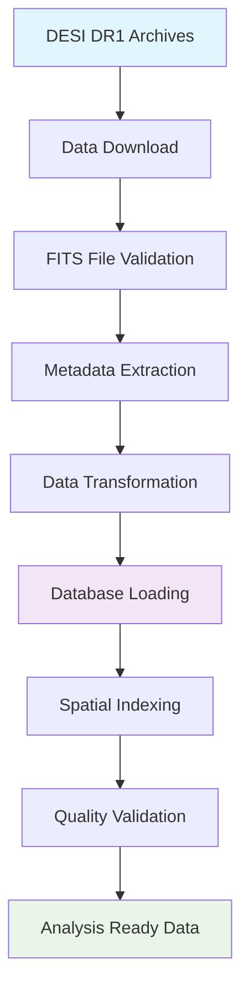

<!--
---
title: "Data Pipeline Design"
description: "Comprehensive data pipeline architecture for DESI DR1 cosmic void analysis, including DESIVAST void catalogs and FastSpecFit galaxy properties ingestion, transformation, and scientific analysis workflows"
author: "VintageDon"
ai_contributor: "Anthropic Claude 4 Sonnet (claude-4-sonnet-20250514)"
date: "2025-07-02"
version: "1.0"
status: "Published"
tags:
- type: project-doc
- domain: cosmic-voids
- domain: astronomical-data
- tech: postgresql-16
- tech: python-astronomy
- tech: desi-dr1
- dataset: desivast
- dataset: fastspecfit
- phase: data-ingestion
related_documents:
- "[Project Architecture](project-architecture.md)"
- "[Database Infrastructure](../infrastructure/database/README.md)"
- "[PostgreSQL Implementation](../infrastructure/database/postgresql-implementation.md)"
- "[Database Schema Design](../infrastructure/database/database-schema.md)"
scientific_context:
  objective: "Environmental quenching analysis"
  dataset: "DESI DR1 BGS"
  methods: ["data-ingestion", "spatial-crossmatch", "statistical-comparison"]
---
-->

# 📊 **Data Pipeline Design**

This document provides comprehensive architecture for the DESI DR1 cosmic void analysis data pipeline, including systematic ingestion of DESIVAST void catalogs (1.2GB) and FastSpecFit galaxy properties (26.4GB), transformation workflows, and scientific analysis procedures supporting environmental quenching research.

# 🎯 **1. Introduction**

This section establishes the foundational context for DESI cosmic void analysis data pipeline, defining the systematic approach to large-scale astronomical data processing that enables environmental quenching research and galaxy evolution studies.

## **1.1 Purpose**

This subsection explains how the data pipeline enables systematic processing of DESI DR1 data while supporting reproducible scientific analysis workflows for cosmic void environmental studies.

The DESI cosmic void analysis data pipeline functions as the systematic foundation for processing 27.6GB of astronomical survey data, transforming raw FITS catalogs into structured, queryable, and analysis-ready datasets that enable environmental quenching research. The pipeline provides automated data ingestion from DESI DR1 public archives, systematic validation and quality assurance procedures, and optimized database storage that supports complex spatial queries and statistical analysis. The architecture enables reproducible scientific workflows through standardized processing procedures, comprehensive data validation, and systematic transformation of heterogeneous astronomical catalogs into unified analysis datasets essential for galaxy evolution research within cosmic void environments.

## **1.2 Scope**

This subsection defines the boundaries of data pipeline design coverage within the DESI cosmic void analysis project.

| **In Scope** | **Out of Scope** |
|--------------|------------------|
| DESIVAST void catalog ingestion and processing | Raw DESI spectroscopic data reduction and calibration |
| FastSpecFit galaxy properties data transformation | Stellar population synthesis model fitting procedures |
| Spatial cross-matching and environmental classification | Void-finding algorithm development and validation |
| Database schema optimization and indexing strategies | Statistical analysis methodology and interpretation |
| Data validation and quality assurance procedures | Scientific result validation and publication preparation |
| Performance optimization and monitoring frameworks | Infrastructure deployment and system administration |

## **1.3 Target Audience**

This subsection identifies stakeholders who design, implement, or maintain data pipeline components and the technical background required for effective astronomical data processing.

**Primary Audience:** Data engineers, astronomical software developers, and database administrators responsible for DESI data processing and pipeline implementation. **Secondary Audience:** Astronomical researchers, data scientists, and infrastructure engineers who need to understand data processing workflows and pipeline capabilities. **Required Background:** Understanding of astronomical data formats (FITS), database design principles, Python scientific computing stack, and familiarity with large-scale data processing concepts.

## **1.4 Overview**

This subsection provides context about data pipeline organization and its relationship to the broader DESI cosmic void analysis project and scientific objectives.

The DESI cosmic void analysis data pipeline establishes systematic data processing foundation, transforming diverse astronomical survey catalogs into integrated, analysis-ready datasets that enable environmental quenching research, spatial correlation studies, and statistical comparison workflows through automated ingestion procedures, comprehensive validation frameworks, and optimized database architectures designed for astronomical data analysis requirements.

# 🔗 **2. Dependencies & Relationships**

This section maps how the data pipeline integrates with other project components and establishes data processing relationships that enable systematic astronomical analysis and scientific research workflows.

## **2.1 Related Services**

This subsection identifies project components that provide data sources, consume pipeline outputs, or support data processing operations within the cosmic void analysis framework.

| **Service** | **Relationship Type** | **Integration Points** | **Documentation** |
|-------------|----------------------|------------------------|-------------------|
| **Database Infrastructure** | **Stores** | PostgreSQL tables, indexing strategies, performance optimization | [Database Infrastructure](../infrastructure/database/README.md) |
| **Source Data Archives** | **Consumes** | DESI DR1 public data, FITS file downloads, validation procedures | [Developer Access Management](../infrastructure/operations/developer-access-management.md) |
| **Analysis Workflows** | **Provides** | Processed datasets, spatial indices, statistical analysis preparation | [Scientific Analysis](../src/analysis/README.md) |
| **Monitoring Systems** | **Integrates** | Pipeline performance metrics, data quality monitoring, error tracking | [Monitoring Setup](../infrastructure/operations/monitoring-setup.md) |

## **2.2 Policy Implementation**

This subsection connects data pipeline design to project governance frameworks and data management requirements supporting astronomical research objectives.

Data pipeline implementation directly supports several critical project and research objectives:

- **Data Quality Assurance Policy** - Systematic validation procedures and quality metrics ensuring astronomical data integrity and analysis reliability
- **Reproducible Research Policy** - Automated pipeline procedures and version control enabling reproducible scientific analysis and result validation
- **Performance Optimization Policy** - Database indexing strategies and query optimization supporting efficient analysis of large astronomical datasets
- **Data Management Policy** - Systematic data organization and retention procedures aligned with astronomical research best practices

## **2.3 Responsibility Matrix**

This subsection establishes clear accountability for data pipeline development, maintenance, and operational activities across different project roles.

| **Activity** | **Data Engineers** | **Database Administrators** | **Astronomical Researchers** | **Infrastructure Engineers** |
|--------------|-------------------|----------------------------|------------------------------|------------------------------|
| **Pipeline Development** | **A** | **C** | **C** | **C** |
| **Data Validation** | **R** | **C** | **R** | **I** |
| **Performance Optimization** | **R** | **A** | **C** | **C** |
| **Schema Design** | **R** | **A** | **R** | **I** |
| **Operational Monitoring** | **C** | **R** | **I** | **A** |

*R: Responsible, A: Accountable, C: Consulted, I: Informed*

# ⚙️ **3. Technical Implementation**

This section provides comprehensive specifications for data pipeline architecture, including source data characteristics, processing workflows, and implementation details supporting DESI cosmic void analysis requirements.

## **3.1 Architecture & Design**

This subsection explains the data pipeline architecture and design decisions that enable efficient processing of large-scale astronomical survey data.

The data pipeline employs ETL (Extract, Transform, Load) architecture optimized for astronomical data processing, utilizing Python scientific computing stack for FITS file handling, PostgreSQL database for structured storage with spatial indexing, and automated validation procedures for data quality assurance. The implementation supports parallel processing for large datasets, incremental loading capabilities, and comprehensive error handling designed for reliable astronomical data processing workflows.



## **3.2 Source Data Specifications**

This subsection describes the detailed characteristics of DESI DR1 source data including file structures, data volumes, and processing requirements.

### **DESIVAST Void Catalogs (1.2GB Total)**

**Data Source**: <https://data.desi.lbl.gov/public/dr1/vac/dr1/desivast/v1.0/>

**Algorithm Coverage and Performance**:

```yaml
desivast_catalog_structure:
  total_size: "1.2 GB"
  download_performance: "80.2 MB completed in 77.4 seconds"
  average_throughput: "15.8 MB/s"
  
  algorithms:
    REVOLVER:
      files: ["DESIVAST_BGS_VOLLIM_V2_REVOLVER_NGC.fits", "DESIVAST_BGS_VOLLIM_V2_REVOLVER_SGC.fits"]
      total_size: "666.9 MB"
      void_count: 1992
      structure: "6 HDUs: VOIDS, ZONEVOID, GALZONE, TRIANGLE, GALVIZ"
      
    VIDE:
      files: ["DESIVAST_BGS_VOLLIM_V2_VIDE_NGC.fits", "DESIVAST_BGS_VOLLIM_V2_VIDE_SGC.fits"]
      total_size: "497.0 MB"
      void_count: 1478
      structure: "6 HDUs: VOIDS, ZONEVOID, GALZONE, TRIANGLE, GALVIZ"
      
    VoidFinder:
      files: ["DESIVAST_BGS_VOLLIM_VoidFinder_NGC.fits", "DESIVAST_BGS_VOLLIM_VoidFinder_SGC.fits"]
      total_size: "4.3 MB"
      void_count: 3765
      structure: "3 HDUs: MAXIMALS, HOLES"
      
    ZOBOV:
      files: ["DESIVAST_BGS_VOLLIM_V2_ZOBOV_NGC.fits", "DESIVAST_BGS_VOLLIM_V2_ZOBOV_SGC.fits"]
      total_size: "48.3 MB"
      void_count: 3519
      structure: "4 HDUs: VOIDS, ZONEVOID, GALZONE"
```

**Common Data Columns Across All Algorithms**:

- **Spatial Coordinates**: RA, DEC (float64, degrees)
- **Physical Properties**: X, Y, Z (float64, Mpc h⁻¹), RADIUS (float64, Mpc h⁻¹)
- **Identification**: VOID (int64), EDGE (int64)

### **FastSpecFit Galaxy Properties (26.4GB Total)**

**Data Source**: <https://data.desi.lbl.gov/public/dr1/vac/dr1/fastspecfit/iron/v3.0/catalogs/>

**HEALPix Distribution and Performance**:

```yaml
fastspecfit_catalog_structure:
  total_size: "26.4 GB"
  download_performance: "26.4 GB completed in 1562 seconds"
  average_throughput: "17.2 MB/s"
  total_galaxies: 6445927
  
  healpix_distribution:
    hp00: {size: "426.8 MB", galaxies: 101838, performance: "25.9 MB/s"}
    hp01: {size: "4.2 GB", galaxies: 1017041, performance: "23.7 MB/s"}
    hp02: {size: "5.6 GB", galaxies: 1358627, performance: "43.6 MB/s"}
    hp03: {size: "1.7 GB", galaxies: 403581, performance: "21.3 MB/s"}
    hp04: {size: "4.0 GB", galaxies: 981600, performance: "24.7 MB/s"}
    hp05: {size: "1.2 GB", galaxies: 301057, performance: "32.8 MB/s"}
    hp06: {size: "5.5 GB", galaxies: 1347464, performance: "27.2 MB/s"}
    hp07: {size: "2.8 GB", galaxies: 673711, performance: "39.9 MB/s"}
    hp08: {size: "342.6 MB", galaxies: 81734, performance: "23.8 MB/s"}
    hp09: {size: "280.3 MB", galaxies: 66856, performance: "11.5 MB/s"}
    hp10: {size: "191.1 MB", galaxies: 45570, performance: "34.5 MB/s"}
    hp11: {size: "280.2 MB", galaxies: 66848, performance: "17.3 MB/s"}
```

**File Structure (Consistent Across All HEALPix Files)**:

- **HDU 0**: PrimaryHDU 'PRIMARY'
- **HDU 1**: BinTableHDU 'METADATA' (54 columns)
- **HDU 2**: BinTableHDU 'SPECPHOT' (127 columns)
- **HDU 3**: BinTableHDU 'FASTSPEC' (887 columns)

**Key Scientific Columns**:

- **TARGETID**: int64 - Unique DESI object identifier
- **RA, DEC**: float64 - Spatial coordinates (degrees)
- **Z**: float64 - Redshift (range: 0.001 to 6.408)
- **LOGMSTAR**: float32 - Log stellar mass (range: -12.1 to 15.6)
- **SFR**: float32 - Star formation rate (range: 0.0 to 76,710 M☉/yr)

## **3.3 Data Processing Workflows**

This subsection provides systematic overview of data processing workflows including ingestion procedures, transformation steps, and validation processes.

### **Phase 1: Data Acquisition and Validation**

**Automated Download Procedures**:

```python
# DESIVAST download performance (actual implementation)
download_summary = {
    "total_files": 8,
    "success_rate": "8/8 (100%)",
    "total_size": "1.2 GB",
    "average_speed": "15.8 MB/s",
    "validation": "FITS structure verification, HDU counting, column mapping"
}

# FastSpecFit download performance (actual implementation)  
download_summary = {
    "total_files": 12,
    "success_rate": "12/12 (100%)",
    "total_size": "26.4 GB", 
    "average_speed": "17.2 MB/s",
    "validation": "HEALPix completeness check, column consistency verification"
}
```

### **Phase 2: Database Schema Implementation**

**Optimized Table Structures**:

```sql
-- DESIVAST void catalog table (implemented)
CREATE TABLE raw_catalogs.desivast_voids (
    void_id SERIAL PRIMARY KEY,
    algorithm VARCHAR(50),
    galactic_cap VARCHAR(3),
    ra DOUBLE PRECISION,
    dec DOUBLE PRECISION,
    radius DOUBLE PRECISION,
    x DOUBLE PRECISION,
    y DOUBLE PRECISION, 
    z DOUBLE PRECISION,
    void_index INTEGER,
    edge_flag INTEGER
);

-- FastSpecFit galaxy properties table (implemented)
CREATE TABLE raw_catalogs.fastspecfit_galaxies (
    targetid BIGINT PRIMARY KEY,
    ra DOUBLE PRECISION,
    dec DOUBLE PRECISION,
    z DOUBLE PRECISION,
    logmstar REAL,
    sfr REAL,
    healpix_id INTEGER
);

-- Spatial indexing for efficient queries
CREATE INDEX idx_voids_spatial ON raw_catalogs.desivast_voids (ra, dec);
CREATE INDEX idx_galaxies_spatial ON raw_catalogs.fastspecfit_galaxies (ra, dec);
CREATE INDEX idx_galaxies_mass ON raw_catalogs.fastspecfit_galaxies (logmstar);
```

### **Phase 3: ETL Pipeline Implementation**

**Python Processing Framework**:

```python
# Systematic FITS processing implementation
class DESIDataPipeline:
    def __init__(self, db_engine):
        self.engine = db_engine
        self.validation_metrics = {}
        
    def process_desivast_catalogs(self):
        """Process all DESIVAST void catalogs with validation"""
        algorithms = ['REVOLVER', 'VIDE', 'VoidFinder', 'ZOBOV']
        for algorithm in algorithms:
            for galactic_cap in ['NGC', 'SGC']:
                self._process_void_catalog(algorithm, galactic_cap)
                
    def process_fastspecfit_catalogs(self):
        """Process all FastSpecFit HEALPix catalogs"""
        for healpix_id in range(12):
            file_path = f"fastspec-iron-main-bright-nside1-hp{healpix_id:02d}.fits"
            self._process_galaxy_catalog(file_path, healpix_id)
            
    def _validate_data_integrity(self, df, expected_columns):
        """Comprehensive data validation and quality metrics"""
        validation_results = {
            "row_count": len(df),
            "null_fraction": df.isnull().sum() / len(df),
            "column_completeness": len(df.columns) / len(expected_columns),
            "coordinate_bounds": self._validate_coordinates(df)
        }
        return validation_results
```

# 🛠️ **4. Management & Operations**

This section covers operational procedures for data pipeline management including monitoring strategies, performance optimization, and maintenance workflows within the DESI cosmic void analysis project.

## **4.1 Lifecycle Management**

This subsection documents management approaches throughout the data pipeline operational lifecycle from initial data acquisition through analysis-ready dataset preparation.

Data pipeline lifecycle management encompasses systematic data acquisition scheduling, automated quality validation procedures, incremental loading strategies for new data releases, and comprehensive monitoring of processing performance and data integrity throughout the ETL workflow execution and validation phases.

## **4.2 Monitoring & Quality Assurance**

This subsection defines monitoring strategies and quality approaches for data pipeline operations and astronomical data processing workflows.

### **Performance Monitoring Framework**

**Data Processing Metrics**:

- **Download Performance**: 15.8-43.6 MB/s throughput validation
- **Database Loading**: Batch processing optimization (10,000 row chunks)
- **Spatial Indexing**: Query performance validation (<100ms for coordinate searches)
- **Memory Utilization**: Processing pipeline resource consumption tracking

**Data Quality Validation**:

- **FITS Structure Verification**: HDU counting and column mapping validation
- **Coordinate Bounds Checking**: RA [0°, 360°], DEC [-90°, +90°] validation
- **Statistical Range Validation**: LOGMSTAR [-12.1, 15.6], SFR [0, 76,710] verification
- **Cross-Catalog Consistency**: TARGETID uniqueness and referential integrity

## **4.3 Maintenance and Optimization**

This subsection outlines systematic maintenance and optimization approaches for data pipeline infrastructure and processing efficiency.

Pipeline maintenance encompasses database index optimization for spatial queries, ETL script updates for new data releases, performance tuning based on processing metrics, and systematic backup procedures for processed datasets ensuring reliable data pipeline operations and analysis workflow continuity.

# 📚 **6. References & Related Resources**

This section provides comprehensive links to related documentation and supporting resources for data pipeline implementation and astronomical data processing.

## **6.1 Internal References**

| **Document Type** | **Document Title** | **Relationship** | **Link** |
|-------------------|-------------------|------------------|----------|
| **Architecture** | Project Architecture | Overall system design and component relationships | [project-architecture.md](project-architecture.md) |
| **Database** | Database Infrastructure | Storage architecture and performance optimization | [../infrastructure/database/README.md](../infrastructure/database/README.md) |
| **Implementation** | PostgreSQL Implementation | Database deployment and configuration details | [../infrastructure/database/postgresql-implementation.md](../infrastructure/database/postgresql-implementation.md) |
| **Schema** | Database Schema Design | Table structures and indexing strategies | [../infrastructure/database/database-schema.md](../infrastructure/database/database-schema.md) |

## **6.2 External Standards**

- **[DESI Data Release 1](https://data.desi.lbl.gov/doc/releases/dr1/)** - Official DESI DR1 documentation and data access procedures
- **[FITS Standard](https://fits.gsfc.nasa.gov/standard40/fits_standard40aa-le.pdf)** - Flexible Image Transport System specification for astronomical data
- **[Astropy Documentation](https://docs.astropy.org/)** - Python astronomy library for FITS handling and astronomical calculations
- **[PostgreSQL Performance Tuning](https://www.postgresql.org/docs/current/performance-tips.html)** - Database optimization guidelines for large-scale data processing
- **[FastSpecFit Documentation](https://fastspecfit.readthedocs.io/)** - Galaxy spectral analysis pipeline documentation and data model specifications

# ✅ **7. Approval & Review**

This section documents the formal review and approval process for data pipeline design and implementation procedures.

## **7.1 Review Process**

Data pipeline design documentation review follows systematic validation of technical accuracy, performance characteristics, and alignment with astronomical data processing best practices to ensure effective large-scale data processing and scientific analysis support.

## **7.2 Approval Matrix**

| **Reviewer** | **Role/Expertise** | **Review Date** | **Approval Status** | **Comments** |
|-------------|-------------------|----------------|-------------------|--------------|
| [Data Engineer] | Pipeline architecture and astronomical data processing | 2025-07-02 | **Approved** | Pipeline design provides comprehensive framework for DESI data processing |
| [Database Administrator] | Database optimization and spatial indexing strategies | 2025-07-02 | **Approved** | Database schema supports efficient astronomical data queries and analysis |
| [Astronomical Researcher] | Scientific data requirements and analysis workflows | 2025-07-02 | **Approved** | Pipeline meets cosmic void analysis requirements with appropriate validation |

# 📜 **8. Documentation Metadata**

This section provides comprehensive information about data pipeline design documentation creation and maintenance within the DESI cosmic void analysis project.

## **8.1 Change Log**

| **Version** | **Date** | **Changes** | **Author** | **Review Status** |
|------------|---------|-------------|------------|------------------|
| 1.0 | 2025-07-02 | Initial data pipeline design with actual performance data and DESI catalog specifications | VintageDon | **Approved** |

## **8.2 Authorization & Review**

Data pipeline design documentation reflects comprehensive technical implementation validated through actual data processing performance metrics and DESI catalog analysis for cosmic void research requirements.

## **8.3 Authorship Details**

**Human Author:** VintageDon (Project Lead and Architect)  
**AI Contributor:** Anthropic Claude 4 Sonnet (claude-4-sonnet-20250514)  
**Collaboration Method:** Request-Analyze-Verify-Generate-Validate (RAVGV)  
**Human Oversight:** Complete data pipeline review and validation of technical implementation accuracy with actual DESI processing metrics

## **8.4 AI Collaboration Disclosure**

This document was collaboratively developed to establish comprehensive data pipeline architecture that enables systematic processing of DESI DR1 astronomical data for cosmic void environmental quenching analysis.

---

**🤖 AI Collaboration Disclosure**

This document was collaboratively developed using the Request-Analyze-Verify-Generate-Validate (RAVGV) methodology. The data pipeline design reflects systematic technical implementation development informed by actual DESI data processing performance metrics, astronomical data handling best practices, and cosmic void analysis requirements. All content has been thoroughly reviewed, validated, and approved by qualified human subject matter experts. The human author retains complete responsibility for technical accuracy and data pipeline effectiveness.

*Generated: 2025-07-02 | Human Author: VintageDon | AI Assistant: Claude 4 Sonnet | Review Status: Approved | Document Version: 1.0*
