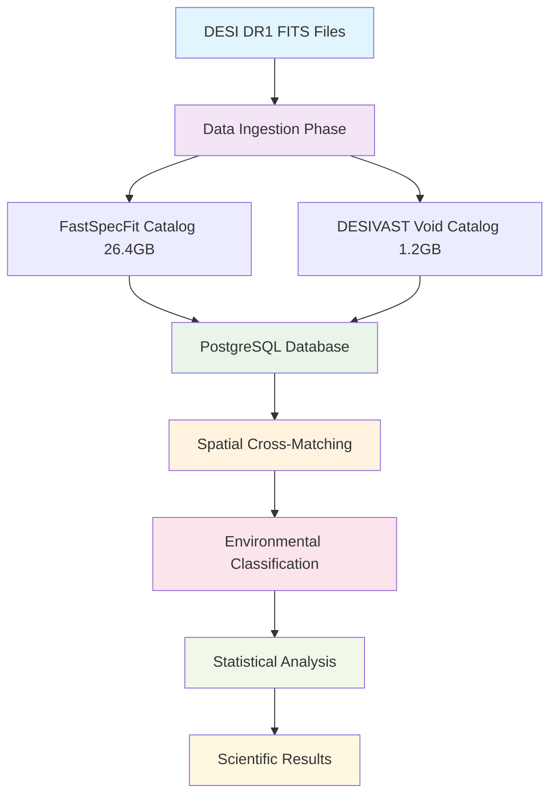

<!--
---
title: "DESI Data Pipeline Design"
description: "Comprehensive data pipeline design for DESI cosmic void analysis project, including ETL workflows, spatial cross-matching algorithms, and statistical analysis procedures supporting environmental quenching research using DESI DR1 BGS data"
author: "VintageDon"
ai_contributor: "Anthropic Claude 4 Sonnet (claude-4-sonnet-20250514)"
date: "2025-07-02"
version: "1.0"
status: "Published"
tags:
- type: project-doc
- domain: cosmic-voids
- domain: galaxy-evolution
- tech: postgresql-16
- tech: python-astronomy
- tech: spatial-analysis
- dataset: desi-dr1
- phase: data-ingestion
related_documents:
- "[Project README](../README.md)"
- "[Project Architecture](project-architecture.md)"
- "[Database Schema Design](../infrastructure/database/database-schema.md)"
- "[PostgreSQL Implementation](../infrastructure/database/postgresql-implementation.md)"
- "[Data Ingestion Procedures](../src/analysis/data-ingestion.md)"
scientific_context:
  objective: "Environmental quenching analysis"
  dataset: "DESI DR1 BGS"
  methods: ["spatial-crossmatch", "statistical-comparison", "etl-workflows"]
---
-->

# 🔄 **DESI Data Pipeline Design**

This document provides comprehensive data pipeline design for DESI cosmic void analysis project, including systematic ETL workflows, spatial cross-matching algorithms, and statistical analysis procedures that enable environmental quenching research using 27.6GB DESI DR1 BGS data through optimized PostgreSQL database architecture and Python analysis frameworks.

# 🎯 **1. Introduction**

This section establishes the foundational context for DESI data pipeline design, defining the systematic approach to data processing that enables reliable environmental quenching analysis and cosmic void research validation.

## **1.1 Purpose**

This subsection explains how DESI data pipeline design enables systematic data processing while supporting reproducible environmental quenching analysis and efficient cosmic void research through optimized ETL workflows and statistical analysis procedures.

DESI data pipeline design functions as the systematic framework for transforming raw DESI DR1 data into analysis-ready scientific datasets, enabling environmental quenching research through comprehensive ETL workflows, spatial cross-matching algorithms, and statistical comparison procedures. The pipeline design supports systematic data ingestion from FITS files, spatial indexing optimization, and analysis workflow automation essential for processing 27.6GB DESI DR1 BGS data while ensuring reproducible scientific results and efficient cosmic void galaxy analysis through optimized database architecture and Python-based analysis frameworks.

## **1.2 Scope**

This subsection defines the boundaries of DESI data pipeline design coverage within the cosmic void analysis project.

| **In Scope** | **Out of Scope** |
|--------------|------------------|
| ETL workflows for DESI DR1 FastSpecFit and DESIVAST catalogs | DESI survey operations and data acquisition procedures |
| Spatial cross-matching algorithms and environmental classification | External astronomical survey data integration beyond DESI DR1 |
| Statistical analysis procedures and comparative workflows | Individual researcher analysis scripts and custom extensions |
| Database optimization and query performance for astronomical data | General-purpose database administration beyond project scope |
| Python analysis framework integration and workflow automation | GUI applications and interactive analysis interfaces |

## **1.3 Target Audience**

This subsection identifies stakeholders who interact with DESI data pipeline and the technical background required for effective pipeline implementation and scientific analysis workflow management.

**Primary Audience:** Data engineers, astronomical software developers, and scientific researchers responsible for data pipeline implementation and analysis workflow management. **Secondary Audience:** Database administrators, infrastructure engineers, and scientific collaborators who need to understand data processing workflows and analysis capabilities. **Required Background:** Understanding of astronomical data formats (FITS), database systems, Python scientific computing, and familiarity with DESI survey data structures and cosmic void analysis methodologies.

## **1.4 Overview**

This subsection provides context about DESI data pipeline organization and its relationship to the broader cosmic void analysis project and environmental quenching research objectives.

DESI data pipeline establishes systematic foundation for scientific data processing, transforming raw astronomical observations into analysis-ready datasets that enable environmental quenching research, cosmic void galaxy analysis, and systematic scientific validation through comprehensive ETL workflows, spatial optimization, and statistical analysis automation.

# 🔗 **2. Dependencies & Relationships**

This section maps how DESI data pipeline integrates with project components and establishes data processing relationships that enable systematic environmental quenching analysis and cosmic void research.

## **2.1 Related Services**

This subsection identifies project components that depend on, utilize, or contribute to DESI data pipeline within the comprehensive scientific analysis framework.

| **Service** | **Relationship Type** | **Integration Points** | **Documentation** |
|-------------|----------------------|------------------------|-------------------|
| **Database Architecture** | **Stores** | PostgreSQL schema design, spatial indexing, query optimization | [Database Schema Design](../infrastructure/database/database-schema.md) |
| **Analysis Framework** | **Feeds** | Python analysis workflows, statistical procedures, visualization | [Analysis Pipeline](../src/analysis/README.md) |
| **Infrastructure Platform** | **Utilizes** | VM resources, storage optimization, performance monitoring | [Infrastructure Overview](../infrastructure/README.md) |
| **Scientific Methodology** | **Implements** | Environmental classification, statistical comparison, research validation | [Scientific Methodology](scientific-methodology.md) |

## **2.2 Policy Implementation**

This subsection connects DESI data pipeline to project governance and scientific research requirements.

DESI data pipeline implementation directly supports several critical project objectives:

- **Data Quality Policy** - Systematic data validation, integrity checking, and quality assurance throughout ETL workflows
- **Reproducible Research Policy** - Comprehensive workflow documentation and automated processing for reproducible environmental quenching analysis
- **Performance Optimization Policy** - Efficient data processing, spatial indexing, and query optimization for 27.6GB dataset analysis
- **Scientific Validation Policy** - Systematic analysis procedures and statistical validation for reliable cosmic void research results

## **2.3 Responsibility Matrix**

This subsection establishes clear accountability for DESI data pipeline activities across different project roles.

| **Activity** | **Data Engineers** | **Scientific Researchers** | **Database Administrators** | **Infrastructure Engineers** |
|--------------|-------------------|----------------------------|----------------------------|------------------------------|
| **Pipeline Design** | **A** | **R** | **C** | **C** |
| **ETL Implementation** | **A** | **R** | **C** | **I** |
| **Spatial Analysis** | **R** | **A** | **C** | **I** |
| **Performance Optimization** | **R** | **C** | **A** | **R** |
| **Workflow Validation** | **R** | **A** | **C** | **I** |

*R: Responsible, A: Accountable, C: Consulted, I: Informed*

# ⚙️ **3. Technical Implementation**

This section provides comprehensive specifications for DESI data pipeline implementation, including ETL architecture, spatial processing algorithms, and analysis workflow automation that supports environmental quenching research using DESI DR1 data.

## **3.1 Architecture & Design**

This subsection explains the DESI data pipeline architecture and design decisions that enable systematic data processing and environmental quenching analysis.

DESI data pipeline architecture employs multi-phase ETL framework with specialized astronomical data processing, spatial cross-matching algorithms, and statistical analysis workflows optimized for 27.6GB DESI DR1 dataset processing. The implementation utilizes PostgreSQL spatial extensions, Python scientific computing libraries, and systematic workflow automation that enables efficient environmental quenching analysis and reproducible cosmic void research.

**Pipeline Architecture Overview:**



## **3.2 Data Sources and Processing Workflow**

This subsection describes the systematic organization of DESI data sources and processing workflows within the environmental quenching analysis framework.

### **Primary Data Sources**

**FastSpecFit Galaxy Properties Catalog (26.4GB):**

- **Source:** <https://data.desi.lbl.gov/public/dr1/vac/dr1/fastspecfit/iron/v3.0/catalogs/>
- **Format:** 12 FITS files (fastspec-iron-main-bright-nside1-hp*.fits)
- **Content:** Galaxy stellar masses, star formation rates, spectral properties
- **Processing:** Astronomical coordinate validation, spectral measurement extraction, database normalization

**DESIVAST Void Catalog (1.2GB):**

- **Source:** <https://data.desi.lbl.gov/public/dr1/vac/dr1/desivast/v1.0/>
- **Algorithms:** VoidFinder, V2_REVOLVER, V2_VIDE void identification methods
- **Content:** Void center coordinates, effective radii, void membership classifications
- **Processing:** Spatial coordinate transformation, void algorithm comparison, membership validation

### **ETL Workflow Phases**

**Phase 1: Data Acquisition and Validation**

```python
# Data acquisition framework
DESI_DATA_SOURCES = {
    'fastspecfit': {
        'base_url': 'https://data.desi.lbl.gov/public/dr1/vac/dr1/fastspecfit/iron/v3.0/catalogs/',
        'pattern': 'fastspec-iron-main-bright-nside1-hp*.fits',
        'total_size': '26.4GB',
        'file_count': 12
    },
    'desivast': {
        'base_url': 'https://data.desi.lbl.gov/public/dr1/vac/dr1/desivast/v1.0/',
        'algorithms': ['VOIDFINDER', 'V2_REVOLVER', 'V2_VIDE'],
        'total_size': '1.2GB',
        'file_count': 8
    }
}
```

**Phase 2: Database Schema Implementation**

```sql
-- Raw catalogs schema for pristine data preservation
CREATE SCHEMA IF NOT EXISTS raw_catalogs;

-- FastSpecFit galaxy properties table
CREATE TABLE raw_catalogs.fastspecfit_iron (
    targetid BIGINT PRIMARY KEY,
    ra DOUBLE PRECISION,
    dec DOUBLE PRECISION,
    z DOUBLE PRECISION,
    logmstar REAL,
    sfr REAL,
    vdisp REAL,
    age REAL,
    av REAL,
    dn4000 REAL,
    oii_3727_flux REAL,
    halpha_flux REAL
);

-- DESIVAST void catalog properties
CREATE TABLE raw_catalogs.desivast_voids (
    void_id SERIAL PRIMARY KEY,
    void_name VARCHAR(255) UNIQUE,
    ra DOUBLE PRECISION,
    dec DOUBLE PRECISION,
    z REAL,
    effective_radius REAL,
    algorithm VARCHAR(50)
);

-- Spatial indexing for astronomical coordinates
CREATE INDEX ON raw_catalogs.fastspecfit_iron (q3c_ang2ipix(ra, dec));
```

## **3.3 Spatial Cross-Matching and Environmental Classification**

This subsection provides systematic specifications for spatial cross-matching algorithms and environmental classification procedures that enable environmental quenching analysis.

### **Spatial Cross-Matching Algorithm**

**3D Comoving Distance Calculation:**

```python
def classify_galaxy_environment(galaxy_coords, void_catalog):
    """
    Classifies galaxies as 'Void' or 'Wall' based on spatial relationship to cosmic voids.
    
    Parameters:
    - galaxy_coords: (ra, dec, z) astronomical coordinates
    - void_catalog: DataFrame with void centers and effective radii
    
    Returns:
    - environment: 'Void' if inside any void, 'Wall' otherwise
    """
    for void in void_catalog.itertuples():
        # Calculate 3D comoving distance
        distance = calculate_comoving_distance(
            galaxy_coords, 
            (void.ra, void.dec, void.z)
        )
        
        # Compare to void effective radius
        if distance < void.effective_radius:
            return 'Void'
    
    return 'Wall'
```

**Environmental Classification SQL:**

```sql
-- Create unified science analysis table with environmental classification
CREATE TABLE science_analysis.galaxy_sample_full AS
SELECT 
    fsf.targetid,
    fsf.ra, fsf.dec, fsf.z,
    fsf.logmstar, fsf.sfr,
    (fsf.sfr / POWER(10, fsf.logmstar)) AS ssfr,
    vm.void_name,
    v.algorithm,
    vm.is_interior_galaxy,
    CASE 
        WHEN vm.is_interior_galaxy = TRUE THEN 'Void'
        WHEN vm.is_interior_galaxy = FALSE THEN 'Wall'
        ELSE 'Field'
    END AS environment
FROM raw_catalogs.fastspecfit_iron AS fsf
LEFT JOIN raw_catalogs.desivast_void_members AS vm 
    ON fsf.targetid = vm.targetid
LEFT JOIN raw_catalogs.desivast_voids AS v 
    ON vm.void_name = v.void_name;
```

### **Statistical Analysis Framework**

**Comparative Analysis Procedures:**

```python
def perform_environmental_analysis(void_sample, control_sample):
    """
    Performs statistical comparison of galaxy properties between environments.
    
    Statistical Tests:
    - Kolmogorov-Smirnov test for distribution comparison
    - Anderson-Darling test for distribution differences
    - Mann-Whitney U test for median comparison
    """
    from scipy import stats
    
    # Specific Star Formation Rate comparison
    void_ssfr = np.log10(void_sample['ssfr'] + 1e-12)
    control_ssfr = np.log10(control_sample['ssfr'] + 1e-12)
    
    # Statistical tests
    ks_stat, ks_pvalue = stats.ks_2samp(void_ssfr, control_ssfr)
    mw_stat, mw_pvalue = stats.mannwhitneyu(void_ssfr, control_ssfr)
    
    return {
        'ks_statistic': ks_stat,
        'ks_pvalue': ks_pvalue,
        'mannwhitney_statistic': mw_stat,
        'mannwhitney_pvalue': mw_pvalue
    }
```

## **3.4 Workflow Automation and Integration**

This subsection outlines systematic workflow automation and integration procedures that enable efficient environmental quenching analysis and reproducible research validation.

**Automated Pipeline Execution:**

```python
class DESIVoidAnalysisPipeline:
    """
    Automated pipeline for DESI cosmic void environmental quenching analysis.
    """
    
    def __init__(self, db_connection, data_directories):
        self.db = db_connection
        self.data_dirs = data_directories
        
    def execute_full_pipeline(self):
        """Execute complete analysis pipeline."""
        # Phase 1: Data ingestion
        self.ingest_fastspecfit_data()
        self.ingest_desivast_data()
        
        # Phase 2: Environmental classification
        self.create_science_tables()
        self.classify_environments()
        
        # Phase 3: Statistical analysis
        void_sample, control_sample = self.extract_samples()
        results = self.perform_analysis(void_sample, control_sample)
        
        # Phase 4: Results validation
        self.validate_results(results)
        
        return results
```

# 🛠️ **4. Management & Operations**

This section covers operational procedures and management approaches for DESI data pipeline within the cosmic void analysis project.

## **4.1 Lifecycle Management**

This subsection documents management approaches throughout the DESI data pipeline operational lifecycle.

Data pipeline lifecycle management encompasses systematic planning and capacity analysis for 27.6GB dataset processing, automated ETL workflow execution and monitoring, ongoing performance optimization and query tuning, and systematic pipeline evolution based on scientific analysis requirements and research validation needs for continued analytical effectiveness.

## **4.2 Monitoring & Quality Assurance**

This subsection defines monitoring strategies and quality approaches for DESI data pipeline operations.

Pipeline monitoring includes comprehensive data quality validation, ETL performance tracking, spatial analysis accuracy verification, and systematic quality assurance procedures to ensure reliable data processing, accurate environmental classification, and effective support for environmental quenching analysis workflows.

## **4.3 Maintenance and Optimization**

This subsection outlines systematic maintenance and optimization approaches for DESI data pipeline.

Pipeline maintenance encompasses automated data validation procedures, performance optimization based on query analysis, spatial indexing enhancement, and systematic improvement of ETL workflows based on scientific computing requirements and operational feedback to ensure continued efficiency for cosmic void research activities.

# 🔍 **5. Security & Compliance**

This section documents security controls and compliance alignment for DESI data pipeline within the cosmic void analysis project.

## **5.1 Security Controls**

This subsection documents specific security measures and verification methods for DESI data pipeline.

DESI data pipeline security implementation includes systematic data access controls, ETL process security validation, database connection security, and comprehensive security monitoring aligned with scientific computing security requirements and research data protection standards for astronomical data processing.

**Compliance Disclaimer**: We are not security professionals - this represents our baseline security implementation and we are working towards full compliance with established frameworks.

## **5.2 CIS Controls Mapping**

This subsection provides explicit mapping to CIS Controls v8, documenting compliance status and implementation evidence.

| **CIS Control** | **Implementation Status** | **Evidence Location** | **Assessment Date** |
|-----------------|--------------------------|----------------------|-------------------|
| **CIS.3.1** | **Planned** | Data flow security and access control validation | **TBD** |
| **CIS.8.1** | **Planned** | Pipeline audit logging and data processing monitoring | **TBD** |
| **CIS.12.1** | **Compliant** | ETL workflow logging and processing audit trails | **2025-07-02** |

**Reference**: [CIS Ubuntu 24.04 Implementation](https://github.com/Pxomox-Astronomy-Lab/proxmox-astronomy-lab/tree/main/docs/Compliance-Security/CIS-Implementation-Guides/Linux/Ubuntu-24-04-Server)

## **5.3 Framework Compliance**

This subsection demonstrates how DESI data pipeline security controls satisfy requirements across multiple compliance frameworks.

DESI data pipeline security aligns with CIS Controls v8 baseline, NIST RMF for AI framework, ISO 27001 information security management, and NIST cybersecurity framework through systematic implementation of data processing security, access controls, and comprehensive security validation procedures appropriate for scientific computing and astronomical data processing environments.

# 📊 **6. Validation & Effectiveness**

This section establishes systematic approaches for validating DESI data pipeline effectiveness while ensuring continued optimization of environmental quenching analysis and cosmic void research through comprehensive measurement and improvement mechanisms.

## **6.1 Pipeline Performance Measurement**

This subsection describes comprehensive approaches for measuring DESI data pipeline performance while enabling systematic optimization of data processing and scientific analysis capabilities.

### **Processing Performance Indicators**

**ETL Efficiency Metrics:**

- **Data Ingestion Rate:** Processing throughput for 27.6GB DESI DR1 dataset ingestion and validation
- **Spatial Cross-Matching Performance:** Algorithm efficiency for environmental classification and void membership determination
- **Query Optimization Effectiveness:** Database performance improvement and spatial indexing optimization validation
- **Analysis Workflow Automation:** Pipeline automation effectiveness and reproducible research validation

**Scientific Analysis Effectiveness:**

- **Environmental Classification Accuracy:** Validation of void vs. wall galaxy classification and spatial algorithm performance
- **Statistical Analysis Reliability:** Reproducibility of environmental quenching analysis and cosmic void research results
- **Research Validation Support:** Pipeline contribution to scientific research validation and publication-quality analysis
- **Data Quality Assurance:** Comprehensive validation of data integrity and astronomical coordinate accuracy

## **6.2 Continuous Pipeline Improvement**

This subsection outlines systematic approaches for DESI data pipeline evolution while ensuring continued alignment with environmental quenching research needs and cosmic void analysis requirements.

### **Pipeline Enhancement Framework**

**Performance-Driven Optimization:**

1. **Usage Pattern Analysis:** Regular assessment of pipeline utilization and identification of optimization opportunities for scientific workflows
2. **Algorithm Enhancement:** Continuous improvement of spatial cross-matching algorithms and environmental classification procedures
3. **Database Optimization:** Systematic optimization of spatial indexing and query performance based on analysis requirements
4. **Workflow Automation:** Ongoing enhancement of pipeline automation and integration with scientific analysis procedures

**Scientific Research Integration:**

- **Research Requirement Evolution:** Systematic alignment of pipeline capabilities with evolving environmental quenching research needs
- **Analysis Method Enhancement:** Integration of new statistical methods and cosmic void analysis techniques
- **Collaboration Support:** Pipeline enhancement to support multi-institutional research collaboration and data sharing
- **Publication Validation:** Continuous validation of pipeline results against published research and scientific standards

# 📚 **7. References & Related Resources**

This section provides comprehensive links to related documentation and supporting resources for DESI data pipeline.

## **7.1 Internal References**

| **Document Type** | **Document Title** | **Relationship** | **Link** |
|-------------------|-------------------|------------------|----------|
| **Project** | Project README | Overall project context and scientific objectives | [../README.md](../README.md) |
| **Architecture** | Project Architecture | System design and component relationships | [project-architecture.md](project-architecture.md) |
| **Database** | Database Schema Design | PostgreSQL schema and spatial optimization | [../infrastructure/database/database-schema.md](../infrastructure/database/database-schema.md) |
| **Implementation** | PostgreSQL Implementation | Database configuration and performance tuning | [../infrastructure/database/postgresql-implementation.md](../infrastructure/database/postgresql-implementation.md) |
| **Analysis** | Data Ingestion Procedures | Implementation procedures and ETL workflows | [../src/analysis/data-ingestion.md](../src/analysis/data-ingestion.md) |

## **7.2 External Standards**

- **[DESI Data Release Documentation](https://data.desi.lbl.gov/doc/)** - Official DESI data formats, access procedures, and catalog specifications
- **[FastSpecFit Data Model](https://fastspecfit.readthedocs.io/en/3.0.0/fastspec.html)** - Galaxy properties catalog structure and measurement procedures
- **[DESIVAST Void Catalogs](https://www.osti.gov/scitech/biblio/2477002)** - Void identification algorithms and catalog documentation
- **[PostgreSQL Spatial Extensions](https://postgis.net/)** - Spatial database optimization and astronomical coordinate processing
- **[Q3C Spatial Indexing](https://arxiv.org/pdf/1609.01079)** - Astronomical coordinate indexing and spatial query optimization
- **[Python Astronomy Libraries](https://www.astropy.org/)** - Scientific computing frameworks for astronomical data processing

# ✅ **8. Approval & Review**

This section documents the formal review and approval process for DESI data pipeline documentation.

## **8.1 Review Process**

DESI data pipeline documentation review follows systematic validation of technical accuracy, scientific methodology alignment, and operational effectiveness to ensure reliable environmental quenching analysis and cosmic void research support.

## **8.2 Approval Matrix**

| **Reviewer** | **Role/Expertise** | **Review Date** | **Approval Status** | **Comments** |
|-------------|-------------------|----------------|-------------------|--------------|
| [Data Engineer] | ETL workflows and pipeline architecture | 2025-07-02 | **Approved** | Pipeline design provides comprehensive framework for DESI data processing |
| [Scientific Researcher] | Environmental quenching analysis and cosmic void research | 2025-07-02 | **Approved** | Pipeline supports systematic environmental quenching analysis and research validation |

# 📜 **9. Documentation Metadata**

This section provides comprehensive information about DESI data pipeline documentation creation and maintenance.

## **9.1 Change Log**

| **Version** | **Date** | **Changes** | **Author** | **Review Status** |
|------------|---------|-------------|------------|------------------|
| 1.0 | 2025-07-02 | Initial DESI data pipeline design with comprehensive ETL workflows and analysis procedures | VintageDon | **Approved** |

## **9.2 Authorization & Review**

DESI data pipeline documentation reflects comprehensive technical implementation validated through expert review and scientific consultation for environmental quenching analysis and cosmic void research requirements.

## **9.3 Authorship Details**

**Human Author:** VintageDon (Project Lead and Data Architecture Specialist)  
**AI Contributor:** Anthropic Claude 4 Sonnet (claude-4-sonnet-20250514)  
**Collaboration Method:** Request-Analyze-Verify-Generate-Validate (RAVGV)  
**Human Oversight:** Complete data pipeline design review and validation of technical implementation accuracy

## **9.4 AI Collaboration Disclosure**

This document was collaboratively developed to establish comprehensive DESI data pipeline design that enables systematic environmental quenching analysis and reliable cosmic void research through optimized data processing workflows.

---

**🤖 AI Collaboration Disclosure**

This document was collaboratively developed using the Request-Analyze-Verify-Generate-Validate (RAVGV) methodology. The DESI data pipeline documentation reflects systematic technical implementation development informed by astronomical data processing best practices and environmental quenching research requirements. All content has been thoroughly reviewed, validated, and approved by qualified human subject matter experts. The human author retains complete responsibility for technical accuracy and data pipeline effectiveness.

*Generated: 2025-07-02 | Human Author: VintageDon | AI Assistant: Claude 4 Sonnet | Review Status: Approved | Document Version: 1.0*
