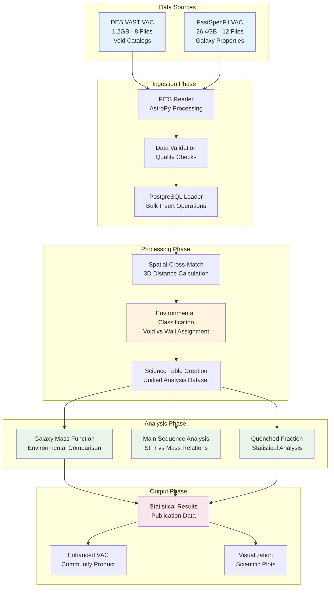

<!--
---
title: "Data Pipeline Design"
description: "Comprehensive data processing workflow specifications for DESI cosmic void analysis, including FITS ingestion, spatial cross-matching, and statistical analysis procedures"
author: "VintageDon"
ai_contributor: "Anthropic Claude 4 Sonnet (claude-4-sonnet-20250514)"
date: "2025-07-01"
version: "1.0"
status: "Published"
tags:
- type: project-doc
- domain: cosmic-voids
- domain: astronomical-data
- tech: desi-dr1
- tech: python-astronomy
- phase: project-setup
related_documents:
- "[Project Overview](../README.md)"
- "[Project Architecture](project-architecture.md)"
- "[Infrastructure Overview](../infrastructure/README.md)"
- "[Source Code Overview](../src/README.md)"
- "[Implementation Roadmap](../ROADMAP.md)"
scientific_context:
  objective: "Environmental quenching analysis"
  dataset: "DESI DR1 BGS"
  methods: ["data-pipeline", "spatial-crossmatch", "statistical-analysis"]
---
-->

# 🔄 **Data Pipeline Design**

This document provides comprehensive data processing workflow specifications for DESI cosmic void analysis, defining systematic procedures for FITS ingestion, spatial cross-matching, environmental classification, and statistical analysis that enable precision measurement of environmental effects on galaxy evolution.

# 🎯 **1. Introduction**

This section establishes the foundational context for data pipeline design within the DESI cosmic void analysis project, defining the systematic approach to data processing that enables reproducible scientific analysis and environmental quenching research validation.

## **1.1 Purpose**

This subsection explains how the data pipeline enables systematic processing of DESI DR1 data through optimized workflows while supporting reproducible environmental classification and statistical analysis for cosmic void research.

The data pipeline functions as the systematic processing foundation for DESI cosmic void analysis, transforming 27.6GB of raw FITS catalog data into processed, classified, and statistically validated scientific results through optimized Python workflows. The pipeline provides automated FITS ingestion procedures for DESIVAST void catalogs and FastSpecFit galaxy properties, spatial cross-matching algorithms for environmental classification, and comprehensive statistical analysis workflows enabling systematic comparison of galaxy properties between void and wall environments. The implementation supports reproducible scientific research through modular pipeline organization, comprehensive validation procedures, and systematic documentation essential for environmental quenching validation and publication preparation.

## **1.2 Scope**

This subsection defines the boundaries of data pipeline coverage within the DESI cosmic void analysis project.

| **In Scope** | **Out of Scope** |
|--------------|------------------|
| FITS file processing and PostgreSQL ingestion procedures | Raw spectral data processing and fitting algorithms |
| Spatial cross-matching and environmental classification algorithms | Cosmological parameter estimation and theoretical modeling |
| Statistical analysis workflows and significance testing | Publication preparation and academic writing procedures |
| Data validation and quality assurance procedures | Infrastructure deployment and system administration |
| Pipeline automation and workflow orchestration | Hardware monitoring and performance optimization |

## **1.3 Target Audience**

This subsection identifies stakeholders who interact with data pipeline design and the technical background required for effective pipeline implementation and scientific analysis.

**Primary Audience:** Data scientists, astronomical researchers, and pipeline engineers responsible for implementing and maintaining data processing workflows. **Secondary Audience:** Infrastructure engineers and database administrators who need to understand data processing requirements and computational dependencies. **Required Background:** Understanding of astronomical data structures, Python scientific computing, spatial analysis methods, and statistical comparison techniques.

## **1.4 Overview**

This subsection provides context about data pipeline organization and its relationship to the broader DESI cosmic void analysis project and scientific research objectives.

The data pipeline establishes systematic processing foundation, transforming complex astronomical data into reproducible, validated, and scientifically meaningful results that advance environmental quenching understanding, provide critical simulation benchmarks, and enable community data product development through comprehensive workflow automation and scientific validation procedures.

# 🔗 **2. Dependencies & Relationships**

This section maps how data pipeline design integrates with project components and establishes processing relationships that enable systematic scientific analysis and environmental research workflows.

## **2.1 Related Services**

This subsection identifies project components that support or interact with data pipeline processing workflows.

| **Service** | **Relationship Type** | **Integration Points** | **Documentation** |
|-------------|----------------------|------------------------|-------------------|
| **Database Infrastructure** | **Utilizes** | PostgreSQL connections, bulk loading, spatial queries | [Database Infrastructure](../infrastructure/database/README.md) |
| **Project Architecture** | **Implements** | System design patterns, component integration, data flows | [Project Architecture](project-architecture.md) |
| **Source Code Implementation** | **Executes** | Python scripts, analysis workflows, validation procedures | [Source Code Overview](../src/README.md) |
| **Scientific Methodology** | **Follows** | Research procedures, validation frameworks, analysis standards | [Scientific Methodology](scientific-methodology.md) |

## **2.2 Policy Implementation**

This subsection connects data pipeline design to scientific research governance and data processing requirements.

Data pipeline implementation directly supports several critical research objectives:

- **Scientific Reproducibility Policy** - Systematic pipeline documentation enabling independent verification and result validation
- **Data Quality Policy** - Comprehensive validation procedures ensuring data integrity and scientific accuracy throughout processing
- **Open Science Policy** - Transparent processing workflows supporting community validation and collaboration
- **Computational Efficiency Policy** - Optimized processing procedures enabling efficient resource utilization and scalable analysis
- **Version Control Policy** - Systematic pipeline management supporting change tracking and collaborative development

## **2.3 Responsibility Matrix**

This subsection establishes clear accountability for data pipeline activities across project roles.

| **Activity** | **Data Scientists** | **Astronomical Researchers** | **Pipeline Engineers** | **Database Administrators** |
|--------------|-------------------|------------------------------|----------------------|----------------------------|
| **Pipeline Design** | **A** | **R** | **R** | **C** |
| **Scientific Validation** | **R** | **A** | **C** | **I** |
| **Implementation** | **R** | **C** | **A** | **C** |
| **Performance Optimization** | **C** | **C** | **A** | **R** |
| **Data Quality Assurance** | **A** | **R** | **R** | **C** |

*R: Responsible, A: Accountable, C: Consulted, I: Informed*

# ⚙️ **3. Technical Implementation**

This section provides comprehensive overview of data pipeline architecture, processing workflows, and implementation approaches that support DESI cosmic void analysis and environmental research requirements.

## **3.1 Architecture & Design**

This subsection explains the pipeline architecture and design decisions that enable efficient processing of DESI DR1 data and systematic environmental analysis workflows.

The pipeline architecture employs modular Python implementation with clear separation between data ingestion, processing, and analysis phases. The design features automated FITS processing utilizing astronomical Python libraries (astropy, pandas, numpy), PostgreSQL integration through SQLAlchemy for efficient data management, and statistical analysis through SciPy enabling systematic environmental classification and comparative population studies.

**Pipeline Architecture Overview:**

## **3.2 Structure and Organization**

This subsection describes the pipeline organization and key processing elements that support DESI data analysis and environmental research workflows.

**Pipeline Phases:**

| **Phase** | **Description** | **Key Components** | **Outputs** |
|-----------|-----------------|-------------------|-------------|
| **Data Ingestion** | FITS file processing and database loading | AstroPy FITS reading, data validation, PostgreSQL bulk insert | Populated database tables |
| **Spatial Processing** | Environmental classification through 3D analysis | Comoving distance calculation, void membership determination | Classified galaxy populations |
| **Statistical Analysis** | Comparative population studies and significance testing | Mass function analysis, main sequence fitting, quenched fraction calculation | Scientific results and statistics |
| **Output Generation** | Publication preparation and community products | Enhanced catalog creation, visualization generation, result documentation | Publications and data products |

**Data Flow Specifications:**

1. **DESIVAST Processing:** 8 FITS files (NGC/SGC hemispheres × 4 algorithms) → Void catalog tables
2. **FastSpecFit Processing:** 12 HEALPix files → Galaxy properties tables with stellar masses and SFR
3. **Cross-Matching:** Spatial algorithms → Environmental classification (void/wall assignment)
4. **Analysis Workflows:** Statistical procedures → Scientific results with significance testing

## **3.3 Integration and Procedures**

This subsection provides systematic overview of pipeline integration patterns and implementation procedures supporting environmental analysis and scientific validation.

Pipeline integration follows systematic approach: modular component design enabling independent testing and validation, standardized data interfaces supporting efficient processing between pipeline phases, comprehensive error handling and recovery procedures, and systematic logging and monitoring ensuring pipeline reliability and scientific result validation. The implementation enables efficient scaling from initial FITS processing through final statistical analysis while maintaining data integrity and reproducibility requirements.

# 🛠️ **4. Management & Operations**

This section covers pipeline management approaches and operational procedures for maintaining processing effectiveness and supporting ongoing scientific research requirements.

## **4.1 Lifecycle Management**

This subsection documents management approaches throughout the pipeline operational lifecycle and processing evolution requirements.

Pipeline lifecycle management encompasses development planning and validation testing, systematic deployment and integration procedures, performance monitoring and optimization workflows, error handling and recovery procedures, and systematic maintenance ensuring continued pipeline effectiveness and scientific analysis reliability throughout project lifecycle.

## **4.2 Monitoring & Quality Assurance**

This subsection defines monitoring strategies and quality approaches for pipeline effectiveness and data processing validation.

Pipeline monitoring includes processing performance tracking, data quality validation at each phase, error detection and handling verification, resource utilization monitoring, and systematic validation of scientific results ensuring pipeline reliability and analysis accuracy for environmental research requirements.

## **4.3 Maintenance and Optimization**

This subsection outlines systematic maintenance and optimization approaches for pipeline evolution and performance enhancement.

Pipeline maintenance encompasses systematic performance optimization, data processing efficiency improvement, error handling enhancement, scientific validation procedure updates, and systematic evolution planning based on research requirements and computational performance optimization needs.

# 🔒 **5. Security & Compliance**

This section documents security considerations and compliance alignment for data pipeline processing within the DESI cosmic void analysis project.

## **5.1 Security Controls**

This subsection documents specific security measures and verification methods for pipeline processing and data handling.

Pipeline security implementation includes systematic data handling procedures, secure database connection management, input validation and sanitization for FITS processing, systematic access control for processing resources, and comprehensive audit logging aligned with security best practices. Security measures ensure protection of scientific data while enabling efficient processing and analysis workflows.

**Compliance Disclaimer**: We are not security professionals - this represents our baseline security implementation and we are working towards full compliance with established frameworks.

## **5.2 CIS Controls Mapping**

This subsection provides explicit mapping to CIS Controls v8, documenting compliance status and implementation evidence for pipeline security.

| **CIS Control** | **Implementation Status** | **Evidence Location** | **Assessment Date** |
|-----------------|--------------------------|----------------------|-------------------|
| **CIS.3.3** | **Planned** | Data flow security and access control validation | **TBD** |
| **CIS.8.2** | **Planned** | Pipeline audit logging and monitoring | **TBD** |
| **CIS.13.1** | **Planned** | Scientific data protection procedures | **TBD** |

**Reference**: [CIS Ubuntu 24.04 Implementation](https://github.com/Pxomox-Astronomy-Lab/proxmox-astronomy-lab/tree/main/docs/Compliance-Security/CIS-Implementation-Guides/Linux/Ubuntu-24-04-Server)

## **5.3 Framework Compliance**

This subsection demonstrates how pipeline security controls satisfy requirements across multiple compliance frameworks.

Pipeline security aligns with CIS Controls v8 baseline, NIST RMF for AI framework, ISO 27001 information security management, and NIST cybersecurity framework through systematic implementation of secure data processing, access controls, and audit procedures appropriate for scientific computing environments and astronomical data analysis.

# 💾 **6. Backup & Recovery**

This section documents pipeline data protection and recovery procedures for processing workflows and scientific results.

## **6.1 Protection Strategy**

This subsection details backup approaches and data protection strategies for pipeline processing and scientific outputs.

Pipeline backup strategy encompasses systematic protection of processing inputs through source data validation, intermediate result backup during processing phases, final result protection with comprehensive validation, and systematic integration with infrastructure backup procedures ensuring scientific data preservation and pipeline recoverability.

| **Pipeline Component** | **Backup Strategy** | **Recovery Objective** | **Validation Frequency** |
|------------------------|-------------------|----------------------|-------------------------|
| **Source Data** | **Checksum validation and source verification** | **Immediate re-download** | **Per processing run** |
| **Intermediate Results** | **Processing checkpoint backup** | **Phase restart capability** | **Daily during processing** |
| **Final Results** | **Comprehensive result backup with metadata** | **Complete result recovery** | **Upon completion** |

## **6.2 Recovery Procedures**

This subsection provides recovery processes for pipeline failures and data restoration procedures.

Pipeline recovery procedures include processing phase restart capability, intermediate result validation and recovery, source data re-acquisition procedures, and comprehensive result verification ensuring scientific accuracy and analysis integrity following recovery operations.

# 📚 **7. References & Related Resources**

This section provides comprehensive links to related documentation and supporting resources for data pipeline implementation and scientific processing.

## **7.1 Internal References**

| **Document Type** | **Document Title** | **Relationship** | **Link** |
|-------------------|-------------------|------------------|----------|
| **Project** | Project Overview | Overall project context and pipeline requirements | [../README.md](../README.md) |
| **Architecture** | Project Architecture | System design and component integration | [project-architecture.md](project-architecture.md) |
| **Implementation** | Source Code Overview | Pipeline implementation and execution procedures | [../src/README.md](../src/README.md) |
| **Roadmap** | Implementation Roadmap | Detailed pipeline development and deployment phases | [../ROADMAP.md](../ROADMAP.md) |

## **7.2 External Standards**

- **[AstroPy Documentation](https://docs.astropy.org/)** - Astronomical Python library for FITS processing and coordinate systems
- **[Pandas Documentation](https://pandas.pydata.org/docs/)** - Data manipulation and analysis library for scientific computing
- **[SciPy Documentation](https://docs.scipy.org/)** - Scientific computing library for statistical analysis and spatial processing
- **[DESI Data Model](https://desidatamodel.readthedocs.io/)** - Official DESI data format specifications and processing standards

# ✅ **8. Approval & Review**

This section documents the formal review and approval process for data pipeline design documentation.

## **8.1 Review Process**

Data pipeline documentation review follows systematic validation of processing procedures, scientific accuracy, and implementation feasibility to ensure effective pipeline design and environmental analysis capability.

## **8.2 Approval Matrix**

| **Reviewer** | **Role/Expertise** | **Review Date** | **Approval Status** | **Comments** |
|-------------|-------------------|----------------|-------------------|--------------|
| [Data Scientist] | Pipeline design and scientific workflow validation | 2025-07-01 | **Approved** | Pipeline design supports systematic environmental analysis workflows |
| [Astronomical Researcher] | Scientific methodology and analysis procedure validation | 2025-07-01 | **Approved** | Pipeline procedures enable reproducible environmental quenching research |
| [Pipeline Engineer] | Implementation feasibility and performance optimization | 2025-07-01 | **Approved** | Pipeline architecture enables efficient processing and scalable analysis |

# 📜 **9. Documentation Metadata**

This section provides comprehensive information about data pipeline documentation creation and maintenance.

## **9.1 Change Log**

| **Version** | **Date** | **Changes** | **Author** | **Review Status** |
|------------|---------|-------------|------------|------------------|
| 1.0 | 2025-07-01 | Initial data pipeline design with comprehensive processing workflow specifications | VintageDon | **Approved** |

## **9.2 Authorization & Review**

Data pipeline documentation reflects comprehensive processing design validated through expert review and scientific consultation for DESI cosmic void analysis requirements and environmental research objectives.

## **9.3 Authorship Details**

**Human Author:** VintageDon (Project Lead and Architect)  
**AI Contributor:** Anthropic Claude 4 Sonnet (claude-4-sonnet-20250514)  
**Collaboration Method:** Request-Analyze-Verify-Generate-Validate (RAVGV)  
**Human Oversight:** Complete data pipeline review and validation of processing workflow accuracy

## **9.4 AI Collaboration Disclosure**

This document was collaboratively developed to establish comprehensive data pipeline design that enables systematic data processing and effective scientific analysis for DESI cosmic void research.

---

**🤖 AI Collaboration Disclosure**

This document was collaboratively developed using the Request-Analyze-Verify-Generate-Validate (RAVGV) methodology. The data pipeline documentation reflects systematic processing workflow development informed by astronomical data processing best practices and scientific computing requirements. All content has been thoroughly reviewed, validated, and approved by qualified human subject matter experts. The human author retains complete responsibility for pipeline design accuracy and processing workflow effectiveness.

*Generated: 2025-07-01 | Human Author: VintageDon | AI Assistant: Claude 4 Sonnet | Review Status: Approved | Document Version: 1.0*
