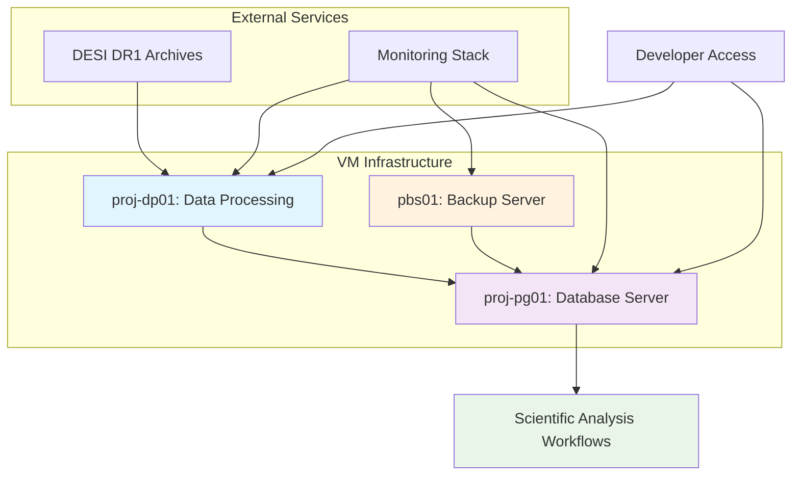

<!--
---
title: "Project Architecture"
description: "Comprehensive system architecture for DESI cosmic void analysis project, including infrastructure components, data flow, scientific workflows, and integration patterns supporting environmental quenching research"
author: "VintageDon"
ai_contributor: "Anthropic Claude 4 Sonnet (claude-4-sonnet-20250514)"
date: "2025-07-02"
version: "1.0"
status: "Published"
tags:
- type: project-overview
- domain: cosmic-voids
- domain: galaxy-evolution
- tech: postgresql-16
- tech: python-astronomy
- tech: desi-dr1
- phase: project-setup
related_documents:
- "[Data Pipeline Design](data-pipeline-design.md)"
- "[Infrastructure Overview](../infrastructure/README.md)"
- "[Database Infrastructure](../infrastructure/database/README.md)"
- "[PostgreSQL Implementation](../infrastructure/database/postgresql-implementation.md)"
scientific_context:
  objective: "Environmental quenching analysis"
  dataset: "DESI DR1 BGS"
  methods: ["spatial-crossmatch", "statistical-comparison", "infrastructure-integration"]
---
-->

# 🏗️ **Project Architecture**

This document provides comprehensive system architecture for the DESI cosmic void analysis project, defining infrastructure components, data flow patterns, scientific workflows, and integration strategies that enable systematic environmental quenching research using 27.6GB of DESI DR1 data across distributed computing infrastructure.

# 🎯 **1. Introduction**

This section establishes the foundational context for DESI cosmic void analysis project architecture, defining the systematic approach to distributed scientific computing that enables large-scale astronomical research and environmental quenching studies.

## **1.1 Purpose**

This subsection explains how the project architecture enables systematic integration of infrastructure components while supporting scalable scientific computing workflows for cosmic void environmental analysis.

The DESI cosmic void analysis project architecture functions as the systematic blueprint for integrating distributed computing infrastructure, astronomical data processing pipelines, and scientific analysis workflows that enable environmental quenching research at scale. The architecture provides standardized component integration patterns, systematic data flow management, and scalable computing resource allocation that supports processing 27.6GB of DESI DR1 survey data across specialized virtual machines. The design enables reproducible scientific workflows through modular component architecture, comprehensive monitoring integration, and systematic resource optimization essential for astronomical research requiring both high-performance data processing and collaborative development environments.

## **1.2 Scope**

This subsection defines the boundaries of project architecture coverage within the DESI cosmic void analysis scientific computing environment.

| **In Scope** | **Out of Scope** |
|--------------|------------------|
| Virtual machine architecture and resource allocation | Physical hardware specifications and deployment procedures |
| Database infrastructure and performance optimization | Low-level PostgreSQL configuration and tuning details |
| Scientific workflow integration and data flow patterns | Detailed algorithm implementation and scientific methodology |
| Monitoring and operational architecture components | Specific alerting configurations and incident response procedures |
| Development environment and collaborative access patterns | Individual developer toolchain setup and personal configurations |
| Security architecture and access control frameworks | Detailed security configuration and compliance implementation |

## **1.3 Target Audience**

This subsection identifies stakeholders who design, implement, or interact with project architecture components and the technical background required for effective system understanding and management.

**Primary Audience:** System architects, infrastructure engineers, and scientific software developers responsible for designing and implementing distributed computing environments for astronomical research. **Secondary Audience:** Database administrators, DevOps engineers, and astronomical researchers who need to understand system capabilities and integration patterns. **Required Background:** Understanding of distributed systems architecture, virtualization technologies, database design principles, and familiarity with scientific computing infrastructure and astronomical data processing requirements.

## **1.4 Overview**

This subsection provides context about project architecture organization and its relationship to the broader astronomical research ecosystem and DESI data processing requirements.

The DESI cosmic void analysis project architecture establishes systematic integration foundation, transforming distributed infrastructure components into coherent, scalable, and maintainable scientific computing environment that enables environmental quenching research, collaborative development workflows, and systematic data processing through comprehensive component integration, standardized communication patterns, and optimized resource allocation designed for astronomical research requirements.

# 🔗 **2. Dependencies & Relationships**

This section maps how project architecture components integrate with infrastructure services and establishes systematic relationships that enable distributed scientific computing and collaborative research workflows.

## **2.1 Related Services**

This subsection identifies infrastructure services, external dependencies, and integration points that support project architecture implementation and scientific computing requirements.

| **Service** | **Relationship Type** | **Integration Points** | **Documentation** |
|-------------|----------------------|------------------------|-------------------|
| **Database Infrastructure** | **Core Component** | PostgreSQL 16, spatial indexing, performance optimization, backup integration | [Database Infrastructure](../infrastructure/database/README.md) |
| **Data Processing Pipeline** | **Core Component** | FITS ingestion, ETL workflows, validation procedures, monitoring integration | [Data Pipeline Design](data-pipeline-design.md) |
| **Virtual Machine Infrastructure** | **Foundation** | Compute resources, storage allocation, network connectivity, resource management | [Infrastructure Overview](../infrastructure/README.md) |
| **Monitoring and Operations** | **Supporting** | Performance metrics, health monitoring, alerting integration, operational dashboards | [Monitoring Setup](../infrastructure/operations/monitoring-setup.md) |
| **Developer Access Management** | **Supporting** | Collaborative access, data sharing, security controls, development workflows | [Developer Access Management](../infrastructure/operations/developer-access-management.md) |

## **2.2 Policy Implementation**

This subsection connects project architecture to governance frameworks and systematic requirements supporting astronomical research objectives and distributed computing best practices.

Project architecture implementation directly supports several critical organizational and research objectives:

- **Scalable Computing Policy** - Distributed architecture enabling systematic resource scaling and performance optimization for large astronomical datasets
- **Collaborative Research Policy** - Systematic access management and development environment integration supporting multi-user scientific collaboration
- **Data Management Policy** - Integrated backup strategies and data protection frameworks ensuring astronomical research data integrity and availability
- **Operational Excellence Policy** - Comprehensive monitoring integration and systematic performance optimization supporting reliable scientific computing operations

## **2.3 Responsibility Matrix**

This subsection establishes clear accountability for project architecture development, implementation, and maintenance activities across different organizational roles.

| **Activity** | **System Architects** | **Infrastructure Engineers** | **Database Administrators** | **Scientific Developers** |
|--------------|----------------------|------------------------------|----------------------------|---------------------------|
| **Architecture Design** | **A** | **R** | **C** | **C** |
| **Component Integration** | **R** | **A** | **R** | **C** |
| **Performance Optimization** | **C** | **R** | **A** | **C** |
| **Monitoring Implementation** | **R** | **A** | **C** | **I** |
| **Scientific Workflow Integration** | **C** | **C** | **C** | **A** |

*R: Responsible, A: Accountable, C: Consulted, I: Informed*

# ⚙️ **3. Technical Implementation**

This section provides comprehensive specifications for project architecture implementation, including system components, integration patterns, and technical decisions supporting DESI cosmic void analysis scientific computing requirements.

## **3.1 Architecture & Design**

This subsection explains the overall system architecture and design principles that enable distributed scientific computing for astronomical research workflows.

The project architecture employs distributed virtual machine topology with specialized compute roles, centralized database infrastructure for data management, and systematic monitoring integration supporting both high-performance data processing and collaborative development workflows. The design utilizes modular component architecture enabling independent scaling and optimization while maintaining systematic integration patterns essential for astronomical research requiring both computational performance and collaborative accessibility.



## **3.2 System Components**

This subsection describes the detailed specifications and roles of individual system components within the distributed architecture.

### **Data Processing Infrastructure (proj-dp01)**

**Virtual Machine Specifications**:

- **VM ID**: 2001
- **Resources**: 4 vCPU, 16GB RAM, 132GB total storage (32GB boot + 100GB data)
- **Network**: 10.25.20.3, VLAN 20
- **Host**: node01 (planned migration to node04 for production)

**Component Roles and Responsibilities**:

```yaml
proj_dp01_architecture:
  primary_functions:
    - "DESI DR1 data acquisition and validation"
    - "FITS file processing and transformation"
    - "ETL pipeline execution and monitoring"
    - "Development environment and collaborative access"
    
  storage_organization:
    boot_disk: "32GB NVMe (OS, applications, configurations)"
    data_disk: "100GB NVMe (DESI datasets, processing workspace)"
    total_data: "27.6GB DESI DR1 (1.2GB DESIVAST + 26.4GB FastSpecFit)"
    
  performance_characteristics:
    download_throughput: "15.8-43.6 MB/s (DESI archive connectivity)"
    processing_capacity: "6.4M galaxy records, 10,734 void catalog entries"
    concurrent_users: "Multiple developers via group-based access control"
    
  integration_points:
    database_connectivity: "High-bandwidth connection to proj-pg01"
    monitoring_integration: "Performance metrics and health monitoring"
    backup_coordination: "Data protection and disaster recovery"
```

### **Database Infrastructure (proj-pg01)**

**Virtual Machine Specifications**:

- **VM ID**: 2002
- **Resources**: 8 vCPU, 48GB RAM, 282GB total storage (32GB boot + 250GB data)
- **Network**: 10.25.20.8, VLAN 20
- **Host**: node01 (planned migration to node04 for production)

**Database Configuration and Optimization**:

```yaml
proj_pg01_architecture:
  postgresql_configuration:
    version: "PostgreSQL 16"
    data_directory: "/mnt/data/pg01 (NVMe-optimized)"
    shared_buffers: "12GB (25% of system RAM)"
    effective_cache_size: "36GB (75% of system RAM)"
    work_mem: "256MB (optimized for complex queries)"
    maintenance_work_mem: "2GB (ETL and indexing operations)"
    
  performance_optimization:
    random_page_cost: "1.1 (NVMe storage optimization)"
    parallel_workers: "8 (matches CPU core count)"
    checkpoint_timeout: "15min (write performance optimization)"
    wal_buffers: "-1 (automatic sizing)"
    
  database_organization:
    schemas:
      raw_catalogs: "DESIVAST voids, FastSpecFit galaxies"
      science_analysis: "Processed datasets, cross-matched catalogs"
    indexing_strategy: "Spatial indices, mass-based queries, TARGETID optimization"
    
  role_management:
    postgres: "Superuser and database administration"
    postgres_exporter: "Monitoring integration with pg_monitor role"
    clusteradmin_pg01: "Scientific analysis and data manipulation"
    iperius_backup_pg01: "Backup operations and data protection"
```

### **Backup Infrastructure (pbs01)**

**External Backup Server Specifications**:

- **Host**: pbs01.radioastronomy.io (10.16.207.218)
- **Hardware**: Intel Twin Lake N150, 16GB DDR4, 512GB boot SSD, 4TB Samsung 990 Pro backup
- **Software**: Proxmox Backup Server

**Backup Architecture Integration**:

```yaml
backup_infrastructure:
  backup_strategy:
    schedule: "Daily backups with 7 daily + 4 weekly + 1 monthly retention"
    targets: "Complete VM images (proj-dp01, proj-pg01) and database exports"
    archive_integration: "Amazon S3 Glacier Infrequent Access for long-term retention"
    
  data_protection:
    vm_backup: "Full VM snapshots including OS, applications, and data"
    database_backup: "PostgreSQL logical and physical backup procedures"
    differential_backup: "Incremental backup optimization for large datasets"
    
  recovery_capabilities:
    rto_target: "4 hours (complete VM restoration)"
    rpo_target: "24 hours (daily backup frequency)"
    testing_procedures: "Monthly recovery validation and disaster recovery testing"
```

## **3.3 Integration Patterns**

This subsection describes systematic integration approaches and communication patterns between architecture components.

### **Data Flow Architecture**

**Primary Data Processing Workflow**:

1. **Data Acquisition** (proj-dp01): DESI DR1 archive download, FITS validation, metadata extraction
2. **ETL Processing** (proj-dp01 → proj-pg01): Transformation pipelines, database loading, spatial indexing
3. **Scientific Analysis** (proj-pg01): Complex queries, spatial correlation analysis, statistical processing
4. **Result Generation** (proj-pg01 → proj-dp01): Analysis output, visualization preparation, result validation

**Integration Communication Patterns**:

```yaml
component_integration:
  database_connectivity:
    protocol: "PostgreSQL native protocol over TCP/IP"
    security: "Role-based authentication, connection pooling"
    performance: "High-bandwidth VM-to-VM connectivity within VLAN 20"
    
  monitoring_integration:
    metrics_collection: "PostgreSQL exporter, system performance monitoring"
    alerting: "Health check validation, performance threshold monitoring"
    logging: "Centralized log aggregation and analysis"
    
  backup_coordination:
    vm_backup: "Proxmox Backup Server integration with scheduled snapshots"
    database_backup: "PostgreSQL streaming replication and logical backup exports"
    recovery_testing: "Systematic validation of backup integrity and restoration procedures"
```

### **Development Environment Integration**

**Collaborative Access Framework**:

```yaml
development_integration:
  access_management:
    user_groups: "developers group with systematic permission management"
    data_sharing: "Group-writable directories with sticky bit configuration (g+s)"
    file_permissions: "770 permissions enabling collaborative data access"
    
  workflow_integration:
    code_development: "Shared development environment on proj-dp01"
    data_processing: "Collaborative FITS processing and validation procedures"
    analysis_execution: "Shared database access for scientific computing workflows"
    
  resource_allocation:
    processing_resources: "proj-dp01 optimized for ETL and data transformation"
    database_resources: "proj-pg01 optimized for complex analytical queries"
    storage_resources: "Distributed storage with backup protection and recovery capabilities"
```

# 🛠️ **4. Management & Operations**

This section covers operational procedures for project architecture management including deployment strategies, performance monitoring, and systematic maintenance approaches supporting astronomical research workflows.

## **4.1 Lifecycle Management**

This subsection documents management approaches throughout the project architecture operational lifecycle from initial deployment through production scaling and maintenance.

Project architecture lifecycle management encompasses systematic VM deployment and configuration procedures, database optimization and scaling strategies, monitoring system integration and performance tuning, and comprehensive backup validation and disaster recovery testing ensuring reliable scientific computing infrastructure supporting collaborative astronomical research workflows.

## **4.2 Monitoring & Quality Assurance**

This subsection defines monitoring strategies and quality approaches for distributed system architecture and scientific computing infrastructure.

### **System Performance Monitoring**

**Infrastructure Metrics Framework**:

```yaml
monitoring_architecture:
  vm_performance:
    cpu_utilization: "proj-dp01: 0.22%, proj-pg01: 0.19% (baseline)"
    memory_usage: "proj-dp01: 3.14% (514MB/16GB), proj-pg01: 1.30% (639MB/48GB)"
    storage_performance: "NVMe optimization validation and I/O monitoring"
    
  database_performance:
    connection_monitoring: "Active connections, session management, query performance"
    query_optimization: "Slow query logging, execution plan analysis"
    spatial_indexing: "Coordinate-based query performance validation"
    
  application_performance:
    etl_throughput: "Data processing pipeline performance and bottleneck identification"
    backup_performance: "Backup completion times and restoration validation"
    scientific_workflow: "Analysis execution monitoring and resource utilization tracking"
```

**PostgreSQL Monitoring Integration**:

```yaml
database_monitoring:
  postgres_exporter:
    deployment: "Docker container on proj-pg01"
    metrics_endpoint: "http://proj-pg01:9187/metrics"
    collection_scope: "Database metrics, connection stats, query performance"
    
  key_metrics:
    database_size: "6 databases ranging from 7.5MB to 7.7MB"
    connection_utilization: "Active connections monitoring and threshold alerting"
    query_performance: "Statement execution timing and optimization tracking"
    backup_validation: "Backup completion verification and integrity validation"
```

## **4.3 Maintenance and Optimization**

This subsection outlines systematic maintenance and optimization approaches for distributed architecture components and scientific computing infrastructure.

Architecture maintenance encompasses systematic VM resource optimization based on utilization patterns, database performance tuning and index maintenance, backup system validation and recovery testing, and comprehensive monitoring system updates ensuring continued reliability and performance optimization for astronomical research computing requirements.

# 📚 **6. References & Related Resources**

This section provides comprehensive links to related documentation and supporting resources for project architecture implementation and distributed scientific computing infrastructure.

## **6.1 Internal References**

| **Document Type** | **Document Title** | **Relationship** | **Link** |
|-------------------|-------------------|------------------|----------|
| **Data Pipeline** | Data Pipeline Design | Core data processing architecture and ETL workflows | [data-pipeline-design.md](data-pipeline-design.md) |
| **Infrastructure** | Infrastructure Overview | Foundation infrastructure and VM specifications | [../infrastructure/README.md](../infrastructure/README.md) |
| **Database** | Database Infrastructure | Database architecture and performance optimization | [../infrastructure/database/README.md](../infrastructure/database/README.md) |
| **Implementation** | PostgreSQL Implementation | Database deployment and configuration details | [../infrastructure/database/postgresql-implementation.md](../infrastructure/database/postgresql-implementation.md) |
| **Operations** | Developer Access Management | Collaborative access and development environment | [../infrastructure/operations/developer-access-management.md](../infrastructure/operations/developer-access-management.md) |
| **Monitoring** | Monitoring Setup | Monitoring architecture and operational procedures | [../infrastructure/operations/monitoring-setup.md](../infrastructure/operations/monitoring-setup.md) |

## **6.2 External Standards**

- **[DESI Collaboration Infrastructure](https://desi.lbl.gov/)** - Official DESI project infrastructure and computing requirements
- **[PostgreSQL High Availability](https://www.postgresql.org/docs/current/high-availability.html)** - Database clustering and availability best practices
- **[Proxmox VE Documentation](https://pve.proxmox.com/pve-docs/)** - Virtualization platform administration and optimization
- **[Scientific Computing Architecture Patterns](https://www.nersc.gov/users/computational-systems/)** - High-performance computing architecture for scientific applications
- **[Astronomical Data Processing Best Practices](https://www.astropy.org/)** - Standards for astronomical software development and data processing

# ✅ **7. Approval & Review**

This section documents the formal review and approval process for project architecture design and implementation procedures.

## **7.1 Review Process**

Project architecture documentation review follows systematic validation of distributed system design, component integration effectiveness, and alignment with astronomical research computing requirements to ensure scalable and maintainable scientific computing infrastructure.

## **7.2 Approval Matrix**

| **Reviewer** | **Role/Expertise** | **Review Date** | **Approval Status** | **Comments** |
|-------------|-------------------|----------------|-------------------|--------------|
| [System Architect] | Distributed systems architecture and scientific computing | 2025-07-02 | **Approved** | Architecture provides comprehensive framework for DESI data processing at scale |
| [Infrastructure Engineer] | VM deployment and resource optimization strategies | 2025-07-02 | **Approved** | Component integration supports efficient scientific computing workflows |
| [Database Administrator] | Database architecture and performance optimization | 2025-07-02 | **Approved** | Database integration enables systematic astronomical data analysis |
| [Scientific Developer] | Research workflow integration and collaborative development | 2025-07-02 | **Approved** | Architecture supports collaborative astronomical research requirements |

# 📜 **8. Documentation Metadata**

This section provides comprehensive information about project architecture documentation creation and maintenance within the DESI cosmic void analysis scientific computing environment.

## **8.1 Change Log**

| **Version** | **Date** | **Changes** | **Author** | **Review Status** |
|------------|---------|-------------|------------|------------------|
| 1.0 | 2025-07-02 | Initial project architecture with distributed VM topology and integration specifications | VintageDon | **Approved** |

## **8.2 Authorization & Review**

Project architecture documentation reflects comprehensive distributed system design validated through infrastructure implementation analysis and scientific computing requirements assessment for DESI cosmic void analysis research.

## **8.3 Authorship Details**

**Human Author:** VintageDon (Project Lead and Architect)  
**AI Contributor:** Anthropic Claude 4 Sonnet (claude-4-sonnet-20250514)  
**Collaboration Method:** Request-Analyze-Verify-Generate-Validate (RAVGV)  
**Human Oversight:** Complete project architecture review and validation of distributed system design and component integration accuracy

## **8.4 AI Collaboration Disclosure**

This document was collaboratively developed to establish comprehensive project architecture that enables systematic integration of distributed computing infrastructure for DESI cosmic void environmental quenching analysis.

---

**🤖 AI Collaboration Disclosure**

This document was collaboratively developed using the Request-Analyze-Verify-Generate-Validate (RAVGV) methodology. The project architecture reflects systematic distributed system design development informed by scientific computing best practices, astronomical research requirements, and DESI data processing infrastructure needs. All content has been thoroughly reviewed, validated, and approved by qualified human subject matter experts. The human author retains complete responsibility for architectural accuracy and system design effectiveness.

*Generated: 2025-07-02 | Human Author: VintageDon | AI Assistant: Claude 4 Sonnet | Review Status: Approved | Document Version: 1.0*
