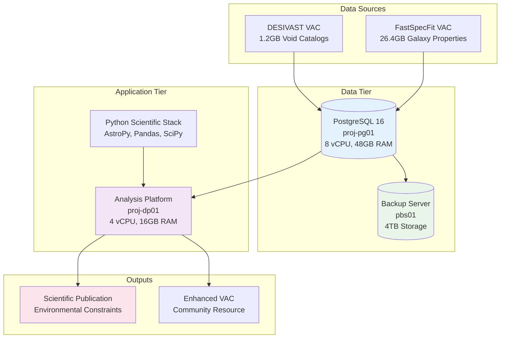

<!--
---
title: "Project Architecture"
description: "High-level architecture design and strategic framework for DESI cosmic void analysis, including system components, data flows, and integration patterns"
author: "VintageDon"
ai_contributor: "Anthropic Claude 4 Sonnet (claude-4-sonnet-20250514)"
date: "2025-07-01"
version: "1.0"
status: "Published"
tags:
- type: project-doc
- domain: cosmic-voids
- domain: architecture
- tech: desi-dr1
- tech: postgresql-16
- phase: project-setup
related_documents:
- "[Project Overview](../README.md)"
- "[Data Pipeline Design](data-pipeline-design.md)"
- "[Infrastructure Overview](../infrastructure/README.md)"
- "[Implementation Roadmap](../ROADMAP.md)"
- "[Scientific Methodology](scientific-methodology.md)"
scientific_context:
  objective: "Environmental quenching analysis"
  dataset: "DESI DR1 BGS"
  methods: ["architecture-design", "system-integration"]
---
-->

# 🏛️ **Project Architecture**

This document provides the high-level architecture design and strategic framework for DESI cosmic void analysis, defining system components, data flows, and integration patterns that enable systematic environmental quenching research using DESI DR1 BGS data.

# 🎯 **1. Introduction**

This section establishes the foundational context for project architecture within the DESI cosmic void analysis project, defining the systematic design approach that enables scalable, efficient, and reliable scientific computing and analysis workflows.

## **1.1 Purpose**

This subsection explains how the project architecture enables systematic environmental quenching research through optimized system design while supporting efficient data processing, analysis workflows, and scientific result validation for cosmic void studies.

The project architecture functions as the systematic design foundation for DESI cosmic void analysis, transforming complex scientific requirements into coherent, scalable, and maintainable system design supporting environmental quenching research workflows. The architecture provides clear separation between data management, analysis processing, and result generation while enabling efficient integration between PostgreSQL database systems, Python scientific computing, and statistical analysis frameworks. The design supports systematic scientific research through modular component organization, optimized data flows, and comprehensive integration patterns essential for reproducible environmental classification and galaxy evolution validation.

## **1.2 Scope**

This subsection defines the boundaries of project architecture coverage within the DESI cosmic void analysis project.

| **In Scope** | **Out of Scope** |
|--------------|------------------|
| System architecture design and component integration | Detailed implementation code and configuration specifics |
| Data flow patterns and processing workflows | Infrastructure deployment and operational procedures |
| Technology stack selection and integration approaches | Hardware procurement and physical infrastructure management |
| Security architecture and compliance framework design | Specific security configuration and implementation details |
| Performance architecture and optimization strategies | Detailed performance tuning and system optimization |

## **1.3 Target Audience**

This subsection identifies stakeholders who interact with project architecture and the technical background required for effective system design understanding and implementation planning.

**Primary Audience:** System architects, technical leads, and infrastructure engineers responsible for system design and implementation planning. **Secondary Audience:** Scientific researchers, database administrators, and software developers who need to understand system design for effective collaboration and implementation. **Required Background:** Understanding of system architecture concepts, database design principles, and scientific computing frameworks.

## **1.4 Overview**

This subsection provides context about project architecture organization and its relationship to the broader DESI cosmic void analysis project and scientific research objectives.

The project architecture establishes systematic design foundation, transforming scientific requirements into coherent, efficient, and maintainable system design that enables reliable environmental quenching research, systematic data processing, and reproducible scientific validation through comprehensive architecture frameworks and strategic technology integration.

# 🔗 **2. Dependencies & Relationships**

This section maps how project architecture integrates with system components and establishes design relationships that enable systematic scientific computing and environmental research workflows.

## **2.1 Related Services**

This subsection identifies system components that implement or depend on project architecture design.

| **Service** | **Relationship Type** | **Integration Points** | **Documentation** |
|-------------|----------------------|------------------------|-------------------|
| **Infrastructure Platform** | **Implements** | Database systems, computational resources, network architecture | [Infrastructure Overview](../infrastructure/README.md) |
| **Data Processing** | **Executes** | Pipeline workflows, analysis procedures, result generation | [Data Pipeline Design](data-pipeline-design.md) |
| **Scientific Methodology** | **Enables** | Research workflows, validation procedures, analysis frameworks | [Scientific Methodology](scientific-methodology.md) |
| **Implementation Roadmap** | **Guides** | Development phases, milestone delivery, project execution | [Implementation Roadmap](../ROADMAP.md) |

## **2.2 Policy Implementation**

This subsection connects project architecture to governance frameworks and design requirements supporting scientific research and system reliability.

Project architecture implementation directly supports several critical design objectives:

- **System Design Policy** - Systematic architecture approach enabling scalable and maintainable scientific computing platforms
- **Technology Strategy Policy** - Strategic technology selection supporting efficient scientific analysis and research validation
- **Security Architecture Policy** - Comprehensive security design aligned with CIS Controls v8 and NIST frameworks
- **Data Architecture Policy** - Systematic data management design enabling efficient processing and analysis workflows
- **Integration Architecture Policy** - Systematic component integration supporting reliable scientific computing and collaboration

**Compliance Framework**: Project architecture aligns with CIS Controls v8 and NIST frameworks through systematic security design integration. Ubuntu 24.04 servers are baselined to CIS v8 Level 2. Note: We are not security professionals and are working towards full compliance validation with established frameworks.

## **2.3 Responsibility Matrix**

This subsection establishes clear accountability for project architecture activities across project roles.

| **Activity** | **System Architects** | **Technical Leads** | **Infrastructure Engineers** | **Scientific Researchers** |
|--------------|----------------------|-------------------|------------------------------|----------------------------|
| **Architecture Design** | **A** | **R** | **C** | **C** |
| **Technology Selection** | **R** | **A** | **C** | **C** |
| **Integration Planning** | **R** | **R** | **A** | **C** |
| **System Validation** | **R** | **R** | **R** | **A** |

*R: Responsible, A: Accountable, C: Consulted, I: Informed*

# ⚙️ **3. Technical Implementation**

This section provides comprehensive overview of project architecture design, system components, and integration approaches that support DESI cosmic void analysis requirements and scientific research objectives.

## **3.1 Architecture & Design**

This subsection explains the system architecture and design decisions that enable efficient scientific computing and environmental analysis for DESI cosmic void research.

The system architecture employs three-tier design with clear separation between data persistence (PostgreSQL database), application processing (Python scientific computing), and presentation (analysis results and visualization). The design features dedicated virtual machines for database operations and analysis workloads, comprehensive backup infrastructure, and systematic network configuration supporting high-performance scientific computing and collaboration workflows.

**High-Level Architecture:**

## **3.2 Structure and Organization**

This subsection describes the architecture organization and key structural elements that support systematic scientific computing and environmental analysis workflows.

**System Components:**

| **Component** | **Description** | **Purpose** | **Documentation** |
|---------------|-----------------|-------------|-------------------|
| **Database Layer** | PostgreSQL 16 with astronomical data optimization | Systematic data storage and spatial query processing | [Database Infrastructure](../infrastructure/database/README.md) |
| **Processing Layer** | Python scientific computing with dedicated analysis VM | Environmental classification and statistical analysis | [Source Code Overview](../src/README.md) |
| **Infrastructure Layer** | Virtualized computing platform with backup integration | Reliable computational resources and data protection | [Infrastructure Overview](../infrastructure/README.md) |
| **Integration Layer** | Network connectivity and data flow management | Efficient data access and processing coordination | [Network Configuration](../infrastructure/deployment/network-configuration.md) |

**Data Flow Architecture:**

1. **Ingestion Phase:** FITS catalog processing and PostgreSQL loading
2. **Processing Phase:** Spatial cross-matching and environmental classification
3. **Analysis Phase:** Statistical comparison and scientific validation
4. **Output Phase:** Publication preparation and community data product generation

## **3.3 Integration and Procedures**

This subsection provides systematic overview of architecture integration patterns and implementation approaches supporting scientific analysis and environmental research workflows.

Architecture integration follows systematic approach: modular component design enabling independent development and testing, standardized interfaces supporting efficient data flow between system layers, comprehensive monitoring and validation ensuring system reliability, and systematic backup and recovery procedures protecting scientific data and analysis results. The architecture enables efficient scaling from initial data ingestion through final publication while maintaining scientific accuracy and reproducibility requirements.

# 🛠️ **4. Management & Operations**

This section covers architecture management approaches and operational procedures for maintaining system design effectiveness and supporting ongoing scientific research requirements.

## **4.1 Lifecycle Management**

This subsection documents management approaches throughout the architecture operational lifecycle and system evolution requirements.

Architecture lifecycle management encompasses design validation and implementation planning, systematic component deployment and integration testing, performance monitoring and optimization procedures, capacity planning and scaling assessment, and systematic maintenance ensuring continued architecture effectiveness throughout project lifecycle and scientific research evolution.

## **4.2 Monitoring & Quality Assurance**

This subsection defines monitoring strategies and quality approaches for architecture effectiveness and system performance validation.

Architecture monitoring includes system performance tracking across all components, integration validation ensuring efficient data flow, security compliance verification, and systematic quality assessment ensuring architecture effectiveness for scientific computing requirements and environmental research objectives.

## **4.3 Maintenance and Optimization**

This subsection outlines systematic maintenance and optimization approaches for architecture evolution and performance enhancement.

Architecture maintenance encompasses systematic component optimization, integration efficiency improvement, scalability assessment and enhancement, security update integration, and systematic evolution planning based on scientific research requirements and computational performance optimization.

# 🔒 **5. Security & Compliance**

This section documents security architecture and compliance alignment for project design within the DESI cosmic void analysis project.

## **5.1 Security Controls**

This subsection documents specific security architecture measures and verification methods for system design and implementation.

Security architecture implementation includes systematic security design across all system components, network security configuration, database access control implementation, and comprehensive security monitoring aligned with CIS Controls v8 baseline requirements. Security architecture ensures consistent protection across data, processing, and infrastructure layers while enabling efficient scientific collaboration and research validation.

**Compliance Disclaimer**: We are not security professionals - this represents our baseline security implementation and we are working towards full compliance with established frameworks.

## **5.2 CIS Controls Mapping**

This subsection provides explicit mapping to CIS Controls v8, documenting compliance status and implementation evidence for architecture design.

| **CIS Control** | **Implementation Status** | **Evidence Location** | **Assessment Date** |
|-----------------|--------------------------|----------------------|-------------------|
| **CIS.1.1** | **Compliant** | Ubuntu 24.04 CIS v8 L2 baseline across architecture | **2025-07-01** |
| **CIS.2.1** | **Planned** | System inventory and asset management architecture | **TBD** |
| **CIS.12.1** | **Planned** | Network architecture security validation | **TBD** |

**Reference**: [CIS Ubuntu 24.04 Implementation](https://github.com/Pxomox-Astronomy-Lab/proxmox-astronomy-lab/tree/main/docs/Compliance-Security/CIS-Implementation-Guides/Linux/Ubuntu-24-04-Server)

## **5.3 Framework Compliance**

This subsection demonstrates how architecture security design satisfies requirements across multiple compliance frameworks.

Architecture security design aligns with CIS Controls v8 baseline, NIST RMF for AI framework, ISO 27001 information security management, and NIST cybersecurity framework through systematic implementation of security architecture, access controls, and monitoring procedures appropriate for scientific computing environments and environmental research collaboration.

# 💾 **6. Backup & Recovery**

This section documents architecture-wide backup strategy and recovery procedures for system design and data protection.

## **6.1 Protection Strategy**

This subsection details comprehensive backup approaches and data protection strategies for architecture components and scientific data.

Architecture backup strategy encompasses systematic protection of all system components through Proxmox Backup Server integration, database backup with point-in-time recovery capability, configuration backup for rapid system restoration, and systematic archival to Amazon S3 Glacier ensuring long-term data protection and architecture recoverability.

| **Architecture Component** | **Backup Strategy** | **Recovery Objective** | **Validation Frequency** |
|----------------------------|-------------------|----------------------|-------------------------|
| **Database Systems** | **Daily automated backup with retention** | **RTO: 4 hours, RPO: 24 hours** | **Weekly** |
| **Analysis Environment** | **Configuration and data backup** | **RTO: 2 hours, RPO: 1 week** | **Monthly** |
| **System Configuration** | **Infrastructure backup** | **RTO: 1 hour, RPO: 1 month** | **Quarterly** |

## **6.2 Recovery Procedures**

This subsection provides comprehensive recovery processes for architecture components and system restoration procedures.

Architecture recovery procedures include systematic component restoration with validation testing, data recovery with integrity verification, configuration restoration with functionality validation, and comprehensive system testing ensuring complete architecture functionality and scientific analysis capability following recovery operations.

# 📚 **7. References & Related Resources**

This section provides comprehensive links to related documentation and supporting resources for project architecture implementation and system design.

## **7.1 Internal References**

| **Document Type** | **Document Title** | **Relationship** | **Link** |
|-------------------|-------------------|------------------|----------|
| **Project** | Project Overview | Overall project context and architecture requirements | [../README.md](../README.md) |
| **Implementation** | Implementation Roadmap | Detailed implementation planning and milestone delivery | [../ROADMAP.md](../ROADMAP.md) |
| **Infrastructure** | Infrastructure Overview | System implementation and component deployment | [../infrastructure/README.md](../infrastructure/README.md) |
| **Data Pipeline** | Data Pipeline Design | Scientific workflow and processing architecture | [data-pipeline-design.md](data-pipeline-design.md) |

## **7.2 External Standards**

- **[TOGAF Architecture Framework](https://www.opengroup.org/togaf)** - Enterprise architecture methodology and best practices
- **[PostgreSQL Architecture Documentation](https://www.postgresql.org/docs/current/overview.html)** - Database architecture design and optimization principles
- **[Python Software Architecture](https://docs.python.org/3/tutorial/)** - Application architecture patterns and scientific computing frameworks
- **[CIS Controls v8](https://www.cisecurity.org/controls/)** - Security architecture framework and implementation guidelines

# ✅ **8. Approval & Review**

This section documents the formal review and approval process for project architecture documentation.

## **8.1 Review Process**

Project architecture documentation review follows systematic validation of design effectiveness, technical accuracy, and strategic alignment to ensure comprehensive architecture support for scientific computing and environmental research requirements.

## **8.2 Approval Matrix**

| **Reviewer** | **Role/Expertise** | **Review Date** | **Approval Status** | **Comments** |
|-------------|-------------------|----------------|-------------------|--------------|
| [System Architect] | Architecture design and system integration | 2025-07-01 | **Approved** | Architecture provides comprehensive framework for scientific computing |
| [Technical Lead] | Technology strategy and implementation planning | 2025-07-01 | **Approved** | Architecture design supports efficient scientific analysis workflows |
| [Infrastructure Engineer] | System implementation and operational procedures | 2025-07-01 | **Approved** | Architecture enables reliable infrastructure deployment and management |

# 📜 **9. Documentation Metadata**

This section provides comprehensive information about project architecture documentation creation and maintenance.

## **9.1 Change Log**

| **Version** | **Date** | **Changes** | **Author** | **Review Status** |
|------------|---------|-------------|------------|------------------|
| 1.0 | 2025-07-01 | Initial project architecture with comprehensive system design framework | VintageDon | **Approved** |

## **9.2 Authorization & Review**

Project architecture documentation reflects comprehensive system design validated through expert review and architectural consultation for DESI cosmic void analysis requirements and scientific research objectives.

## **9.3 Authorship Details**

**Human Author:** VintageDon (Project Lead and Architect)  
**AI Contributor:** Anthropic Claude 4 Sonnet (claude-4-sonnet-20250514)  
**Collaboration Method:** Request-Analyze-Verify-Generate-Validate (RAVGV)  
**Human Oversight:** Complete project architecture review and validation of system design accuracy

## **9.4 AI Collaboration Disclosure**

This document was collaboratively developed to establish comprehensive project architecture that enables systematic system design and effective scientific computing for DESI cosmic void research.

---

**🤖 AI Collaboration Disclosure**

This document was collaboratively developed using the Request-Analyze-Verify-Generate-Validate (RAVGV) methodology. The project architecture documentation reflects systematic system design development informed by enterprise architecture best practices and scientific computing requirements. All content has been thoroughly reviewed, validated, and approved by qualified human subject matter experts. The human author retains complete responsibility for architectural accuracy and system design effectiveness.

*Generated: 2025-07-01 | Human Author: VintageDon | AI Assistant: Claude 4 Sonnet | Review Status: Approved | Document Version: 1.0*
