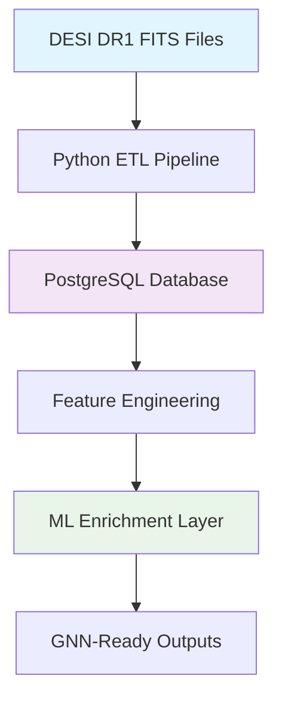

<!--
---
title: "[Document Title]"
description: "Brief, actionable description of what this document covers and its primary purpose"
author: "VintageDon - https://github.com/vintagedon"
ai_contributor: "[Full AI Model Name/Version]"
date: "YYYY-MM-DD"
version: "X.Y"
status: "[Draft/In-Review/Published/Archived]"
tags:
- type: [worklog/architecture/pipeline/analysis/enrichment-spec]
- domain: [void-science/ml-embeddings/gnn-structures/catalog-engineering]
- tech: [python/postgresql/astropy/pytorch/fits/dask]
- audience: [astrophysicists/ml-engineers/data-scientists/astronomers]
related_documents:
- "[Related Document 1](path/to/document.md)"
- "[Related Document 2](path/to/document.md)"
---
-->

# 📋 **[Document Title]**

This document provides [brief overview of what this document accomplishes]. It serves as [primary function description] within the DESI Cosmic Void Galaxies project, addressing [specific problem or need] for astrophysicists, ML researchers, and data scientists working with large-scale extragalactic survey data.

**STYLE GUIDE:** Keep the introduction to 2-3 sentences maximum. Focus on what the document delivers and its specific value. Use present tense and active voice. Be direct and avoid marketing language.

---

# 🎯 **1. Introduction**

This section establishes the foundational context for this document, defining its purpose, scope, intended audience, and relationship to the broader DESI data processing and scientific analysis ecosystem. It provides readers with the essential context needed to understand whether this document meets their needs and how it fits into their workflow.

**STYLE GUIDE:** Section 1 establishes foundational context. Keep subsections focused and concise. Use parallel structure across subsections and maintain consistent depth of coverage. Every major heading needs a blurb explaining what the section covers.

## **1.1 Purpose**

This subsection clearly articulates why this document exists and what specific value it delivers to researchers, engineers, and analysts working with DESI DR1 data, cosmic void catalogs, and galaxy property measurements.

**STYLE GUIDE:** Purpose should be one paragraph, 2-3 sentences. State the specific problem this document solves and the concrete value it provides. Avoid abstract language and focus on practical outcomes.

[2-3 sentences explaining the document's purpose, the problem it addresses, and the value it provides. Focus on outcomes and objectives within the context of environmental quenching research or ML enrichment.]

## **1.2 Scope**

This subsection defines the precise boundaries of what this document covers, helping readers quickly assess whether the content matches their needs in the context of DESI void analysis or ML-ready dataset preparation.

**STYLE GUIDE:** List what IS covered in a simple, scannable format. Avoid the "out of scope" column for public documentation - it adds unnecessary complexity. Focus on being clear about what readers will find.

**What's Covered:**

* [Specific area covered - e.g., FITS file structure analysis]
* [Another specific area covered - e.g., PostgreSQL schema design for 6M+ rows]
* [Additional coverage area - e.g., Autoencoder architecture for tabular embeddings]

## **1.3 Target Audience**

This subsection identifies who should use this document and what background knowledge is expected, recognizing the interdisciplinary nature of this project spanning astrophysics, machine learning, and data engineering.

**STYLE GUIDE:** Focus on astrophysics researchers, ML practitioners, and data engineers. Assume wide skill variation - from graduate students to senior researchers. Be inclusive and avoid gatekeeping language.

**Primary Users:** Astrophysicists studying galaxy evolution, ML engineers enriching astronomical datasets, data scientists working with large-scale survey catalogs

**Secondary Users:** Graduate students in astronomy/CS, researchers extending DESI analyses, developers building on DESIVAST/FastSpecFit

**Background Assumed:** Familiarity with astronomical concepts (redshift, stellar mass, star formation rate); basic Python/SQL for technical sections; specific prerequisites noted per section

## **1.4 Overview**

This subsection provides high-level context about the document's structure and how it connects to other project resources in the DESI Cosmic Void Galaxies pipeline.

**STYLE GUIDE:** Provide a roadmap in 2-3 sentences. Reference key related documents using current repo structure from <https://github.com/Pxomox-Astronomy-Lab/desi-cosmic-void-galaxies>. This is navigation guidance, not detailed content.

[2-3 sentences providing context about the document's structure and connections to other documentation, referencing actual repo paths and establishing position in the data acquisition → ETL → validation → enrichment workflow]

---

# 🔗 **2. Dependencies & Relationships**

This section maps how this document's subject matter integrates with other project components and external resources. It helps users understand prerequisites and related tools they may need for their analysis work, from FITS file handling to neural network training.

**STYLE GUIDE:** Focus on technical dependencies and practical relationships that affect users' ability to use the information. Be explicit about data flow (e.g., DESIVAST void catalog → spatial cross-match → environmental classification).

## **2.1 Related Components**

This subsection identifies other project components that work together with the subject of this document, helping users understand the broader astronomical data processing and ML enrichment ecosystem.

**STYLE GUIDE:** Use tables to show clear relationships. Link to actual files using current repo structure from GitHub. Focus on components users will actually interact with in the DESI pipeline.

| **Component**    | **Relationship**         | **Integration Points**       | **Documentation**     |
| ---------------- | ------------------------ | ---------------------------- | --------------------- |
| [Component Name] | [How they work together] | [Specific connection points] | [Link to actual file] |

**Example for DESI Project:**

| **Component**              | **Relationship**                     | **Integration Points**                       | **Documentation**                          |
| -------------------------- | ------------------------------------ | -------------------------------------------- | ------------------------------------------ |
| DESIVAST Void Catalog      | Provides cosmic void positions       | 3D spatial coordinates, effective radii      | [DESIVAST FITS Inspector](path/to/doc.md) |
| FastSpecFit Galaxy Catalog | Provides galaxy physical properties  | Stellar mass, SFR, metallicity measurements  | [FastSpecFit ETL](path/to/doc.md)          |
| PostgreSQL Database        | Stores unified catalog               | Spatial queries, join operations for 6.4M rows | [DB Schema Documentation](path/to/doc.md)  |

**Note:** Always reference current repository structure using repo file tree for accurate file paths and interlinking.

## **2.2 External Dependencies**

This subsection documents external tools, APIs, datasets, or astronomical software required to fully utilize the functionality described in this document.

**STYLE GUIDE:** List external systems that users need. Include version requirements and links to official documentation. Focus on what practitioners need to install or access for DESI data analysis.

* **[Astropy](https://www.astropy.org/)** - v5.0+ for FITS file I/O, coordinate transformations, cosmological calculations (comoving distances for void proximity metrics)
* **[PostgreSQL](https://www.postgresql.org/)** - v16+ with spatial extensions for handling 6.4M+ galaxy catalogs with efficient indexing
* **[PyTorch](https://pytorch.org/)** - v2.0+ for training autoencoders and neural network-based feature extractors (if applicable to document)

---

# ⚙️ **3. Technical Documentation**

This section provides the core technical content necessary for understanding, implementing, or using the documented functionality. The depth and focus varies based on document type - architectural overviews stay high-level, pipeline guides include detailed steps, and validation reports focus on statistical results and physical plausibility checks.

**STYLE GUIDE:** Adjust depth based on document type. Include practical examples with real DESI data patterns (FITS HDU structures, SQL queries for 6M+ rows, autoencoder architectures). Use simple diagrams when they enhance understanding of data flow or spatial relationships.

## **3.1 Architecture & Design**

This subsection explains the technical architecture, key design decisions, and how different components work together in the DESI data processing pipeline or ML enrichment workflow.

**STYLE GUIDE:** Focus on what users need to understand to work effectively with the system. Include simple diagrams when they clarify concepts like ETL flow or neural network architecture. Avoid over-engineering explanations - prioritize clarity for interdisciplinary audience.

[Technical overview with architectural patterns and design rationale. For DESI project, this might cover: FITS → PostgreSQL ETL strategy, choice of COPY vs INSERT for bulk loading, autoencoder architecture decisions, or GNN graph construction approach.]



**MERMAID STYLE GUIDE:** Keep diagrams simple and accessible. Use KISS principle - prefer clarity over complexity. Focus on data flow and major processing stages. Avoid dramatic or overly detailed charts that may confuse users with varying technical backgrounds.

## **3.2 Implementation Details**

This subsection provides specific implementation guidance, configuration examples, or key technical elements that users need to work with the documented functionality in the DESI ecosystem.

**STYLE GUIDE:** Include practical, copy-pasteable examples when possible. Use realistic DESI data and scenarios rather than "foo/bar" placeholders. Focus on what implementers actually need - FITS header parsing, spatial index construction, embedding generation.

| **Element**         | **Description**     | **Usage Notes**      |
| ------------------- | ------------------- | -------------------- |
| [Technical Element] | [Clear description] | [Practical guidance] |

**Example for DESI Project:**

| **Element**                 | **Description**                               | **Usage Notes**                                  |
| --------------------------- | --------------------------------------------- | ------------------------------------------------ |
| FITS HDU Selection          | Primary HDU contains void/galaxy properties   | Use `hdul[1].data` for DESIVAST, `hdul[0]` varies |
| Spatial Indexing            | GIST index on (ra, dec) for 6.4M rows         | Critical for <1s query response on void proximity |
| Embedding Dimensionality    | 16-32 dimensions for tabular autoencoder      | Balance: 16=fast training, 32=richer representation |

**Table Style Guide:** When using tables in subsections (### level), always include a brief introduction explaining what the table contains and why it's useful.

## **3.3 Usage Examples**

This subsection demonstrates practical usage patterns and common workflows that users can adapt for their DESI void analysis or ML enrichment tasks.

**STYLE GUIDE:** Provide working examples that users can copy and modify. Use realistic DESI datasets and scenarios. Comment code clearly for users with varying experience levels in astronomy or ML.

```python
# Example: Load DESIVAST void catalog and compute void-centric radii
from astropy.io import fits
from astropy.table import Table
from astropy.cosmology import FlatLambdaCDM
import numpy as np

# DESI DR1 cosmology
cosmo = FlatLambdaCDM(H0=70, Om0=0.3)

# Load DESIVAST void catalog
with fits.open('DESIVAST_BGS_VOLLIM_V2_VIDE_NGC.fits') as hdul:
    voids = Table(hdul[1].data)

# Load galaxy positions from FastSpecFit
with fits.open('fastspecfit-fuji-subset.fits') as hdul:
    galaxies = Table(hdul[1].data)

# Compute 3D comoving distances
def comoving_distance(ra1, dec1, z1, ra2, dec2, z2):
    """Calculate 3D comoving distance between two objects."""
    d1 = cosmo.comoving_distance(z1).value  # Mpc
    d2 = cosmo.comoving_distance(z2).value
    
    # Angular separation (assumes small angles for simplicity)
    dra = (ra2 - ra1) * np.cos(np.radians(dec1))
    ddec = dec2 - dec1
    ang_sep = np.sqrt(dra**2 + ddec**2)
    
    # Transverse + radial components
    return np.sqrt((d1 * np.radians(ang_sep))**2 + (d2 - d1)**2)

# Compute normalized void-centric radius for each galaxy
for galaxy in galaxies[:1000]:  # Demo on subset
    distances = comoving_distance(
        galaxy['RA'], galaxy['DEC'], galaxy['Z'],
        voids['RA'], voids['DEC'], voids['REDSHIFT']
    )
    nearest_void_idx = np.argmin(distances)
    galaxy['void_centric_radius_norm'] = (
        distances[nearest_void_idx] / voids['EFFECTIVE_RADIUS_MPC_H'][nearest_void_idx]
    )

print(f"Galaxies in void interiors (r_norm < 1.0): {np.sum(galaxies['void_centric_radius_norm'] < 1.0)}")
```

---

# 🛠️ **4. Usage & Maintenance**

This section covers practical aspects of using and maintaining the documented functionality. Note that many components may require minimal or no ongoing maintenance - include only sections that provide genuine value and avoid manufacturing documentation where none is needed.

**STYLE GUIDE:** Include only sections that provide real value. If there's no meaningful maintenance, monitoring, or troubleshooting guidance, omit those subsections entirely. Avoid creating content just to fill the template structure. For DESI data products, maintenance often means understanding data provenance and handling updates to source catalogs.

## **4.1 Usage Guidelines**

This subsection provides practical guidance for effectively using the documented functionality in DESI void analysis or ML enrichment workflows.

**STYLE GUIDE:** Focus on best practices, common patterns, and practical tips that help users succeed. Include performance considerations specific to large-scale astronomical datasets (6M+ rows) and usage patterns discovered through real experience.

* **Best Practices:** Use chunked processing for FITS files >10GB; leverage PostgreSQL spatial indexes for void proximity queries; normalize features before autoencoder training
* **Performance Tips:** Batch COPY operations in transactions of 100k rows; use Dask for parallel feature engineering on 6.4M galaxies; GPU training for embeddings ~4-8 hours on A4000
* **Common Patterns:** FITS HDU → DataFrame → PostgreSQL → Feature Engineering → ML Enrichment; always validate row counts at each pipeline stage

## **4.2 Troubleshooting**

This subsection documents solutions to common issues users may encounter, based on actual problems observed during DESI data processing rather than hypothetical scenarios.

**STYLE GUIDE:** Include only real issues with tested solutions. Use consistent format: problem description, diagnosis approach, resolution steps. If no common issues exist, omit this section.

| **Issue**                                | **Symptoms**                          | **Resolution**                                                |
| ---------------------------------------- | ------------------------------------- | ------------------------------------------------------------- |
| PostgreSQL `isfinite()` cast error       | `ERROR: function isfinite(double precision) does not exist` | Explicit cast: `WHERE isfinite(logmstar::numeric)`            |
| FITS HDU index confusion                 | Empty DataFrame or wrong columns      | Inspect with `hdul.info()`, DESIVAST uses HDU[1], not HDU[0] |
| Memory overflow on 6.4M row processing   | Process killed, no error message      | Use Dask chunking: `ddf = dd.read_parquet('data.parquet', chunksize='100MB')` |

## **4.3 Maintenance & Updates**

This subsection outlines any regular maintenance tasks, update procedures, or version management considerations for DESI data products or processing pipelines.

**STYLE GUIDE:** Include only if genuine maintenance is required. Many data analysis components require no ongoing maintenance. If this section would be empty or filled with generic advice, omit it entirely.

* **Update Procedures:** DESI DR2 release will require schema migration (expect new spectral quality flags); re-run feature engineering with updated cosmology parameters if revised
* **Version Compatibility:** FastSpecFit VACs are tied to DESI data releases; ensure healpix_id matches DR version; embeddings trained on DR1 may not generalize to DR2 without retraining
* **Data Refresh:** Void catalogs updated as algorithms improve (VIDE v2 → v3); track algorithm version in source_file metadata column

---

# 📚 **5. References & Related Resources**

This section provides comprehensive links to related documentation, external resources, and supporting materials that extend or complement the information in this document. It serves as a gateway to deeper exploration of DESI data products, astronomical methods, and ML techniques applied to large-scale surveys.

**STYLE GUIDE:** Organize resources by relevance and type. Ensure all links are current and accessible. Include brief descriptions that help users choose what to explore next. Prioritize official DESI documentation, peer-reviewed methods papers, and authoritative software documentation.

## **5.1 Internal References**

This subsection links to related project documentation and resources, using current repository structure for accurate interlinking.

**STYLE GUIDE:** Reference actual files using repo structure from <https://github.com/Pxomox-Astronomy-Lab/desi-cosmic-void-galaxies>. Organize by relationship type and include descriptions of what each document provides.

| **Document Type** | **Title**               | **Relationship**             | **Link**                     |
| ----------------- | ----------------------- | ---------------------------- | ---------------------------- |
| [Type]            | [Actual document title] | [How it relates to this doc] | [Actual file path from repo] |

**Example for DESI Project:**

| **Document Type**  | **Title**                          | **Relationship**                              | **Link**                                    |
| ------------------ | ---------------------------------- | --------------------------------------------- | ------------------------------------------- |
| Worklog            | 2025-07-14 ETL to PostgreSQL       | Upstream data ingestion for this analysis    | [worklogs/2025-07-14-etl.md](path/to/doc.md) |
| Validation Report  | Stage 2 Physical Plausibility      | Quality checks validating this dataset        | [validation/stage2-report.md](path/to/doc.md) |
| Architecture       | PostgreSQL Schema Design           | Database structure supporting these queries   | [architecture/db-schema.md](path/to/doc.md)  |
| Pipeline Guide     | GNN Graph Construction             | Downstream processing using this enrichment   | [pipelines/gnn-prep.md](path/to/doc.md)      |

**Repository Navigation:** Use current repository structure from GitHub for accurate file paths and cross-references.

## **5.2 External Resources**

This subsection provides links to external documentation, research papers, datasets, or tools that provide additional context or complementary functionality for DESI void analysis and ML enrichment.

**STYLE GUIDE:** Focus on authoritative sources and current information. Include academic papers (with DOI/arXiv links), official DESI documentation, and relevant astronomical software. Organize by resource type for easy scanning.

| **Resource Type** | **Title**                                    | **Description**                          | **Link**                                          |
| ----------------- | -------------------------------------------- | ---------------------------------------- | ------------------------------------------------- |
| Official Docs     | DESI DR1 Data Model                          | Schema and contents of DR1 release       | [https://data.desi.lbl.gov/doc/releases/dr1/](https://data.desi.lbl.gov/doc/releases/dr1/) |
| Research Paper    | DESIVAST: Void Catalog Construction          | Methodology for void-finding algorithms  | [arXiv:2410.XXXXX](https://arxiv.org/abs/2410.XXXXX) |
| Software Docs     | Astropy Coordinates                          | Coordinate transformations, cosmology    | [https://docs.astropy.org/en/stable/coordinates/](https://docs.astropy.org/en/stable/coordinates/) |
| Dataset           | FastSpecFit Value-Added Catalog              | Galaxy stellar masses and SFR for DESI   | [DESI DR1 VACs](https://data.desi.lbl.gov/doc/releases/dr1/vac/) |
| Methods Paper     | Graph Neural Networks for Cosmology          | GNN applications to large-scale structure | [DOI:10.1093/mnras/example](https://doi.org/10.1093/mnras/example) |

---

# 📝 **6. Documentation Metadata**

This section provides comprehensive information about document creation, revision history, and authorship. It maintains transparency about the document's development process and enables effective version management within the DESI project.

**STYLE GUIDE:** Maintain accurate metadata for version control and attribution. Be transparent about AI collaboration while emphasizing human responsibility for scientific and technical accuracy.

## **6.1 Change Log**

This subsection tracks all significant changes to the document over time, enabling users to understand what has evolved and when, particularly important for living documents describing evolving data products or pipelines.

**STYLE GUIDE:** Use semantic versioning (major.minor format). Include meaningful change descriptions. Use ISO date format (YYYY-MM-DD) for consistency. Update with each significant revision.

| **Version** | **Date**   | **Changes**                              | **Author**  |
| ----------- | ---------- | ---------------------------------------- | ----------- |
| 1.0         | 2025-07-14 | Initial ETL pipeline documentation       | VintageDon  |
| 1.1         | 2025-08-04 | Added Stage 1 validation results         | VintageDon  |
| 2.0         | 2025-08-05 | Major update: ML enrichment methodology  | VintageDon  |
| X.Y         | YYYY-MM-DD | [Specific changes made]                  | [Author]    |

## **6.2 Authorship & Collaboration**

This subsection provides transparent attribution for all contributors, including both human authors and AI assistance used in document development.

**STYLE GUIDE:** Be explicit about human responsibility and AI assistance. Include links for accountability. Emphasize that human authors validate all content regardless of AI involvement, especially critical for scientific accuracy and data provenance.

**Primary Author:** VintageDon ([GitHub Profile](https://github.com/vintagedon))
**AI Assistance:** [Model name and version if applicable]
**Methodology:** Request-Analyze-Verify-Generate-Validate-Reflect (RAVGVR) when AI collaboration is used
**Quality Assurance:** All content reviewed and validated by domain experts; astronomical calculations and data provenance verified

## **6.3 Technical Notes**

This subsection documents any technical considerations about the document's creation, maintenance, or integration with project systems.

**STYLE GUIDE:** Include information about document dependencies, tooling used, or integration requirements. Omit this subsection if no special technical considerations apply.

* **Documentation Tools:** Markdown with Mermaid for diagrams; Jupyter notebooks for executable examples
* **Data Provenance:** All examples use DESI DR1 public data; specific FITS files referenced in code comments
* **Reproducibility:** Code examples tested against PostgreSQL 16 with pgvector extension; Python 3.9+ required
* **Maintenance Notes:** Update cosmology parameters if DESI collaboration revises official values; revalidate SQL queries if schema changes in future data releases

*Document Version: [X.Y] | Last Updated: [YYYY-MM-DD] | Status: [Current Status]*

---

## 🔢 **CRITICAL: Semantic Section Numbering System**

**When USING this template:** If you omit sections, preserve the original numbering with gaps. Never renumber to close gaps.

* **Correct**: 1, 2, 3, 5, 6 (Section 4 omitted, numbering preserved)
* **WRONG**: 1, 2, 3, 4, 5 (Renumbered - breaks RAG system optimization)

**This template structure:** Sequential numbering 1-6 with no gaps, designed for the general case.

### **Template Usage Principles**

* **No Manufacturing Documentation:** Include only sections that provide genuine value
* **Omit Empty Sections:** If a section would contain no meaningful content, remove it entirely
* **Focus on User Needs:** Prioritize information that helps astrophysicists, ML engineers, and data scientists succeed with DESI data
* **Maintain Quality Standards:** Every section should serve a clear purpose and provide actionable information

### **Content Guidelines**

* **All # and ## headings need introductory blurbs** explaining what the section covers
* **Tables in ### sections should have brief introductions** explaining their purpose
* **Avoid excessive heading depth** - prefer flatter information architecture
* **Keep mermaid diagrams simple** - use KISS principle for accessibility across skill levels
* **Link using current repo structure** - reference <https://github.com/Pxomox-Astronomy-Lab/desi-cosmic-void-galaxies> for accurate paths

### **DESI-Specific Guidelines**

* **Astronomical Context:** Always provide physical interpretation alongside technical details
* **Data Provenance:** Clearly identify source catalogs (DESIVAST, FastSpecFit) and DESI data release version
* **Scale Considerations:** Note performance implications for 6.4M+ galaxy catalogs
* **Interdisciplinary Clarity:** Write for both astronomy and ML audiences; define domain-specific terms

### **Quality Indicators**

* ✅ Document serves stated purpose clearly
* ✅ All major headings include explanatory context
* ✅ Examples use real DESI data patterns (FITS structures, SQL schemas, cosmology parameters)
* ✅ Links reference actual repository structure from GitHub
* ✅ Length appropriate for content and audience
* ✅ No "manufactured" content filling template structure
* ✅ Accessible to interdisciplinary audience (astrophysics + ML + data engineering)
* ✅ Scientific accuracy validated for astronomical calculations and data interpretation
