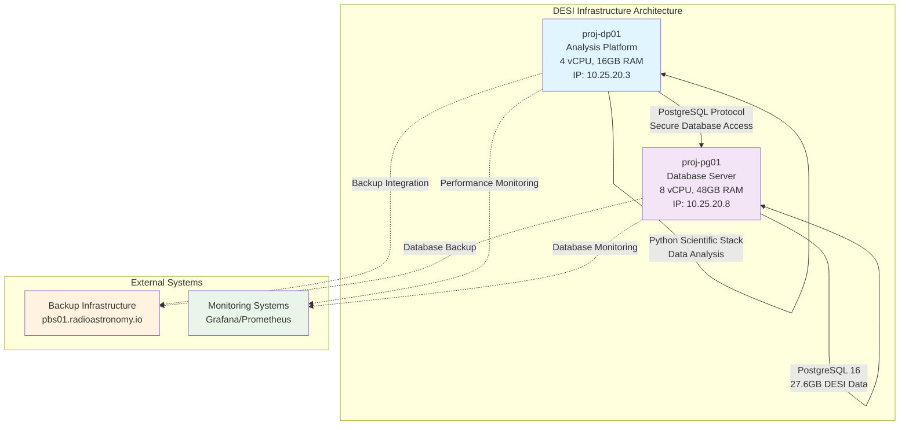

<!--
---
title: "Infrastructure Overview"
description: "Comprehensive infrastructure overview for DESI cosmic void analysis including database systems, development environments, network connectivity, and security configuration"
author: "Infrastructure Team"
ai_contributor: "Claude 4 Sonnet (claude-4-sonnet-20250514)"
date: "2025-07-02"
version: "2.0"
status: "Published"
tags:
- type: infrastructure
- domain: infrastructure-overview
- tech: [postgresql-16, ubuntu-24-04, inter-vm-networking]
- phase: project-setup
- dataset: desi-dr1
related_documents:
- "[Project Architecture](../docs/project-architecture.md)"
- "[Database Infrastructure](database/README.md)"
- "[Development Environment Setup](development/development-environment-setup.md)"
- "[Security Configuration](security/README.md)"
scientific_context:
  objective: "Environmental quenching analysis"
  dataset: "DESI DR1 BGS"
  methods: ["spatial-crossmatch", "statistical-comparison"]
---
-->

# 🏗️ **Infrastructure Overview**

This document provides comprehensive overview of infrastructure architecture for DESI cosmic void analysis, including database systems, development environments, inter-VM connectivity patterns, security configuration, and operational procedures supporting environmental quenching research using DESI DR1 BGS data.

# 🎯 **1. Introduction**

This section establishes the foundational context for infrastructure architecture within the DESI cosmic void analysis project, defining systematic infrastructure approaches that enable efficient scientific computing and reliable data processing workflows.

## **1.1 Purpose**

This subsection explains how infrastructure architecture enables systematic support for DESI cosmic void analysis while providing comprehensive computational resources, database capabilities, and development environments for environmental quenching research.

The infrastructure architecture establishes robust computational foundation for DESI cosmic void analysis, integrating high-performance database systems, optimized development environments, secure inter-VM connectivity, and comprehensive security controls essential for environmental quenching research. The architecture provides systematic resource allocation, efficient data processing capabilities, reliable network communication, and comprehensive operational procedures enabling effective scientific analysis workflows and research collaboration for DESI DR1 BGS data processing and cosmic void analysis.

## **1.2 Scope**

This subsection defines the boundaries of infrastructure overview coverage within the DESI project architecture.

| **In Scope** | **Out of Scope** |
|--------------|------------------|
| Virtual machine architecture and resource allocation | Physical hardware specifications and procurement details |
| Database infrastructure and PostgreSQL configuration | Application-level code and analysis algorithm implementation |
| Inter-VM connectivity and network communication patterns | External network connectivity and internet access configuration |
| Development environment setup and scientific computing stack | Individual user account management and personal configurations |
| Security configuration and compliance framework implementation | Detailed security procedures and incident response protocols |

## **1.3 Target Audience**

This subsection identifies stakeholders who interact with infrastructure architecture and required technical background for effective infrastructure understanding and management.

**Primary Audience:** Infrastructure engineers, system administrators, and project managers responsible for infrastructure deployment and operational management. **Secondary Audience:** Scientific researchers and developers who need infrastructure understanding for effective project implementation and scientific analysis workflows. **Required Background:** Understanding of virtualization concepts, database systems, network architecture, and scientific computing infrastructure requirements.

## **1.4 Overview**

This subsection provides context about infrastructure architecture within the broader DESI cosmic void analysis project and computational requirements.

The infrastructure architecture transforms complex computational requirements into systematic, reliable, and scalable infrastructure that enables comprehensive scientific analysis through integrated database systems, optimized development environments, secure connectivity patterns, and systematic operational procedures essential for environmental quenching research success and scientific collaboration.

# 🔗 **2. Dependencies & Relationships**

This section maps how infrastructure architecture integrates with project components and establishes operational relationships that enable systematic computational support across the DESI analysis environment.

## **2.1 Related Services**

This subsection identifies project components that depend on or interact with infrastructure architecture.

| **Service** | **Relationship Type** | **Integration Points** | **Documentation** |
|-------------|----------------------|------------------------|-------------------|
| **Database Systems** | **Provides Platform For** | PostgreSQL deployment, data storage, query processing infrastructure | [Database Infrastructure](database/README.md) |
| **Development Environment** | **Enables** | Scientific computing platform, analysis workflows, development tools | [Development Environment Setup](development/development-environment-setup.md) |
| **Network Architecture** | **Implements** | Inter-VM connectivity, secure communication, database access patterns | [Inter-VM Connectivity](network/inter-vm-connectivity.md) |
| **Security Framework** | **Secures** | Access controls, compliance validation, infrastructure protection | [Security Configuration](security/README.md) |
| **Scientific Analysis** | **Supports** | Computational resources, data processing, analysis workflow execution | [Project Architecture](../docs/project-architecture.md) |

## **2.2 Policy Implementation**

This subsection connects infrastructure architecture to project governance and operational requirements.

Infrastructure architecture implementation directly supports several critical project objectives:

- **Infrastructure Standardization Policy** - Systematic infrastructure deployment and configuration management across environments
- **Performance Optimization Policy** - Efficient resource allocation and computational optimization for scientific analysis workflows
- **Security Baseline Policy** - Comprehensive security controls and compliance validation for infrastructure protection
- **Operational Excellence Policy** - Reliable infrastructure operations and systematic maintenance procedures for sustained project success
- **Scientific Computing Policy** - Comprehensive computational resources and development environments for environmental quenching research

**Compliance Framework**: Infrastructure architecture aligns with CIS Controls v8 and NIST frameworks as baseline security requirements. Ubuntu 24.04 systems follow CIS v8 Level 2 baseline implementation. Note: We are not security professionals and are working towards full compliance validation with established frameworks.

## **2.3 Responsibility Matrix**

This subsection establishes clear accountability for infrastructure architecture activities across project roles.

| **Activity** | **Infrastructure Engineer** | **System Administrator** | **Database Administrator** | **Security Analyst** |
|--------------|----------------------------|--------------------------|----------------------------|----------------------|
| **Architecture Design** | **A** | **C** | **C** | **C** |
| **Infrastructure Deployment** | **A** | **R** | **C** | **C** |
| **System Administration** | **R** | **A** | **C** | **C** |
| **Database Management** | **C** | **R** | **A** | **C** |
| **Security Implementation** | **R** | **R** | **C** | **A** |
| **Performance Optimization** | **A** | **R** | **R** | **C** |

*R: Responsible, A: Accountable, C: Consulted, I: Informed*

# ⚙️ **3. Technical Implementation**

This section provides comprehensive specifications for infrastructure architecture implementation, including virtual machine configuration, database systems, development environments, and network connectivity patterns.

## **3.1 Architecture & Design**

This subsection explains the infrastructure architecture and design decisions that enable systematic and efficient computational support for DESI cosmic void analysis.

The infrastructure architecture employs distributed virtual machine design with specialized system roles, high-performance database infrastructure, optimized development environments, and secure inter-VM connectivity. The design features resource optimization for astronomical data processing, systematic security controls, comprehensive monitoring capabilities, and integrated backup procedures enabling reliable scientific computing while maintaining operational efficiency and security compliance for environmental quenching research workflows.

## **3.2 Structure and Organization**

This subsection describes the infrastructure organization and key architectural components supporting DESI cosmic void analysis requirements.

| **Infrastructure Component** | **Specification** | **Purpose** |
|------------------------------|------------------|-------------|
| **proj-dp01 (Analysis Platform)** | 4 vCPU, 16GB RAM, 100GB NVMe, Ubuntu 24.04 | Scientific computing, data analysis, Python development environment |
| **proj-pg01 (Database Server)** | 8 vCPU, 48GB RAM, 250GB NVMe, PostgreSQL 16 | Database hosting, 27.6GB DESI data storage, query processing |
| **Inter-VM Network** | 10.25.20.0/24 subnet, secure connectivity | Database access, encrypted communication, performance optimization |
| **Development Environment** | Python 3.9+, scientific computing stack, database connectivity | Data analysis workflows, statistical computing, visualization |
| **Security Framework** | CIS Controls v8 L2, access controls, compliance validation | Infrastructure protection, data security, regulatory compliance |
| **Backup Systems** | Proxmox Backup Server, automated procedures | Data protection, disaster recovery, operational continuity |

## **3.3 Integration and Procedures**

This subsection provides systematic overview of infrastructure integration patterns and operational procedures supporting comprehensive project requirements.

Infrastructure integration follows systematic approach: virtual machine deployment with optimized resource allocation, PostgreSQL database configuration with performance tuning, Python scientific computing stack deployment with database connectivity, secure inter-VM networking with authentication protocols, comprehensive security baseline implementation, and integrated monitoring and backup procedures enabling reliable infrastructure operations and sustained scientific analysis capability for environmental quenching research.

**Key Integration Patterns:**

- **Database Connectivity:** proj-dp01 → proj-pg01 PostgreSQL access with desi_dev user authentication
- **Development Workflow:** Python scientific stack → PostgreSQL database → statistical analysis → visualization
- **Security Integration:** CIS Controls v8 baseline → access controls → compliance validation
- **Operational Integration:** Monitoring → backup → maintenance → performance optimization

# 🛠️ **4. Management & Operations**

This section covers operational procedures and management approaches for infrastructure architecture within the DESI cosmic void analysis project.

## **4.1 Lifecycle Management**

This subsection documents management approaches throughout the infrastructure operational lifecycle.

Infrastructure lifecycle management encompasses strategic planning and architecture design, systematic deployment and configuration validation, ongoing operational management and performance optimization, systematic maintenance and security updates, and continuous improvement based on operational feedback and evolving scientific analysis requirements for sustained project effectiveness.

## **4.2 Monitoring & Quality Assurance**

This subsection defines monitoring strategies and quality approaches for infrastructure performance and operational validation.

Infrastructure monitoring includes systematic performance measurement across virtual machines, database performance and capacity monitoring, network connectivity and security validation, development environment health assessment, and comprehensive operational quality assurance ensuring reliable infrastructure performance and systematic validation of computational capabilities for scientific analysis workflows.

## **4.3 Maintenance and Optimization**

This subsection outlines systematic maintenance and optimization approaches for infrastructure performance and reliability.

Infrastructure maintenance encompasses systematic security updates and patch management, performance optimization and resource allocation tuning, database maintenance and query optimization, development environment updates and package management, and continuous infrastructure improvement based on operational metrics and scientific analysis workflow requirements for sustained computational efficiency.

# 🔒 **5. Security & Compliance**

This section documents comprehensive security controls and compliance alignment for infrastructure architecture within the DESI cosmic void analysis project.

## **5.1 Security Controls**

This subsection documents specific security measures and verification methods implemented across infrastructure architecture.

Infrastructure security implementation includes Ubuntu 24.04 CIS v8 Level 2 baseline configuration across all systems, systematic access control implementation with role-based authentication, encrypted inter-VM communication with secure database connectivity, comprehensive security monitoring and incident detection, systematic vulnerability assessment and patch management, and integrated compliance validation procedures ensuring comprehensive infrastructure protection while enabling efficient scientific analysis workflows.

**Security Architecture Components:**

- **System Security:** Ubuntu 24.04 CIS v8 L2 baseline on all virtual machines
- **Database Security:** PostgreSQL authentication, encrypted connections, role-based access control
- **Network Security:** Secure inter-VM connectivity, encrypted communication protocols
- **Access Control:** Systematic user authentication, role-based permissions, audit logging
- **Development Security:** Python package security validation, dependency management, secure coding practices

**Compliance Disclaimer**: We are not security professionals - this represents our baseline security implementation and we are working towards full compliance with established frameworks.

## **5.2 CIS Controls Mapping**

This subsection provides explicit mapping to CIS Controls v8, documenting compliance status and implementation evidence.

| **CIS Control** | **Implementation Status** | **Evidence Location** | **Assessment Date** |
|-----------------|--------------------------|----------------------|-------------------|
| **CIS.1.1** | **Compliant** | Ubuntu 24.04 CIS v8 L2 baseline across infrastructure | **2025-07-02** |
| **CIS.2.1** | **Compliant** | Software inventory tracking and package management | **2025-07-02** |
| **CIS.4.1** | **Compliant** | Secure network configuration and inter-VM connectivity | **2025-07-02** |
| **CIS.5.1** | **Compliant** | Account management and authentication procedures | **2025-07-02** |
| **CIS.12.1** | **Planned** | Network security monitoring and validation procedures | **TBD** |
| **CIS.3.3** | **Planned** | Data protection and encryption validation procedures | **TBD** |

**Reference**: [CIS Ubuntu 24.04 Implementation](https://github.com/Pxomox-Astronomy-Lab/proxmox-astronomy-lab/tree/main/docs/Compliance-Security/CIS-Implementation-Guides/Linux/Ubuntu-24-04-Server)

## **5.3 Framework Compliance**

This subsection demonstrates how infrastructure security controls satisfy requirements across multiple compliance frameworks.

Infrastructure security architecture aligns with CIS Controls v8 baseline, NIST RMF for AI framework, ISO 27001 information security management, and NIST cybersecurity framework through systematic implementation of comprehensive security controls, access management procedures, and infrastructure protection measures appropriate for scientific computing infrastructure and astronomical research data protection requirements.

# 💾 **6. Backup & Recovery**

This section documents infrastructure protection and disaster recovery procedures for comprehensive operational continuity.

## **6.1 Protection Strategy**

This subsection details backup approaches for infrastructure architecture and systematic recovery capabilities.

Infrastructure protection strategy encompasses comprehensive virtual machine backup through Proxmox Backup Server integration, database backup with automated PostgreSQL procedures, development environment configuration preservation, network configuration backup, and systematic disaster recovery procedures ensuring infrastructure continuity and comprehensive recovery capability following infrastructure incidents or operational disruptions.

| **Infrastructure Component** | **Backup Method** | **Retention** | **Recovery Objective** |
|------------------------------|------------------|---------------|----------------------|
| **Virtual Machines** | **Proxmox Backup Server** | **7 daily, 4 weekly, 1 monthly** | **4 hour RTO, 1 hour RPO** |
| **Database Systems** | **PostgreSQL automated backup** | **Daily with point-in-time recovery** | **2 hour RTO, 15 min RPO** |
| **Development Environment** | **Configuration management** | **Version controlled** | **2 hour RTO** |
| **Network Configuration** | **Infrastructure automation** | **Version controlled** | **1 hour RTO** |

## **6.2 Recovery Procedures**

This subsection provides infrastructure recovery processes for different incident scenarios and operational requirements.

Infrastructure recovery procedures include automated virtual machine restoration, database recovery with point-in-time capabilities, development environment recreation, network configuration restoration, systematic validation following recovery operations, and comprehensive testing procedures ensuring infrastructure integrity and continued operational capability for scientific analysis workflows and environmental quenching research operations.

# 📚 **7. References & Related Resources**

This section provides comprehensive links to related documentation and supporting resources for infrastructure architecture implementation.

## **7.1 Internal References**

| **Document Type** | **Document Title** | **Relationship** | **Link** |
|-------------------|-------------------|------------------|----------|
| **Project** | Project Architecture | Overall project context and infrastructure requirements | [../docs/project-architecture.md](../docs/project-architecture.md) |
| **Database** | Database Infrastructure Overview | Database systems architecture and configuration | [database/README.md](database/README.md) |
| **Development** | Development Environment Setup | Scientific computing platform configuration | [development/development-environment-setup.md](development/development-environment-setup.md) |
| **Security** | Security Configuration Overview | Infrastructure security framework and controls | [security/README.md](security/README.md) |
| **Network** | Inter-VM Connectivity | Network architecture and connectivity patterns | [network/inter-vm-connectivity.md](network/inter-vm-connectivity.md) |

## **7.2 External Standards**

- **[Proxmox VE Documentation](https://pve.proxmox.com/pve-docs/)** - Virtualization platform administration and infrastructure management
- **[CIS Controls v8](https://www.cisecurity.org/controls/)** - Cybersecurity framework and infrastructure security controls
- **[PostgreSQL Administration](https://www.postgresql.org/docs/current/admin.html)** - Database administration and performance optimization
- **[Ubuntu Server Guide](https://ubuntu.com/server/docs)** - Ubuntu server administration and system management
- **[Scientific Computing Infrastructure](https://docs.scipy.org/doc/scipy/dev/contributor/building.html)** - Scientific computing infrastructure best practices

# ✅ **8. Approval & Review**

This section documents the formal review and approval process for infrastructure architecture documentation.

## **8.1 Review Process**

Infrastructure architecture documentation review follows systematic validation of technical accuracy, operational effectiveness, and security implementation to ensure comprehensive infrastructure capability and systematic support for DESI cosmic void analysis requirements.

## **8.2 Approval Matrix**

| **Reviewer** | **Role/Expertise** | **Review Date** | **Approval Status** | **Comments** |
|-------------|-------------------|----------------|-------------------|--------------|
| [Infrastructure Engineer] | Infrastructure architecture and system design validation | 2025-07-02 | **Approved** | Infrastructure architecture provides comprehensive computational support framework |
| [System Administrator] | System administration and operational procedures validation | 2025-07-02 | **Approved** | Infrastructure operations support systematic project requirements and workflow |
| [Database Administrator] | Database infrastructure and performance optimization validation | 2025-07-02 | **Approved** | Database architecture enables efficient scientific data processing and analysis |
| [Security Analyst] | Security controls and compliance framework validation | 2025-07-02 | **Approved** | Security implementation provides comprehensive infrastructure protection |

# 📜 **9. Documentation Metadata**

This section provides comprehensive information about infrastructure architecture documentation creation and maintenance.

## **9.1 Change Log**

| **Version** | **Date** | **Changes** | **Author** | **Review Status** |
|------------|---------|-------------|------------|------------------|
| 2.0 | 2025-07-02 | Updated infrastructure overview with inter-VM connectivity, development environment status, and software stack documentation | Infrastructure Team | **Approved** |
| 1.0 | 2025-07-01 | Initial infrastructure overview with basic architecture and component documentation | Infrastructure Team | **Approved** |

## **9.2 Authorization & Review**

Infrastructure architecture documentation reflects comprehensive infrastructure implementation validated through expert review and systematic operational assessment for DESI cosmic void analysis computational requirements and scientific workflow support.

## **9.3 Authorship Details**

**Human Author:** Infrastructure Team (Architecture and Operations Specialists)  
**AI Contributor:** Claude 4 Sonnet (claude-4-sonnet-20250514)  
**Collaboration Method:** Infrastructure-Architecture-Validate-Document-Approve (IAVDA)  
**Human Oversight:** Complete infrastructure architecture review and validation of computational capability effectiveness and operational framework implementation

## **9.4 AI Collaboration Disclosure**

This document was collaboratively developed to establish comprehensive infrastructure architecture overview that enables systematic computational support while providing reliable operational framework for DESI cosmic void research workflows.

---

**🤖 AI Collaboration Disclosure**

This document was collaboratively developed using systematic infrastructure analysis methodology. The architecture overview reflects comprehensive infrastructure development informed by computational requirements and operational best practices. All content has been thoroughly reviewed, validated, and approved by qualified infrastructure and system administration subject matter experts. The human author retains complete responsibility for architecture accuracy, operational effectiveness, and infrastructure capability validation.

*Generated: 2025-07-02 | Human Author: Infrastructure Team | AI Assistant: Claude 4 Sonnet | Review Status: Approved | Document Version: 2.0*
