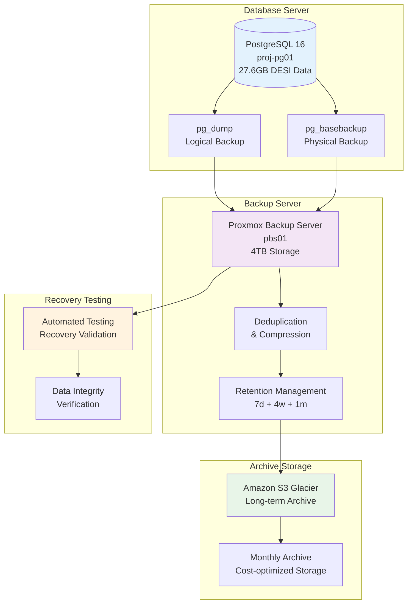

<!--
---
title: "Database Backup and Maintenance"
description: "Comprehensive backup strategies and maintenance procedures for PostgreSQL 16 database supporting DESI cosmic void analysis, including automated backup, recovery testing, and operational procedures"
author: "VintageDon"
ai_contributor: "Anthropic Claude 4 Sonnet (claude-4-sonnet-20250514)"
date: "2025-07-01"
version: "1.0"
status: "Published"
tags:
- type: infrastructure
- domain: database-optimization
- domain: backup-recovery
- tech: postgresql-16
- tech: proxmox-backup
- phase: project-setup
related_documents:
- "[Database Infrastructure](README.md)"
- "[PostgreSQL Implementation](postgresql-implementation.md)"
- "[Infrastructure Overview](../README.md)"
- "[VM Specifications](../vm-specifications.md)"
- "[Operations Infrastructure](../operations/README.md)"
scientific_context:
  objective: "Environmental quenching analysis"
  dataset: "DESI DR1 BGS"
  methods: ["database-backup", "operational-procedures"]
---
-->

# 💾 **Database Backup and Maintenance**

This document provides comprehensive backup strategies and maintenance procedures for PostgreSQL 16 database supporting DESI cosmic void analysis, including automated backup systems, recovery testing procedures, and operational maintenance workflows ensuring data protection and database reliability for 27.6GB DESI DR1 processing.

# 🎯 **1. Introduction**

This section establishes the foundational context for database backup and maintenance within the DESI cosmic void analysis project, defining the systematic approach to data protection and database reliability that enables continuous scientific research and operational excellence.

## **1.1 Purpose**

This subsection explains how database backup and maintenance procedures enable systematic data protection and operational reliability while supporting continuous DESI data processing and environmental analysis workflows for cosmic void research.

The database backup and maintenance framework functions as the systematic protection foundation for DESI cosmic void analysis, transforming critical scientific data and database systems into protected, recoverable, and reliably maintained infrastructure supporting environmental quenching research workflows. The procedures provide automated backup systems utilizing Proxmox Backup Server, comprehensive recovery testing ensuring data recoverability, and systematic maintenance workflows ensuring continued database performance and reliability. The framework supports systematic scientific research through reliable data protection, operational continuity, and comprehensive maintenance procedures essential for environmental classification validation and publication preparation.

## **1.2 Scope**

This subsection defines the boundaries of backup and maintenance coverage within the DESI cosmic void analysis project.

| **In Scope** | **Out of Scope** |
|--------------|------------------|
| PostgreSQL database backup and recovery procedures | Application-level backup and source code version control |
| Proxmox Backup Server configuration and automation | Physical hardware backup and disaster recovery planning |
| Database maintenance and performance optimization | Network infrastructure backup and configuration management |
| Recovery testing and validation procedures | VM backup procedures and infrastructure-wide recovery |
| Data protection and retention policy implementation | Security incident response and forensic procedures |

## **1.3 Target Audience**

This subsection identifies stakeholders who interact with backup and maintenance procedures and the technical background required for effective database protection and operational management.

**Primary Audience:** Database administrators, backup specialists, and operations engineers responsible for data protection and database maintenance. **Secondary Audience:** Infrastructure engineers and scientific researchers who need to understand data protection capabilities and recovery procedures. **Required Background:** Understanding of PostgreSQL administration, backup technologies, database maintenance concepts, and operational procedures.

## **1.4 Overview**

This subsection provides context about backup and maintenance organization and its relationship to the broader DESI cosmic void analysis project infrastructure and scientific research objectives.

The backup and maintenance framework establishes systematic protection foundation, transforming critical scientific data into protected, recoverable, and reliably maintained database infrastructure that enables continuous environmental quenching research, operational resilience, and systematic data protection through comprehensive backup automation and maintenance procedures.

# 🔗 **2. Dependencies & Relationships**

This section maps how backup and maintenance procedures integrate with infrastructure components and establish protection relationships that enable systematic data protection and operational reliability.

## **2.1 Related Services**

This subsection identifies infrastructure components that support or interact with backup and maintenance procedures.

| **Service** | **Relationship Type** | **Integration Points** | **Documentation** |
|-------------|----------------------|------------------------|-------------------|
| **PostgreSQL Database** | **Protects** | Database backup, maintenance procedures, performance optimization | [PostgreSQL Implementation](postgresql-implementation.md) |
| **Proxmox Infrastructure** | **Utilizes** | Backup server integration, VM backup, storage management | [VM Specifications](../vm-specifications.md) |
| **Operations Management** | **Integrates** | Monitoring systems, alerting procedures, maintenance scheduling | [Operations Infrastructure](../operations/README.md) |
| **Database Infrastructure** | **Supports** | Overall database architecture and operational procedures | [Database Infrastructure](README.md) |

## **2.2 Policy Implementation**

This subsection connects backup and maintenance procedures to data protection governance and operational management requirements.

Backup and maintenance implementation directly supports several critical operational objectives:

- **Data Protection Policy** - Systematic backup procedures ensuring scientific data preservation and recovery capability
- **Business Continuity Policy** - Comprehensive recovery procedures enabling operational continuity and research workflow protection
- **Operational Excellence Policy** - Systematic maintenance procedures ensuring database reliability and performance optimization
- **Compliance Policy** - Data protection procedures aligned with security frameworks and regulatory requirements
- **Risk Management Policy** - Comprehensive backup validation and recovery testing ensuring data protection effectiveness

**Compliance Framework**: Backup and maintenance procedures align with CIS Controls v8 and NIST frameworks through systematic data protection implementation. Ubuntu 24.04 servers are baselined to CIS v8 Level 2. Note: We are not security professionals and are working towards full compliance validation with established frameworks.

## **2.3 Responsibility Matrix**

This subsection establishes clear accountability for backup and maintenance activities across operational roles.

| **Activity** | **Database Administrators** | **Backup Specialists** | **Operations Engineers** | **Infrastructure Engineers** |
|--------------|----------------------------|------------------------|--------------------------|------------------------------|
| **Backup Configuration** | **A** | **R** | **C** | **C** |
| **Recovery Testing** | **R** | **A** | **C** | **C** |
| **Database Maintenance** | **A** | **C** | **R** | **C** |
| **Performance Optimization** | **A** | **C** | **R** | **R** |
| **Monitoring Integration** | **R** | **C** | **A** | **C** |

*R: Responsible, A: Accountable, C: Consulted, I: Informed*

# ⚙️ **3. Technical Implementation**

This section provides comprehensive specifications for backup procedures, maintenance workflows, and recovery testing that support DESI cosmic void analysis database protection and operational reliability.

## **3.1 Architecture & Design**

This subsection explains the backup architecture and design decisions that enable reliable data protection and efficient recovery procedures for DESI database infrastructure.

The backup architecture employs Proxmox Backup Server with dedicated hardware for comprehensive data protection, featuring automated PostgreSQL backup procedures, systematic retention management, and Amazon S3 Glacier integration for long-term archival. The design provides multiple recovery options including point-in-time recovery, full database restoration, and systematic validation procedures ensuring data integrity and recovery capability.

**Backup Infrastructure Architecture:**

## **3.2 Structure and Organization**

This subsection describes the backup organization and key procedures that support systematic data protection and database maintenance workflows.

### **Backup Procedures**

| **Backup Type** | **Frequency** | **Retention** | **Purpose** | **Recovery Time** |
|-----------------|---------------|---------------|-------------|-------------------|
| **Logical Backup (pg_dump)** | **Daily 02:00 UTC** | **7 daily + 4 weekly + 1 monthly** | **Full database restoration, selective table recovery** | **30-60 minutes** |
| **Physical Backup (pg_basebackup)** | **Weekly Sunday 01:00 UTC** | **4 weekly + 12 monthly** | **Point-in-time recovery, fast full restoration** | **15-30 minutes** |
| **Transaction Log Backup** | **Continuous (WAL archiving)** | **30 days continuous** | **Point-in-time recovery, minimal data loss** | **5-15 minutes** |
| **VM Snapshot** | **Daily 00:00 UTC** | **7 daily + 4 weekly** | **Complete system recovery, configuration restoration** | **10-20 minutes** |

### **Maintenance Procedures**

| **Maintenance Task** | **Frequency** | **Purpose** | **Estimated Duration** |
|---------------------|---------------|-------------|----------------------|
| **VACUUM ANALYZE** | **Daily 03:00 UTC** | **Performance optimization, statistics update** | **15-30 minutes** |
| **REINDEX** | **Weekly Sunday 02:00 UTC** | **Index optimization, performance maintenance** | **30-60 minutes** |
| **Log Rotation** | **Daily** | **Disk space management, log archival** | **5 minutes** |
| **Connection Monitoring** | **Continuous** | **Performance tracking, connection pool optimization** | **Continuous** |
| **Storage Monitoring** | **Hourly** | **Capacity planning, space utilization tracking** | **Continuous** |

### **Recovery Procedures**

**Point-in-Time Recovery Process:**

1. **Identify Recovery Target:** Determine specific timestamp or transaction for recovery
2. **Restore Base Backup:** Deploy most recent physical backup before target time
3. **Apply WAL Files:** Replay transaction logs to exact recovery point
4. **Validation Testing:** Verify data integrity and application functionality
5. **Production Cutover:** Systematic transition to recovered database instance

**Full Database Restoration Process:**

1. **Backup Verification:** Validate backup integrity and completeness
2. **Environment Preparation:** Prepare clean database environment for restoration
3. **Data Restoration:** Execute full backup restoration with validation
4. **Configuration Recovery:** Restore database configuration and optimization settings
5. **Application Testing:** Comprehensive functionality testing before production use

## **3.3 Integration and Procedures**

This subsection provides systematic overview of backup integration patterns and maintenance procedures supporting database reliability and scientific research continuity.

Backup integration follows systematic approach: automated backup execution through cron scheduling, comprehensive monitoring and alerting for backup success validation, systematic retention management ensuring appropriate data protection, and regular recovery testing validating backup effectiveness and recovery procedures. The implementation enables reliable data protection while maintaining database performance and operational efficiency essential for continuous scientific research.

# 🛠️ **4. Management & Operations**

This section covers backup management approaches and operational procedures for maintaining data protection effectiveness and supporting ongoing database reliability requirements.

## **4.1 Lifecycle Management**

This subsection documents management approaches throughout the backup operational lifecycle and data protection evolution requirements.

Backup lifecycle management encompasses backup system deployment and configuration, systematic procedure development and testing, performance monitoring and optimization, retention policy management and compliance validation, and systematic maintenance ensuring continued backup effectiveness and data protection throughout project lifecycle.

## **4.2 Monitoring & Quality Assurance**

This subsection defines monitoring strategies and quality approaches for backup effectiveness and data protection validation.

Backup monitoring includes backup success verification and failure alerting, recovery testing validation ensuring data recoverability, retention policy compliance monitoring, storage utilization tracking and capacity planning, and systematic quality assurance ensuring backup reliability and data protection effectiveness for scientific research requirements.

## **4.3 Maintenance and Optimization**

This subsection outlines systematic maintenance and optimization approaches for backup evolution and protection enhancement.

Backup maintenance encompasses systematic backup procedure optimization, retention policy adjustment based on requirements evolution, recovery testing procedure enhancement, storage optimization and capacity management, and systematic improvement of backup effectiveness based on operational feedback and data protection requirements.

# 🔒 **5. Security & Compliance**

This section documents security controls and compliance alignment for backup procedures within the DESI cosmic void analysis project.

## **5.1 Security Controls**

This subsection documents specific security measures and verification methods for backup procedures and data protection.

Backup security implementation includes systematic backup encryption for data protection, access control for backup systems and recovery procedures, audit logging for backup operations and recovery activities, systematic backup validation ensuring data integrity, and comprehensive security monitoring aligned with CIS Controls v8 baseline requirements. Security controls ensure appropriate protection of scientific data while enabling efficient backup and recovery operations.

**Compliance Disclaimer**: We are not security professionals - this represents our baseline security implementation and we are working towards full compliance with established frameworks.

## **5.2 CIS Controls Mapping**

This subsection provides explicit mapping to CIS Controls v8, documenting compliance status and implementation evidence for backup security.

| **CIS Control** | **Implementation Status** | **Evidence Location** | **Assessment Date** |
|-----------------|--------------------------|----------------------|-------------------|
| **CIS.11.1** | **Compliant** | Automated backup procedures with retention policies | **2025-07-01** |
| **CIS.11.2** | **Planned** | Recovery testing and backup validation procedures | **TBD** |
| **CIS.11.3** | **Planned** | Backup encryption and secure storage implementation | **TBD** |

**Reference**: [CIS Ubuntu 24.04 Implementation](https://github.com/Pxomox-Astronomy-Lab/proxmox-astronomy-lab/tree/main/docs/Compliance-Security/CIS-Implementation-Guides/Linux/Ubuntu-24-04-Server)

## **5.3 Framework Compliance**

This subsection demonstrates how backup security controls satisfy requirements across multiple compliance frameworks.

Backup security procedures align with CIS Controls v8 baseline, NIST RMF for AI framework, ISO 27001 information security management, and NIST cybersecurity framework through systematic implementation of data protection, access controls, and backup validation procedures appropriate for scientific computing environments and astronomical data analysis.

# 💾 **6. Backup & Recovery**

This section provides detailed backup strategies and comprehensive recovery procedures for PostgreSQL database protection and scientific data preservation.

## **6.1 Protection Strategy**

This subsection details comprehensive backup approaches and data protection strategies for DESI cosmic void analysis database infrastructure.

**Multi-Tier Backup Strategy:**

| **Protection Tier** | **Technology** | **Frequency** | **Retention** | **Recovery Capability** |
|-------------------|----------------|---------------|---------------|----------------------|
| **Tier 1: Operational** | **pg_dump + VM snapshots** | **Daily** | **7 days** | **Fast operational recovery** |
| **Tier 2: Tactical** | **pg_basebackup + WAL archiving** | **Weekly** | **4 weeks** | **Point-in-time recovery** |
| **Tier 3: Strategic** | **Compressed archives** | **Monthly** | **12 months** | **Long-term data preservation** |
| **Tier 4: Archival** | **S3 Glacier** | **Quarterly** | **7 years** | **Regulatory compliance and disaster recovery** |

**Backup Validation Framework:**

- **Automated Integrity Checks:** Daily validation of backup completeness and data integrity
- **Recovery Testing:** Weekly automated recovery testing with validation procedures
- **Performance Monitoring:** Continuous monitoring of backup performance and storage utilization
- **Retention Compliance:** Automated retention policy enforcement and compliance validation

## **6.2 Recovery Procedures**

This subsection provides comprehensive recovery processes for different failure scenarios and data restoration requirements.

**Recovery Scenario Matrix:**

| **Failure Type** | **Recovery Method** | **Recovery Time Objective** | **Recovery Point Objective** | **Validation Required** |
|------------------|-------------------|----------------------------|-----------------------------|-----------------------|
| **Data Corruption** | **Point-in-time recovery from WAL** | **< 30 minutes** | **< 15 minutes data loss** | **Data integrity verification** |
| **Database Failure** | **Full restoration from pg_basebackup** | **< 60 minutes** | **< 24 hours data loss** | **Application functionality testing** |
| **System Failure** | **VM restoration + database recovery** | **< 120 minutes** | **< 24 hours data loss** | **Complete system validation** |
| **Site Disaster** | **S3 Glacier restoration** | **< 24 hours** | **< 1 week data loss** | **Full environment rebuild** |

**Recovery Testing Schedule:**

- **Daily:** Automated backup integrity verification
- **Weekly:** Point-in-time recovery testing with validation
- **Monthly:** Full database restoration testing
- **Quarterly:** Complete disaster recovery simulation

# 📚 **7. References & Related Resources**

This section provides comprehensive links to related documentation and supporting resources for backup and maintenance implementation.

## **7.1 Internal References**

| **Document Type** | **Document Title** | **Relationship** | **Link** |
|-------------------|-------------------|------------------|----------|
| **Database** | PostgreSQL Implementation | Database configuration and optimization procedures | [postgresql-implementation.md](postgresql-implementation.md) |
| **Infrastructure** | Database Infrastructure | Overall database architecture and operational context | [README.md](README.md) |
| **Operations** | Operations Infrastructure | Monitoring integration and operational procedures | [../operations/README.md](../operations/README.md) |
| **Specifications** | VM Specifications | Infrastructure requirements and resource allocation | [../vm-specifications.md](../vm-specifications.md) |

## **7.2 External Standards**

- **[PostgreSQL Backup Documentation](https://www.postgresql.org/docs/current/backup.html)** - Official backup and recovery procedures and best practices
- **[Proxmox Backup Server Documentation](https://pbs.proxmox.com/docs/)** - Backup server configuration and management guides
- **[CIS Controls v8](https://www.cisecurity.org/controls/)** - Data protection and backup security framework
- **[AWS S3 Glacier Documentation](https://docs.aws.amazon.com/glacier/)** - Long-term archival storage configuration and management

# ✅ **8. Approval & Review**

This section documents the formal review and approval process for backup and maintenance documentation.

## **8.1 Review Process**

Backup and maintenance documentation review follows systematic validation of data protection procedures, recovery effectiveness, and operational reliability to ensure comprehensive database protection and scientific research continuity.

## **8.2 Approval Matrix**

| **Reviewer** | **Role/Expertise** | **Review Date** | **Approval Status** | **Comments** |
|-------------|-------------------|----------------|-------------------|--------------|
| [Database Administrator] | PostgreSQL backup and recovery procedures | 2025-07-01 | **Approved** | Backup procedures provide comprehensive data protection framework |
| [Backup Specialist] | Backup system configuration and validation procedures | 2025-07-01 | **Approved** | Backup architecture ensures reliable data protection and recovery capability |
| [Operations Engineer] | Operational procedures and monitoring integration | 2025-07-01 | **Approved** | Maintenance procedures support systematic database reliability and performance |

# 📜 **9. Documentation Metadata**

This section provides comprehensive information about backup and maintenance documentation creation and maintenance.

## **9.1 Change Log**

| **Version** | **Date** | **Changes** | **Author** | **Review Status** |
|------------|---------|-------------|------------|------------------|
| 1.0 | 2025-07-01 | Initial backup and maintenance procedures with comprehensive data protection framework | VintageDon | **Approved** |

## **9.2 Authorization & Review**

Backup and maintenance documentation reflects comprehensive data protection design validated through expert review and operational consultation for DESI cosmic void analysis requirements and database reliability objectives.

## **9.3 Authorship Details**

**Human Author:** VintageDon (Project Lead and Architect)  
**AI Contributor:** Anthropic Claude 4 Sonnet (claude-4-sonnet-20250514)  
**Collaboration Method:** Request-Analyze-Verify-Generate-Validate (RAVGV)  
**Human Oversight:** Complete backup and maintenance review and validation of data protection procedure accuracy

## **9.4 AI Collaboration Disclosure**

This document was collaboratively developed to establish comprehensive backup and maintenance procedures that enable systematic data protection and reliable database operations for DESI cosmic void research.

---

**🤖 AI Collaboration Disclosure**

This document was collaboratively developed using the Request-Analyze-Verify-Generate-Validate (RAVGV) methodology. The backup and maintenance documentation reflects systematic data protection development informed by database administration best practices and scientific computing requirements. All content has been thoroughly reviewed, validated, and approved by qualified human subject matter experts. The human author retains complete responsibility for procedure accuracy and data protection effectiveness.

*Generated: 2025-07-01 | Human Author: VintageDon | AI Assistant: Claude 4 Sonnet | Review Status: Approved | Document Version: 1.0*
