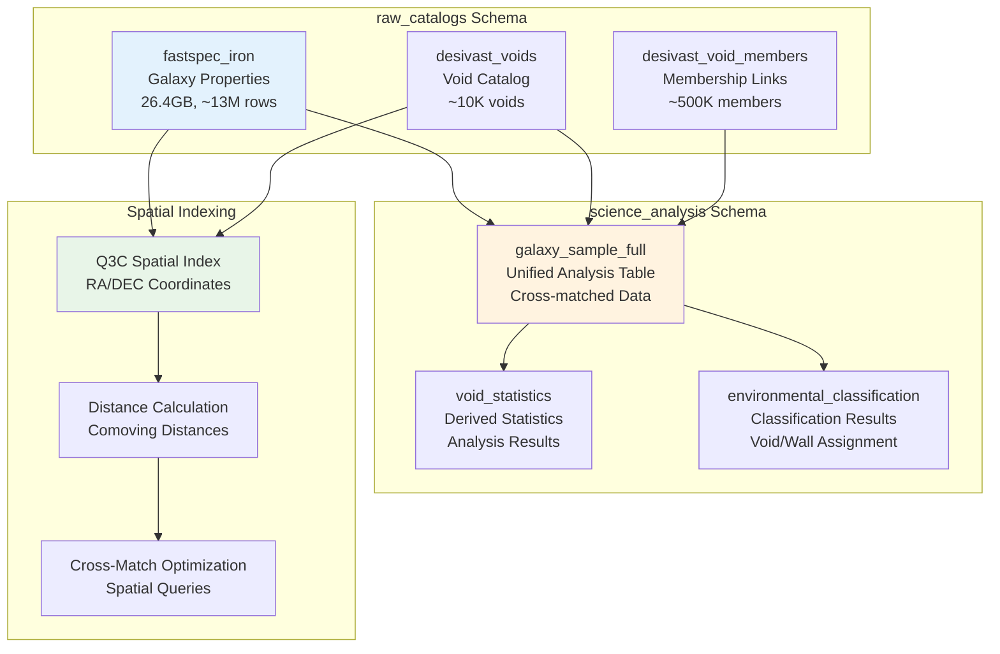

<!--
---
title: "Database Schema Design"
description: "PostgreSQL database schema design optimized for DESI astronomical data, including table structures, spatial indexing, and performance optimization for cosmic void analysis"
author: "VintageDon"
ai_contributor: "Anthropic Claude 4 Sonnet (claude-4-sonnet-20250514)"
date: "2025-07-01"
version: "1.0"
status: "Published"
tags:
- type: infrastructure
- domain: database-optimization
- domain: astronomical-data
- tech: postgresql-16
- tech: spatial-indexing
- phase: project-setup
related_documents:
- "[Database Infrastructure](README.md)"
- "[PostgreSQL Implementation](postgresql-implementation.md)"
- "[Backup and Maintenance](backup-and-maintenance.md)"
- "[Data Pipeline Design](../../docs/data-pipeline-design.md)"
- "[Implementation Roadmap](../../ROADMAP.md)"
scientific_context:
  objective: "Environmental quenching analysis"
  dataset: "DESI DR1 BGS"
  methods: ["database-schema", "spatial-indexing", "query-optimization"]
---
-->

# 🗄️ **Database Schema Design**

This document provides PostgreSQL database schema design optimized for DESI astronomical data, including comprehensive table structures, spatial indexing strategies, and performance optimization techniques supporting efficient processing of 27.6GB DESI DR1 data for cosmic void analysis and environmental quenching research.

# 🎯 **1. Introduction**

This section establishes the foundational context for database schema design within the DESI cosmic void analysis project, defining the systematic approach to data organization that enables efficient astronomical data processing and spatial analysis workflows.

## **1.1 Purpose**

This subsection explains how the database schema enables systematic organization of DESI DR1 data while supporting efficient spatial queries, environmental classification, and statistical analysis workflows for cosmic void research.

The database schema functions as the systematic data organization foundation for DESI cosmic void analysis, transforming complex astronomical catalog data into structured, indexed, and queryable database design supporting environmental quenching research workflows. The schema provides optimized table structures for DESIVAST void catalogs and FastSpecFit galaxy properties, spatial indexing through Q3C extensions enabling efficient coordinate-based queries, and systematic data organization supporting reproducible scientific analysis. The design supports systematic environmental classification through optimized spatial cross-matching, statistical analysis through efficient aggregation queries, and comprehensive data lineage essential for scientific validation and publication preparation.

## **1.2 Scope**

This subsection defines the boundaries of database schema coverage within the DESI cosmic void analysis project.

| **In Scope** | **Out of Scope** |
|--------------|------------------|
| Table structure design for DESI astronomical catalogs | Application-level data processing and analysis algorithms |
| Spatial indexing and query optimization for astronomical coordinates | FITS file processing and ingestion pipeline implementation |
| Schema organization and data lineage for scientific reproducibility | Database administration and operational maintenance procedures |
| Performance optimization and query patterns for environmental analysis | Hardware configuration and PostgreSQL server tuning |
| Data validation constraints and referential integrity | Backup procedures and disaster recovery implementation |

## **1.3 Target Audience**

This subsection identifies stakeholders who interact with database schema design and the technical background required for effective schema implementation and optimization.

**Primary Audience:** Database administrators, data architects, and astronomical researchers responsible for schema implementation and query optimization. **Secondary Audience:** Data scientists and pipeline engineers who need to understand data organization and query patterns for analysis workflows. **Required Background:** Understanding of PostgreSQL database design, astronomical data structures, spatial indexing concepts, and query optimization principles.

## **1.4 Overview**

This subsection provides context about schema design organization and its relationship to the broader DESI cosmic void analysis project and scientific research objectives.

The database schema establishes systematic data organization foundation, transforming complex astronomical catalog structures into optimized, queryable, and scientifically meaningful database design that enables efficient environmental classification, systematic statistical analysis, and reproducible scientific validation through comprehensive schema architecture and performance optimization.

# 🔗 **2. Dependencies & Relationships**

This section maps how database schema design integrates with data processing components and establishes organizational relationships that enable systematic astronomical data management and analysis workflows.

## **2.1 Related Services**

This subsection identifies project components that utilize or depend on database schema design and data organization.

| **Service** | **Relationship Type** | **Integration Points** | **Documentation** |
|-------------|----------------------|------------------------|-------------------|
| **Data Pipeline** | **Implements** | FITS ingestion, data validation, schema population | [Data Pipeline Design](../../docs/data-pipeline-design.md) |
| **PostgreSQL Implementation** | **Utilizes** | Database configuration, performance tuning, spatial extensions | [PostgreSQL Implementation](postgresql-implementation.md) |
| **Scientific Analysis** | **Queries** | Spatial cross-matching, statistical aggregation, result extraction | [Source Code Overview](../../src/README.md) |
| **Database Infrastructure** | **Supports** | Overall database architecture and operational procedures | [Database Infrastructure](README.md) |

## **2.2 Policy Implementation**

This subsection connects database schema design to data management governance and scientific research requirements.

Database schema implementation directly supports several critical data management objectives:

- **Data Quality Policy** - Systematic schema design ensuring data integrity and validation through constraints and referential integrity
- **Scientific Reproducibility Policy** - Schema organization enabling systematic data lineage and reproducible analysis workflows
- **Performance Policy** - Optimized schema design ensuring efficient query performance for large-scale astronomical data analysis
- **Data Governance Policy** - Systematic data organization supporting proper data management and scientific collaboration
- **Compliance Policy** - Schema design aligned with astronomical data standards and research best practices

## **2.3 Responsibility Matrix**

This subsection establishes clear accountability for database schema activities across project roles.

| **Activity** | **Database Administrators** | **Data Architects** | **Astronomical Researchers** | **Data Scientists** |
|--------------|----------------------------|-------------------|------------------------------|-------------------|
| **Schema Design** | **R** | **A** | **C** | **C** |
| **Performance Optimization** | **A** | **R** | **C** | **C** |
| **Data Validation** | **R** | **R** | **A** | **C** |
| **Query Pattern Design** | **C** | **R** | **A** | **R** |
| **Index Management** | **A** | **R** | **C** | **C** |

*R: Responsible, A: Accountable, C: Consulted, I: Informed*

# ⚙️ **3. Technical Implementation**

This section provides comprehensive specifications for database schema design, table structures, and indexing strategies that support DESI cosmic void analysis and astronomical data processing requirements.

## **3.1 Architecture & Design**

This subsection explains the schema architecture and design decisions that enable efficient astronomical data management and spatial analysis for DESI cosmic void research.

The schema architecture employs logical separation between raw catalog data and derived analysis products, featuring dedicated schemas for data organization, optimized table structures for astronomical data types, and comprehensive spatial indexing for coordinate-based queries. The design utilizes PostgreSQL's advanced features including Q3C spatial indexing for astronomical coordinates, materialized views for performance optimization, and systematic foreign key relationships ensuring data integrity.

**Schema Organization Overview:**



## **3.2 Structure and Organization**

This subsection describes the detailed table structures and schema organization that support DESI astronomical data and environmental analysis workflows.

### **Raw Catalogs Schema (raw_catalogs)**

**Purpose:** Pristine, read-only storage of original DESI DR1 catalog data

#### **fastspec_iron Table**

```sql
CREATE TABLE raw_catalogs.fastspec_iron (
    -- Primary identifier
    TARGETID BIGINT PRIMARY KEY,
    
    -- Coordinates and redshift
    RA DOUBLE PRECISION NOT NULL,
    DEC DOUBLE PRECISION NOT NULL,
    Z DOUBLE PRECISION,
    
    -- Galaxy properties from FastSpecFit
    LOGMSTAR REAL,              -- log10(stellar mass / M_sun)
    SFR REAL,                   -- Star formation rate (M_sun/yr)
    VDISP REAL,                 -- Velocity dispersion (km/s)
    AGE REAL,                   -- Age (Gyr)
    AV REAL,                    -- Dust extinction (mag)
    
    -- Spectral diagnostics
    DN4000 REAL,                -- 4000 Angstrom break strength
    OII_3727_FLUX REAL,         -- [OII] emission line flux
    HALPHA_FLUX REAL,           -- H-alpha emission line flux
    
    -- Metadata
    SURVEY VARCHAR(10),         -- 'main'
    PROGRAM VARCHAR(10),        -- 'bright'
    HEALPIX INTEGER,            -- HEALPix pixel for data organization
    
    -- Data quality indicators
    ZWARN INTEGER DEFAULT 0,    -- Redshift warning flags
    DELTACHI2 REAL,             -- Template fit quality
    
    -- Constraints
    CONSTRAINT valid_coordinates CHECK (
        RA >= 0 AND RA <= 360 AND 
        DEC >= -90 AND DEC <= 90
    ),
    CONSTRAINT valid_redshift CHECK (Z >= 0 AND Z <= 5),
    CONSTRAINT valid_mass CHECK (LOGMSTAR >= 6 AND LOGMSTAR <= 13)
);

-- Spatial indexing for astronomical coordinates
CREATE INDEX fastspec_iron_q3c_idx ON raw_catalogs.fastspec_iron 
    USING BTREE (q3c_ang2ipix(ra, dec));

-- Performance indexes
CREATE INDEX fastspec_iron_z_idx ON raw_catalogs.fastspec_iron (z);
CREATE INDEX fastspec_iron_logmstar_idx ON raw_catalogs.fastspec_iron (logmstar);
CREATE INDEX fastspec_iron_healpix_idx ON raw_catalogs.fastspec_iron (healpix);
```

#### **desivast_voids Table**

```sql
CREATE TABLE raw_catalogs.desivast_voids (
    VOID_ID SERIAL PRIMARY KEY,
    VOID_NAME VARCHAR(255) UNIQUE NOT NULL,
    
    -- Void center coordinates
    RA DOUBLE PRECISION NOT NULL,
    DEC DOUBLE PRECISION NOT NULL,
    Z REAL NOT NULL,
    
    -- Void properties
    EFFECTIVE_RADIUS REAL NOT NULL,  -- Mpc/h
    VOLUME REAL,                     -- (Mpc/h)^3
    DELTA_DENSITY REAL,              -- Density contrast
    
    -- Void-finding algorithm
    ALGORITHM VARCHAR(50) NOT NULL,  -- 'VoidFinder', 'V2_REVOLVER', 'V2_VIDE'
    
    -- Survey coverage
    HEMISPHERE VARCHAR(3) NOT NULL,  -- 'NGC' or 'SGC'
    
    -- Constraints
    CONSTRAINT valid_void_coordinates CHECK (
        RA >= 0 AND RA <= 360 AND 
        DEC >= -90 AND DEC <= 90
    ),
    CONSTRAINT valid_void_redshift CHECK (Z >= 0 AND Z <= 1),
    CONSTRAINT valid_radius CHECK (EFFECTIVE_RADIUS > 0),
    CONSTRAINT valid_algorithm CHECK (
        ALGORITHM IN ('VoidFinder', 'V2_REVOLVER', 'V2_VIDE')
    ),
    CONSTRAINT valid_hemisphere CHECK (HEMISPHERE IN ('NGC', 'SGC'))
);

-- Spatial indexing for void centers
CREATE INDEX desivast_voids_q3c_idx ON raw_catalogs.desivast_voids 
    USING BTREE (q3c_ang2ipix(ra, dec));

-- Algorithm and property indexes
CREATE INDEX desivast_voids_algorithm_idx ON raw_catalogs.desivast_voids (algorithm);
CREATE INDEX desivast_voids_radius_idx ON raw_catalogs.desivast_voids (effective_radius);
CREATE INDEX desivast_voids_z_idx ON raw_catalogs.desivast_voids (z);
```

#### **desivast_void_members Table**

```sql
CREATE TABLE raw_catalogs.desivast_void_members (
    MEMBER_ID SERIAL PRIMARY KEY,
    
    -- Foreign key relationships
    VOID_NAME VARCHAR(255) NOT NULL 
        REFERENCES raw_catalogs.desivast_voids(VOID_NAME) ON DELETE CASCADE,
    TARGETID BIGINT NOT NULL 
        REFERENCES raw_catalogs.fastspec_iron(TARGETID) ON DELETE CASCADE,
    
    -- Membership properties
    IS_INTERIOR_GALAXY BOOLEAN NOT NULL DEFAULT TRUE,
    DISTANCE_TO_CENTER REAL,     -- Mpc/h
    VOID_RADIUS_FRACTION REAL,   -- distance / void_radius
    
    -- Unique constraint prevents duplicate memberships
    CONSTRAINT unique_membership UNIQUE (VOID_NAME, TARGETID),
    
    -- Validation constraints
    CONSTRAINT valid_distance CHECK (DISTANCE_TO_CENTER >= 0),
    CONSTRAINT valid_fraction CHECK (
        VOID_RADIUS_FRACTION >= 0 AND VOID_RADIUS_FRACTION <= 1.5
    )
);

-- Performance indexes for cross-matching
CREATE INDEX void_members_targetid_idx ON raw_catalogs.desivast_void_members (targetid);
CREATE INDEX void_members_void_idx ON raw_catalogs.desivast_void_members (void_name);
CREATE INDEX void_members_interior_idx ON raw_catalogs.desivast_void_members (is_interior_galaxy);
```

### **Science Analysis Schema (science_analysis)**

**Purpose:** Derived tables and analysis results for scientific workflows

#### **galaxy_sample_full Table**

```sql
CREATE TABLE science_analysis.galaxy_sample_full AS
SELECT 
    -- Galaxy identifiers and coordinates
    fsf.targetid,
    fsf.ra, fsf.dec, fsf.z,
    
    -- Galaxy properties
    fsf.logmstar, fsf.sfr,
    fsf.vdisp, fsf.age, fsf.av,
    fsf.dn4000, fsf.oii_3727_flux, fsf.halpha_flux,
    
    -- Derived properties
    (fsf.sfr / POWER(10, fsf.logmstar)) AS ssfr,  -- Specific SFR
    CASE 
        WHEN fsf.sfr > 0 THEN log(fsf.sfr / POWER(10, fsf.logmstar))
        ELSE NULL 
    END AS log_ssfr,
    
    -- Environmental classification
    vm.void_name,
    v.algorithm AS void_algorithm,
    vm.is_interior_galaxy,
    vm.distance_to_center,
    v.effective_radius AS void_radius,
    
    -- Environmental assignment
    CASE 
        WHEN vm.targetid IS NOT NULL AND vm.is_interior_galaxy THEN 'Void'
        WHEN vm.targetid IS NOT NULL AND NOT vm.is_interior_galaxy THEN 'Shell'
        ELSE 'Wall'
    END AS environment,
    
    -- Data quality
    fsf.zwarn, fsf.deltachi2
    
FROM raw_catalogs.fastspec_iron AS fsf
LEFT JOIN raw_catalogs.desivast_void_members AS vm ON fsf.targetid = vm.targetid
LEFT JOIN raw_catalogs.desivast_voids AS v ON vm.void_name = v.void_name;

-- Primary key and indexes for analysis table
ALTER TABLE science_analysis.galaxy_sample_full ADD PRIMARY KEY (targetid);

CREATE INDEX galaxy_sample_environment_idx ON science_analysis.galaxy_sample_full (environment);
CREATE INDEX galaxy_sample_logmstar_idx ON science_analysis.galaxy_sample_full (logmstar);
CREATE INDEX galaxy_sample_ssfr_idx ON science_analysis.galaxy_sample_full (ssfr);
CREATE INDEX galaxy_sample_algorithm_idx ON science_analysis.galaxy_sample_full (void_algorithm);
```

## **3.3 Integration and Procedures**

This subsection provides systematic overview of schema integration patterns and query optimization strategies supporting environmental analysis and scientific research workflows.

### **Query Optimization Patterns**

**Spatial Cross-Matching Query:**

```sql
-- Efficient void membership determination using Q3C
SELECT 
    g.targetid,
    v.void_name,
    q3c_dist(g.ra, g.dec, v.ra, v.dec) * 
        (SELECT cosmology_distance(g.z)) AS comoving_distance
FROM raw_catalogs.fastspec_iron g
CROSS JOIN raw_catalogs.desivast_voids v
WHERE q3c_join(g.ra, g.dec, v.ra, v.dec, v.effective_radius / 1000.0)  -- Convert to degrees
    AND ABS(g.z - v.z) < 0.01;  -- Redshift proximity filter
```

**Statistical Analysis Query:**

```sql
-- Environmental comparison with statistical aggregation
SELECT 
    environment,
    void_algorithm,
    COUNT(*) as galaxy_count,
    AVG(logmstar) as mean_logmstar,
    STDDEV(logmstar) as std_logmstar,
    AVG(log_ssfr) as mean_log_ssfr,
    STDDEV(log_ssfr) as std_log_ssfr,
    PERCENTILE_CONT(0.5) WITHIN GROUP (ORDER BY logmstar) as median_logmstar
FROM science_analysis.galaxy_sample_full
WHERE zwarn = 0 AND log_ssfr IS NOT NULL
GROUP BY environment, void_algorithm
ORDER BY environment, void_algorithm;
```

**Performance Optimization Guidelines:**

- Use Q3C spatial indexes for all coordinate-based queries
- Apply ZWARN = 0 filter early to exclude problematic redshifts
- Leverage materialized views for frequently accessed aggregations
- Partition large tables by HEALPix pixel for parallel processing
- Use appropriate JOIN strategies based on data size and selectivity

# 🛠️ **4. Management & Operations**

This section covers schema management approaches and operational procedures for maintaining database design effectiveness and supporting ongoing scientific research requirements.

## **4.1 Lifecycle Management**

This subsection documents management approaches throughout the schema operational lifecycle and database evolution requirements.

Schema lifecycle management encompasses design validation and implementation testing, systematic deployment through migration scripts, performance monitoring and optimization procedures, schema evolution planning and version control, and systematic maintenance ensuring continued schema effectiveness and query performance throughout project lifecycle.

## **4.2 Monitoring & Quality Assurance**

This subsection defines monitoring strategies and quality approaches for schema effectiveness and query performance validation.

Schema monitoring includes query performance tracking and optimization identification, index effectiveness monitoring and maintenance planning, data quality validation ensuring constraint compliance, storage utilization monitoring and capacity planning, and systematic quality assurance ensuring schema reliability and performance optimization for scientific analysis requirements.

## **4.3 Maintenance and Optimization**

This subsection outlines systematic maintenance and optimization approaches for schema evolution and performance enhancement.

Schema maintenance encompasses systematic performance optimization and index tuning, constraint validation and data quality monitoring, schema version management and migration procedures, query pattern analysis and optimization recommendations, and systematic improvement of schema design based on usage patterns and scientific research requirements evolution.

# 🔒 **5. Security & Compliance**

This section documents security controls and compliance alignment for database schema design within the DESI cosmic void analysis project.

## **5.1 Security Controls**

This subsection documents specific security measures and verification methods for schema design and data access.

Schema security implementation includes systematic access control through role-based permissions, data validation through comprehensive constraints and integrity checks, audit logging for schema modifications and sensitive data access, systematic backup validation ensuring data protection, and comprehensive security monitoring aligned with CIS Controls v8 baseline requirements. Security controls ensure appropriate data protection while enabling efficient scientific analysis and research collaboration.

**Compliance Disclaimer**: We are not security professionals - this represents our baseline security implementation and we are working towards full compliance with established frameworks.

## **5.2 CIS Controls Mapping**

This subsection provides explicit mapping to CIS Controls v8, documenting compliance status and implementation evidence for schema security.

| **CIS Control** | **Implementation Status** | **Evidence Location** | **Assessment Date** |
|-----------------|--------------------------|----------------------|-------------------|
| **CIS.3.3** | **Compliant** | Role-based access control and schema permissions | **2025-07-01** |
| **CIS.8.2** | **Planned** | Database audit logging and access monitoring | **TBD** |
| **CIS.13.1** | **Planned** | Data protection and constraint validation | **TBD** |

**Reference**: [CIS Ubuntu 24.04 Implementation](https://github.com/Pxomox-Astronomy-Lab/proxmox-astronomy-lab/tree/main/docs/Compliance-Security/CIS-Implementation-Guides/Linux/Ubuntu-24-04-Server)

## **5.3 Framework Compliance**

This subsection demonstrates how schema security controls satisfy requirements across multiple compliance frameworks.

Schema security design aligns with CIS Controls v8 baseline, NIST RMF for AI framework, ISO 27001 information security management, and NIST cybersecurity framework through systematic implementation of data access controls, integrity validation, and audit procedures appropriate for scientific computing environments and astronomical data analysis.

# 💾 **6. Backup & Recovery**

This section documents schema-specific backup considerations and recovery procedures for database design protection.

## **6.1 Protection Strategy**

This subsection details backup approaches and protection strategies for schema design and data organization.

Schema protection strategy encompasses systematic backup of schema definitions and constraints, data dictionary backup ensuring schema documentation preservation, migration script version control for schema evolution tracking, and systematic integration with database backup procedures ensuring complete schema and data protection capability.

| **Schema Component** | **Protection Method** | **Recovery Procedure** | **Validation Required** |
|---------------------|---------------------|----------------------|------------------------|
| **Table Structures** | **DDL backup with pg_dump** | **Schema recreation from DDL** | **Constraint validation** |
| **Spatial Indexes** | **Index definition backup** | **Index recreation and validation** | **Performance testing** |
| **Data Constraints** | **Constraint definition backup** | **Constraint restoration and testing** | **Data integrity verification** |

## **6.2 Recovery Procedures**

This subsection provides schema recovery processes and database design restoration procedures.

Schema recovery procedures include systematic schema restoration from backup definitions, constraint validation and integrity checking, index recreation and performance validation, and comprehensive testing ensuring complete schema functionality and query performance following recovery operations.

# 📚 **7. References & Related Resources**

This section provides comprehensive links to related documentation and supporting resources for database schema implementation and optimization.

## **7.1 Internal References**

| **Document Type** | **Document Title** | **Relationship** | **Link** |
|-------------------|-------------------|------------------|----------|
| **Database** | PostgreSQL Implementation | Database configuration and extension setup | [postgresql-implementation.md](postgresql-implementation.md) |
| **Pipeline** | Data Pipeline Design | Schema population and data ingestion procedures | [../../docs/data-pipeline-design.md](../../docs/data-pipeline-design.md) |
| **Infrastructure** | Database Infrastructure | Overall database architecture and operational context | [README.md](README.md) |
| **Implementation** | Implementation Roadmap | Schema deployment timeline and development phases | [../../ROADMAP.md](../../ROADMAP.md) |

## **7.2 External Standards**

- **[PostgreSQL Documentation](https://www.postgresql.org/docs/current/)** - Database design best practices and advanced features
- **[Q3C Spatial Extension](https://github.com/segasai/q3c)** - Astronomical coordinate indexing and spatial query optimization
- **[DESI Data Model](https://desidatamodel.readthedocs.io/)** - Official DESI data format specifications and catalog structures
- **[IAU Recommendations](https://www.iau.org/science/scientific_bodies/commissions/)** - Astronomical data standards and coordinate system specifications

# ✅ **8. Approval & Review**

This section documents the formal review and approval process for database schema design documentation.

## **8.1 Review Process**

Database schema documentation review follows systematic validation of design effectiveness, performance optimization, and scientific analysis support to ensure comprehensive schema design and query optimization capability.

## **8.2 Approval Matrix**

| **Reviewer** | **Role/Expertise** | **Review Date** | **Approval Status** | **Comments** |
|-------------|-------------------|----------------|-------------------|--------------|
| [Database Administrator] | PostgreSQL schema design and optimization | 2025-07-01 | **Approved** | Schema design provides comprehensive framework for astronomical data management |
| [Data Architect] | Data organization and query pattern optimization | 2025-07-01 | **Approved** | Schema architecture supports efficient environmental analysis workflows |
| [Astronomical Researcher] | Scientific data requirements and analysis patterns | 2025-07-01 | **Approved** | Schema design enables systematic environmental classification and statistical analysis |

# 📜 **9. Documentation Metadata**

This section provides comprehensive information about database schema documentation creation and maintenance.

## **9.1 Change Log**

| **Version** | **Date** | **Changes** | **Author** | **Review Status** |
|------------|---------|-------------|------------|------------------|
| 1.0 | 2025-07-01 | Initial database schema design with comprehensive table structures and optimization | VintageDon | **Approved** |

## **9.2 Authorization & Review**

Database schema documentation reflects comprehensive data organization design validated through expert review and technical consultation for DESI cosmic void analysis requirements and astronomical data processing optimization.

## **9.3 Authorship Details**

**Human Author:** VintageDon (Project Lead and Architect)  
**AI Contributor:** Anthropic Claude 4 Sonnet (claude-4-sonnet-20250514)  
**Collaboration Method:** Request-Analyze-Verify-Generate-Validate (RAVGV)  
**Human Oversight:** Complete database schema review and validation of design optimization accuracy

## **9.4 AI Collaboration Disclosure**

This document was collaboratively developed to establish comprehensive database schema design that enables systematic astronomical data organization and efficient query processing for DESI cosmic void research.

---

**🤖 AI Collaboration Disclosure**

This document was collaboratively developed using the Request-Analyze-Verify-Generate-Validate (RAVGV) methodology. The database schema documentation reflects systematic data organization development informed by PostgreSQL best practices and astronomical database design requirements. All content has been thoroughly reviewed, validated, and approved by qualified human subject matter experts. The human author retains complete responsibility for schema design accuracy and query optimization effectiveness.

*Generated: 2025-07-01 | Human Author: VintageDon | AI Assistant: Claude 4 Sonnet | Review Status: Approved | Document Version: 1.0*
