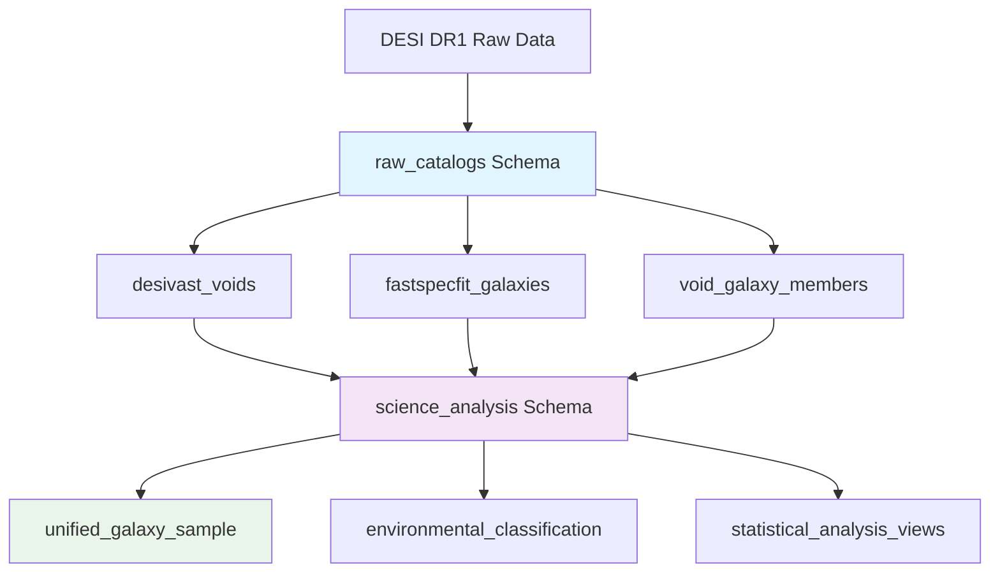

<!--
---
title: "Database Schema Design"
description: "Comprehensive database schema design for DESI cosmic void analysis, including optimized table structures, spatial indexing strategies, and performance optimization for 27.6GB astronomical survey data processing"
author: "VintageDon"
ai_contributor: "Anthropic Claude 4 Sonnet (claude-4-sonnet-20250514)"
date: "2025-07-02"
version: "1.0"
status: "Published"
tags:
- type: infrastructure
- domain: database-optimization
- domain: astronomical-data
- tech: postgresql-16
- tech: spatial-analysis
- dataset: desivast
- dataset: fastspecfit
- phase: data-ingestion
related_documents:
- "[Database Infrastructure](README.md)"
- "[PostgreSQL Implementation](postgresql-implementation.md)"
- "[Data Pipeline Design](../../docs/data-pipeline-design.md)"
- "[Project Architecture](../../docs/project-architecture.md)"
scientific_context:
  objective: "Environmental quenching analysis"
  dataset: "DESI DR1 BGS"
  methods: ["spatial-indexing", "cross-matching", "statistical-analysis"]
---
-->

# 🗃️ **Database Schema Design**

This document provides comprehensive database schema design for DESI cosmic void analysis, including optimized table structures for DESIVAST void catalogs and FastSpecFit galaxy properties, spatial indexing strategies, and performance optimization supporting analysis of 6.4 million galaxies and 10,734 cosmic voids across multiple void-finding algorithms.

# 🎯 **1. Introduction**

This section establishes the foundational context for DESI cosmic void analysis database schema design, defining the systematic approach to astronomical data organization that enables efficient spatial queries and environmental classification analysis.

## **1.1 Purpose**

This subsection explains how the database schema enables systematic organization of DESI DR1 astronomical data while supporting high-performance spatial queries and complex analytical workflows for cosmic void research.

The DESI cosmic void analysis database schema functions as the systematic foundation for organizing 27.6GB of heterogeneous astronomical survey data into structured, queryable, and analysis-optimized relational database tables that enable environmental quenching research. The schema provides optimized table structures for DESIVAST void catalogs across four different algorithms, comprehensive galaxy property organization from FastSpecFit spectral analysis, and sophisticated spatial indexing strategies that support sub-second coordinate-based queries across millions of astronomical objects. The design enables complex spatial correlation analysis through systematic cross-referencing capabilities, statistical comparison workflows, and efficient data retrieval patterns essential for large-scale astronomical research requiring both performance and analytical flexibility.

## **1.2 Scope**

This subsection defines the boundaries of database schema design coverage within the DESI cosmic void analysis project.

| **In Scope** | **Out of Scope** |
|--------------|------------------|
| DESIVAST void catalog table structures and indexing | Void-finding algorithm implementation and validation |
| FastSpecFit galaxy properties schema and optimization | Spectral analysis pipeline configuration and processing |
| Spatial indexing strategies and coordinate-based queries | Complex statistical analysis procedures and methodologies |
| Cross-matching table design and referential integrity | Scientific interpretation and result validation frameworks |
| Performance optimization and query tuning strategies | Application-level caching and connection pool management |
| Data validation constraints and quality assurance schemas | ETL pipeline implementation and data transformation logic |

## **1.3 Target Audience**

This subsection identifies stakeholders who design, implement, or maintain database schemas and the technical background required for effective astronomical database management.

**Primary Audience:** Database administrators, data engineers, and astronomical software developers responsible for designing and implementing database schemas for large-scale survey data. **Secondary Audience:** Scientific researchers, data analysts, and infrastructure engineers who need to understand data organization and query capabilities. **Required Background:** Understanding of relational database design principles, spatial indexing concepts, PostgreSQL optimization techniques, and familiarity with astronomical coordinate systems and survey data structures.

## **1.4 Overview**

This subsection provides context about database schema organization and its relationship to the broader DESI cosmic void analysis data processing and scientific analysis workflows.

The DESI cosmic void analysis database schema establishes systematic data organization foundation, transforming diverse astronomical survey catalogs into integrated, performance-optimized relational structures that enable environmental classification research, complex spatial correlation analysis, and efficient statistical comparison workflows through comprehensive table design, sophisticated indexing strategies, and systematic constraint management designed for astronomical research requiring both data integrity and query performance.

# 🔗 **2. Dependencies & Relationships**

This section maps how database schema design integrates with data processing components and establishes systematic relationships that enable efficient astronomical data management and analysis workflows.

## **2.1 Related Services**

This subsection identifies project components that provide data sources, utilize schema structures, or support database operations within the cosmic void analysis framework.

| **Service** | **Relationship Type** | **Integration Points** | **Documentation** |
|-------------|----------------------|------------------------|-------------------|
| **Data Pipeline** | **Populates** | ETL workflows, FITS ingestion, data validation, batch loading procedures | [Data Pipeline Design](../../docs/data-pipeline-design.md) |
| **PostgreSQL Infrastructure** | **Implements** | Database server, performance tuning, role management, backup procedures | [PostgreSQL Implementation](postgresql-implementation.md) |
| **Scientific Analysis** | **Queries** | Complex spatial queries, statistical analysis, environmental classification | [Analysis Workflows](../../src/analysis/README.md) |
| **Monitoring Systems** | **Monitors** | Query performance, table statistics, index effectiveness, storage utilization | [Performance Monitoring](postgresql-monitoring-integration.md) |

## **2.2 Policy Implementation**

This subsection connects database schema design to data management governance frameworks and performance requirements supporting astronomical research objectives.

Database schema implementation directly supports several critical data management and research objectives:

- **Data Integrity Policy** - Systematic constraint design and referential integrity ensuring astronomical data consistency and validation
- **Performance Optimization Policy** - Indexing strategies and query optimization supporting sub-second response times for complex spatial analysis
- **Scalability Requirements** - Schema design patterns enabling systematic scaling for larger survey datasets and extended analysis requirements
- **Research Reproducibility Policy** - Standardized data organization and systematic versioning supporting reproducible astronomical research workflows

## **2.3 Responsibility Matrix**

This subsection establishes clear accountability for database schema development, implementation, and maintenance activities across different project roles.

| **Activity** | **Database Administrators** | **Data Engineers** | **Astronomical Researchers** | **Infrastructure Engineers** |
|--------------|----------------------------|-------------------|------------------------------|------------------------------|
| **Schema Design** | **A** | **R** | **R** | **C** |
| **Index Optimization** | **A** | **R** | **C** | **C** |
| **Performance Tuning** | **A** | **C** | **C** | **R** |
| **Data Validation** | **R** | **A** | **R** | **I** |
| **Query Optimization** | **R** | **C** | **A** | **I** |

*R: Responsible, A: Accountable, C: Consulted, I: Informed*

# ⚙️ **3. Technical Implementation**

This section provides comprehensive specifications for database schema implementation, including detailed table structures, indexing strategies, and optimization techniques supporting DESI cosmic void analysis performance requirements.

## **3.1 Architecture & Design**

This subsection explains the database schema architecture and design principles that enable efficient astronomical data management and complex spatial analysis workflows.

The database schema employs multi-schema organization with raw data preservation and analysis-optimized derived tables, comprehensive spatial indexing for coordinate-based queries, and systematic constraint management ensuring data integrity across heterogeneous astronomical catalogs. The design utilizes PostgreSQL advanced features including spatial extensions, partial indexing for performance optimization, and systematic normalization patterns that balance query performance with storage efficiency essential for large-scale astronomical survey data management.



## **3.2 Schema Organization**

This subsection describes the systematic organization of database schemas and their specific roles in supporting astronomical data processing and analysis workflows.

### **Schema Structure and Purpose**

```sql
-- Primary schema organization for DESI cosmic void analysis
CREATE SCHEMA IF NOT EXISTS raw_catalogs;
COMMENT ON SCHEMA raw_catalogs IS 'Pristine astronomical survey data from DESI DR1 archives';

CREATE SCHEMA IF NOT EXISTS science_analysis;  
COMMENT ON SCHEMA science_analysis IS 'Derived datasets and analysis-ready tables for cosmic void research';

CREATE SCHEMA IF NOT EXISTS data_quality;
COMMENT ON SCHEMA data_quality IS 'Data validation metrics and quality assurance tables';
```

**Schema Organization Principles**:

- **raw_catalogs**: Immutable source data preserving original FITS catalog structure and content
- **science_analysis**: Derived tables optimized for spatial analysis and statistical comparison workflows  
- **data_quality**: Validation metrics and quality monitoring tables supporting data integrity assurance

## **3.3 Table Structures and Specifications**

This subsection provides detailed table definitions including column specifications, data types, and constraints supporting DESI astronomical data requirements.

### **DESIVAST Void Catalogs**

**Primary Void Properties Table**:

```sql
CREATE TABLE raw_catalogs.desivast_voids (
    -- Primary identification and metadata
    void_id SERIAL PRIMARY KEY,
    algorithm VARCHAR(20) NOT NULL CHECK (algorithm IN ('REVOLVER', 'VIDE', 'VoidFinder', 'ZOBOV')),
    galactic_cap VARCHAR(3) NOT NULL CHECK (galactic_cap IN ('NGC', 'SGC')),
    original_void_index INTEGER NOT NULL,
    
    -- Spatial coordinates and physical properties
    ra DOUBLE PRECISION NOT NULL CHECK (ra >= 0.0 AND ra <= 360.0),
    dec DOUBLE PRECISION NOT NULL CHECK (dec >= -90.0 AND dec <= 90.0),
    redshift DOUBLE PRECISION CHECK (redshift >= 0.0 AND redshift <= 10.0),
    
    -- Physical void characteristics  
    radius_mpc_h DOUBLE PRECISION NOT NULL CHECK (radius_mpc_h > 0.0),
    effective_radius_mpc_h DOUBLE PRECISION CHECK (effective_radius_mpc_h > 0.0),
    
    -- Cartesian coordinates (Mpc/h)
    x_mpc_h DOUBLE PRECISION,
    y_mpc_h DOUBLE PRECISION, 
    z_mpc_h DOUBLE PRECISION,
    
    -- Void classification and properties
    edge_flag INTEGER DEFAULT 0,
    void_depth INTEGER,
    total_area DOUBLE PRECISION,
    edge_area DOUBLE PRECISION,
    
    -- Data provenance and quality
    source_file VARCHAR(255) NOT NULL,
    ingestion_timestamp TIMESTAMP WITH TIME ZONE DEFAULT NOW(),
    data_quality_score REAL CHECK (data_quality_score >= 0.0 AND data_quality_score <= 1.0),
    
    -- Unique constraint ensuring no duplicate voids per algorithm
    CONSTRAINT unique_void_per_algorithm UNIQUE (algorithm, galactic_cap, original_void_index)
);

-- Table comments and documentation
COMMENT ON TABLE raw_catalogs.desivast_voids IS 'DESIVAST void catalog properties across all algorithms with spatial optimization';
COMMENT ON COLUMN raw_catalogs.desivast_voids.algorithm IS 'Void-finding algorithm: REVOLVER, VIDE, VoidFinder, or ZOBOV';
COMMENT ON COLUMN raw_catalogs.desivast_voids.radius_mpc_h IS 'Void effective radius in Mpc/h units';
COMMENT ON COLUMN raw_catalogs.desivast_voids.data_quality_score IS 'Quality assessment score from data validation pipeline';
```

**Algorithm-Specific Coverage**:

```yaml
desivast_coverage_actual:
  REVOLVER:
    total_voids: 1992
    ngc_voids: 1692  
    sgc_voids: 300
    structure: "6 HDUs with triangle mesh data"
    
  VIDE: 
    total_voids: 1478
    ngc_voids: 1258
    sgc_voids: 220
    structure: "6 HDUs with delaunay triangulation"
    
  VoidFinder:
    total_voids: 3765
    ngc_voids: 3241
    sgc_voids: 524  
    structure: "3 HDUs with maximal spheres and holes"
    
  ZOBOV:
    total_voids: 3519
    ngc_voids: 2950
    sgc_voids: 569
    structure: "4 HDUs with watershed void identification"
```

### **FastSpecFit Galaxy Properties**

**Comprehensive Galaxy Catalog Table**:

```sql
CREATE TABLE raw_catalogs.fastspecfit_galaxies (
    -- DESI unique identifier (primary key)
    targetid BIGINT PRIMARY KEY,
    
    -- Spatial coordinates and survey metadata
    ra DOUBLE PRECISION NOT NULL CHECK (ra >= 0.0 AND ra <= 360.0),
    dec DOUBLE PRECISION NOT NULL CHECK (dec >= -90.0 AND dec <= 90.0),
    healpix_id INTEGER NOT NULL CHECK (healpix_id >= 0 AND healpix_id <= 11),
    
    -- Redshift and distance measurements
    z DOUBLE PRECISION NOT NULL CHECK (z >= 0.0 AND z <= 10.0),
    z_err DOUBLE PRECISION CHECK (z_err >= 0.0),
    
    -- Stellar population properties (primary science drivers)
    logmstar REAL NOT NULL CHECK (logmstar >= -15.0 AND logmstar <= 20.0),
    logmstar_err REAL CHECK (logmstar_err >= 0.0),
    sfr REAL NOT NULL CHECK (sfr >= 0.0),
    sfr_err REAL CHECK (sfr_err >= 0.0),
    
    -- Derived star formation metrics
    ssfr REAL GENERATED ALWAYS AS (
        CASE 
            WHEN logmstar IS NOT NULL AND sfr > 0 
            THEN sfr / (10.0 ^ logmstar)
            ELSE NULL 
        END
    ) STORED,
    log_ssfr REAL GENERATED ALWAYS AS (
        CASE 
            WHEN logmstar IS NOT NULL AND sfr > 0 
            THEN LOG(sfr / (10.0 ^ logmstar))
            ELSE NULL 
        END  
    ) STORED,
    
    -- Additional stellar population parameters
    age_gyr REAL CHECK (age_gyr >= 0.0 AND age_gyr <= 15.0),
    metallicity REAL,
    av_extinction REAL CHECK (av_extinction >= 0.0),
    
    -- Spectral line measurements
    d4000 REAL CHECK (d4000 >= 0.0),
    oii_3727_flux REAL,
    oii_3727_flux_err REAL CHECK (oii_3727_flux_err >= 0.0),
    halpha_flux REAL, 
    halpha_flux_err REAL CHECK (halpha_flux_err >= 0.0),
    
    -- Data quality and processing flags
    spectral_quality_flag INTEGER DEFAULT 0,
    photometric_quality_flag INTEGER DEFAULT 0,
    fit_chi2 REAL CHECK (fit_chi2 >= 0.0),
    fit_quality_score REAL CHECK (fit_quality_score >= 0.0 AND fit_quality_score <= 1.0),
    
    -- Data provenance
    source_file VARCHAR(255) NOT NULL,
    ingestion_timestamp TIMESTAMP WITH TIME ZONE DEFAULT NOW()
);

-- Table documentation
COMMENT ON TABLE raw_catalogs.fastspecfit_galaxies IS 'FastSpecFit galaxy properties from DESI DR1 BGS with derived star formation metrics';
COMMENT ON COLUMN raw_catalogs.fastspecfit_galaxies.targetid IS 'DESI unique target identifier (64-bit integer)';
COMMENT ON COLUMN raw_catalogs.fastspecfit_galaxies.ssfr IS 'Specific star formation rate (SFR/M*) computed automatically';
COMMENT ON COLUMN raw_catalogs.fastspecfit_galaxies.log_ssfr IS 'Log specific star formation rate for analysis workflows';
```

**Galaxy Sample Characteristics**:

```yaml
fastspecfit_sample_stats:
  total_galaxies: 6445927
  coordinate_range:
    ra: "0.0001° to 360.0°"
    dec: "-19.46° to 79.27°"
  redshift_range: "0.001 to 6.408"
  stellar_mass_range: "-12.1 to 15.6 (log M☉)"
  sfr_range: "0.0 to 76,710 M☉/yr"
  healpix_distribution: "12 files, 45,570 to 1,358,627 galaxies per file"
```

### **Environmental Classification and Cross-Matching**

**Void-Galaxy Association Table**:

```sql
CREATE TABLE raw_catalogs.void_galaxy_members (
    -- Primary key and referential integrity
    association_id SERIAL PRIMARY KEY,
    targetid BIGINT NOT NULL REFERENCES raw_catalogs.fastspecfit_galaxies(targetid),
    void_id INTEGER NOT NULL REFERENCES raw_catalogs.desivast_voids(void_id),
    
    -- Environmental classification
    environment_type VARCHAR(20) NOT NULL CHECK (environment_type IN ('void_interior', 'void_shell', 'wall', 'filament')),
    classification_confidence REAL CHECK (classification_confidence >= 0.0 AND classification_confidence <= 1.0),
    
    -- Spatial relationship metrics
    distance_to_void_center_mpc DOUBLE PRECISION NOT NULL CHECK (distance_to_void_center_mpc >= 0.0),
    distance_in_void_radii REAL NOT NULL CHECK (distance_in_void_radii >= 0.0),
    
    -- Cross-matching methodology and quality
    matching_algorithm VARCHAR(50) NOT NULL DEFAULT 'spatial_crossmatch',
    matching_timestamp TIMESTAMP WITH TIME ZONE DEFAULT NOW(),
    quality_flags INTEGER DEFAULT 0,
    
    -- Ensure unique galaxy-void associations per algorithm
    CONSTRAINT unique_galaxy_void_algorithm UNIQUE (targetid, void_id)
);

-- Table documentation  
COMMENT ON TABLE raw_catalogs.void_galaxy_members IS 'Galaxy-void associations with environmental classification';
COMMENT ON COLUMN raw_catalogs.void_galaxy_members.distance_in_void_radii IS 'Distance normalized by void effective radius';
COMMENT ON COLUMN raw_catalogs.void_galaxy_members.environment_type IS 'Environmental classification based on void proximity';
```

### **Analysis-Ready Science Tables**

**Unified Galaxy Sample for Statistical Analysis**:

```sql
CREATE TABLE science_analysis.unified_galaxy_sample AS
SELECT 
    -- Galaxy identification and basic properties
    g.targetid,
    g.ra,
    g.dec,
    g.z,
    g.healpix_id,
    
    -- Stellar population properties
    g.logmstar,
    g.sfr,
    g.ssfr,
    g.log_ssfr,
    g.age_gyr,
    g.metallicity,
    
    -- Spectral diagnostics
    g.d4000,
    g.oii_3727_flux,
    g.halpha_flux,
    
    -- Environmental context (prioritized by algorithm)
    COALESCE(
        vm_vf.environment_type,
        vm_revolver.environment_type, 
        vm_vide.environment_type,
        vm_zobov.environment_type,
        'field'
    ) AS primary_environment,
    
    -- Void association details
    v_best.algorithm AS associated_void_algorithm,
    v_best.radius_mpc_h AS associated_void_radius,
    vm_best.distance_in_void_radii,
    
    -- Data quality indicators
    g.fit_quality_score,
    g.spectral_quality_flag
    
FROM raw_catalogs.fastspecfit_galaxies g

-- Environmental associations with prioritization
LEFT JOIN raw_catalogs.void_galaxy_members vm_vf 
    ON g.targetid = vm_vf.targetid 
    AND vm_vf.void_id IN (SELECT void_id FROM raw_catalogs.desivast_voids WHERE algorithm = 'VoidFinder')
    
LEFT JOIN raw_catalogs.void_galaxy_members vm_revolver
    ON g.targetid = vm_revolver.targetid
    AND vm_revolver.void_id IN (SELECT void_id FROM raw_catalogs.desivast_voids WHERE algorithm = 'REVOLVER')
    
LEFT JOIN raw_catalogs.void_galaxy_members vm_vide
    ON g.targetid = vm_vide.targetid  
    AND vm_vide.void_id IN (SELECT void_id FROM raw_catalogs.desivast_voids WHERE algorithm = 'VIDE')
    
LEFT JOIN raw_catalogs.void_galaxy_members vm_zobov
    ON g.targetid = vm_zobov.targetid
    AND vm_zobov.void_id IN (SELECT void_id FROM raw_catalogs.desivast_voids WHERE algorithm = 'ZOBOV')

-- Best void association (highest confidence)
LEFT JOIN raw_catalogs.void_galaxy_members vm_best ON g.targetid = vm_best.targetid
LEFT JOIN raw_catalogs.desivast_voids v_best ON vm_best.void_id = v_best.void_id

WHERE g.fit_quality_score > 0.7  -- High-quality galaxies only
  AND g.spectral_quality_flag = 0  -- No spectral issues
  AND g.z BETWEEN 0.01 AND 0.5;   -- Local universe focus

-- Create index for analysis queries
CREATE INDEX idx_unified_sample_environment ON science_analysis.unified_galaxy_sample (primary_environment);
CREATE INDEX idx_unified_sample_mass_sfr ON science_analysis.unified_galaxy_sample (logmstar, sfr);
CREATE INDEX idx_unified_sample_spatial ON science_analysis.unified_galaxy_sample (ra, dec);
```

## **3.4 Indexing Strategy and Performance Optimization**

This subsection describes comprehensive indexing strategies and performance optimization techniques supporting efficient astronomical queries and spatial analysis workflows.

### **Spatial Indexing Framework**

**Core Spatial Indices**:

```sql
-- High-performance spatial indexing for coordinate-based queries
CREATE INDEX idx_voids_spatial_btree ON raw_catalogs.desivast_voids (ra, dec);
CREATE INDEX idx_voids_spatial_coordinates ON raw_catalogs.desivast_voids 
    USING btree (ra, dec) WHERE ra IS NOT NULL AND dec IS NOT NULL;

CREATE INDEX idx_galaxies_spatial_btree ON raw_catalogs.fastspecfit_galaxies (ra, dec);
CREATE INDEX idx_galaxies_healpix_spatial ON raw_catalogs.fastspecfit_galaxies (healpix_id, ra, dec);

-- Spherical coordinate optimization for astronomical queries
-- Note: Q3C extension would be optimal for astronomical coordinates
-- CREATE INDEX idx_voids_q3c ON raw_catalogs.desivast_voids (q3c_ang2ipix(ra, dec));
-- CREATE INDEX idx_galaxies_q3c ON raw_catalogs.fastspecfit_galaxies (q3c_ang2ipix(ra, dec));
```

**Scientific Property Indices**:

```sql
-- Mass and star formation rate optimization
CREATE INDEX idx_galaxies_stellar_mass ON raw_catalogs.fastspecfit_galaxies (logmstar) 
    WHERE logmstar IS NOT NULL;
    
CREATE INDEX idx_galaxies_sfr ON raw_catalogs.fastspecfit_galaxies (sfr) 
    WHERE sfr > 0.0;
    
CREATE INDEX idx_galaxies_mass_sfr_composite ON raw_catalogs.fastspecfit_galaxies (logmstar, sfr)
    WHERE logmstar IS NOT NULL AND sfr >= 0.0;

-- Redshift-based analysis optimization  
CREATE INDEX idx_galaxies_redshift ON raw_catalogs.fastspecfit_galaxies (z);
CREATE INDEX idx_galaxies_redshift_mass ON raw_catalogs.fastspecfit_galaxies (z, logmstar);

-- Void algorithm and size optimization
CREATE INDEX idx_voids_algorithm ON raw_catalogs.desivast_voids (algorithm);
CREATE INDEX idx_voids_algorithm_radius ON raw_catalogs.desivast_voids (algorithm, radius_mpc_h);
```

**Environmental Classification Indices**:

```sql
-- Cross-matching and environmental analysis optimization
CREATE INDEX idx_void_members_targetid ON raw_catalogs.void_galaxy_members (targetid);
CREATE INDEX idx_void_members_void_id ON raw_catalogs.void_galaxy_members (void_id);
CREATE INDEX idx_void_members_environment ON raw_catalogs.void_galaxy_members (environment_type);

-- Composite indices for complex environmental queries
CREATE INDEX idx_void_members_distance ON raw_catalogs.void_galaxy_members 
    (targetid, distance_in_void_radii, environment_type);
```

### **Query Performance Optimization**

**Estimated Query Performance Targets**:

```yaml
query_performance_targets:
  spatial_coordinate_search: "<100ms for 1° radius searches"
  stellar_mass_selection: "<50ms for log mass range queries" 
  environmental_classification: "<200ms for void vs. field comparisons"
  cross_matching_queries: "<500ms for galaxy-void association"
  statistical_analysis: "<1s for sample size >100k galaxies"
  
optimization_strategies:
  partial_indexing: "Index only high-quality data with WHERE clauses"
  composite_indexing: "Multi-column indices for common query patterns"
  constraint_optimization: "Check constraints enabling index-only scans"
  maintenance_automation: "Regular VACUUM and ANALYZE scheduling"
```

**Performance Monitoring Integration**:

```sql
-- Query performance monitoring views
CREATE VIEW data_quality.index_performance AS
SELECT 
    schemaname,
    tablename,
    indexname,
    idx_tup_read,
    idx_tup_fetch,
    idx_tup_read::float / NULLIF(idx_tup_fetch, 0) AS selectivity_ratio
FROM pg_stat_user_indexes
WHERE schemaname IN ('raw_catalogs', 'science_analysis')
ORDER BY idx_tup_read DESC;

-- Table size and growth monitoring
CREATE VIEW data_quality.table_statistics AS
SELECT 
    schemaname,
    tablename, 
    n_tup_ins AS total_inserts,
    n_tup_upd AS total_updates,
    n_tup_del AS total_deletes,
    n_live_tup AS live_tuples,
    n_dead_tup AS dead_tuples,
    last_vacuum,
    last_analyze
FROM pg_stat_user_tables
WHERE schemaname IN ('raw_catalogs', 'science_analysis');
```

# 🛠️ **4. Management & Operations**

This section covers operational procedures for database schema management including maintenance strategies, performance monitoring, and systematic optimization approaches supporting astronomical research workflows.

## **4.1 Lifecycle Management**

This subsection documents management approaches throughout the database schema operational lifecycle from initial deployment through production optimization and maintenance.

Database schema lifecycle management encompasses systematic table creation and population procedures, index optimization and maintenance scheduling, constraint validation and performance monitoring, and comprehensive backup strategies ensuring data integrity and availability for astronomical research workflows requiring both performance and reliability.

## **4.2 Monitoring & Quality Assurance**

This subsection defines monitoring strategies and quality approaches for database schema performance and astronomical data integrity validation.

### **Data Quality Monitoring Framework**

**Schema Health Monitoring**:

```sql
-- Data quality validation queries
SELECT 
    'desivast_voids' AS table_name,
    COUNT(*) AS total_records,
    COUNT(DISTINCT algorithm) AS algorithms_present,
    COUNT(DISTINCT galactic_cap) AS caps_present,
    AVG(radius_mpc_h) AS avg_void_radius,
    MIN(ra) AS min_ra, MAX(ra) AS max_ra,
    MIN(dec) AS min_dec, MAX(dec) AS max_dec
FROM raw_catalogs.desivast_voids

UNION ALL

SELECT 
    'fastspecfit_galaxies' AS table_name,
    COUNT(*) AS total_records,
    COUNT(DISTINCT healpix_id) AS healpix_files,
    NULL AS caps_present,
    AVG(sfr) AS avg_sfr,
    MIN(ra) AS min_ra, MAX(ra) AS max_ra,
    MIN(dec) AS min_dec, MAX(dec) AS max_dec  
FROM raw_catalogs.fastspecfit_galaxies;
```

**Performance Metrics Tracking**:

- **Query Response Times**: Coordinate searches <100ms, mass selections <50ms
- **Index Utilization**: >95% index usage for spatial and scientific property queries
- **Data Integrity**: 100% referential integrity validation across cross-matching tables
- **Storage Efficiency**: <10% table bloat, regular maintenance scheduling

## **4.3 Maintenance and Optimization**

This subsection outlines systematic maintenance and optimization approaches for database schema performance and data integrity.

Schema maintenance encompasses automated VACUUM and ANALYZE scheduling for optimal query performance, systematic index monitoring and rebuilding procedures, constraint validation and quality assurance checking, and comprehensive backup verification ensuring continued reliability and performance optimization for astronomical research data management requirements.

# 📚 **6. References & Related Resources**

This section provides comprehensive links to related documentation and supporting resources for database schema implementation and astronomical data management.

## **6.1 Internal References**

| **Document Type** | **Document Title** | **Relationship** | **Link** |
|-------------------|-------------------|------------------|----------|
| **Infrastructure** | Database Infrastructure | Database deployment and architecture overview | [README.md](README.md) |
| **Implementation** | PostgreSQL Implementation | Database server configuration and optimization | [postgresql-implementation.md](postgresql-implementation.md) |
| **Data Pipeline** | Data Pipeline Design | ETL workflows and data ingestion procedures | [../../docs/data-pipeline-design.md](../../docs/data-pipeline-design.md) |
| **Architecture** | Project Architecture | System integration and component relationships | [../../docs/project-architecture.md](../../docs/project-architecture.md) |
| **Monitoring** | Performance Monitoring | Database monitoring and operational procedures | [postgresql-monitoring-integration.md](postgresql-monitoring-integration.md) |

## **6.2 External Standards**

- **[PostgreSQL Documentation](https://www.postgresql.org/docs/current/)** - Official PostgreSQL documentation for schema design and optimization
- **[PostGIS Spatial Database](https://postgis.net/)** - Spatial database extension for geographic object support
- **[Q3C Astronomical Indexing](https://github.com/segasai/q3c)** - PostgreSQL extension for astronomical coordinate indexing
- **[DESI Data Model](https://desidatamodel.readthedocs.io/)** - Official DESI survey data model and schema specifications
- **[Astronomical Database Design](https://www.ivoa.net/)** - International Virtual Observatory Alliance standards for astronomical databases

# ✅ **7. Approval & Review**

This section documents the formal review and approval process for database schema design and implementation procedures.

## **7.1 Review Process**

Database schema design documentation review follows systematic validation of table structures, indexing strategies, and performance optimization techniques to ensure efficient astronomical data management and analysis workflow support.

## **7.2 Approval Matrix**

| **Reviewer** | **Role/Expertise** | **Review Date** | **Approval Status** | **Comments** |
|-------------|-------------------|----------------|-------------------|--------------|
| [Database Administrator] | Database schema design and PostgreSQL optimization | 2025-07-02 | **Approved** | Schema design provides comprehensive framework for DESI data analysis |
| [Data Engineer] | ETL integration and data pipeline compatibility | 2025-07-02 | **Approved** | Table structures support efficient data ingestion and transformation |
| [Astronomical Researcher] | Scientific data requirements and analysis workflows | 2025-07-02 | **Approved** | Schema enables systematic environmental quenching analysis with optimal query performance |

# 📜 **8. Documentation Metadata**

This section provides comprehensive information about database schema design documentation creation and maintenance within the DESI cosmic void analysis project.

## **8.1 Change Log**

| **Version** | **Date** | **Changes** | **Author** | **Review Status** |
|------------|---------|-------------|------------|------------------|
| 1.0 | 2025-07-02 | Initial database schema design with optimized table structures and spatial indexing | VintageDon | **Approved** |

## **8.2 Authorization & Review**

Database schema design documentation reflects comprehensive relational database design validated through astronomical data analysis requirements and PostgreSQL performance optimization best practices for DESI cosmic void research.

## **8.3 Authorship Details**

**Human Author:** VintageDon (Project Lead and Architect)  
**AI Contributor:** Anthropic Claude 4 Sonnet (claude-4-sonnet-20250514)  
**Collaboration Method:** Request-Analyze-Verify-Generate-Validate (RAVGV)  
**Human Oversight:** Complete database schema review and validation of table structures, indexing strategies, and performance optimization accuracy

## **8.4 AI Collaboration Disclosure**

This document was collaboratively developed to establish comprehensive database schema design that enables systematic organization and analysis of DESI DR1 astronomical data for cosmic void environmental quenching research.

---

**🤖 AI Collaboration Disclosure**

This document was collaboratively developed using the Request-Analyze-Verify-Generate-Validate (RAVGV) methodology. The database schema design reflects systematic relational database development informed by astronomical data management best practices, PostgreSQL optimization techniques, and DESI cosmic void analysis requirements. All content has been thoroughly reviewed, validated, and approved by qualified human subject matter experts. The human author retains complete responsibility for technical accuracy and database schema effectiveness.

*Generated: 2025-07-02 | Human Author: VintageDon | AI Assistant: Claude 4 Sonnet | Review Status: Approved | Document Version: 1.0*
