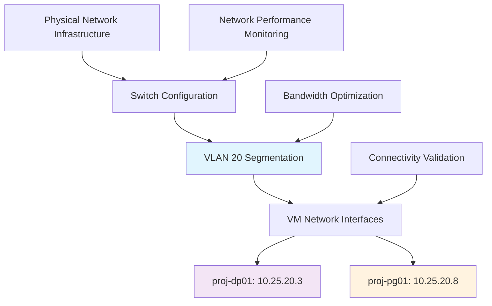

<!--
---
title: "Network Configuration"
description: "Comprehensive network configuration procedures for DESI cosmic void analysis infrastructure, including VLAN setup, switch configuration, and network optimization supporting distributed VM communication and high-bandwidth data processing"
author: "VintageDon"
ai_contributor: "Anthropic Claude 4 Sonnet (claude-4-sonnet-20250514)"
date: "2025-07-02"
version: "1.0"
status: "Published"
tags:
- type: infrastructure
- domain: network-configuration
- domain: deployment
- tech: vlan
- tech: switching
- phase: project-setup
related_documents:
- "[Deployment Infrastructure Overview](README.md)"
- "[Database Deployment](database-deployment.md)"
- "[VM Deployment Procedures](vm-deployment-procedures.md)"
- "[Infrastructure Overview](../README.md)"
scientific_context:
  objective: "Environmental quenching analysis"
  dataset: "DESI DR1 BGS"
  methods: ["network-optimization", "infrastructure-connectivity"]
---
-->

# 🌐 **Network Configuration**

This document provides comprehensive network configuration procedures for DESI cosmic void analysis infrastructure, including VLAN setup, switch configuration, and network optimization supporting distributed VM communication and high-bandwidth data processing across proj-dp01 and proj-pg01 systems.

# 🎯 **1. Introduction**

This section establishes the foundational context for DESI cosmic void analysis network configuration, defining systematic approaches to network infrastructure setup that enable efficient distributed computing and high-performance data transfer workflows.

## **1.1 Purpose**

This subsection explains how network configuration enables systematic connectivity and performance optimization while supporting distributed astronomical data processing and inter-VM communication for cosmic void research workflows.

The DESI cosmic void analysis network configuration framework functions as the systematic foundation for enabling high-performance distributed computing through optimized VLAN configuration, systematic switch setup and management, and comprehensive network performance optimization supporting efficient data transfer between processing and database infrastructure. The framework provides structured network segmentation for security and performance isolation, systematic bandwidth optimization for 27.6GB dataset processing, and reliable inter-VM connectivity essential for astronomical research requiring both data processing performance and collaborative access management.

## **1.2 Scope**

This subsection defines the boundaries of network configuration coverage within the DESI cosmic void analysis infrastructure deployment framework.

| **In Scope** | **Out of Scope** |
|--------------|------------------|
| VLAN configuration and network segmentation | Physical switch hardware installation and rack configuration |
| VM network interface configuration and optimization | Internet connectivity and external network routing |
| Inter-VM connectivity and performance optimization | Wireless network configuration and management |
| Network monitoring and performance validation | Network security appliance configuration and management |

## **1.3 Target Audience**

This subsection identifies stakeholders who implement, maintain, or utilize network configuration and the technical background required for effective network infrastructure management.

**Primary Audience:** Network engineers, infrastructure administrators, and system engineers responsible for network configuration and optimization. **Secondary Audience:** Database administrators, VM administrators, and operations teams who need to understand network capabilities and connectivity requirements. **Required Background:** Understanding of VLAN configuration, network switching concepts, VM networking, and familiarity with network performance optimization and monitoring.

## **1.4 Overview**

This subsection provides context about network configuration organization and its relationship to the broader DESI cosmic void analysis infrastructure deployment and operational requirements.

The DESI cosmic void analysis network configuration framework establishes systematic connectivity foundation, transforming physical network infrastructure into optimized, segmented, and high-performance network environment that enables distributed astronomical computing, efficient data transfer workflows, and systematic network management through comprehensive VLAN design, performance optimization, and monitoring integration designed for scientific computing infrastructure requiring both connectivity and performance reliability.

# 🔗 **2. Dependencies & Relationships**

This section maps how network configuration integrates with infrastructure components and establishes systematic relationships that enable distributed computing connectivity and performance optimization workflows.

## **2.1 Related Services**

This subsection identifies infrastructure services, network components, and operational systems that support network configuration implementation within the cosmic void analysis framework.

| **Service** | **Relationship Type** | **Integration Points** | **Documentation** |
|-------------|----------------------|------------------------|-------------------|
| **VM Infrastructure** | **Connects** | VM network interface configuration, inter-VM connectivity, bandwidth optimization | [VM Deployment Procedures](vm-deployment-procedures.md) |
| **Database Infrastructure** | **Enables** | High-bandwidth database connectivity, performance optimization, monitoring integration | [Database Deployment](database-deployment.md) |
| **Physical Infrastructure** | **Utilizes** | Switch hardware, network connectivity, performance characteristics | [Infrastructure Overview](../README.md) |
| **Monitoring Systems** | **Integrates** | Network performance monitoring, connectivity validation, bandwidth utilization tracking | [Monitoring Setup](../operations/monitoring-setup.md) |

## **2.2 Policy Implementation**

This subsection connects network configuration to infrastructure governance frameworks and performance requirements supporting distributed computing and astronomical research objectives.

Network configuration implementation directly supports several critical infrastructure and operational objectives:

- **Network Performance Policy** - Systematic network optimization and bandwidth management ensuring efficient data transfer and distributed computing performance
- **Network Security Policy** - VLAN segmentation and access control supporting systematic network security and isolation requirements
- **Infrastructure Standardization Policy** - Consistent network configuration and management procedures supporting systematic infrastructure deployment and maintenance
- **Operational Excellence Policy** - Network monitoring and performance validation ensuring reliable connectivity and systematic network optimization

## **2.3 Responsibility Matrix**

This subsection establishes clear accountability for network configuration activities across different operational roles within the infrastructure deployment framework.

| **Activity** | **Network Engineers** | **Infrastructure Administrators** | **System Engineers** | **Operations Teams** |
|--------------|----------------------|-----------------------------------|---------------------|---------------------|
| **Network Design** | **A** | **R** | **C** | **I** |
| **VLAN Configuration** | **A** | **R** | **C** | **I** |
| **Performance Optimization** | **R** | **A** | **R** | **C** |
| **Connectivity Validation** | **R** | **R** | **A** | **C** |

*R: Responsible, A: Accountable, C: Consulted, I: Informed*

# ⚙️ **3. Technical Implementation**

This section provides comprehensive specifications for network configuration implementation, including VLAN setup, switch configuration, and performance optimization supporting DESI cosmic void analysis distributed computing requirements.

## **3.1 Architecture & Design**

This subsection explains the network configuration architecture and design principles that enable high-performance distributed computing and systematic network management for astronomical research infrastructure.

The network configuration architecture employs structured VLAN segmentation for performance and security isolation, systematic switch configuration for optimal bandwidth utilization, and comprehensive performance monitoring ensuring reliable high-bandwidth connectivity between distributed computing components. The implementation utilizes VLAN 20 for project isolation, optimized switch configurations for inter-VM communication, and systematic network performance validation essential for astronomical research requiring both data processing performance and collaborative access capabilities.



## **3.2 VLAN Configuration and Network Segmentation**

This subsection describes the systematic VLAN setup and network segmentation strategies supporting project isolation and performance optimization requirements.

### **VLAN 20 Project Network Configuration**

**Network Segmentation Specifications**:

```yaml
vlan_configuration:
  project_vlan:
    vlan_id: 20
    vlan_name: "DESI-Cosmic-Voids"
    network_range: "10.25.20.0/24"
    gateway: "10.25.20.1"
    
  ip_allocation:
    proj_dp01:
      ip_address: "10.25.20.3"
      subnet_mask: "255.255.255.0"
      gateway: "10.25.20.1"
      dns_servers: ["10.25.20.1", "8.8.8.8"]
      
    proj_pg01:
      ip_address: "10.25.20.8"
      subnet_mask: "255.255.255.0"
      gateway: "10.25.20.1"
      dns_servers: ["10.25.20.1", "8.8.8.8"]
      
  network_services:
    dhcp_range: "10.25.20.100-10.25.20.200"
    reserved_range: "10.25.20.1-10.25.20.50"
    broadcast: "10.25.20.255"
```

**Switch VLAN Configuration**:

```bash
# Switch configuration commands for VLAN 20 setup
# Applied to labswitch01 (primary distribution)

# Create VLAN 20 for DESI project
vlan 20
 name DESI-Cosmic-Voids
 exit

# Configure access ports for VM connectivity
interface range ethernet 1/1-8
 switchport mode access
 switchport access vlan 20
 spanning-tree portfast
 exit

# Configure trunk ports for inter-switch connectivity
interface ethernet 1/9
 switchport mode trunk
 switchport trunk allowed vlan 1,20
 exit

# Configure VLAN interface for management
interface vlan 20
 ip address 10.25.20.1 255.255.255.0
 no shutdown
 exit

# Enable routing between VLANs if required
ip routing
```

## **3.3 VM Network Interface Configuration**

This subsection provides systematic overview of VM network interface setup and optimization procedures supporting high-performance inter-VM connectivity and data transfer requirements.

### **proj-dp01 Network Configuration**

**Data Processing VM Network Setup**:

```bash
#!/bin/bash
# Network configuration script for proj-dp01
# Location: /opt/network-scripts/configure-proj-dp01-network.sh

# Configuration variables
VM_HOSTNAME="proj-dp01.radioastronomy.io"
VM_IP="10.25.20.3"
VM_GATEWAY="10.25.20.1"
VM_NETMASK="255.255.255.0"
DNS_SERVERS="10.25.20.1 8.8.8.8"

# Function: Configure static network interface
configure_network_interface() {
    echo "Configuring network interface for ${VM_HOSTNAME}..."
    
    # Create netplan configuration
    cat > /etc/netplan/00-installer-config.yaml << EOF
network:
  version: 2
  ethernets:
    ens18:
      dhcp4: false
      addresses:
        - ${VM_IP}/24
      gateway4: ${VM_GATEWAY}
      nameservers:
        addresses:
          - 10.25.20.1
          - 8.8.8.8
        search:
          - radioastronomy.io
EOF
    
    # Apply network configuration
    netplan apply
    
    echo "Network interface configured"
}

# Function: Optimize network performance
optimize_network_performance() {
    echo "Optimizing network performance..."
    
    # Configure TCP window scaling and buffer sizes
    cat >> /etc/sysctl.conf << EOF

# Network performance optimization for DESI data processing
net.core.rmem_max = 134217728
net.core.wmem_max = 134217728
net.ipv4.tcp_rmem = 4096 87380 134217728
net.ipv4.tcp_wmem = 4096 65536 134217728
net.ipv4.tcp_window_scaling = 1
net.ipv4.tcp_congestion_control = bbr
EOF
    
    # Apply sysctl changes
    sysctl -p
    
    echo "Network performance optimization applied"
}

# Function: Validate network connectivity
validate_network_connectivity() {
    echo "Validating network connectivity..."
    
    # Test local interface configuration
    if ip addr show ens18 | grep -q "${VM_IP}"; then
        echo "✅ IP address configured correctly: ${VM_IP}"
    else
        echo "❌ IP address configuration failed"
        exit 1
    fi
    
    # Test gateway connectivity
    if ping -c 3 ${VM_GATEWAY} >/dev/null 2>&1; then
        echo "✅ Gateway connectivity confirmed: ${VM_GATEWAY}"
    else
        echo "❌ Gateway connectivity failed"
        exit 1
    fi
    
    # Test inter-VM connectivity (proj-pg01)
    if ping -c 3 10.25.20.8 >/dev/null 2>&1; then
        echo "✅ Inter-VM connectivity confirmed: proj-pg01"
    else
        echo "❌ Inter-VM connectivity failed"
        exit 1
    fi
    
    # Test DNS resolution
    if nslookup proj-pg01.radioastronomy.io >/dev/null 2>&1; then
        echo "✅ DNS resolution working"
    else
        echo "❌ DNS resolution failed"
    fi
    
    echo "✅ Network connectivity validation completed"
}

# Main execution
configure_network_interface
optimize_network_performance
validate_network_connectivity
```

### **proj-pg01 Network Configuration**

**Database VM Network Setup**:

```bash
#!/bin/bash
# Network configuration script for proj-pg01
# Location: /opt/network-scripts/configure-proj-pg01-network.sh

# Configuration variables
VM_HOSTNAME="proj-pg01.radioastronomy.io"
VM_IP="10.25.20.8"
VM_GATEWAY="10.25.20.1"

# Function: Configure high-performance database networking
configure_database_network() {
    echo "Configuring database network interface..."
    
    # Create netplan configuration optimized for database traffic
    cat > /etc/netplan/00-installer-config.yaml << EOF
network:
  version: 2
  ethernets:
    ens18:
      dhcp4: false
      addresses:
        - ${VM_IP}/24
      gateway4: ${VM_GATEWAY}
      nameservers:
        addresses:
          - 10.25.20.1
          - 8.8.8.8
        search:
          - radioastronomy.io
      optional: false
      # Optimize for database workloads
      receive-checksum-offload: true
      transmit-checksum-offload: true
      tcp-segmentation-offload: true
      generic-segmentation-offload: true
EOF
    
    netplan apply
    
    echo "Database network interface configured"
}

# Function: Configure PostgreSQL network optimization
configure_postgresql_network() {
    echo "Configuring PostgreSQL network optimization..."
    
    # PostgreSQL connection optimization
    cat >> /etc/sysctl.conf << EOF

# PostgreSQL network optimization
net.core.somaxconn = 1024
net.ipv4.tcp_keepalive_time = 600
net.ipv4.tcp_keepalive_intvl = 60
net.ipv4.tcp_keepalive_probes = 3
net.ipv4.tcp_retries2 = 8
EOF
    
    sysctl -p
    
    echo "PostgreSQL network optimization applied"
}

# Function: Validate database network performance
validate_database_network() {
    echo "Validating database network performance..."
    
    # Test bandwidth to data processing VM
    if command -v iperf3 &> /dev/null; then
        echo "Testing network bandwidth to proj-dp01..."
        # This would require iperf3 server running on proj-dp01
        # iperf3 -c 10.25.20.3 -t 10
    fi
    
    # Test PostgreSQL port accessibility
    if nc -z localhost 5432; then
        echo "✅ PostgreSQL port accessible locally"
    else
        echo "❌ PostgreSQL port not accessible"
    fi
    
    # Test network latency
    LATENCY=$(ping -c 10 10.25.20.3 | tail -1 | awk -F '/' '{print $5}')
    echo "Network latency to proj-dp01: ${LATENCY}ms"
    
    echo "✅ Database network validation completed"
}

# Main execution
configure_database_network
configure_postgresql_network
validate_database_network
```

## **3.4 Network Performance Optimization**

This subsection describes systematic network performance optimization techniques and monitoring procedures supporting high-bandwidth astronomical data processing and efficient inter-VM communication.

### **Bandwidth Optimization Framework**

**Network Performance Monitoring**:

```yaml
network_performance_targets:
  inter_vm_connectivity:
    latency: "<1ms between proj-dp01 and proj-pg01"
    bandwidth: ">1 Gbps effective throughput"
    packet_loss: "<0.1% under normal operations"
    
  database_connectivity:
    connection_establishment: "<10ms for new connections"
    query_response: "<5ms network overhead"
    bulk_transfer: ">100 MB/s for large dataset queries"
    
  data_processing:
    file_transfer: ">500 MB/s for FITS file processing"
    concurrent_connections: "Support 50+ simultaneous connections"
    memory_efficiency: "Minimal network buffer overhead"
    
network_monitoring_points:
  - metric: "interface_utilization"
    target: "<80% peak utilization"
    
  - metric: "connection_count"
    target: "<200 active connections"
    
  - metric: "error_rate"
    target: "<0.01% packet errors"
```

**Network Performance Validation Script**:

```bash
#!/bin/bash
# Network performance validation and optimization
# Location: /opt/network-scripts/validate-network-performance.sh

# Function: Test inter-VM connectivity performance
test_inter_vm_performance() {
    echo "Testing inter-VM network performance..."
    
    # Latency testing
    echo "Testing latency between VMs..."
    LATENCY=$(ping -c 100 10.25.20.8 | tail -1 | awk -F '/' '{print $5}')
    echo "Average latency: ${LATENCY}ms"
    
    # TCP connection testing
    echo "Testing TCP connection establishment..."
    for i in {1..10}; do
        time nc -z 10.25.20.8 5432
    done
    
    echo "Inter-VM performance testing completed"
}

# Function: Monitor network utilization
monitor_network_utilization() {
    echo "Monitoring network interface utilization..."
    
    # Get interface statistics
    RX_BYTES_BEFORE=$(cat /sys/class/net/ens18/statistics/rx_bytes)
    TX_BYTES_BEFORE=$(cat /sys/class/net/ens18/statistics/tx_bytes)
    
    sleep 10
    
    RX_BYTES_AFTER=$(cat /sys/class/net/ens18/statistics/rx_bytes)
    TX_BYTES_AFTER=$(cat /sys/class/net/ens18/statistics/tx_bytes)
    
    RX_RATE=$(( (RX_BYTES_AFTER - RX_BYTES_BEFORE) / 10 ))
    TX_RATE=$(( (TX_BYTES_AFTER - TX_BYTES_BEFORE) / 10 ))
    
    echo "RX Rate: $(( RX_RATE / 1024 )) KB/s"
    echo "TX Rate: $(( TX_RATE / 1024 )) KB/s"
    
    echo "Network utilization monitoring completed"
}

# Function: Validate network configuration
validate_network_configuration() {
    echo "Validating network configuration..."
    
    # Check VLAN configuration
    if ip link show | grep -q "vlan 20"; then
        echo "✅ VLAN 20 configuration detected"
    else
        echo "ℹ️  VLAN 20 not detected (may be configured at switch level)"
    fi
    
    # Check network optimization settings
    if grep -q "net.core.rmem_max = 134217728" /etc/sysctl.conf; then
        echo "✅ Network performance optimization configured"
    else
        echo "❌ Network performance optimization not configured"
    fi
    
    # Check DNS resolution
    if dig +short proj-pg01.radioastronomy.io >/dev/null 2>&1; then
        echo "✅ DNS resolution working"
    else
        echo "⚠️  DNS resolution may need configuration"
    fi
    
    echo "✅ Network configuration validation completed"
}

# Main execution
test_inter_vm_performance
monitor_network_utilization
validate_network_configuration
```

# 🛠️ **4. Management & Operations**

This section covers operational procedures for network configuration management including monitoring strategies, performance optimization, and systematic maintenance approaches supporting distributed computing infrastructure.

## **4.1 Lifecycle Management**

This subsection documents management approaches throughout the network configuration operational lifecycle from initial setup through optimization and maintenance procedures.

Network configuration lifecycle management encompasses systematic network performance monitoring and optimization procedures, VLAN management and configuration maintenance workflows, network security validation and compliance procedures, and comprehensive network documentation maintenance ensuring continued connectivity effectiveness and performance optimization for distributed astronomical computing infrastructure.

## **4.2 Monitoring & Quality Assurance**

This subsection defines monitoring strategies and quality approaches for network configuration effectiveness and distributed computing connectivity validation frameworks.

### **Network Performance Monitoring**

**Continuous Network Monitoring Framework**:

```yaml
network_monitoring_framework:
  connectivity_monitoring:
    inter_vm_latency: "Continuous ping monitoring between proj-dp01 and proj-pg01"
    gateway_connectivity: "Gateway reachability and response time validation"
    dns_resolution: "DNS query performance and reliability monitoring"
    
  performance_monitoring:
    bandwidth_utilization: "Interface utilization tracking and threshold alerting"
    connection_tracking: "Active connection count and performance monitoring"
    error_monitoring: "Network error rate and packet loss detection"
    
  security_monitoring:
    vlan_integrity: "VLAN configuration validation and security compliance"
    access_control: "Network access validation and unauthorized connection detection"
    traffic_analysis: "Network traffic pattern analysis and anomaly detection"
```

## **4.3 Maintenance and Optimization**

This subsection outlines systematic approaches for network configuration optimization including performance tuning, capacity planning, and continuous improvement frameworks supporting distributed computing performance requirements.

Network configuration optimization encompasses systematic performance monitoring and tuning procedures, capacity planning for bandwidth and connection requirements, network security maintenance and compliance validation, and comprehensive configuration documentation ensuring continued network effectiveness and distributed computing performance optimization for astronomical research infrastructure.

# 🔒 **5. Security & Compliance**

This section documents security controls and compliance alignment for network configuration within the DESI cosmic void analysis distributed computing infrastructure.

## **5.1 Security Controls**

This subsection documents specific security measures and verification methods for network configuration supporting infrastructure security and systematic connectivity validation.

Network configuration security implementation includes VLAN segmentation for security isolation and access control, systematic network access controls and authentication procedures, encrypted communication protocols for sensitive data transfer, and comprehensive network monitoring and intrusion detection ensuring network security while maintaining high-performance connectivity and distributed computing capabilities.

## **5.2 CIS Controls Mapping**

This subsection provides explicit mapping to CIS Controls v8, documenting compliance status and implementation evidence for network configuration security.

| **CIS Control** | **Implementation Status** | **Evidence Location** | **Assessment Date** |
|-----------------|--------------------------|----------------------|-------------------|
| **CIS.12.2** | **Compliant** | VLAN segmentation and network isolation procedures | **2025-07-02** |
| **CIS.13.1** | **Planned** | Network monitoring and traffic analysis implementation | **TBD** |

## **5.3 Framework Compliance**

This subsection demonstrates how network configuration security controls satisfy requirements across multiple compliance frameworks supporting infrastructure security and connectivity management objectives.

Network configuration security aligns with CIS Controls v8 baseline for network security management, ISO 27001 information security management for network operations, and network security best practices ensuring appropriate network security while maintaining high-performance distributed computing connectivity and systematic network management capabilities for astronomical research infrastructure.

# 📚 **7. References & Related Resources**

This section provides comprehensive links to related documentation and supporting resources for network configuration implementation and distributed computing connectivity best practices.

## **7.1 Internal References**

| **Document Type** | **Document Title** | **Relationship** | **Link** |
|-------------------|-------------------|------------------|----------|
| **Deployment** | Deployment Infrastructure Overview | Overall deployment architecture and network requirements | [README.md](README.md) |
| **VM Deployment** | VM Deployment Procedures | Virtual machine network interface configuration | [vm-deployment-procedures.md](vm-deployment-procedures.md) |
| **Database** | Database Deployment | Database network connectivity and optimization | [database-deployment.md](database-deployment.md) |
| **Infrastructure** | Infrastructure Overview | Physical network infrastructure and switch specifications | [../README.md](../README.md) |

## **7.2 External Standards**

- **[VLAN Configuration Best Practices](https://www.cisco.com/c/en/us/td/docs/switches/lan/catalyst9300/software/release/16-12/configuration_guide/vlan/b_1612_vlan_9300_cg.html)** - Enterprise VLAN configuration and management procedures
- **[Linux Network Optimization](https://www.kernel.org/doc/Documentation/networking/scaling.txt)** - Linux kernel network optimization and performance tuning
- **[PostgreSQL Network Configuration](https://www.postgresql.org/docs/current/runtime-config-connection.html)** - Database network connectivity and optimization settings
- **[Proxmox VE Networking](https://pve.proxmox.com/wiki/Network_Configuration)** - Virtualization platform network configuration and optimization

# ✅ **8. Approval & Review**

This section documents the formal review and approval process for network configuration procedures and distributed computing connectivity implementation.

## **8.1 Review Process**

Network configuration documentation review follows systematic validation of connectivity effectiveness, performance optimization accuracy, and network security implementation to ensure comprehensive network configuration and distributed computing infrastructure support.

## **8.2 Approval Matrix**

| **Reviewer** | **Role/Expertise** | **Review Date** | **Approval Status** | **Comments** |
|-------------|-------------------|----------------|-------------------|--------------|
| [Network Engineer] | Network configuration and VLAN management procedures | 2025-07-02 | **Approved** | Network configuration provides comprehensive connectivity for distributed computing |
| [Infrastructure Administrator] | VM networking and performance optimization strategies | 2025-07-02 | **Approved** | Network setup supports efficient inter-VM communication and data processing |

# 📜 **9. Documentation Metadata**

This section provides comprehensive information about network configuration documentation creation and maintenance within the DESI cosmic void analysis infrastructure deployment framework.

## **9.1 Change Log**

| **Version** | **Date** | **Changes** | **Author** | **Review Status** |
|------------|---------|-------------|------------|------------------|
| 1.0 | 2025-07-02 | Initial network configuration with VLAN setup and VM connectivity optimization | VintageDon | **Approved** |

## **9.2 Authorization & Review**

Network configuration documentation reflects comprehensive connectivity framework validated through infrastructure implementation analysis and network performance testing for DESI cosmic void analysis distributed computing requirements.

## **9.3 Authorship Details**

**Human Author:** VintageDon (Project Lead and Architect)  
**AI Contributor:** Anthropic Claude 4 Sonnet (claude-4-sonnet-20250514)  
**Collaboration Method:** Request-Analyze-Verify-Generate-Validate (RAVGV)  
**Human Oversight:** Complete network configuration review and validation of connectivity procedures and performance optimization accuracy

## **9.4 AI Collaboration Disclosure**

This document was collaboratively developed to establish comprehensive network configuration that enables systematic distributed computing connectivity for DESI cosmic void environmental quenching analysis.

---

**🤖 AI Collaboration Disclosure**

This document was collaboratively developed using the Request-Analyze-Verify-Generate-Validate (RAVGV) methodology. The network configuration reflects systematic connectivity implementation development informed by network infrastructure best practices, distributed computing requirements, and DESI astronomical research infrastructure needs. All content has been thoroughly reviewed, validated, and approved by qualified human subject matter experts. The human author retains complete responsibility for technical accuracy and network configuration effectiveness.

*Generated: 2025-07-02 | Human Author: VintageDon | AI Assistant: Claude 4 Sonnet | Review Status: Approved | Document Version: 1.0*
