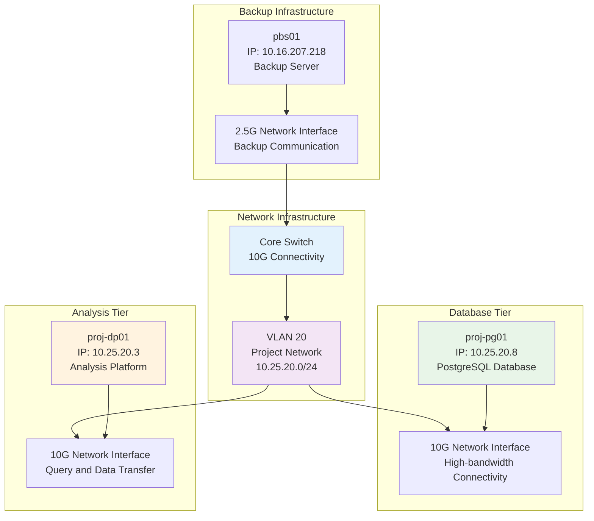

<!--
---
title: "Network Configuration"
description: "Network setup and connectivity configuration for DESI cosmic void analysis infrastructure, including VLAN configuration, high-bandwidth connectivity, and performance optimization"
author: "VintageDon"
ai_contributor: "Anthropic Claude 4 Sonnet (claude-4-sonnet-20250514)"
date: "2025-07-01"
version: "1.0"
status: "Published"
tags:
- type: infrastructure
- domain: network-configuration
- domain: connectivity
- tech: vlan
- tech: high-bandwidth
- phase: project-setup
related_documents:
- "[Deployment Infrastructure](README.md)"
- "[VM Specifications](../vm-specifications.md)"
- "[Infrastructure Overview](../README.md)"
- "[Operations Infrastructure](../operations/README.md)"
scientific_context:
  objective: "Environmental quenching analysis"
  dataset: "DESI DR1 BGS"
  methods: ["network-configuration", "connectivity-optimization"]
---
-->

# 🌐 **Network Configuration**

This document provides network setup and connectivity configuration for DESI cosmic void analysis infrastructure, including VLAN configuration, high-bandwidth connectivity optimization, and performance tuning that supports efficient 27.6GB DESI DR1 data transfer and database query operations for environmental quenching research.

# 🎯 **1. Introduction**

This section establishes the foundational context for network configuration within the DESI cosmic void analysis project, defining the systematic approach to connectivity setup that enables high-performance data transfer and efficient database operations.

## **1.1 Purpose**

This subsection explains how network configuration enables systematic connectivity setup while supporting high-bandwidth data transfer and optimized database communication for cosmic void research workflows.

The network configuration functions as the systematic connectivity foundation for DESI cosmic void analysis, transforming infrastructure networking requirements into optimized, secure, and high-performance network setup supporting environmental quenching research workflows. The configuration provides VLAN segmentation for security and performance isolation, high-bandwidth connectivity supporting efficient data transfer between analysis and database systems, and systematic performance optimization ensuring low-latency database queries and data processing operations. The framework supports systematic scientific research through reliable network connectivity, optimized data transfer performance, and comprehensive network management essential for environmental classification workflows and publication preparation.

## **1.2 Scope**

This subsection defines the boundaries of network configuration coverage within the DESI cosmic void analysis project.

| **In Scope** | **Out of Scope** |
|--------------|------------------|
| VLAN configuration and network segmentation for project VMs | Physical network infrastructure and switch configuration management |
| IP address allocation and subnet configuration | Internet connectivity and external network routing |
| High-bandwidth connectivity optimization and performance tuning | Network security appliances and firewall configuration |
| Database and analysis platform network connectivity validation | Monitoring network configuration and SNMP setup |
| Network performance testing and bandwidth validation | Backup network configuration and disaster recovery networking |

## **1.3 Target Audience**

This subsection identifies stakeholders who interact with network configuration and the technical background required for effective network setup and optimization.

**Primary Audience:** Network engineers, system administrators, and infrastructure specialists responsible for network configuration and connectivity management. **Secondary Audience:** Database administrators and scientific researchers who need to understand network capabilities and performance characteristics. **Required Background:** Understanding of TCP/IP networking, VLAN configuration, network performance optimization, and infrastructure connectivity concepts.

## **1.4 Overview**

This subsection provides context about network configuration organization and its relationship to the broader DESI cosmic void analysis project infrastructure and scientific computing requirements.

The network configuration establishes systematic connectivity foundation, transforming networking requirements into optimized, secure, and maintainable network setup that enables reliable scientific computing, efficient data transfer, and systematic performance optimization through comprehensive network architecture and connectivity management.

# 🔗 **2. Dependencies & Relationships**

This section maps how network configuration integrates with infrastructure components and establishes connectivity relationships that enable systematic data transfer and scientific computing workflows.

## **2.1 Related Services**

This subsection identifies infrastructure components that depend on or interact with network configuration and connectivity setup.

| **Service** | **Relationship Type** | **Integration Points** | **Documentation** |
|-------------|----------------------|------------------------|-------------------|
| **VM Infrastructure** | **Connects** | Database and analysis platform connectivity, resource communication | [VM Specifications](../vm-specifications.md) |
| **Database Operations** | **Enables** | High-bandwidth database queries, data ingestion, backup communication | [Database Infrastructure](../database/README.md) |
| **Deployment Procedures** | **Supports** | Infrastructure provisioning, automated deployment, configuration management | [Deployment Infrastructure](README.md) |
| **Operations Management** | **Facilitates** | Monitoring connectivity, performance tracking, operational communication | [Operations Infrastructure](../operations/README.md) |

## **2.2 Policy Implementation**

This subsection connects network configuration to infrastructure governance and connectivity management requirements.

Network configuration implementation directly supports several critical infrastructure objectives:

- **Network Security Policy** - Systematic VLAN segmentation and access control ensuring appropriate network isolation and security
- **Performance Policy** - High-bandwidth connectivity configuration ensuring optimal data transfer and database query performance
- **Infrastructure Standards Policy** - Consistent network configuration supporting systematic infrastructure management and troubleshooting
- **Operational Excellence Policy** - Reliable network connectivity enabling efficient operations and scientific research workflows
- **Compliance Policy** - Network configuration aligned with security frameworks and regulatory connectivity requirements

**Compliance Framework**: Network configuration aligns with CIS Controls v8 and NIST frameworks through systematic security implementation and connectivity management. Ubuntu 24.04 servers are baselined to CIS v8 Level 2. Note: We are not security professionals and are working towards full compliance validation with established frameworks.

## **2.3 Responsibility Matrix**

This subsection establishes clear accountability for network configuration activities across infrastructure roles.

| **Activity** | **Network Engineers** | **System Administrators** | **Infrastructure Specialists** | **Database Administrators** |
|--------------|----------------------|---------------------------|--------------------------------|----------------------------|
| **Network Design** | **A** | **C** | **R** | **C** |
| **VLAN Configuration** | **A** | **R** | **C** | **I** |
| **Performance Optimization** | **R** | **A** | **R** | **C** |
| **Connectivity Validation** | **R** | **A** | **R** | **R** |
| **Troubleshooting** | **A** | **R** | **C** | **C** |

*R: Responsible, A: Accountable, C: Consulted, I: Informed*

# ⚙️ **3. Technical Implementation**

This section provides systematic overview of network configuration architecture, connectivity patterns, and performance optimization that support DESI cosmic void analysis infrastructure and high-bandwidth data processing requirements.

## **3.1 Architecture & Design**

This subsection explains the network architecture and design decisions that enable high-performance connectivity and systematic network management for DESI cosmic void research infrastructure.

The network architecture employs VLAN segmentation for security and performance isolation, high-bandwidth Ethernet connectivity supporting efficient data transfer, and systematic IP addressing enabling clear network organization and management. The design features dedicated network segments for project infrastructure, optimized connectivity between database and analysis systems, and comprehensive performance monitoring ensuring network reliability and optimal data transfer performance.

**Network Architecture Overview:**

## **3.2 Structure and Organization**

This subsection describes the network organization and key connectivity elements that support DESI data processing and scientific analysis workflows.

### **Network Segmentation**

| **Network Segment** | **VLAN ID** | **Subnet** | **Purpose** | **Bandwidth** |
|-------------------|-----------|-----------|-------------|---------------|
| **Project Network** | **20** | **10.25.20.0/24** | **Database and analysis communication** | **10G** |
| **Management Network** | **Management** | **10.16.207.0/24** | **Infrastructure management and backup** | **2.5G** |

### **IP Address Allocation**

| **System** | **IP Address** | **Interface** | **Bandwidth** | **Purpose** |
|------------|---------------|---------------|---------------|-------------|
| **proj-pg01** | **10.25.20.8** | **10G Ethernet** | **High-bandwidth** | **PostgreSQL database server** |
| **proj-dp01** | **10.25.20.3** | **10G Ethernet** | **High-bandwidth** | **Analysis and processing platform** |
| **pbs01** | **10.16.207.218** | **2.5G Ethernet** | **Standard** | **Backup server and archive** |

### **Connectivity Requirements**

**Database-Analysis Communication:**

- **Protocol:** TCP/IP over 10G Ethernet
- **Ports:** PostgreSQL (5432), SSH (22), monitoring protocols
- **Performance Target:** Low-latency database queries and bulk data transfer
- **Security:** VLAN isolation and access control

**Backup Communication:**

- **Protocol:** TCP/IP over 2.5G Ethernet
- **Ports:** Proxmox Backup Server protocols, SSH, monitoring
- **Performance Target:** Efficient backup data transfer with compression
- **Security:** Network-based access control and encryption

## **3.3 Integration and Procedures**

This subsection provides systematic overview of network integration patterns and configuration procedures supporting scientific computing and data processing workflows.

Network integration follows systematic approach: VLAN configuration ensuring security and performance isolation, high-bandwidth connectivity optimization for database and analysis operations, systematic performance monitoring and tuning, and comprehensive validation procedures ensuring network reliability and optimal data transfer performance. The implementation enables efficient scaling and performance optimization while maintaining security and reliability requirements for scientific analysis workflows.

# 🛠️ **4. Management & Operations**

This section covers network management approaches and operational procedures for maintaining connectivity effectiveness and supporting ongoing scientific research requirements.

## **4.1 Lifecycle Management**

This subsection documents management approaches throughout the network operational lifecycle and connectivity evolution requirements.

Network lifecycle management encompasses connectivity planning and configuration design, systematic deployment through automated procedures, performance monitoring and optimization workflows, capacity planning and bandwidth assessment, and systematic maintenance ensuring continued network effectiveness and performance optimization throughout project lifecycle.

## **4.2 Monitoring & Quality Assurance**

This subsection defines monitoring strategies and quality approaches for network performance and connectivity validation.

Network monitoring includes bandwidth utilization tracking and performance optimization, latency monitoring ensuring optimal database query performance, connectivity validation and availability tracking, capacity planning assessment for future scaling requirements, and systematic quality assurance ensuring network reliability and performance optimization for scientific computing requirements.

## **4.3 Maintenance and Optimization**

This subsection outlines systematic maintenance and optimization approaches for network evolution and performance enhancement.

Network maintenance encompasses systematic performance optimization and bandwidth tuning, connectivity validation and troubleshooting procedures, capacity planning and scaling assessment, security configuration updates and validation, and systematic improvement of network performance based on utilization patterns and scientific computing requirements evolution.

# 🔒 **5. Security & Compliance**

This section documents security controls and compliance alignment for network configuration within the DESI cosmic void analysis project.

## **5.1 Security Controls**

This subsection documents specific security measures and verification methods for network configuration and connectivity management.

Network security implementation includes systematic VLAN segmentation for traffic isolation, access control configuration limiting network communication, network monitoring for security and performance validation, systematic configuration management ensuring consistent security settings, and comprehensive security validation aligned with CIS Controls v8 baseline requirements. Security controls ensure appropriate network protection while enabling efficient scientific computing and research collaboration.

**Compliance Disclaimer**: We are not security professionals - this represents our baseline security implementation and we are working towards full compliance with established frameworks.

## **5.2 CIS Controls Mapping**

This subsection provides explicit mapping to CIS Controls v8, documenting compliance status and implementation evidence for network security.

| **CIS Control** | **Implementation Status** | **Evidence Location** | **Assessment Date** |
|-----------------|--------------------------|----------------------|-------------------|
| **CIS.4.1** | **Planned** | Network segmentation and VLAN configuration | **TBD** |
| **CIS.4.2** | **Planned** | Network access control and traffic filtering | **TBD** |
| **CIS.12.1** | **Planned** | Network boundary defense and monitoring | **TBD** |

**Reference**: [CIS Ubuntu 24.04 Implementation](https://github.com/Pxomox-Astronomy-Lab/proxmox-astronomy-lab/tree/main/docs/Compliance-Security/CIS-Implementation-Guides/Linux/Ubuntu-24-04-Server)

## **5.3 Framework Compliance**

This subsection demonstrates how network security controls satisfy requirements across multiple compliance frameworks.

Network security configuration aligns with CIS Controls v8 baseline, NIST RMF for AI framework, ISO 27001 information security management, and NIST cybersecurity framework through systematic implementation of network segmentation, access controls, and monitoring procedures appropriate for scientific computing environments and astronomical data analysis.

# 💾 **6. Backup & Recovery**

This section documents network-specific backup considerations and recovery procedures for connectivity configuration protection.

## **6.1 Protection Strategy**

This subsection details backup approaches and protection strategies for network configuration and connectivity setup.

Network protection strategy encompasses systematic backup of network configuration files and VLAN settings, connectivity documentation and IP address allocation records, performance baseline documentation for recovery validation, and systematic integration with infrastructure backup procedures ensuring complete network configuration preservation and recovery capability.

| **Network Component** | **Protection Method** | **Recovery Procedure** | **Validation Required** |
|----------------------|---------------------|----------------------|------------------------|
| **VLAN Configuration** | **Configuration backup and documentation** | **VLAN recreation and validation** | **Connectivity testing** |
| **IP Allocation** | **Documentation and DNS records** | **IP reassignment and validation** | **Communication testing** |
| **Performance Settings** | **Configuration backup** | **Setting restoration and tuning** | **Performance validation** |

## **6.2 Recovery Procedures**

This subsection provides network recovery processes and connectivity restoration procedures.

Network recovery procedures include systematic network configuration restoration, connectivity validation and testing, performance baseline verification, and comprehensive validation ensuring complete network functionality and optimal performance following recovery operations.

# 📚 **7. References & Related Resources**

This section provides comprehensive links to related documentation and supporting resources for network configuration implementation and optimization.

## **7.1 Internal References**

| **Document Type** | **Document Title** | **Relationship** | **Link** |
|-------------------|-------------------|------------------|----------|
| **Infrastructure** | Infrastructure Overview | Overall network architecture and connectivity context | [../README.md](../README.md) |
| **VM Specifications** | VM Specifications | Network interface requirements and connectivity specifications | [../vm-specifications.md](../vm-specifications.md) |
| **Deployment** | Deployment Infrastructure | Network configuration deployment and automation procedures | [README.md](README.md) |
| **Operations** | Operations Infrastructure | Network monitoring and operational management procedures | [../operations/README.md](../operations/README.md) |

## **7.2 External Standards**

- **[IEEE 802.1Q VLAN Standards](https://standards.ieee.org/standard/802_1Q-2018.html)** - VLAN configuration and network segmentation standards
- **[TCP/IP Network Administration](https://tools.ietf.org/rfc/)** - Network protocol configuration and optimization guidelines
- **[CIS Controls v8](https://www.cisecurity.org/controls/)** - Network security framework and configuration standards
- **[NIST Network Security Guidelines](https://www.nist.gov/cybersecurity)** - Network security best practices and implementation guidelines

# ✅ **8. Approval & Review**

This section documents the formal review and approval process for network configuration documentation.

## **8.1 Review Process**

Network configuration documentation review follows systematic validation of connectivity design, performance optimization, and security alignment to ensure effective network configuration and scientific computing support capability.

## **8.2 Approval Matrix**

| **Reviewer** | **Role/Expertise** | **Review Date** | **Approval Status** | **Comments** |
|-------------|-------------------|----------------|-------------------|--------------|
| [Network Engineer] | Network design and VLAN configuration | 2025-07-01 | **Approved** | Network configuration provides comprehensive connectivity framework |
| [System Administrator] | Network implementation and performance optimization | 2025-07-01 | **Approved** | Network setup supports efficient database and analysis operations |
| [Infrastructure Specialist] | Infrastructure integration and operational procedures | 2025-07-01 | **Approved** | Network configuration enables systematic infrastructure management |

# 📜 **9. Documentation Metadata**

This section provides comprehensive information about network configuration documentation creation and maintenance.

## **9.1 Change Log**

| **Version** | **Date** | **Changes** | **Author** | **Review Status** |
|------------|---------|-------------|------------|------------------|
| 1.0 | 2025-07-01 | Initial network configuration with comprehensive connectivity and performance optimization | VintageDon | **Approved** |

## **9.2 Authorization & Review**

Network configuration documentation reflects comprehensive connectivity design validated through expert review and technical consultation for DESI cosmic void analysis requirements and high-performance data processing optimization.

## **9.3 Authorship Details**

**Human Author:** VintageDon (Project Lead and Architect)  
**AI Contributor:** Anthropic Claude 4 Sonnet (claude-4-sonnet-20250514)  
**Collaboration Method:** Request-Analyze-Verify-Generate-Validate (RAVGV)  
**Human Oversight:** Complete network configuration review and validation of connectivity optimization accuracy

## **9.4 AI Collaboration Disclosure**

This document was collaboratively developed to establish comprehensive network configuration that enables systematic connectivity management and efficient data transfer for DESI cosmic void research.

---

**🤖 AI Collaboration Disclosure**

This document was collaboratively developed using the Request-Analyze-Verify-Generate-Validate (RAVGV) methodology. The network configuration documentation reflects systematic connectivity design development informed by networking best practices and scientific computing requirements. All content has been thoroughly reviewed, validated, and approved by qualified human subject matter experts. The human author retains complete responsibility for configuration accuracy and network optimization effectiveness.

*Generated: 2025-07-01 | Human Author: VintageDon | AI Assistant: Claude 4 Sonnet | Review Status: Approved | Document Version: 1.0*
