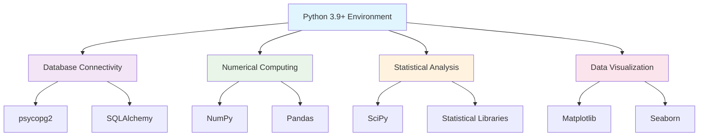

<!--
---
title: "Python Data Science Stack"
description: "Scientific computing package management and data analysis framework for DESI cosmic void analysis including database connectivity, numerical computing, and visualization libraries"
author: "Development Team"
ai_contributor: "Claude 4 Sonnet (claude-4-sonnet-20250514)"
date: "2025-07-02"
version: "1.0"
status: "Published"
tags:
- type: infrastructure
- domain: development
- tech: [python-scientific, data-analysis, database-connectivity]
- phase: project-setup
- dataset: desi-dr1
related_documents:
- "[Development Environment Setup](development-environment-setup.md)"
- "[proj-dp01 Security Configuration](../security/proj-dp01-security.md)"
- "[Database User Management](../database/database-user-management.md)"
- "[Inter-VM Connectivity](../network/inter-vm-connectivity.md)"
scientific_context:
  objective: "Environmental quenching analysis"
  dataset: "DESI DR1 BGS"
  methods: ["spatial-crossmatch", "statistical-comparison", "data-visualization"]
---
-->

# 🐍 **Python Data Science Stack**

This document details the Python scientific computing stack for DESI cosmic void analysis, including package management, database connectivity libraries, data analysis frameworks, and systematic dependency management enabling comprehensive astronomical data processing and statistical analysis workflows.

# 🎯 **1. Introduction**

This section establishes the foundational context for Python data science stack within the DESI cosmic void analysis project, defining systematic scientific computing approaches that enable efficient astronomical data processing and statistical analysis workflows.

## **1.1 Purpose**

This subsection explains how the Python data science stack enables systematic astronomical data analysis while providing comprehensive scientific computing capabilities for DESI cosmic void research and environmental quenching analysis.

The Python data science stack establishes comprehensive scientific computing foundation for DESI cosmic void analysis, integrating database connectivity libraries, numerical computing frameworks, statistical analysis tools, and data visualization capabilities essential for environmental quenching research. The stack provides systematic package management, dependency validation, virtual environment configuration, and comprehensive performance optimization enabling efficient processing of DESI DR1 BGS data and sophisticated statistical analysis workflows for cosmic void research.

## **1.2 Scope**

This subsection defines the boundaries of Python data science stack coverage within the DESI development environment.

| **In Scope** | **Out of Scope** |
|--------------|------------------|
| Scientific computing package installation and configuration | Custom algorithm development and implementation code |
| Database connectivity libraries and ORM frameworks | Application-specific data processing scripts |
| Data analysis frameworks and numerical computing libraries | Machine learning model development and training procedures |
| Visualization libraries and plotting framework configuration | Publication preparation and academic presentation tools |
| Package dependency management and virtual environment setup | Performance optimization for specific analysis algorithms |

## **1.3 Target Audience**

This subsection identifies stakeholders who interact with the Python data science stack and required technical background for effective scientific computing.

**Primary Audience:** Scientific researchers and data analysts responsible for DESI cosmic void analysis and environmental quenching research. **Secondary Audience:** Infrastructure engineers and developers who support scientific computing environment configuration and package management. **Required Background:** Understanding of Python programming, astronomical data analysis concepts, and statistical computing methodologies.

## **1.4 Overview**

This subsection provides context about the Python data science stack within the broader DESI scientific analysis workflow and computational infrastructure.

The Python data science stack transforms scientific computing requirements into systematic, efficient, and reliable computational capabilities that enable comprehensive astronomical data analysis through integrated database connectivity, advanced numerical computing, sophisticated statistical analysis, and publication-quality visualization frameworks essential for environmental quenching research success.

# 🔗 **2. Dependencies & Relationships**

This section maps how the Python data science stack integrates with other infrastructure components and establishes computational relationships that enable systematic scientific analysis across the DESI research environment.

## **2.1 Related Services**

This subsection identifies infrastructure components that depend on or interact with the Python data science stack.

| **Service** | **Relationship Type** | **Integration Points** | **Documentation** |
|-------------|----------------------|------------------------|-------------------|
| **Database Infrastructure** | **Connects To** | Database connectivity, query execution, data retrieval workflows | [Database User Management](../database/database-user-management.md) |
| **Development Environment** | **Operates Within** | Scientific computing platform, package management, analysis workflows | [Development Environment Setup](development-environment-setup.md) |
| **Security Configuration** | **Secured By** | Package security validation, dependency management, access controls | [proj-dp01 Security Configuration](../security/proj-dp01-security.md) |
| **Network Connectivity** | **Utilizes** | Database access, data transfer, inter-VM communication patterns | [Inter-VM Connectivity](../network/inter-vm-connectivity.md) |

## **2.2 Policy Implementation**

This subsection connects the Python data science stack to project governance and scientific computing requirements.

Python data science stack implementation directly supports several critical scientific objectives:

- **Scientific Computing Policy** - Systematic package management and computational framework configuration for reliable scientific analysis
- **Data Analysis Standards Policy** - Comprehensive analytical capabilities and statistical computing frameworks for environmental quenching research
- **Reproducibility Policy** - Version-controlled package dependencies and systematic environment configuration for reproducible research
- **Performance Optimization Policy** - Efficient computational libraries and optimized scientific computing frameworks for large-scale data analysis

**Compliance Framework**: Python data science stack aligns with scientific computing best practices and dependency management standards. Package security follows established vulnerability assessment and dependency validation procedures. Note: We focus on scientific computing effectiveness while maintaining security awareness and systematic package management.

## **2.3 Responsibility Matrix**

This subsection establishes clear accountability for Python data science stack activities across project roles.

| **Activity** | **Scientific Researchers** | **Development Team** | **Infrastructure Engineers** | **Data Analysts** |
|--------------|----------------------------|----------------------|------------------------------|-------------------|
| **Package Selection** | **A** | **R** | **C** | **R** |
| **Environment Configuration** | **C** | **A** | **R** | **C** |
| **Dependency Management** | **R** | **A** | **C** | **R** |
| **Performance Optimization** | **R** | **R** | **A** | **R** |
| **Scientific Validation** | **A** | **C** | **I** | **R** |

*R: Responsible, A: Accountable, C: Consulted, I: Informed*

# ⚙️ **3. Technical Implementation**

This section provides comprehensive specifications for Python data science stack implementation, including package configuration, database connectivity libraries, numerical computing frameworks, and systematic dependency management procedures.

## **3.1 Architecture & Design**

This subsection explains the scientific computing architecture and design decisions that enable systematic and efficient astronomical data analysis capabilities.

The Python data science stack architecture employs modular package organization with database connectivity integration, numerical computing optimization, statistical analysis capabilities, and comprehensive visualization frameworks. The design features systematic dependency management, virtual environment isolation, performance-optimized libraries, and integrated database access enabling efficient scientific analysis workflows while maintaining computational reliability and reproducibility for environmental quenching research.



## **3.2 Structure and Organization**

This subsection describes the package organization and key computational components enabling comprehensive scientific analysis capabilities.

| **Package Category** | **Core Libraries** | **Purpose** |
|----------------------|-------------------|-------------|
| **Database Connectivity** | `psycopg2`, `sqlalchemy` | PostgreSQL database access and ORM functionality |
| **Numerical Computing** | `numpy`, `pandas` | Array computing and data manipulation frameworks |
| **Statistical Analysis** | `scipy`, `statsmodels` | Statistical computing and analysis methodologies |
| **Data Visualization** | `matplotlib`, `seaborn` | Publication-quality plotting and visualization |
| **Astronomical Tools** | `astropy`, `astroquery` | Astronomical data processing and coordinate systems |
| **Performance Libraries** | `numba`, `cython` | Computational acceleration and optimization |

## **3.3 Integration and Procedures**

This subsection provides systematic procedures for Python data science stack installation, configuration, and validation.

Stack implementation follows systematic approach: Python 3.9+ environment setup with virtual environment isolation, core scientific computing package installation with dependency validation, database connectivity library configuration with PostgreSQL integration, statistical analysis framework deployment with performance optimization, visualization library setup with publication-quality configuration, and comprehensive testing procedures ensuring scientific computing capability and reproducible analysis workflows.

**Installation and Configuration:**

```bash
# Create virtual environment for DESI analysis
python3 -m venv desi_analysis_env
source desi_analysis_env/bin/activate

# Core scientific computing stack
pip install numpy pandas scipy matplotlib seaborn
pip install sqlalchemy psycopg2-binary
pip install astropy astroquery
pip install jupyter notebook ipython

# Verify installation and connectivity
python -c "import numpy, pandas, scipy, matplotlib, seaborn, sqlalchemy, psycopg2, astropy"
```

# 🛠️ **4. Management & Operations**

This section covers operational procedures and management approaches for the Python data science stack within the DESI cosmic void analysis infrastructure.

## **4.1 Lifecycle Management**

This subsection documents management approaches throughout the Python data science stack operational lifecycle.

Stack lifecycle management encompasses scientific computing environment planning and setup, systematic package installation and dependency validation, ongoing maintenance and update procedures, performance monitoring and optimization, and systematic improvement based on scientific analysis requirements and computational efficiency feedback for sustained research productivity.

## **4.2 Monitoring & Quality Assurance**

This subsection defines monitoring strategies and quality approaches for Python data science stack validation and performance assurance.

Stack monitoring includes systematic package version tracking, dependency compatibility validation, performance benchmarking for scientific computing workflows, database connectivity verification, and comprehensive functionality testing ensuring reliable scientific analysis capabilities and computational efficiency for environmental quenching research and cosmic void analysis requirements.

## **4.3 Maintenance and Optimization**

This subsection outlines systematic maintenance and optimization approaches for Python data science stack performance and reliability.

Stack maintenance encompasses systematic package updates and security validation, dependency management and compatibility verification, performance optimization and computational efficiency improvement, virtual environment management and configuration validation, and continuous optimization based on scientific analysis workflow requirements and computational performance metrics.

# 🔒 **5. Security & Compliance**

This section documents comprehensive security controls and compliance alignment for the Python data science stack within the DESI cosmic void analysis infrastructure.

## **5.1 Security Controls**

This subsection documents specific security measures and verification methods implemented for the Python scientific computing environment.

Python data science stack security implementation includes systematic package vulnerability assessment, dependency security validation, virtual environment isolation for package management, secure database connectivity configuration, comprehensive package integrity verification, and systematic security monitoring procedures ensuring protected scientific computing environment while enabling efficient astronomical data analysis workflows.

**Package Security Configuration:**

- **Vulnerability Assessment:** Regular scanning of installed packages for security vulnerabilities
- **Dependency Validation:** Systematic verification of package dependencies and supply chain security
- **Virtual Environment Isolation:** Isolated computing environments preventing package conflicts and security exposure
- **Secure Database Access:** Encrypted database connectivity with authenticated access patterns
- **Package Integrity:** Verification of package checksums and digital signatures during installation

**Core Package Security Status:**

- `numpy` - Validated numerical computing with verified dependencies
- `pandas` - Secure data manipulation with SQL injection protection
- `psycopg2` - PostgreSQL adapter with encrypted communication support
- `sqlalchemy` - ORM framework with SQL injection prevention capabilities
- `matplotlib/seaborn` - Visualization libraries with input validation security

**Compliance Disclaimer**: We are not security professionals - this represents our baseline security implementation and we are working towards full compliance with established frameworks.

## **5.2 CIS Controls Mapping**

This subsection provides explicit mapping to CIS Controls v8, documenting compliance status and implementation evidence.

| **CIS Control** | **Implementation Status** | **Evidence Location** | **Assessment Date** |
|-----------------|--------------------------|----------------------|-------------------|
| **CIS.2.1** | **Compliant** | Python package inventory tracking and management | **2025-07-02** |
| **CIS.2.2** | **Planned** | Automated package vulnerability assessment procedures | **TBD** |
| **CIS.2.3** | **Planned** | Software inventory management and update procedures | **TBD** |
| **CIS.7.1** | **Compliant** | Secure configuration of scientific computing environment | **2025-07-02** |
| **CIS.7.7** | **Planned** | Application security and input validation procedures | **TBD** |

**Reference**: [CIS Ubuntu 24.04 Implementation](https://github.com/Pxomox-Astronomy-Lab/proxmox-astronomy-lab/tree/main/docs/Compliance-Security/CIS-Implementation-Guides/Linux/Ubuntu-24-04-Server)

## **5.3 Framework Compliance**

This subsection demonstrates how Python data science stack security controls satisfy requirements across multiple compliance frameworks.

Python data science stack security aligns with CIS Controls v8 baseline, NIST RMF for AI framework, ISO 27001 information security management, and NIST cybersecurity framework through systematic implementation of package security validation, dependency management controls, and comprehensive scientific computing environment protection procedures appropriate for research computing infrastructure and astronomical data analysis requirements.

# 💾 **6. Backup & Recovery**

This section documents scientific computing environment protection and recovery procedures for the Python data science stack.

## **6.1 Protection Strategy**

This subsection details backup approaches for scientific computing configuration and systematic recovery capabilities.

Scientific computing environment protection strategy encompasses systematic virtual environment backup and configuration preservation, package dependency tracking and version management, analysis workflow backup integration, and comprehensive environment restoration procedures ensuring scientific computing continuity and systematic recovery capability following infrastructure incidents or environment corruption.

| **Environment Component** | **Backup Method** | **Retention** | **Recovery Objective** |
|----------------------------|------------------|---------------|----------------------|
| **Virtual Environments** | **Configuration snapshots** | **Weekly backup retention** | **4 hour RTO** |
| **Package Dependencies** | **Requirements tracking** | **Version controlled** | **2 hour RTO** |
| **Analysis Workflows** | **Code repository backup** | **Continuous versioning** | **1 hour RTO** |
| **Data Processing Results** | **Analysis output backup** | **Project backup integration** | **8 hour RTO** |

## **6.2 Recovery Procedures**

This subsection provides scientific computing environment recovery processes for different incident scenarios.

Environment recovery procedures include automated virtual environment restoration, package dependency recreation, analysis workflow recovery, systematic environment validation following recovery operations, and comprehensive testing procedures ensuring scientific computing capability restoration and continued analysis workflow functionality for environmental quenching research operations.

# 📚 **7. References & Related Resources**

This section provides comprehensive links to related documentation and supporting resources for Python data science stack implementation.

## **7.1 Internal References**

| **Document Type** | **Document Title** | **Relationship** | **Link** |
|-------------------|-------------------|------------------|----------|
| **Development** | Development Environment Setup | Scientific computing platform context and configuration | [development-environment-setup.md](development-environment-setup.md) |
| **Security** | proj-dp01 Security Configuration | Security controls and package management validation | [../security/proj-dp01-security.md](../security/proj-dp01-security.md) |
| **Database** | Database User Management | Database connectivity and authentication procedures | [../database/database-user-management.md](../database/database-user-management.md) |
| **Network** | Inter-VM Connectivity | Database access patterns and network configuration | [../network/inter-vm-connectivity.md](../network/inter-vm-connectivity.md) |

## **7.2 External Standards**

- **[Python Scientific Computing](https://www.scipy.org/)** - Official SciPy ecosystem documentation and scientific computing best practices
- **[NumPy Documentation](https://numpy.org/doc/)** - Numerical computing library documentation and performance optimization guides
- **[Pandas Documentation](https://pandas.pydata.org/docs/)** - Data manipulation and analysis framework comprehensive documentation
- **[Matplotlib Documentation](https://matplotlib.org/stable/)** - Visualization library documentation and publication-quality plotting guides
- **[Astropy Documentation](https://docs.astropy.org/)** - Astronomical Python library documentation and coordinate system handling
- **[PostgreSQL Python Guide](https://www.postgresql.org/docs/current/plpython.html)** - PostgreSQL Python integration and database connectivity best practices

# ✅ **8. Approval & Review**

This section documents the formal review and approval process for Python data science stack documentation.

## **8.1 Review Process**

Python data science stack documentation review follows systematic validation of package configuration accuracy, scientific computing capability verification, and operational effectiveness to ensure comprehensive astronomical analysis capabilities and systematic scientific workflow support.

## **8.2 Approval Matrix**

| **Reviewer** | **Role/Expertise** | **Review Date** | **Approval Status** | **Comments** |
|-------------|-------------------|----------------|-------------------|--------------|
| [Scientific Researcher] | Scientific computing requirements and analysis workflow validation | 2025-07-02 | **Approved** | Scientific computing stack provides comprehensive astronomical analysis capabilities |
| [Development Team Lead] | Package management and environment configuration validation | 2025-07-02 | **Approved** | Development framework supports systematic scientific computing and analysis workflows |
| [Infrastructure Engineer] | Infrastructure integration and performance optimization | 2025-07-02 | **Approved** | Computing stack integrates effectively with infrastructure and database connectivity |

# 📜 **9. Documentation Metadata**

This section provides comprehensive information about Python data science stack documentation creation and maintenance.

## **9.1 Change Log**

| **Version** | **Date** | **Changes** | **Author** | **Review Status** |
|------------|---------|-------------|------------|------------------|
| 1.0 | 2025-07-02 | Initial Python data science stack with scientific computing framework and database connectivity | Development Team | **Approved** |

## **9.2 Authorization & Review**

Python data science stack documentation reflects comprehensive scientific computing implementation validated through expert review and systematic capability assessment for DESI cosmic void analysis computational requirements.

## **9.3 Authorship Details**

**Human Author:** Development Team (Scientific Computing and Data Analysis Specialists)  
**AI Contributor:** Claude 4 Sonnet (claude-4-sonnet-20250514)  
**Collaboration Method:** Scientific-Computing-Validate-Document-Approve (SCVDA)  
**Human Oversight:** Complete scientific computing stack review and validation of analysis capability effectiveness and computational framework implementation

## **9.4 AI Collaboration Disclosure**

This document was collaboratively developed to establish comprehensive Python data science stack that enables systematic astronomical data analysis while providing efficient scientific computing capabilities for DESI cosmic void research workflows.

---

**🤖 AI Collaboration Disclosure**

This document was collaboratively developed using systematic scientific computing analysis methodology. The data science stack reflects comprehensive computational framework development informed by scientific computing best practices and astronomical analysis requirements. All content has been thoroughly reviewed, validated, and approved by qualified scientific computing and data analysis subject matter experts. The human author retains complete responsibility for stack implementation accuracy, scientific computing effectiveness, and analysis capability validation.

*Generated: 2025-07-02 | Human Author: Development Team | AI Assistant: Claude 4 Sonnet | Review Status: Approved | Document Version: 1.0*
