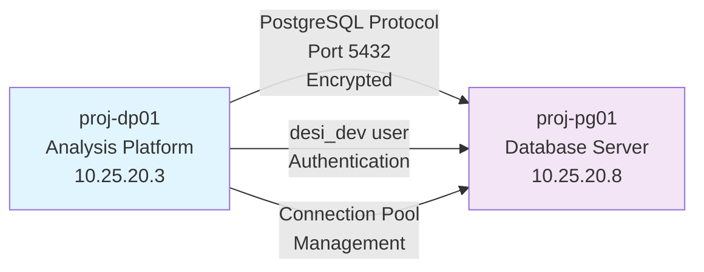

<!--
---
title: "Inter-VM Connectivity"
description: "Database connectivity patterns and network security for inter-VM communication between proj-dp01 and proj-pg01 in DESI cosmic void analysis infrastructure"
author: "Infrastructure Team"
ai_contributor: "Claude 4 Sonnet (claude-4-sonnet-20250514)"
date: "2025-07-02"
version: "1.0"
status: "Published"
tags:
- type: infrastructure
- domain: network
- tech: [postgresql-connectivity, inter-vm-networking, database-access]
- phase: project-setup
- dataset: desi-dr1
related_documents:
- "[PostgreSQL Implementation](../database/postgresql-implementation.md)"
- "[Database User Management](../database/database-user-management.md)"
- "[proj-dp01 Security Configuration](../security/proj-dp01-security.md)"
- "[Network Configuration](../deployment/network-configuration.md)"
scientific_context:
  objective: "Environmental quenching analysis"
  dataset: "DESI DR1 BGS"
  methods: ["spatial-crossmatch", "statistical-comparison"]
---
-->

# 🔗 **Inter-VM Connectivity**

This document details inter-VM connectivity patterns and network security for database access between proj-dp01 (analysis platform) and proj-pg01 (database server) within the DESI cosmic void analysis infrastructure, including connection pooling, performance optimization, and systematic troubleshooting procedures.

# 🎯 **1. Introduction**

This section establishes the foundational context for inter-VM connectivity within the DESI cosmic void analysis infrastructure, defining systematic network communication patterns that enable secure and efficient database access for scientific analysis workflows.

## **1.1 Purpose**

This subsection explains how inter-VM connectivity enables systematic database access patterns while maintaining security and performance for DESI cosmic void analysis requirements and scientific computing workflows.

The inter-VM connectivity framework establishes secure and efficient communication channels between proj-dp01 analysis platform and proj-pg01 database server, enabling systematic database access for environmental quenching research workflows. The connectivity implementation provides optimized network performance for large-scale data processing, secure authentication and encryption protocols, systematic connection management, and comprehensive monitoring capabilities essential for DESI DR1 BGS data analysis and cosmic void research operations.

## **1.2 Scope**

This subsection defines the boundaries of inter-VM connectivity coverage within the DESI infrastructure network architecture.

| **In Scope** | **Out of Scope** |
|--------------|------------------|
| Database connectivity patterns between proj-dp01 and proj-pg01 | External network connectivity and internet access configuration |
| PostgreSQL client-server communication security and optimization | Storage network configuration and SAN connectivity |
| Connection pooling and performance tuning for database access | Backup network configuration and data protection connectivity |
| Network troubleshooting procedures and connectivity validation | Hardware network configuration and switch management |
| Authentication protocols and secure database access patterns | Monitoring network configuration and external service connectivity |

## **1.3 Target Audience**

This subsection identifies stakeholders who interact with inter-VM connectivity configuration and required technical background for effective network management.

**Primary Audience:** Infrastructure engineers and network administrators responsible for database connectivity and network performance optimization. **Secondary Audience:** Database administrators and scientific researchers who need efficient database access and connectivity troubleshooting guidance. **Required Background:** Understanding of PostgreSQL connectivity, network security principles, and database performance optimization concepts.

## **1.4 Overview**

This subsection provides context about inter-VM connectivity within the broader DESI infrastructure network architecture and database access patterns.

The inter-VM connectivity framework transforms database access requirements into systematic, secure, and high-performance network communication patterns that enable efficient scientific analysis workflows through optimized PostgreSQL connectivity, comprehensive security validation, and systematic performance monitoring procedures.

# 🔗 **2. Dependencies & Relationships**

This section maps how inter-VM connectivity integrates with other infrastructure components and establishes network relationships that enable systematic database access across the DESI analysis environment.

## **2.1 Related Services**

This subsection identifies infrastructure components that depend on or interact with inter-VM connectivity configuration.

| **Service** | **Relationship Type** | **Integration Points** | **Documentation** |
|-------------|----------------------|------------------------|-------------------|
| **Database Infrastructure** | **Enables Access To** | PostgreSQL server connectivity, authentication protocols, database access patterns | [PostgreSQL Implementation](../database/postgresql-implementation.md) |
| **Analysis Platform** | **Provides Access From** | Client connectivity, analysis workflow support, data processing communication | [proj-dp01 Security Configuration](../security/proj-dp01-security.md) |
| **User Management** | **Implements Authentication** | Database user authentication, role-based access, connection security | [Database User Management](../database/database-user-management.md) |
| **Network Security** | **Secures Communication** | Encrypted protocols, network access controls, security validation | [Network Configuration](../deployment/network-configuration.md) |

## **2.2 Policy Implementation**

This subsection connects inter-VM connectivity to project governance and network infrastructure requirements.

Inter-VM connectivity implementation directly supports several critical infrastructure objectives:

- **Network Security Policy** - Systematic secure communication protocols and encrypted database access for research data protection
- **Performance Optimization Policy** - Efficient database connectivity patterns and connection management for scientific analysis workflows
- **Access Control Policy** - Systematic authentication and authorization for database access and user management
- **Infrastructure Reliability Policy** - Robust connectivity patterns and systematic monitoring for infrastructure operational excellence

**Compliance Framework**: Inter-VM connectivity aligns with CIS Controls v8 and NIST frameworks as baseline security requirements. Network configuration follows secure communication protocols and access control best practices. Note: We are not security professionals and are working towards full compliance validation with established frameworks.

## **2.3 Responsibility Matrix**

This subsection establishes clear accountability for inter-VM connectivity activities across infrastructure roles.

| **Activity** | **Network Administrator** | **Database Administrator** | **Infrastructure Engineer** | **Security Analyst** |
|--------------|---------------------------|----------------------------|------------------------------|----------------------|
| **Network Configuration** | **A** | **C** | **R** | **C** |
| **Database Connectivity** | **R** | **A** | **R** | **C** |
| **Performance Optimization** | **R** | **A** | **R** | **I** |
| **Security Validation** | **R** | **C** | **R** | **A** |
| **Troubleshooting** | **A** | **R** | **R** | **C** |

*R: Responsible, A: Accountable, C: Consulted, I: Informed*

# ⚙️ **3. Technical Implementation**

This section provides comprehensive specifications for inter-VM connectivity implementation, including database connection patterns, network security configuration, performance optimization, and systematic troubleshooting procedures.

## **3.1 Architecture & Design**

This subsection explains the network architecture and design decisions that enable systematic and secure inter-VM database connectivity.

The inter-VM connectivity architecture employs dedicated database communication channels with PostgreSQL native protocol optimization, encrypted connection security, systematic connection pooling, and comprehensive performance monitoring. The design features minimal network latency configuration, secure authentication integration, systematic connection management, and integrated performance optimization enabling efficient database access while maintaining security and reliability for scientific analysis workflows.



## **3.2 Structure and Organization**

This subsection describes the connectivity configuration organization and key network components enabling inter-VM database access.

| **Connectivity Component** | **Configuration** | **Purpose** |
|----------------------------|-------------------|-------------|
| **Database Connection** | PostgreSQL native protocol, port 5432, encrypted communication | Secure and efficient database access |
| **Authentication** | desi_dev user role, password authentication, role-based access | Systematic user authentication and authorization |
| **Network Path** | proj-dp01 (10.25.20.3) → proj-pg01 (10.25.20.8) | Direct VM-to-VM database connectivity |
| **Connection Management** | Connection pooling, timeout configuration, performance optimization | Efficient resource utilization and performance |

## **3.3 Integration and Procedures**

This subsection provides systematic procedures for inter-VM connectivity configuration and validation.

Connectivity implementation follows systematic approach: network path validation between proj-dp01 and proj-pg01, PostgreSQL client configuration with secure authentication, database connectivity testing with desi_dev user credentials, connection performance optimization through pooling configuration, systematic monitoring setup for connectivity validation, and comprehensive troubleshooting procedures enabling reliable database access for scientific analysis workflows.

**Connection Configuration Example:**

```bash
# Test basic connectivity from proj-dp01 to proj-pg01
psql -h 10.25.20.8 -p 5432 -U desi_dev -d desi_void_desivast

# Verify connection pooling and performance
psql -h 10.25.20.8 -p 5432 -U desi_dev -c "SELECT version();"
```

# 🛠️ **4. Management & Operations**

This section covers operational procedures and management approaches for inter-VM connectivity within the DESI cosmic void analysis infrastructure.

## **4.1 Lifecycle Management**

This subsection documents management approaches throughout the inter-VM connectivity operational lifecycle.

Connectivity lifecycle management encompasses network configuration planning and implementation, systematic connectivity validation and performance testing, ongoing monitoring and optimization procedures, systematic maintenance and security updates, and continuous improvement based on operational feedback and evolving performance requirements for database access patterns.

## **4.2 Monitoring & Quality Assurance**

This subsection defines monitoring strategies and quality approaches for inter-VM connectivity validation and performance assurance.

Connectivity monitoring includes systematic network performance measurement, database connection success rates, authentication validation, connection pooling efficiency assessment, and comprehensive connectivity health validation ensuring reliable database access and optimal performance for scientific analysis workflows and research data processing requirements.

## **4.3 Maintenance and Optimization**

This subsection outlines systematic maintenance and optimization approaches for inter-VM connectivity performance and reliability.

Connectivity maintenance encompasses systematic performance optimization, connection pool tuning, network security validation, authentication system maintenance, and continuous optimization of database access patterns based on operational metrics and scientific analysis workflow requirements for sustained infrastructure performance.

# 🔒 **5. Security & Compliance**

This section documents comprehensive security controls and compliance alignment for inter-VM connectivity within the DESI cosmic void analysis infrastructure.

## **5.1 Security Controls**

This subsection documents specific security measures and verification methods implemented for inter-VM database connectivity.

Inter-VM connectivity security implementation includes encrypted PostgreSQL communication protocols, systematic authentication validation, role-based access control through desi_dev user configuration, network access controls limiting database connectivity to authorized systems, comprehensive connection logging and monitoring, and systematic security validation procedures ensuring protected database access while enabling efficient scientific analysis workflows.

**Security Configuration:**

- **Encrypted Communication:** PostgreSQL SSL/TLS encryption for all database connections
- **Authentication:** Password-based authentication with role-based access control
- **Network Access Control:** Restricted connectivity between proj-dp01 and proj-pg01 only
- **Connection Logging:** Comprehensive logging of database access and authentication events
- **Monitoring:** Systematic monitoring of connection patterns and security validation

**Compliance Disclaimer**: We are not security professionals - this represents our baseline security implementation and we are working towards full compliance with established frameworks.

## **5.2 CIS Controls Mapping**

This subsection provides explicit mapping to CIS Controls v8, documenting compliance status and implementation evidence.

| **CIS Control** | **Implementation Status** | **Evidence Location** | **Assessment Date** |
|-----------------|--------------------------|----------------------|-------------------|
| **CIS.12.1** | **Compliant** | Network boundary protection and access control implementation | **2025-07-02** |
| **CIS.12.2** | **Compliant** | Secure network configuration and encrypted communication protocols | **2025-07-02** |
| **CIS.3.3** | **Planned** | Data protection in transit through encrypted database connectivity | **TBD** |
| **CIS.6.2** | **Compliant** | Access control management through role-based database authentication | **2025-07-02** |
| **CIS.8.2** | **Planned** | Audit log management for database connectivity and access validation | **TBD** |

**Reference**: [CIS Ubuntu 24.04 Implementation](https://github.com/Pxomox-Astronomy-Lab/proxmox-astronomy-lab/tree/main/docs/Compliance-Security/CIS-Implementation-Guides/Linux/Ubuntu-24-04-Server)

## **5.3 Framework Compliance**

This subsection demonstrates how inter-VM connectivity security controls satisfy requirements across multiple compliance frameworks.

Inter-VM connectivity security aligns with CIS Controls v8 baseline, NIST RMF for AI framework, ISO 27001 information security management, and NIST cybersecurity framework through systematic implementation of encrypted communication protocols, access control validation, and comprehensive security monitoring procedures appropriate for scientific computing infrastructure and research data protection requirements.

# 💾 **6. Backup & Recovery**

This section documents connectivity configuration protection and recovery procedures for inter-VM database access.

## **6.1 Protection Strategy**

This subsection details backup approaches for connectivity configuration and systematic recovery capabilities.

Connectivity configuration protection strategy encompasses systematic network configuration backup through infrastructure automation, database connection configuration preservation, authentication credential management, and integration with project backup procedures ensuring connectivity configuration continuity and systematic recovery capability following network or infrastructure incidents.

| **Configuration Type** | **Backup Method** | **Retention** | **Recovery Objective** |
|------------------------|------------------|---------------|----------------------|
| **Network Configuration** | **Infrastructure automation** | **Version controlled** | **Automated restoration** |
| **Database Connectivity** | **Configuration management** | **Daily backup retention** | **2 hour RTO** |
| **Authentication Config** | **Secure backup** | **Version controlled** | **1 hour RTO** |

## **6.2 Recovery Procedures**

This subsection provides connectivity configuration recovery processes for different network and database incident scenarios.

Connectivity recovery procedures include automated network configuration restoration, database connection configuration recovery, authentication system restoration, systematic connectivity validation following recovery operations, and comprehensive testing procedures ensuring connectivity integrity and continued database access capability for scientific analysis workflows.

# 📚 **7. References & Related Resources**

This section provides comprehensive links to related documentation and supporting resources for inter-VM connectivity implementation.

## **7.1 Internal References**

| **Document Type** | **Document Title** | **Relationship** | **Link** |
|-------------------|-------------------|------------------|----------|
| **Infrastructure** | Infrastructure Network Overview | Overall network architecture context | [../README.md](../README.md) |
| **Database** | PostgreSQL Implementation | Database server configuration and connectivity requirements | [../database/postgresql-implementation.md](../database/postgresql-implementation.md) |
| **Security** | proj-dp01 Security Configuration | Client security configuration and access controls | [../security/proj-dp01-security.md](../security/proj-dp01-security.md) |
| **User Management** | Database User Management | Authentication procedures and user access patterns | [../database/database-user-management.md](../database/database-user-management.md) |

## **7.2 External Standards**

- **[PostgreSQL Connection Documentation](https://www.postgresql.org/docs/current/client-interfaces.html)** - Official PostgreSQL client connectivity and configuration guidance
- **[PostgreSQL Security](https://www.postgresql.org/docs/current/client-authentication.html)** - Database authentication and security configuration best practices
- **[Network Security Best Practices](https://www.nist.gov/cybersecurity)** - NIST cybersecurity framework and network protection guidelines
- **[CIS Network Security Controls](https://www.cisecurity.org/controls/)** - Network security controls and validation procedures

# ✅ **8. Approval & Review**

This section documents the formal review and approval process for inter-VM connectivity documentation.

## **8.1 Review Process**

Inter-VM connectivity documentation review follows systematic validation of network configuration accuracy, security implementation effectiveness, and operational performance to ensure reliable database access and comprehensive connectivity validation procedures.

## **8.2 Approval Matrix**

| **Reviewer** | **Role/Expertise** | **Review Date** | **Approval Status** | **Comments** |
|-------------|-------------------|----------------|-------------------|--------------|
| [Network Administrator] | Network configuration and connectivity optimization | 2025-07-02 | **Approved** | Connectivity configuration provides systematic database access framework |
| [Database Administrator] | Database connectivity and performance optimization | 2025-07-02 | **Approved** | Database access patterns support efficient scientific analysis workflows |
| [Infrastructure Engineer] | Infrastructure integration and operational validation | 2025-07-02 | **Approved** | Connectivity framework enables reliable infrastructure operations |

# 📜 **9. Documentation Metadata**

This section provides comprehensive information about inter-VM connectivity documentation creation and maintenance.

## **9.1 Change Log**

| **Version** | **Date** | **Changes** | **Author** | **Review Status** |
|------------|---------|-------------|------------|------------------|
| 1.0 | 2025-07-02 | Initial inter-VM connectivity with database access patterns and security configuration | Infrastructure Team | **Approved** |

## **9.2 Authorization & Review**

Inter-VM connectivity documentation reflects comprehensive network architecture implementation validated through expert review and systematic performance assessment for DESI cosmic void analysis database connectivity requirements.

## **9.3 Authorship Details**

**Human Author:** Infrastructure Team (Network and Database Connectivity Specialists)  
**AI Contributor:** Claude 4 Sonnet (claude-4-sonnet-20250514)  
**Collaboration Method:** Network-Database-Validate-Document-Approve (NDVDA)  
**Human Oversight:** Complete connectivity configuration review and validation of database access effectiveness and security implementation

## **9.4 AI Collaboration Disclosure**

This document was collaboratively developed to establish comprehensive inter-VM connectivity that enables systematic database access while maintaining security and performance for DESI cosmic void research workflows.

---

**🤖 AI Collaboration Disclosure**

This document was collaboratively developed using systematic network analysis methodology. The connectivity configuration reflects comprehensive database access development informed by network security best practices and performance optimization requirements. All content has been thoroughly reviewed, validated, and approved by qualified network and database subject matter experts. The human author retains complete responsibility for connectivity implementation accuracy, security effectiveness, and database access capability.

*Generated: 2025-07-02 | Human Author: Infrastructure Team | AI Assistant: Claude 4 Sonnet | Review Status: Approved | Document Version: 1.0*
