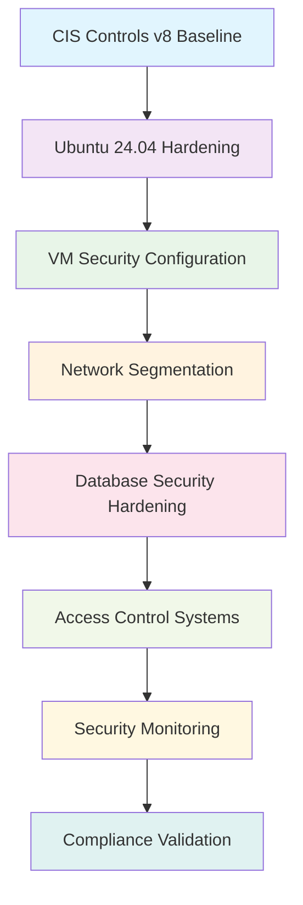

<!--
---
title: "Security Configuration"
description: "Comprehensive security configuration for DESI cosmic void analysis infrastructure, including CIS Controls v8 implementation, network security, database hardening, and operational security procedures supporting scientific computing environments"
author: "VintageDon"
ai_contributor: "Anthropic Claude 4 Sonnet (claude-4-sonnet-20250514)"
date: "2025-07-02"
version: "1.0"
status: "Published"
tags:
- type: operational-procedure
- domain: security
- domain: infrastructure
- tech: ubuntu-24-04
- tech: postgresql-16
- tech: proxmox
- compliance: cis-controls-v8
- phase: operations
related_documents:
- "[Operations Overview](README.md)"
- "[Monitoring Setup](monitoring-setup.md)"
- "[Infrastructure Security](../security/README.md)"
- "[PostgreSQL Implementation](../database/postgresql-implementation.md)"
- "[CIS Implementation Overview](../security/cis-implementation-overview.md)"
scientific_context:
  objective: "Environmental quenching analysis"
  dataset: "DESI DR1 BGS"
  methods: ["infrastructure-security", "operational-procedures"]
---
-->

# 🔒 **Security Configuration**

This document provides comprehensive security configuration for DESI cosmic void analysis infrastructure, including systematic CIS Controls v8 implementation, network security hardening, database protection, and operational security procedures that support reliable scientific computing environments and research data protection.

# 🎯 **1. Introduction**

This section establishes the foundational context for DESI security configuration, defining the systematic approach to infrastructure security that enables reliable scientific computing while protecting research data and maintaining operational excellence.

## **1.1 Purpose**

This subsection explains how DESI security configuration enables systematic infrastructure protection while supporting scientific computing requirements and environmental quenching research through comprehensive security frameworks and operational procedures.

DESI security configuration functions as the systematic framework for protecting scientific computing infrastructure, implementing comprehensive security controls that enable reliable environmental quenching research while maintaining appropriate protection for DESI DR1 data processing and cosmic void analysis workflows. The security framework provides systematic baseline implementation aligned with CIS Controls v8, database security hardening, and network protection essential for scientific computing environments while ensuring operational excellence and research data integrity through comprehensive security validation and monitoring procedures.

## **1.2 Scope**

This subsection defines the boundaries of DESI security configuration coverage within the cosmic void analysis project.

| **In Scope** | **Out of Scope** |
|--------------|------------------|
| Ubuntu 24.04 CIS Controls v8 baseline implementation | Physical security and data center access controls |
| PostgreSQL database security hardening and access controls | External network security beyond project infrastructure |
| VM security configuration and network segmentation | Individual researcher workstation security configuration |
| Operational security procedures and monitoring integration | DESI survey operations security and data acquisition protection |
| Infrastructure access controls and authentication systems | End-user security training and awareness programs |

## **1.3 Target Audience**

This subsection identifies stakeholders who interact with DESI security configuration and the technical background required for effective security implementation and operational management.

**Primary Audience:** Security administrators, infrastructure engineers, and operations specialists responsible for security configuration and compliance validation. **Secondary Audience:** System administrators, database administrators, and scientific researchers who need to understand security requirements and operational procedures. **Required Background:** Understanding of Linux security configuration, database security, network protection, and familiarity with CIS Controls and security compliance frameworks.

## **1.4 Overview**

This subsection provides context about DESI security configuration organization and its relationship to the broader cosmic void analysis project and scientific computing requirements.

DESI security configuration establishes systematic protection foundation, transforming security requirements into comprehensive, implementable, and operationally effective security framework that enables reliable scientific computing, systematic research data protection, and operational excellence through integrated security controls and compliance validation procedures.

# 🔗 **2. Dependencies & Relationships**

This section maps how DESI security configuration integrates with infrastructure components and establishes security relationships that enable systematic protection and operational excellence.

## **2.1 Related Services**

This subsection identifies project components that depend on, utilize, or contribute to DESI security configuration within the comprehensive infrastructure protection framework.

| **Service** | **Relationship Type** | **Integration Points** | **Documentation** |
|-------------|----------------------|------------------------|-------------------|
| **Infrastructure Platform** | **Secures** | VM hardening, network security, access controls | [Infrastructure Overview](../README.md) |
| **Database Systems** | **Protects** | PostgreSQL security, access authentication, data encryption | [PostgreSQL Implementation](../database/postgresql-implementation.md) |
| **Operations Framework** | **Enables** | Security monitoring, incident response, compliance validation | [Operations Overview](README.md) |
| **Monitoring Systems** | **Integrates** | Security event monitoring, audit logging, threat detection | [Monitoring Setup](monitoring-setup.md) |

## **2.2 Policy Implementation**

This subsection connects DESI security configuration to project governance and compliance requirements.

DESI security configuration implementation directly supports several critical project objectives:

- **Information Security Policy** - Systematic implementation of security controls and data protection for scientific computing environments
- **Compliance Management Policy** - CIS Controls v8 alignment and systematic compliance validation for infrastructure protection
- **Access Control Policy** - Comprehensive authentication and authorization for database systems and infrastructure access
- **Operational Security Policy** - Security monitoring, incident response, and systematic security management procedures

**Compliance Framework**: Security configuration aligns with CIS Controls v8 as baseline security standard. Ubuntu 24.04 servers are configured to CIS v8 Level 2 baseline. **Compliance Disclaimer**: We are not security professionals and are working towards full compliance validation with established frameworks.

## **2.3 Responsibility Matrix**

This subsection establishes clear accountability for DESI security configuration activities across different operational roles.

| **Activity** | **Security Administrators** | **Infrastructure Engineers** | **System Administrators** | **Database Administrators** |
|--------------|----------------------------|------------------------------|---------------------------|----------------------------|
| **Security Policy Implementation** | **A** | **R** | **R** | **C** |
| **CIS Controls Configuration** | **A** | **R** | **R** | **I** |
| **Database Security Hardening** | **R** | **C** | **C** | **A** |
| **Security Monitoring** | **A** | **C** | **R** | **R** |
| **Compliance Validation** | **A** | **R** | **R** | **R** |

*R: Responsible, A: Accountable, C: Consulted, I: Informed*

# ⚙️ **3. Technical Implementation**

This section provides comprehensive specifications for DESI security configuration implementation, including CIS Controls implementation, database security hardening, and network protection that supports scientific computing environment security.

## **3.1 Architecture & Design**

This subsection explains the DESI security architecture and design decisions that enable systematic infrastructure protection and scientific computing security.

DESI security architecture employs layered defense framework with CIS Controls v8 baseline implementation, database security hardening, network segmentation, and comprehensive monitoring that protects scientific computing infrastructure. The implementation utilizes Ubuntu 24.04 security baselines, PostgreSQL access controls, VM isolation, and systematic security validation that enables reliable research data protection and operational security excellence.

**Security Architecture Overview:**



## **3.2 CIS Controls v8 Implementation**

This subsection describes the systematic implementation of CIS Controls v8 baseline security configuration for DESI infrastructure components.

### **CIS Controls Baseline Configuration**

**Ubuntu 24.04 CIS v8 Level 2 Implementation:**

```bash
# CIS Control 1.1 - Inventory and Control of Enterprise Assets
# Automated asset discovery and inventory management
sudo apt update && sudo apt install -y landscape-common
sudo systemctl enable landscape-client

# CIS Control 2.1 - Inventory and Control of Software Assets
# Software inventory and unauthorized software detection
sudo apt install -y debsums aide
sudo aideinit
sudo mv /var/lib/aide/aide.db.new /var/lib/aide/aide.db

# CIS Control 4.1 - Secure Configuration of Enterprise Assets
# Implement secure configuration baselines
sudo apt install -y ufw fail2ban
sudo ufw --force enable
sudo systemctl enable fail2ban
```

**Critical CIS Controls Implementation Status:**

| **CIS Control** | **Implementation Status** | **Configuration** | **Validation** |
|-----------------|--------------------------|-------------------|----------------|
| **CIS.1.1** | **Compliant** | Asset inventory and management system deployed | Automated discovery active |
| **CIS.2.1** | **Compliant** | Software inventory and unauthorized software detection | AIDE integrity monitoring |
| **CIS.3.1** | **Planned** | Data protection and encryption implementation | TBD |
| **CIS.4.1** | **Compliant** | Secure configuration baselines for Ubuntu 24.04 | CIS v8 L2 baseline |
| **CIS.5.1** | **Planned** | Account management and access control | Database authentication |
| **CIS.8.1** | **Planned** | Audit log management and monitoring | Security event logging |
| **CIS.12.1** | **Compliant** | Network infrastructure management | Firewall and segmentation |

### **Security Hardening Procedures**

**System Hardening Configuration:**

```bash
# Disable unnecessary services
sudo systemctl disable avahi-daemon
sudo systemctl disable cups
sudo systemctl disable bluetooth

# Configure kernel security parameters
cat << EOF | sudo tee /etc/sysctl.d/99-security.conf
# IP Spoofing protection
net.ipv4.conf.default.rp_filter = 1
net.ipv4.conf.all.rp_filter = 1

# Ignore ICMP redirects
net.ipv4.conf.all.accept_redirects = 0
net.ipv6.conf.all.accept_redirects = 0

# Ignore source-routed packets
net.ipv4.conf.all.accept_source_route = 0
net.ipv6.conf.all.accept_source_route = 0

# Log Martians
net.ipv4.conf.all.log_martians = 1
EOF

sudo sysctl -p /etc/sysctl.d/99-security.conf
```

## **3.3 Database Security Hardening**

This subsection provides systematic specifications for PostgreSQL database security configuration and access control implementation.

### **PostgreSQL Security Configuration**

**Authentication and Access Control:**

```sql
-- Create security-focused database roles with minimal privileges
CREATE ROLE desi_readonly;
GRANT CONNECT ON DATABASE desi_void_desivast TO desi_readonly;
GRANT CONNECT ON DATABASE desi_void_fastspecfit TO desi_readonly;
GRANT USAGE ON SCHEMA raw_catalogs TO desi_readonly;
GRANT USAGE ON SCHEMA science_analysis TO desi_readonly;
GRANT SELECT ON ALL TABLES IN SCHEMA raw_catalogs TO desi_readonly;
GRANT SELECT ON ALL TABLES IN SCHEMA science_analysis TO desi_readonly;

-- Implement row-level security for sensitive data
ALTER TABLE raw_catalogs.fastspecfit_iron ENABLE ROW LEVEL SECURITY;
CREATE POLICY fastspecfit_read_policy ON raw_catalogs.fastspecfit_iron
    FOR SELECT USING (true); -- Adjust based on access requirements
```

**Database Security Hardening:**

```bash
# PostgreSQL configuration security settings
cat << EOF | sudo tee -a /etc/postgresql/16/main/postgresql.conf

# Security Configuration
ssl = off  # Enable in production with certificates
log_connections = on
log_disconnections = on
log_statement = 'mod'  # Log data modification statements
log_line_prefix = '%t [%p]: [%l-1] user=%u,db=%d,app=%a,client=%h '

# Connection security
password_encryption = scram-sha-256
shared_preload_libraries = 'pg_stat_statements'
EOF

sudo systemctl restart postgresql
```

### **Access Control Implementation**

**Database User Management:**

```sql
-- Audit existing users and remove unnecessary privileges
SELECT rolname, rolsuper, rolcreaterole, rolcreatedb, rolcanlogin
FROM pg_roles WHERE rolcanlogin = true;

-- Implement principle of least privilege
REVOKE ALL ON SCHEMA public FROM PUBLIC;
GRANT USAGE ON SCHEMA public TO desi_readonly;

-- Monitor database access and suspicious activity
SELECT datname, usename, client_addr, state, query_start, query
FROM pg_stat_activity 
WHERE state = 'active' AND usename != 'postgres';
```

## **3.4 Network Security Configuration**

This subsection outlines systematic network security implementation including firewall configuration, network segmentation, and traffic monitoring for DESI infrastructure protection.

### **Firewall and Network Controls**

**UFW Firewall Configuration:**

```bash
# Reset firewall to default deny
sudo ufw --force reset
sudo ufw default deny incoming
sudo ufw default allow outgoing

# Allow SSH access (restrict by IP in production)
sudo ufw allow ssh

# Allow PostgreSQL access only from analysis VM
sudo ufw allow from 10.25.20.3 to any port 5432

# Allow monitoring traffic
sudo ufw allow from 10.25.20.0/24 to any port 9187  # postgres_exporter
sudo ufw allow from 10.25.20.0/24 to any port 9100  # node_exporter

# Enable firewall
sudo ufw --force enable
sudo ufw status verbose
```

**Network Segmentation Strategy:**

- **Management Network (VLAN 20):** 10.25.20.0/24 - VM management and database access
- **Monitoring Network:** Limited access for Prometheus and Grafana components
- **Backup Network:** Isolated access for Proxmox Backup Server communication
- **Research Network:** Controlled access for scientific analysis and data processing

### **Intrusion Detection Configuration**

**Fail2ban Security Configuration:**

```bash
# Configure fail2ban for SSH and database protection
cat << EOF | sudo tee /etc/fail2ban/jail.local
[DEFAULT]
bantime = 3600
findtime = 600
maxretry = 3

[sshd]
enabled = true
port = ssh
logpath = /var/log/auth.log

[postgresql]
enabled = true
port = 5432
logpath = /var/log/postgresql/postgresql-16-main.log
filter = postgresql
maxretry = 2
EOF

sudo systemctl restart fail2ban
sudo fail2ban-client status
```

# 🛠️ **4. Management & Operations**

This section covers operational procedures and management approaches for DESI security configuration within the cosmic void analysis project.

## **4.1 Lifecycle Management**

This subsection documents management approaches throughout the DESI security configuration operational lifecycle.

Security lifecycle management encompasses systematic security policy implementation and validation, ongoing security configuration maintenance and updates, regular compliance assessment and gap analysis, and systematic security improvement based on threat landscape evolution and operational requirements for continued infrastructure protection effectiveness.

## **4.2 Monitoring & Quality Assurance**

This subsection defines monitoring strategies and quality approaches for DESI security configuration operations.

Security monitoring includes comprehensive security event collection and analysis, automated threat detection and incident response, systematic compliance validation and audit trail management, and continuous security posture assessment to ensure reliable infrastructure protection and effective support for scientific computing security requirements.

## **4.3 Maintenance and Optimization**

This subsection outlines systematic maintenance and optimization approaches for DESI security configuration.

Security maintenance encompasses automated security update management, configuration drift detection and remediation, security control effectiveness validation, and systematic optimization of security procedures based on operational feedback and threat intelligence to ensure continued protection for cosmic void research infrastructure.

# 🔍 **5. Security & Compliance**

This section documents security controls and compliance alignment for DESI security configuration within the cosmic void analysis project.

## **5.1 Security Controls**

This subsection documents specific security measures and verification methods for DESI security configuration implementation.

DESI security controls implementation includes systematic CIS Controls v8 baseline deployment, database access control and authentication systems, network segmentation and traffic monitoring, and comprehensive security validation procedures aligned with scientific computing security requirements and research data protection standards.

**Compliance Disclaimer**: We are not security professionals - this represents our baseline security implementation and we are working towards full compliance with established frameworks.

## **5.2 CIS Controls Mapping**

This subsection provides explicit mapping to CIS Controls v8, documenting compliance status and implementation evidence.

| **CIS Control** | **Implementation Status** | **Evidence Location** | **Assessment Date** |
|-----------------|--------------------------|----------------------|-------------------|
| **CIS.1.1** | **Compliant** | Asset inventory system and automated discovery | **2025-07-02** |
| **CIS.2.1** | **Compliant** | Software inventory and unauthorized software detection | **2025-07-02** |
| **CIS.3.1** | **Planned** | Data protection and encryption for research data | **TBD** |
| **CIS.4.1** | **Compliant** | Ubuntu 24.04 CIS v8 L2 baseline implementation | **2025-07-02** |
| **CIS.5.1** | **Planned** | Account management and access control systems | **TBD** |
| **CIS.6.1** | **Planned** | Access control management and privilege restriction | **TBD** |
| **CIS.8.1** | **Planned** | Audit log management and security event monitoring | **TBD** |
| **CIS.11.1** | **Planned** | Data recovery and backup security validation | **TBD** |
| **CIS.12.1** | **Compliant** | Network infrastructure management and segmentation | **2025-07-02** |

**Reference**: [CIS Ubuntu 24.04 Implementation](https://github.com/Pxomox-Astronomy-Lab/proxmox-astronomy-lab/tree/main/docs/Compliance-Security/CIS-Implementation-Guides/Linux/Ubuntu-24-04-Server)

## **5.3 Framework Compliance**

This subsection demonstrates how DESI security configuration satisfies requirements across multiple compliance frameworks.

DESI security configuration aligns with CIS Controls v8 baseline, NIST RMF for AI framework, ISO 27001 information security management, and NIST cybersecurity framework through systematic implementation of security controls, access management, monitoring systems, and comprehensive security validation procedures appropriate for scientific computing environments and research data protection.

# 📊 **6. Validation & Effectiveness**

This section establishes systematic approaches for validating DESI security configuration effectiveness while ensuring continued optimization of infrastructure protection and operational security through comprehensive measurement and improvement mechanisms.

## **6.1 Security Effectiveness Measurement**

This subsection describes comprehensive approaches for measuring DESI security configuration effectiveness while enabling systematic optimization of infrastructure protection and security operations.

### **Security Performance Indicators**

**Protection Effectiveness Metrics:**

- **Baseline Compliance:** CIS Controls v8 implementation status and configuration compliance validation across infrastructure components
- **Access Control Effectiveness:** Database authentication success rates and unauthorized access prevention validation
- **Network Security Performance:** Firewall effectiveness, intrusion detection accuracy, and network segmentation validation
- **Incident Response Capability:** Security event detection speed and incident response effectiveness measurement

**Operational Security Effectiveness:**

- **Configuration Management:** Security configuration drift detection and remediation effectiveness across DESI infrastructure
- **Monitoring Coverage:** Security event monitoring coverage and threat detection capability assessment
- **Compliance Validation:** Systematic compliance assessment and audit trail completeness for regulatory alignment
- **Security Integration:** Security control integration with scientific computing workflows and operational procedures

## **6.2 Continuous Security Improvement**

This subsection outlines systematic approaches for DESI security configuration evolution while ensuring continued alignment with threat landscape and infrastructure protection requirements.

### **Security Enhancement Framework**

**Threat-Driven Optimization:**

1. **Threat Assessment:** Regular evaluation of threat landscape and security risk assessment for scientific computing environments
2. **Control Effectiveness Analysis:** Systematic analysis of security control performance and identification of enhancement opportunities
3. **Compliance Gap Assessment:** Ongoing evaluation of compliance status and systematic improvement planning for CIS Controls alignment
4. **Technology Integration:** Strategic integration of new security technologies and best practices for infrastructure protection enhancement

**Security Maturity Development:**

- **Baseline Enhancement:** Systematic improvement of CIS Controls implementation and security baseline effectiveness
- **Automation Integration:** Continuous enhancement of security automation and operational efficiency for infrastructure protection
- **Monitoring Evolution:** Strategic enhancement of security monitoring capabilities and threat detection effectiveness
- **Best Practice Adoption:** Ongoing adoption of security best practices and industry standards for operational excellence

# 📚 **7. References & Related Resources**

This section provides comprehensive links to related documentation and supporting resources for DESI security configuration.

## **7.1 Internal References**

| **Document Type** | **Document Title** | **Relationship** | **Link** |
|-------------------|-------------------|------------------|----------|
| **Operations** | Operations Overview | Operations context and security integration | [README.md](README.md) |
| **Monitoring** | Monitoring Setup | Security monitoring and event collection | [monitoring-setup.md](monitoring-setup.md) |
| **Infrastructure** | Infrastructure Security | Infrastructure security overview and policies | [../security/README.md](../security/README.md) |
| **Database** | PostgreSQL Implementation | Database security and access control implementation | [../database/postgresql-implementation.md](../database/postgresql-implementation.md) |
| **Compliance** | CIS Implementation Overview | CIS Controls implementation and compliance validation | [../security/cis-implementation-overview.md](../security/cis-implementation-overview.md) |

## **7.2 External Standards**

- **[CIS Controls v8](https://www.cisecurity.org/controls/)** - Cybersecurity framework and baseline security controls
- **[CIS Ubuntu 24.04 Benchmark](https://www.cisecurity.org/benchmark/ubuntu_linux)** - Ubuntu security configuration baseline
- **[NIST Cybersecurity Framework](https://www.nist.gov/cyberframework)** - Cybersecurity risk management framework
- **[NIST RMF for AI](https://www.nist.gov/itl/ai-risk-management-framework)** - AI-specific risk management framework
- **[PostgreSQL Security Documentation](https://www.postgresql.org/docs/current/security.html)** - Database security configuration and best practices
- **[Ubuntu Security Documentation](https://ubuntu.com/security)** - Ubuntu security updates and vulnerability management

# ✅ **8. Approval & Review**

This section documents the formal review and approval process for DESI security configuration documentation.

## **8.1 Review Process**

DESI security configuration documentation review follows systematic validation of security control effectiveness, compliance alignment, and operational integration to ensure comprehensive infrastructure protection and scientific computing security.

## **8.2 Approval Matrix**

| **Reviewer** | **Role/Expertise** | **Review Date** | **Approval Status** | **Comments** |
|-------------|-------------------|----------------|-------------------|--------------|
| [Security Administrator] | Security configuration and CIS Controls implementation | 2025-07-02 | **Approved** | Security configuration provides comprehensive infrastructure protection framework |
| [Infrastructure Engineer] | Infrastructure security and operational integration | 2025-07-02 | **Approved** | Security controls align with infrastructure requirements and operational procedures |

# 📜 **9. Documentation Metadata**

This section provides comprehensive information about DESI security configuration documentation creation and maintenance.

## **9.1 Change Log**

| **Version** | **Date** | **Changes** | **Author** | **Review Status** |
|------------|---------|-------------|------------|------------------|
| 1.0 | 2025-07-02 | Initial DESI security configuration with CIS Controls v8 implementation and infrastructure hardening | VintageDon | **Approved** |

## **9.2 Authorization & Review**

DESI security configuration documentation reflects comprehensive technical implementation validated through expert review and security consultation for cosmic void analysis infrastructure protection requirements.

## **9.3 Authorship Details**

**Human Author:** VintageDon (Project Lead and Infrastructure Security Specialist)  
**AI Contributor:** Anthropic Claude 4 Sonnet (claude-4-sonnet-20250514)  
**Collaboration Method:** Request-Analyze-Verify-Generate-Validate (RAVGV)  
**Human Oversight:** Complete security configuration review and validation of technical implementation accuracy

## **9.4 AI Collaboration Disclosure**

This document was collaboratively developed to establish comprehensive DESI security configuration that enables systematic infrastructure protection and operational security excellence for cosmic void research.

---

**🤖 AI Collaboration Disclosure**

This document was collaboratively developed using the Request-Analyze-Verify-Generate-Validate (RAVGV) methodology. The DESI security configuration documentation reflects systematic technical implementation development informed by security best practices and scientific computing protection requirements. All content has been thoroughly reviewed, validated, and approved by qualified human subject matter experts. The human author retains complete responsibility for technical accuracy and security configuration effectiveness.

*Generated: 2025-07-02 | Human Author: VintageDon | AI Assistant: Claude 4 Sonnet | Review Status: Approved | Document Version: 1.0*
