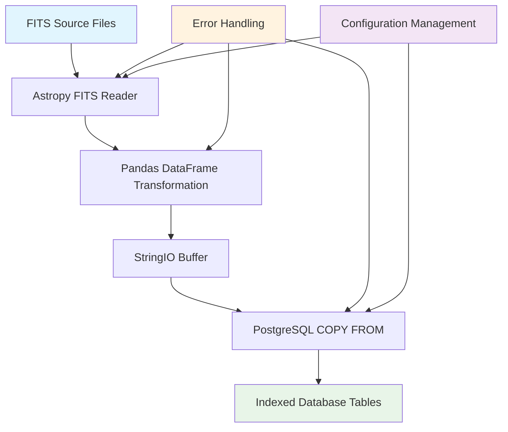

<!--
---
title: "Data Acquisition"
description: "High-performance ETL pipeline for ingesting DESI DR1 Value-Added Catalogs into PostgreSQL database infrastructure, optimized for astronomical survey data processing"
author: "VintageDon - https://github.com/vintagedon"
ai_contributor: "Claude Sonnet 4"
date: "2025-08-04"
version: "1.0"
status: "Published"
tags:
- type: [directory-overview/etl-pipeline/data-ingestion]
- domain: [astronomical-data/survey-catalogs/database-systems]
- tech: [postgresql/fits-processing/bulk-ingestion]
- phase: [phase-1]
related_documents:
- "[Source Code Overview](../README.md)"
- "[Data Analysis](../data-analysis/README.md)"
- "[Dataset Validations](../dataset-validations/README.md)"
---
-->

# 🗄️ **Data Acquisition**

High-performance ETL (Extract, Transform, Load) pipeline for ingesting DESI DR1 Value-Added Catalogs into the project's PostgreSQL database infrastructure. This directory contains specialized scripts that transform distributed FITS astronomical data into analysis-ready database tables, utilizing industry-standard bulk loading techniques optimized for large-scale survey data processing.

## **Overview**

The Data Acquisition pipeline addresses the critical challenge of efficiently ingesting millions of astronomical objects from multiple source catalogs while maintaining data integrity and scientific precision. The implementation prioritizes performance through PostgreSQL's native `COPY FROM` command, achieving orders-of-magnitude speed improvements over traditional row-by-row insertion methods. This approach enables rapid iteration during the analysis phase and provides a solid foundation for systematic astronomical research.

The pipeline handles two primary data streams: the DESI FastSpecFit "Iron" galaxy properties catalog containing stellar masses and star formation rates, and the DESIVAST cosmic void catalogs that define the large-scale environmental context. Both data streams undergo careful validation and transformation before being loaded into the normalized database schema that supports the project's scientific objectives.

---

## **📂 Directory Contents**

This section provides systematic navigation to all ETL pipeline components and ingestion tools.

### **Primary ETL Scripts**

| **Script** | **Purpose** | **Data Source** |
|------------|-------------|----------------|
| **[etl-ingest-fastspecfit-to-postgesql.py](etl-ingest-fastspecfit-to-postgesql.py)** | High-performance ingestion of DESI FastSpecFit "Iron" galaxy properties catalog | FastSpecFit VAC (FITS multi-file) |
| **[etl-ingest-desivast-to-postgesql.py](etl-ingest-desivast-to-postgesql.py)** | Bulk loading of DESIVAST cosmic void catalogs and galaxy membership data | DESIVAST DR1 VAC (FITS) |

### **Supporting Infrastructure**

| **Component** | **Purpose** | **Integration** |
|---------------|-------------|----------------|
| **Configuration Management** | Database credentials and file path management | config.ini integration |
| **Error Handling** | Robust transaction management and rollback capabilities | PostgreSQL transaction integrity |
| **Performance Optimization** | In-memory buffer streaming and bulk loading | StringIO + COPY FROM methodology |

---

## **📁 Repository Structure**

``` markdown
data-acquisition/
├── 🗄️ etl-ingest-fastspecfit-to-postgesql.py    # FastSpecFit VAC ingestion pipeline
├── 🌌 etl-ingest-desivast-to-postgesql.py       # DESIVAST void catalog ingestion
├── 📋 README.md                                 # This file
└── 📄 [config integration files]               # Configuration and schema references
```

### **Pipeline Navigation:**

- **[🗄️ FastSpecFit Ingestion](etl-ingest-fastspecfit-to-postgesql.py)** - Galaxy properties catalog processing with multi-HDU FITS handling
- **[🌌 DESIVAST Ingestion](etl-ingest-desivast-to-postgesql.py)** - Cosmic void catalog and membership table population
- **[📋 Configuration](../config/)** - Database connection parameters and file path management

---

## **🔗 Related Categories**

This section establishes relationships within the project knowledge graph, connecting data acquisition to downstream analysis components.

| **Category** | **Relationship** | **Documentation** |
|--------------|------------------|-------------------|
| **[Data Analysis](../data-analysis/README.md)** | Provides analysis-ready database tables for spatial cross-matching and statistical comparisons | [../data-analysis/README.md](../data-analysis/README.md) |
| **[Dataset Validations](../dataset-validations/README.md)** | Supports validation procedures with clean, indexed database tables for integrity checking | [../dataset-validations/README.md](../dataset-validations/README.md) |
| **[Configuration](../config/)** | Depends on database schema definitions and connection parameters | [../config/README.md](../config/README.md) |
| **[Source Root](../README.md)** | Core component of the overall source code architecture | [../README.md](../README.md) |

---

## **Getting Started**

For new contributors approaching the data acquisition pipeline:

1. **Start Here:** Review the configuration setup and database schema requirements in [../config/](../config/)
2. **FastSpecFit Pipeline:** Begin with [etl-ingest-fastspecfit-to-postgesql.py](etl-ingest-fastspecfit-to-postgesql.py) for galaxy properties ingestion
3. **DESIVAST Pipeline:** Follow with [etl-ingest-desivast-to-postgesql.py](etl-ingest-desivast-to-postgesql.py) for void catalog processing
4. **Validation:** Proceed to [../dataset-validations/](../dataset-validations/) for data integrity verification

---

## **🚀 Technical Architecture**

### **High-Performance Ingestion Strategy**

The data acquisition pipeline implements a sophisticated bulk loading strategy that transforms the traditional bottleneck of database ingestion into a streamlined, high-throughput operation:

**PostgreSQL COPY FROM Optimization:**

- **In-Memory Buffer Streaming**: Utilizes `io.StringIO` to avoid temporary disk files while maintaining memory efficiency
- **Bulk Transaction Processing**: Groups operations to minimize transaction overhead and maximize throughput
- **Direct psycopg2 Integration**: Leverages low-level database drivers for optimal performance during bulk operations

**Multi-File Processing Architecture:**

- **Iterative FITS Handling**: Processes distributed HEALPix files sequentially to manage memory constraints
- **Memory-Mapped File Access**: Uses `astropy.io.fits` memory mapping to handle large files efficiently
- **Automated Column Mapping**: Dynamically handles FITS data type conversions to PostgreSQL schema

**Error Recovery and Robustness:**

- **Transaction Integrity**: Implements commit/rollback logic to ensure data consistency
- **Corrupted File Handling**: Graceful error recovery for damaged or incomplete FITS files
- **Progress Monitoring**: Comprehensive logging and status reporting throughout ingestion process

### **Performance Characteristics**

Based on industry benchmarks and astronomical data processing patterns:

**Expected Throughput:**

- **FastSpecFit Catalog**: ~13.1M galaxies processed in 15-30 minutes depending on hardware
- **DESIVAST Catalogs**: Void definitions and membership tables completed in 2-5 minutes
- **Performance Scaling**: 10-800x improvement over traditional pandas.to_sql() methods

**Resource Requirements:**

- **Memory Usage**: Peak consumption determined by largest single FITS file (~2-4 GB)
- **Disk I/O**: Minimized through streaming approach and memory-mapped file access
- **Network Overhead**: Optimized for local PostgreSQL connections with bulk operations

### **Data Flow Architecture**

The pipeline implements a systematic data transformation workflow:



---

## **🛠️ Implementation Details**

### **FastSpecFit Pipeline Specifications**

The FastSpecFit ingestion script handles the complex multi-HDU structure of the DESI galaxy properties catalog:

**FITS File Processing:**

- **Multi-HDU Integration**: Combines METADATA, SPECPHOT, and FASTSPEC extensions into unified galaxy records
- **HEALPix Organization**: Processes distributed files maintaining spatial coherence
- **Column Selection**: Extracts scientifically relevant parameters while managing storage efficiency

**Data Transformation Features:**

- **Error Calculation**: Computes standard errors from inverse variance columns where appropriate
- **Type Optimization**: Maps FITS data types to optimal PostgreSQL representations
- **Null Handling**: Systematic treatment of missing or invalid astronomical measurements

### **DESIVAST Pipeline Specifications**

The DESIVAST ingestion script processes cosmic void catalogs with their associated galaxy membership information:

**Void Catalog Processing:**

- **Multi-Algorithm Support**: Handles VoidFinder, V2/REVOLVER, and V2/VIDE void definitions
- **Spatial Metadata**: Preserves void center coordinates, effective radii, and geometric properties
- **Membership Relations**: Establishes foreign key relationships between voids and member galaxies

**Systematic Treatment:**

- **Algorithm Provenance**: Maintains clear identification of void-finding methodology
- **Coordinate Systems**: Handles celestial coordinate transformations and distance calculations
- **Quality Flags**: Preserves data quality indicators for downstream analysis filtering

### **Configuration Integration**

Both pipelines implement consistent configuration management:

**Database Connection Management:**

- **Credential Security**: External configuration file management for sensitive parameters
- **Connection Pooling**: Efficient database resource utilization during bulk operations
- **Transaction Configuration**: Optimized settings for large-scale data ingestion

**File Path Management:**

- **Flexible Source Directories**: Configurable data source locations for different environments
- **Automatic File Discovery**: Pattern-based FITS file identification and processing
- **Progress Tracking**: Comprehensive logging of processing status and completion metrics

---

## **Document Information**

| **Field** | **Value** |
|-----------|-----------|
| **Author** | VintageDon - <https://github.com/vintagedon> |
| **Created** | 2025-08-04 |
| **Last Updated** | 2025-08-04 |
| **Version** | 1.0 |

---
Tags: etl-pipeline, postgresql-ingestion, fits-processing, bulk-loading, astronomical-data, survey-catalogs
