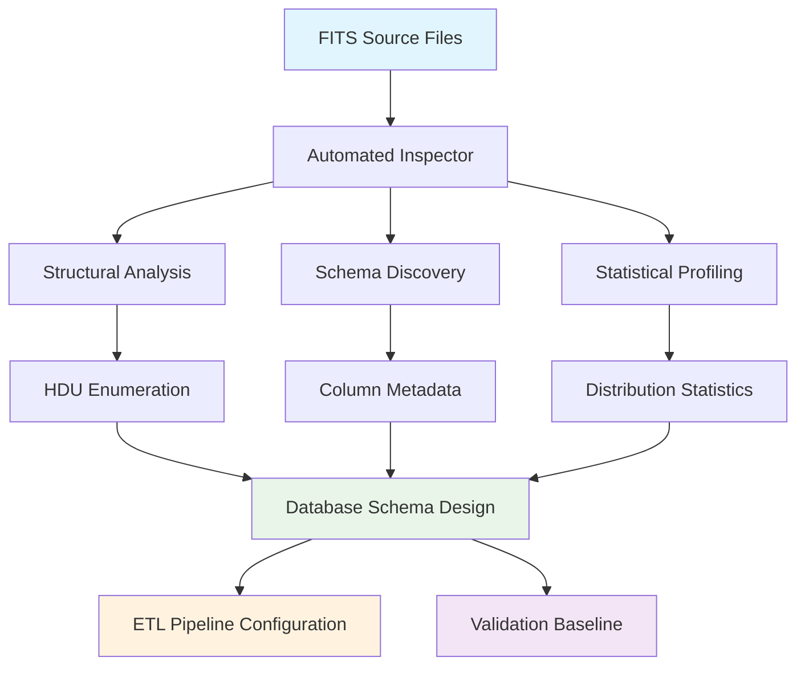

<!--
---
title: "Data Analysis"
description: "Specialized diagnostic and schema discovery tools for systematic inspection of DESI DR1 astronomical catalogs, providing automated FITS file analysis and database schema design support"
author: "VintageDon - https://github.com/vintagedon"
ai_contributor: "Claude Sonnet 4"
date: "2025-08-04"
version: "1.0"
status: "Published"
tags:
- type: [directory-overview/diagnostic-tools/schema-discovery]
- domain: [astronomical-data/fits-inspection/database-design]
- tech: [fits-analysis/schema-validation/statistical-reporting]
- phase: [phase-1]
related_documents:
- "[Source Code Overview](../README.md)"
- "[Data Acquisition](../data-acquisition/README.md)"
- "[Dataset Validations](../dataset-validations/README.md)"
---
-->

# 🔍 **Data Analysis**

Specialized diagnostic and schema discovery tools for systematic inspection of DESI DR1 astronomical catalogs. This directory contains sophisticated FITS file analyzers that automate the tedious and error-prone process of manual catalog examination, providing comprehensive structural analysis, schema discovery, and statistical reporting essential for database design and ETL pipeline development.

## **Overview**

The Data Analysis suite addresses the critical preliminary phase of any astronomical data project: understanding the structure, content, and quality of source catalogs before committing to database schemas and analysis workflows. These tools transform what traditionally requires hours of manual FITS file examination into automated, reproducible reports that inform intelligent database design and ensure robust data processing pipelines.

The implementation recognizes that modern astronomical surveys distribute data across complex, heterogeneous file structures. The FastSpecFit catalog uses HEALPix sky partitioning across 12 files, while DESIVAST catalogs organize by void-finding algorithm. Each requires specialized inspection strategies that these tools provide through algorithm-aware processing and cross-file schema validation.

---

## **📂 Directory Contents**

This section provides systematic navigation to all diagnostic tools and schema discovery components.

### **Primary Inspection Tools**

| **Tool** | **Purpose** | **Target Data** |
|----------|-------------|----------------|
| **[fastspecfit-fits-inspector.py](fastspecfit-fits-inspector.py)** | HEALPix-aware schema discovery and statistical analysis of galaxy properties catalog | FastSpecFit "Iron" VAC (12 HEALPix files) |
| **[desivast-fits-inspector.py](desivast-fits-inspector.py)** | Multi-algorithm void catalog structure analysis and cross-algorithm schema comparison | DESIVAST DR1 VAC (multiple algorithms) |

### **Analysis Capabilities**

| **Feature** | **FastSpecFit Inspector** | **DESIVAST Inspector** |
|-------------|--------------------------|------------------------|
| **Multi-File Handling** | HEALPix partitioning aware | Algorithm-specific organization |
| **Schema Validation** | Cross-file consistency verification | Cross-algorithm column comparison |
| **Statistical Analysis** | Physical parameter distributions | Void property summaries |
| **Reporting Format** | Human-readable structural summaries | Algorithm comparison matrices |

---

## **📁 Repository Structure**

``` markdown
data-analysis/
├── 🔍 fastspecfit-fits-inspector.py    # Galaxy catalog schema discovery tool
├── 🌌 desivast-fits-inspector.py       # Void catalog structure analyzer
├── 📋 README.md                        # This file
└── 📄 [analysis output files]          # Generated inspection reports
```

### **Inspection Pipeline Navigation:**

- **[🔍 FastSpecFit Inspector](fastspecfit-fits-inspector.py)** - HEALPix-distributed galaxy properties analysis with statistical summaries
- **[🌌 DESIVAST Inspector](desivast-fits-inspector.py)** - Multi-algorithm void catalog comparison and schema unification
- **[📊 Analysis Results](./reports/)** - Generated inspection reports and schema documentation

---

## **🔗 Related Categories**

This section establishes critical dependencies within the project workflow, connecting schema discovery to database design and validation.

| **Category** | **Relationship** | **Documentation** |
|--------------|------------------|-------------------|
| **[Data Acquisition](../data-acquisition/README.md)** | Provides essential schema information for ETL pipeline design and database table creation | [../data-acquisition/README.md](../data-acquisition/README.md) |
| **[Dataset Validations](../dataset-validations/README.md)** | Supplies baseline statistical distributions and structural expectations for validation procedures | [../dataset-validations/README.md](../dataset-validations/README.md) |
| **[Configuration](../config/)** | Informs database schema definitions and column mapping specifications | [../config/README.md](../config/README.md) |
| **[Source Root](../README.md)** | Foundational component enabling informed database design and pipeline architecture | [../README.md](../README.md) |

---

## **Getting Started**

For new contributors approaching the data analysis and inspection tools:

1. **Start Here:** Run [fastspecfit-fits-inspector.py](fastspecfit-fits-inspector.py) to understand galaxy catalog structure and column schemas
2. **Void Analysis:** Execute [desivast-fits-inspector.py](desivast-fits-inspector.py) to analyze void catalog organization and algorithm differences
3. **Schema Design:** Use inspection results to inform database table design in [../config/](../config/)
4. **Pipeline Development:** Apply schema knowledge to ETL pipeline development in [../data-acquisition/](../data-acquisition/)

---

## **🔬 Technical Architecture**

### **FITS Inspection Methodology**

The data analysis tools implement sophisticated approaches to astronomical catalog inspection that go beyond simple file enumeration:

**Automated Schema Discovery:**

- **Header-Data Unit (HDU) Analysis**: Systematic inspection of FITS file structure with detailed HDU enumeration
- **Column Metadata Extraction**: Comprehensive capture of column names, data types, formats, and physical units
- **Cross-File Schema Validation**: Verification of consistent structure across distributed file collections
- **Statistical Profiling**: Automated calculation of distribution statistics for scientific parameters

**Multi-File Architecture Handling:**

- **HEALPix-Aware Processing**: Specialized handling of sky-partitioned catalog distributions
- **Algorithm-Specific Organization**: Recognition of methodology-based data organization patterns
- **Unified Schema Generation**: Cross-file analysis to identify common and unique data columns
- **Structural Consistency Verification**: Validation that distributed files maintain coherent schemas

**Intelligent Error Detection:**

- **Corruption Identification**: Detection of damaged or incomplete FITS files during inspection
- **Schema Inconsistency Flagging**: Automatic identification of structural differences across expected-identical files
- **Missing Data Analysis**: Systematic assessment of null values and data completeness
- **Format Validation**: Verification of FITS standard compliance and astronomical conventions

### **FastSpecFit Inspector Specifications**

The FastSpecFit inspector addresses the unique challenges of HEALPix-distributed galaxy catalogs:

**HEALPix Processing Strategy:**

- **Multi-File Coordination**: Systematic processing of all 12 HEALPix partitioned files
- **Sky Coverage Verification**: Validation of complete sky coverage through HEALPix tile analysis
- **Row Count Aggregation**: Total galaxy count calculation across distributed files
- **Schema Consistency Checking**: Verification that all HEALPix files maintain identical column structures

**Statistical Analysis Features:**

- **Physical Parameter Profiling**: Automated statistics for stellar masses, star formation rates, and redshifts
- **Distribution Analysis**: Min/max/mean calculations for key scientific parameters
- **Data Quality Assessment**: Identification of non-physical values and outlier populations
- **Volume Estimation**: Total data size calculations for storage and processing planning

**Comprehensive Reporting:**

- **Human-Readable Summaries**: Clear presentation of file properties and data characteristics
- **Database Design Information**: Schema details optimized for PostgreSQL table creation
- **ETL Planning Data**: File organization and processing requirements for ingestion pipeline design

### **DESIVAST Inspector Specifications**

The DESIVAST inspector handles the complex multi-algorithm structure of cosmic void catalogs:

**Multi-Algorithm Analysis:**

- **Algorithm Identification**: Systematic classification of VoidFinder, V2/REVOLVER, and V2/VIDE catalogs
- **Cross-Algorithm Comparison**: Detailed analysis of column differences and commonalities across void-finding methods
- **Schema Unification Strategy**: Design recommendations for unified database storage of heterogeneous void catalogs
- **Membership Relationship Mapping**: Analysis of void-galaxy association structures

**Void Catalog Characterization:**

- **Void Property Analysis**: Statistical summaries of void radii, positions, and geometric properties
- **Galaxy Membership Assessment**: Analysis of void population characteristics and membership distributions
- **Algorithm Performance Comparison**: Quantitative comparison of void identification efficiency across methods
- **Spatial Coverage Evaluation**: Assessment of void catalog completeness and sky coverage

**Database Design Support:**

- **Normalized Schema Recommendations**: Optimal table structures for multi-algorithm void data storage
- **Foreign Key Relationship Mapping**: Clear identification of void-galaxy relationship structures
- **Index Strategy Planning**: Performance optimization recommendations for spatial queries
- **Data Integration Pathways**: Strategies for combining void catalogs with galaxy property data

### **Output and Reporting Architecture**

Both inspection tools generate comprehensive documentation that supports intelligent project development:



---

## **🛠️ Implementation Details**

### **Inspection Workflow Integration**

The data analysis tools integrate seamlessly into the project development lifecycle:

**Pre-Database Phase:**

- **Schema Discovery**: Automated identification of optimal database table structures
- **Column Mapping**: FITS-to-PostgreSQL data type recommendations
- **Storage Planning**: Accurate size estimates for database storage requirements
- **Performance Optimization**: Index strategy recommendations based on column usage patterns

**ETL Pipeline Support:**

- **File Organization Understanding**: Clear documentation of source file structures and relationships
- **Processing Order Determination**: Optimal sequence for multi-file ingestion procedures
- **Error Handling Planning**: Identification of potential failure modes and recovery strategies
- **Progress Monitoring Setup**: Baseline metrics for ETL pipeline progress tracking

**Validation Preparation:**

- **Expected Value Ranges**: Statistical baselines for data quality validation procedures
- **Completeness Metrics**: Null value patterns and data availability expectations
- **Outlier Identification**: Baseline distributions for anomaly detection during validation
- **Cross-Catalog Consistency**: Expected relationships between different data sources

### **Performance and Scalability**

The inspection tools are designed for efficiency and reliability across varying data scales:

**Memory Management:**

- **Streaming File Access**: Memory-mapped FITS file reading to handle large catalogs efficiently
- **Progressive Analysis**: Incremental processing to manage memory constraints during inspection
- **Selective Column Loading**: Targeted data extraction to minimize memory overhead
- **Garbage Collection Optimization**: Systematic memory cleanup during multi-file processing

**Processing Efficiency:**

- **Parallel File Handling**: Concurrent inspection of multiple files where appropriate
- **Caching Strategy**: Intelligent caching of repeated metadata access operations
- **Progress Reporting**: Real-time status updates during lengthy inspection procedures
- **Interrupt Handling**: Graceful termination and partial result preservation

### **Quality Assurance Integration**

The analysis tools incorporate systematic quality assurance to ensure reliable results:

**Validation Procedures:**

- **FITS Standard Compliance**: Verification of proper FITS format adherence
- **Astronomical Convention Checking**: Validation of coordinate systems and unit specifications
- **Cross-Reference Verification**: Consistency checking across related data files
- **Statistical Sanity Checking**: Identification of implausible physical parameter values

**Error Recovery:**

- **Graceful Failure Handling**: Continuation of inspection despite individual file problems
- **Detailed Error Logging**: Comprehensive documentation of inspection failures and warnings
- **Partial Result Preservation**: Useful output generation even when some files are problematic
- **Recovery Recommendations**: Actionable guidance for resolving identified data issues

---

## **Document Information**

| **Field** | **Value** |
|-----------|-----------|
| **Author** | VintageDon - <https://github.com/vintagedon> |
| **Created** | 2025-08-04 |
| **Last Updated** | 2025-08-04 |
| **Version** | 1.0 |

---
Tags: fits-inspection, schema-discovery, diagnostic-tools, database-design, statistical-analysis, astronomical-catalogs
