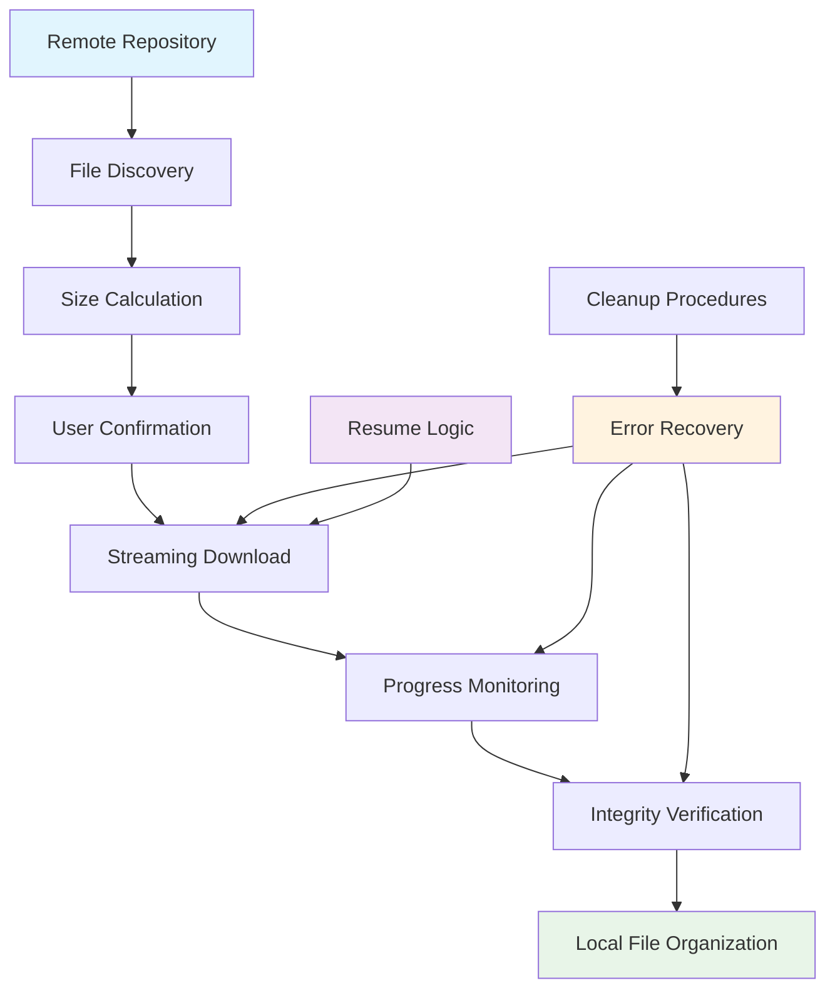

<!--
---
title: "Data Set Downloaders"
description: "Robust data acquisition utilities for downloading DESI DR1 Value-Added Catalogs from official repositories, featuring intelligent progress tracking and error recovery"
author: "VintageDon - https://github.com/vintagedon"
ai_contributor: "Claude Sonnet 4"
date: "2025-08-04"
version: "1.0"
status: "Published"
tags:
- type: [directory-overview/data-acquisition/download-utilities]
- domain: [astronomical-data/survey-downloads/data-pipeline]
- tech: [http-streaming/progress-tracking/error-recovery]
- phase: [phase-0]
related_documents:
- "[Source Code Overview](../README.md)"
- "[Data Analysis](../data-analysis/README.md)"
- "[Data Acquisition](../data-acquisition/README.md)"
---
-->

# 📥 **Data Set Downloaders**

Robust data acquisition utilities for downloading DESI DR1 Value-Added Catalogs from official repositories. This directory contains intelligent download managers that handle large astronomical datasets with sophisticated progress tracking, error recovery, and user-friendly interfaces designed for reliable acquisition of multi-gigabyte survey catalogs.

## **Overview**

The Data Set Downloaders provide the critical first step in the project's data pipeline, transforming the challenge of acquiring large astronomical datasets into a streamlined, reliable process. These utilities recognize that modern survey catalogs can span hundreds of gigabytes across multiple files, requiring intelligent download strategies that handle network interruptions, storage constraints, and user workflow integration.

The implementation prioritizes user experience and operational robustness through pre-download validation, intelligent progress reporting, and idempotent operation that gracefully handles partial downloads and resumption scenarios. This foundation enables confident data acquisition for downstream analysis while providing transparent insight into dataset characteristics and transfer progress.

---

## **📂 Directory Contents**

This section provides systematic navigation to all download utilities and data acquisition tools.

### **Primary Download Tools**

| **Utility** | **Purpose** | **Target Dataset** |
|-------------|-------------|-------------------|
| **[desivast-download-data-set.py](desivast-download-data-set.py)** | Official DESI DR1 DESIVAST void catalog acquisition from public repositories | DESIVAST DR1 VAC (void catalogs) |
| **[fastspecfit-download-data-set.py](fastspecfit-download-data-set.py)** | FastSpecFit "Iron" galaxy properties catalog download with HEALPix-aware processing | FastSpecFit "Iron" VAC (galaxy properties) |

### **Download Features**

| **Feature** | **DESIVAST Downloader** | **FastSpecFit Downloader** |
|-------------|------------------------|-----------------------------|
| **Pre-Download Validation** | Remote file size calculation and disk space verification | HEALPix file enumeration and completeness checking |
| **Progress Tracking** | Real-time transfer progress with speed indicators | Multi-file progress with aggregate completion status |
| **Error Recovery** | Automatic cleanup of partial downloads and retry logic | Interrupted download resumption and file integrity verification |
| **User Interface** | Interactive confirmation prompts and status reporting | Batch operation status with individual file progress |

---

## **📁 Repository Structure**

``` markdown
data-set-downloaders/
├── 📥 desivast-download-data-set.py        # DESIVAST void catalog acquisition utility
├── 🌌 fastspecfit-download-data-set.py     # FastSpecFit galaxy properties downloader
├── 📋 README.md                            # This file
└── 📄 [download status files]             # Progress tracking and status logs
```

### **Download Pipeline Navigation:**

- **[📥 DESIVAST Downloader](desivast-download-data-set.py)** - Void catalog acquisition with intelligent progress tracking
- **[🌌 FastSpecFit Downloader](fastspecfit-download-data-set.py)** - HEALPix-distributed galaxy catalog download management
- **[📊 Download Status](./logs/)** - Transfer progress logs and completion verification

---

## **🔗 Related Categories**

This section establishes the foundational role of data acquisition within the broader project workflow.

| **Category** | **Relationship** | **Documentation** |
|--------------|------------------|-------------------|
| **[Data Analysis](../data-analysis/README.md)** | Provides source files for FITS inspection and schema discovery procedures | [../data-analysis/README.md](../data-analysis/README.md) |
| **[Data Acquisition](../data-acquisition/README.md)** | Supplies downloaded catalogs for ETL pipeline ingestion into PostgreSQL database | [../data-acquisition/README.md](../data-acquisition/README.md) |
| **[Configuration](../config/)** | Utilizes configuration settings for download locations and file organization | [../config/README.md](../config/README.md) |
| **[Source Root](../README.md)** | Initial component enabling all downstream data processing and analysis | [../README.md](../README.md) |

---

## **Getting Started**

For new contributors approaching the data acquisition process:

1. **Start Here:** Configure download locations and verify network connectivity to DESI data repositories
2. **DESIVAST Acquisition:** Run [desivast-download-data-set.py](desivast-download-data-set.py) to acquire void catalog data
3. **FastSpecFit Acquisition:** Execute [fastspecfit-download-data-set.py](fastspecfit-download-data-set.py) for galaxy properties catalog
4. **Verification:** Proceed to [../data-analysis/](../data-analysis/) for downloaded file inspection and validation

---

## **📡 Technical Architecture**

### **Intelligent Download Strategy**

The download utilities implement sophisticated approaches to large-scale data acquisition that address the unique challenges of astronomical survey data:

**Pre-Download Intelligence:**

- **Remote File Discovery**: Automated enumeration of available files and calculation of total download requirements
- **Storage Verification**: Pre-flight disk space validation to prevent incomplete downloads due to storage constraints
- **User Confirmation**: Interactive prompts providing clear information about download scope and resource requirements
- **Dependency Analysis**: Verification of complete dataset availability before initiating transfer operations

**Streaming Download Architecture:**

- **Memory-Efficient Transfer**: HTTP streaming to handle multi-gigabyte files without excessive memory consumption
- **Progress Monitoring**: Real-time transfer speed calculation and estimated completion time reporting
- **Bandwidth Optimization**: Configurable chunk sizes and connection parameters for optimal network utilization
- **Concurrent Operations**: Intelligent multi-file download coordination where appropriate

**Robust Error Handling:**

- **Network Interruption Recovery**: Graceful handling of connection timeouts and network instability
- **Partial Download Cleanup**: Automatic removal of corrupted or incomplete files to prevent processing errors
- **Retry Logic**: Configurable retry attempts with exponential backoff for transient network issues
- **Integrity Verification**: Post-download file validation to ensure complete and uncorrupted transfers

### **DESIVAST Download Specifications**

The DESIVAST downloader addresses the specific requirements of cosmic void catalog acquisition:

**Repository Integration:**

- **Official DESI DR1 Access**: Direct connection to authenticated DESI data repositories
- **Catalog Version Management**: Automatic identification and download of correct DESIVAST DR1 releases
- **Metadata Preservation**: Retention of original file timestamps and repository metadata
- **Access Control Handling**: Proper authentication and authorization for restricted dataset access

**User Experience Optimization:**

- **Size Prediction**: Accurate calculation of total download requirements before transfer initiation
- **Interactive Confirmation**: Clear presentation of download scope with user approval workflows
- **Progress Visualization**: Real-time progress bars with transfer speed and completion estimates
- **Status Reporting**: Comprehensive logging of download activities and completion status

**Operational Robustness:**

- **Idempotent Operation**: Safe re-execution without duplicate downloads or data corruption
- **Resume Capability**: Intelligent resumption of interrupted downloads from last successful checkpoint
- **File Validation**: Post-download integrity checking to ensure complete and accurate transfers
- **Storage Management**: Efficient organization of downloaded files for downstream processing

### **FastSpecFit Download Specifications**

The FastSpecFit downloader handles the complex multi-file structure of HEALPix-distributed galaxy catalogs:

**HEALPix-Aware Processing:**

- **Multi-File Coordination**: Systematic download of all 12 HEALPix partition files with completeness verification
- **Sky Coverage Validation**: Confirmation of complete sky coverage through HEALPix tile verification
- **Parallel Download Management**: Efficient concurrent transfer of multiple HEALPix files with resource management
- **Dependency Tracking**: Cross-file consistency checking to ensure complete dataset availability

**Batch Operation Management:**

- **Aggregate Progress Tracking**: Overall completion status across multiple HEALPix files
- **Individual File Monitoring**: Detailed progress reporting for each HEALPix partition download
- **Failure Isolation**: Individual file error handling that doesn't compromise overall download completion
- **Recovery Coordination**: Intelligent restart of failed transfers without affecting successful downloads

**Quality Assurance Integration:**

- **File Enumeration Verification**: Confirmation that all expected HEALPix files are available for download
- **Size Consistency Checking**: Validation of expected file sizes against repository specifications
- **Transfer Verification**: Post-download validation of file integrity and completeness
- **Schema Preparation**: Organization of downloaded files for efficient FITS inspection and analysis

### **Download Workflow Architecture**

The download utilities integrate seamlessly into the project's data acquisition pipeline:



---

## **🛠️ Implementation Details**

### **Network Transfer Optimization**

The download utilities implement sophisticated network handling optimized for astronomical data characteristics:

**Connection Management:**

- **HTTP Streaming Protocol**: Memory-efficient transfer of large files through streaming requests
- **Configurable Timeouts**: Adaptive timeout settings based on file size and network conditions
- **Connection Pooling**: Efficient reuse of network connections for multi-file download scenarios
- **Bandwidth Throttling**: Optional transfer rate limiting to prevent network congestion

**Progress Tracking Integration:**

- **Real-Time Metrics**: Live calculation of transfer speed, completion percentage, and estimated time remaining
- **Visual Progress Indicators**: User-friendly progress bars with contextual status information
- **Historical Performance**: Tracking of download performance for optimization of future transfers
- **Completion Logging**: Comprehensive records of successful downloads and transfer characteristics

**Error Recovery Mechanisms:**

- **Automatic Retry Logic**: Configurable retry attempts with intelligent backoff strategies
- **Partial Download Detection**: Identification and cleanup of incomplete or corrupted transfers
- **Network State Monitoring**: Detection of network availability and connection quality changes
- **Graceful Degradation**: Continued operation in degraded network conditions with appropriate user notification

### **Storage Management Integration**

The download utilities include sophisticated storage handling to ensure reliable data acquisition:

**Disk Space Management:**

- **Pre-Flight Validation**: Verification of sufficient storage space before initiating large downloads
- **Dynamic Space Monitoring**: Real-time tracking of available disk space during transfer operations
- **Storage Optimization**: Efficient file organization to minimize storage overhead and improve access patterns
- **Cleanup Automation**: Automatic removal of temporary files and failed downloads

**File Organization Strategy:**

- **Structured Directory Layout**: Systematic organization of downloaded files by catalog type and version
- **Metadata Preservation**: Retention of original file attributes, timestamps, and repository information
- **Version Management**: Clear identification of catalog versions and download timestamps
- **Integration Preparation**: File organization optimized for downstream inspection and ETL processing

### **Quality Assurance Framework**

The download utilities incorporate comprehensive quality assurance to ensure data integrity:

**Transfer Validation:**

- **File Size Verification**: Confirmation that downloaded files match expected sizes from repository metadata
- **Checksum Validation**: Where available, verification of file integrity through cryptographic checksums
- **Format Validation**: Basic FITS format checking to identify corrupted or incomplete files
- **Completeness Verification**: Confirmation that all required files have been successfully downloaded

**Operational Monitoring:**

- **Transfer Logging**: Detailed logs of all download activities, errors, and performance metrics
- **Status Reporting**: Clear indication of successful completions, failures, and required actions
- **Performance Analysis**: Collection of transfer statistics for optimization of future downloads
- **User Notification**: Appropriate alerts for completion, errors, or required user intervention

### **Configuration and Customization**

The download utilities support flexible configuration to accommodate different environments and requirements:

**Repository Configuration:**

- **Endpoint Customization**: Configurable repository URLs and access credentials
- **Authentication Management**: Support for various authentication methods and credential storage
- **Mirror Selection**: Automatic or manual selection of optimal repository mirrors
- **Protocol Optimization**: Configuration of transfer protocols and connection parameters

**Operational Parameters:**

- **Transfer Settings**: Configurable chunk sizes, timeout values, and retry parameters
- **Progress Reporting**: Customizable progress update frequency and display formats
- **Storage Locations**: Flexible specification of download directories and file organization
- **Logging Configuration**: Adjustable logging levels and output formatting for different use cases

---

## **Document Information**

| **Field** | **Value** |
|-----------|-----------|
| **Author** | VintageDon - <https://github.com/vintagedon> |
| **Created** | 2025-08-04 |
| **Last Updated** | 2025-08-04 |
| **Version** | 1.0 |

---
Tags: data-acquisition, download-utilities, streaming-transfer, progress-tracking, error-recovery, astronomical-surveys
